# 信贷网络自组织临界完整实验报告 v2

生成时间：2026-06-09 16:55 CST

## 1. 报告定位

本报告基于 [`project.md`](../project.md) 的模型框架，整合当前已经完成的两条主实验线：

1. `period_end` 完备场景扫描：在期末统一做流量结算、违约检查和级联清算。
2. `timestep_settle_check` 对照扫描：在每个 credit `time_step` 后立即做缩放微结算、违约检查和级联清算。

报告目标不是只列出扫描变量，而是把模型机制、固定参数基线、扫描轴、级联失效相图、SOC 判定、timestep 对照和动画可视化统一放在一个完整实验叙述中。v2 相比 v1 重点补充当前模型机制、关键变量口径、period/timestep 时间粒度差异、持续失败与 SOC 的区别，并纳入同参数 period/timestep 对照动画。

核心结论是：

- `period_end` 粒度下，系统存在清楚的级联失效过载相图；高 `c`、高支出、biased 收入和部分高连接/异质拓扑会显著放大级联。
- `timestep` 粒度下，原先的期末大崩塌被切碎为高频、小规模 avalanche；出现小尺度重尾/近幂律样貌，但没有达到 `10%N` 的大级联。
- 最新同参数 GIF 对照进一步显示：在相同 seed、相同初始现金和相同高风险参数下，仅改变结算/检查粒度，`period_end` 可出现 `49/60` 的大级联，而 `timestep_settle_check` 最大只有 `3/60`。
- 当前证据支持“级联失效/过载转变”和“机制敏感的小尺度重尾”，但不支持严格自组织临界（SOC）。

最新动画证据来自 `results/credit_soc_visual_evolution_same_params_20260609_v3/`，配套视觉支线报告为 `docs/credit_soc_visual_evolution_report_20260609_v3.md`。其中 `same_params_period_vs_timestep_side_by_side.gif` 是本文第 9.4 节采用的主对照图；`same_params_period_end.gif` 和 `same_params_timestep.gif` 分别给出两种协议的单独轨迹。该组动画的用途是解释“同一参数下，检查粒度如何改变级联形态”，不是替代后文的全局参数扫描和 SOC 统计检验。

## 2. 模型机制

### 2.1 个体资产负债表

系统由 `N` 个个体组成。每个个体是一个资产负债表节点，而不是银行或企业部门。节点 `i` 的核心存量变量为：

| 变量 | 含义 |
| --- | --- |
| `C_i` / `cash_i` | 现金或货币余额 |
| `E_ij` / `exposure[i,j]` | `i` 对 `j` 的未清算信贷暴露权重 |
| `A_i=sum_j E_ij` | `i` 持有的贷款资产 |
| `D_i=sum_j E_ji` | `i` 承担的债务负债 |
| `W_i=C_i+A_i-D_i` | `i` 的净资产 |

初始化时，每个主体只有现金本金，信贷暴露矩阵为空。因此初始现金既是初始货币资产，也是初始净资产。初始本金分布可以为 `equal`、`uniform`、`normal`、`lognormal` 或 `pareto`；除 `equal` 外，单次 run 的样本均值和 Gini 会因随机抽样略有波动。

模型是封闭现金系统：支出后的收入会重新分配给主体，总现金在 run 内守恒。信贷清算只重写贷款资产、债务负债和暴露矩阵，不额外扣除现金。

### 2.2 单位信贷增长

每个成功 credit `time_step` 新增 1 单位有向信贷暴露。若 `i` 向 `j` 贷款 1 单位，则：

```text
i.cash -= 1
i.loan_assets += 1
j.cash += 1
j.debt_liabilities += 1
E_ij += 1
```

这个交易本身保持贷款人和借款人的净资产都不变。贷款人只是把现金换成贷款资产，借款人同时增加现金和负债。因此，**如果只增加信贷、不做支出和收入结算，理论上不会产生新的负净资产违约**。违约主要来自后续投资/消费支出、收入再分配以及级联清算中的贷款资产减记。

信贷选择机制由 `growth_rule` 控制：

- `random`：在现金约束满足的主体中随机形成信贷。
- `preferential_debt`：贷款人更倾向于现金充足主体，借款人权重与既有债务负债加基础权重相关，容易形成债务集中。

若显式拓扑为 `er/ba/sw`，这些拓扑只给出“谁可以和谁交易”的机会图边界；实际有向带权信贷网络仍从空矩阵开始逐步增长。

### 2.3 period、time_step 与 c

当前模型有两层时间尺度：

| 层级 | 含义 |
| --- | --- |
| `time_step` | 一次单位信贷尝试，至多成功新增 1 单位有向暴露 |
| `period` | 一组计划信贷尝试和一次或多次流量结算/违约检查窗口 |

宏观期长度由上一期总收入内生给出：

```text
K_t = round(c * Y_(t-1))
```

这里的 `c` 是代码字段 `investment_income_propensity`，更准确地说是“上一期总收入到下一期计划信贷尝试数的转换系数”。它不是单笔贷款规模，不是直接投资支出比例，也不是违约阈值。每个成功 `time_step` 的单位信贷规模始终为 1。

在 `period_end` 协议下，`c` 的作用有两个含义叠加：

1. 更大的 `c` 使本期计划尝试的单位信贷数量更多。
2. 更大的 `c` 也意味着下一次期末结算和违约检查前，系统可以累计更大的信贷暴露和更大的批量流量冲击。

因此，`period_end` 扫描中的 `c` 效应不能解释成纯粹的“驱动速度”效应，它同时改变检查窗口内的累积批量。`timestep_settle_check` 协议把结算和检查推进到每个微步后，正是为了把这一机制拆开观察。

### 2.4 支出、收入与现金流

每个结算窗口内，个体支出由投资支出和消费支出组成。

消费计划为：

```text
planned_consumption_i = a * max(W_i,0) + b * max(Y_i,last,0)
```

其中 `a` 是财富消费倾向，`b` 是上一期收入消费倾向。计划消费经过随机舍入后成为整数，并受现金约束。

投资支出目标来自结算窗口内的成功借入量：

```text
investment_spending_i = min(cash_i, borrowed_since_settlement_i)
consumption_spending_i = min(投资支出后的现金, planned_consumption_i)
```

总支出等于总收入，然后按收入分配规则返回到个体现金：

```text
uniform: p_i = 1/N
biased:  p_i = [max(W_i,0)+income_bias_floor] / sum_j[max(W_j,0)+income_bias_floor]
```

biased 收入分配会让高净资产主体更容易获得收入，但 `income_bias_floor=1` 保证低净资产或负净资产主体仍有非零收入概率。

### 2.5 两种结算/检查协议

本报告比较两种主要协议：

| 协议 | 机制 | 事件含义 |
| --- | --- | --- |
| `period_end` | 一个 period 内先执行 `K_t` 个单位信贷尝试，再统一做投资/消费支出、收入分配、违约检查和完整清算 | 一次 avalanche 是“整期批量结算后的事件” |
| `timestep_settle_check` | 一个 period 仍由 `K_t` 个计划微步组成，但每个成功或失败 credit `time_step` 后立即做按 `1/K_t` 缩放的微结算、收入分配、违约检查和完整清算 | 一次 avalanche 是“单个 credit 微步之后的微结算事件” |

两者使用相同的净资产违约阈值和清算规则，差异是流量结算与违约检查的时间粒度。这个差异非常关键：`period_end` 会把许多潜在脆弱节点压到同一个期末检查点，产生同步初始违约；`timestep_settle_check` 则会更早释放小违约，减少单个事件中共同积累的暴露和同步压力。

### 2.6 违约与级联清算

违约阈值为严格负净资产：

```text
default_i = 1(W_i < default_threshold)
```

当前基线 `default_threshold=0`，因此 `W_i=0` 不违约，只有 `W_i<0` 才违约。

在某个检查点发现违约后，所有初始违约节点形成清算队列。债务人 `j` 被清算时：

1. 所有指向 `j` 的贷款资产 `E_ij` 被减记，债权人 `i` 的贷款资产下降。
2. `j` 的对应债务负债同步解除。
3. 若 `wipe_defaulted_assets=True`，还会清除 `j` 持有的贷款资产 `E_jk`，并解除对应借款人 `k` 的负债。
4. 每处理一个违约节点后重新计算全体净资产；若新的债权人因贷款资产减记变成负净资产，则加入队列。

一次 avalanche 的规模定义为本次清算中被处理的不同违约节点数：

```text
initial_default_count = 检查点上已经负净资产的初始违约节点数
propagated_default_count = 清算传播新增的违约节点数
collapse_size = initial_default_count + propagated_default_count
collapse_fraction = collapse_size / N
critical_event = 1(collapse_fraction >= collapse_threshold_fraction)
```

`critical_event` 只是人工大级联标签，当前阈值为 `collapse_threshold_fraction=0.10`。它表示事件波及至少 10% 节点，不是模型内生临界点，也不是 SOC 证明。

当前主实验采用 `continue_after_avalanche`：清算后节点不永久退出，后续仍可参与借贷、支出和收入分配。因此，同一个节点可以在不同 period 或不同 micro step 中重复违约。报告中的 `repeat_default_share` 用来刻画这种重复违约占比。

### 2.7 持续失败、过载与 SOC 的区别

period 扫描中有些场景表现为“持续失败”或“近饱和”：很多 period 都发生违约，甚至高 `c` 下大级联率和事件占用率接近 1。这类现象说明系统进入了持续过载或超临界活动状态，但不能直接解释为 SOC 临界态保持。

本报告按以下证据阶梯解释结果：

```text
大级联出现 < 稳健级联转变 < 重尾 < 统计上可信的幂律 < 严格 SOC
```

严格 SOC 至少需要同时满足：无需精细调参、慢驱动/快清算分离、长期统计稳定、事件定义可解释、可信尾部统计、有限尺寸标度和机制稳健性。持续失败只说明事件频繁；若事件占用率接近饱和、净资产和活跃信贷持续漂移，或者事件主要由同步初始违约和重复违约贡献，它更接近过载吸引子，而不是自组织临界态。

## 3. 拓扑口径

显式拓扑变量 `er/ba/sw` 表示交易机会图，不表示初始化时已经存在的信贷暴露网络。

- 初始化时，实际信贷暴露矩阵为空。
- `er/ba/sw` 先生成一张无向“允许交易机会图”。
- 后续每个 credit `time_step` 新增信贷时，只能在机会图允许的节点对之间发生。
- 实际信贷暴露是有向、带权、可重复累积的；方向由当次贷款人与借款人决定。
- `complete` 表示不施加额外机会边界，任意两主体都可成为候选对手方。

因此，拓扑实验考察的是“谁可以和谁发生后续信贷关系”的机会边界，而不是给定一张静态信贷网络让它直接失效。

## 4. 实验设计

### 4.1 扫描轴

两轮主扫描使用相同的场景轴：

| 轴 | 取值 |
| --- | --- |
| `c` | `0.10, 0.20, 0.30, 0.40, 0.50, 0.60, 0.70, 0.80` |
| 初始本金分布 | `equal, uniform, normal, lognormal, pareto` |
| 收入分配规则 | `uniform, biased` |
| 信贷增长规则 | `random, preferential_debt` |
| 支出机制 `(a,b)` | `low=(0.01,0.10)`、`baseline=(0.02,0.20)`、`high_income=(0.02,0.40)`、`high_wealth=(0.04,0.20)`、`high_both=(0.04,0.40)` |
| 交易机会拓扑 | `complete`；`er/ba/sw` 的目标平均度 `k=6,12,24` |

### 4.2 固定参数基线

`period_end` 完备扫描的固定基线：

| 固定项 | 取值 |
| --- | --- |
| 节点数 | `N=120` |
| 独立重复 | 每个 scenario `3` 个 seed/run |
| 单 run 长度 | `max_periods=120`，`max_time_steps=0` |
| 初始本金规模 | `mean_initial_money=20.0` |
| 初始参考收入 | `initial_income_per_capita=5.0`，即 `Y_0=600` |
| period 长度 | `K_t=round(c*Y_(t-1))` |
| 违约阈值 | `default_threshold=0.0` |
| 大级联阈值 | `collapse_threshold_fraction=0.10`，即至少 12 个节点 |
| 清算与恢复 | `wipe_defaulted_assets=True`，`continue_after_avalanche` |
| 检查粒度 | `period_end` |
| 会计校验 | `validate_accounting=True` |

`timestep_settle_check` 对照扫描的固定基线：

| 固定项 | 取值 |
| --- | --- |
| 节点数 | `N=120` |
| 独立重复 | 每个 scenario `1` 个 seed/run |
| 单 run 长度 | `max_periods=20`，`max_time_steps=0` |
| 单 period 微步上限 | `max_period_length_steps=500` |
| 初始本金规模 | `mean_initial_money=20.0` |
| 初始参考收入 | `initial_income_per_capita=5.0`，即 `Y_0=600` |
| period 长度 | `K_t=round(c*Y_(t-1))`，实际执行 `min(K_t,500)` |
| 微结算 | 每个 credit `time_step` 后按 `1/K_t` 缩放结算、检查和清算 |
| 违约阈值 | `default_threshold=0.0` |
| 大级联阈值 | `collapse_threshold_fraction=0.10`，即至少 12 个节点 |
| 清算与恢复 | `wipe_defaulted_assets=True`，`continue_after_avalanche` |
| 检查粒度 | `timestep_settle_check` |
| 会计校验 | 正式 v2 为加速设置 `validate_accounting=False`；小样本 smoke test 已校验通过 |

## 5. period_end 完备扫描结果

原始扫描目录：`results/credit_soc_comprehensive_scan_20260608_v1/`  
分析目录：`results/credit_soc_comprehensive_scan_analysis_20260608_v1/`

规模：

- `8000` 个 scenario；
- `24000` 个 run；
- `1915216` 个 avalanche 事件。

按 `c` 聚合的相图骨架：

| c | 平均大级联率 | 平均事件规模占比 | 平均事件占用率 | 近饱和场景数/1000 |
| ---: | ---: | ---: | ---: | ---: |
| 0.10 | 0.0001 | 0.0094 | 0.1913 | 43 |
| 0.20 | 0.0371 | 0.0195 | 0.3720 | 194 |
| 0.30 | 0.1177 | 0.0372 | 0.5324 | 359 |
| 0.40 | 0.2124 | 0.0641 | 0.6655 | 527 |
| 0.50 | 0.3251 | 0.1075 | 0.7798 | 653 |
| 0.60 | 0.5026 | 0.1652 | 0.8710 | 804 |
| 0.70 | 0.6153 | 0.2133 | 0.9332 | 897 |
| 0.80 | 0.7576 | 0.2637 | 0.9749 | 966 |


主要解释：

- `c` 是最强控制轴。高 `c` 同时意味着更多计划信贷尝试和更大的期末批量结算窗口。
- biased 收入显著放大级联，因为收入继续向高净资产主体集中，弱主体更容易进入负净资产。
- 高支出机制提高资产负债表压力，使违约更早、更频繁发生。
- 拓扑会改变传播路径和风险集中方式，但在 `period_end` 粗粒度批量结算下不是唯一主导因素。
- 高风险区表现为事件占用率接近 1 的持续过载，不是稀疏、平稳的 SOC avalanche。

## 6. period_end 的 SOC 快筛

SOC 快筛 gate 情况：

| gate | 通过场景数 | 通过率 |
| --- | ---: | ---: |
| 事件数足够 | 6736 | 0.8420 |
| 非饱和占用 | 3557 | 0.4446 |
| 处于转变区 | 1365 | 0.1706 |
| 传播新增占比足够 | 2641 | 0.3301 |
| 尾部幂律诊断可接受 | 81 | 0.0101 |
| 替代分布没有更优 | 1 | 0.0001 |
| 快速 SOC 候选 | 0 | 0.0000 |


解释：

- 看到重尾或局部幂律拟合不拒绝，不足以推出 SOC。
- 许多高风险场景同时存在高占用、重复违约、期末同步初始违约和替代分布更优的问题。
- 因此，period_end 扫描支持级联失效相图和过载转变，不支持严格 SOC 相图存在稳定临界带。

需要特别说明的是，`period_end` 高风险区的“持续失败”不是 SOC 临界态保持。SOC 中也可以长期不断发生 avalanche，但它要求系统长期停留在临界附近，并产生非饱和、跨尺度、统计稳定且机制稳健的事件分布。当前 period 扫描中的高 `c` 区更接近过载区：事件占用率接近 1，大级联率随 `c` 单调升高，许多事件由期末同步初始违约和重复违约共同贡献。这说明系统被推过了转变边界，而不是自组织维持在临界边界上。

因此，period 结果应分成三类理解：

| 区域 | 现象 | SOC 含义 |
| --- | --- | --- |
| 低风险区 | 违约稀疏，事件规模小 | 系统未接近临界传播 |
| 转变边界区 | 违约频率和规模开始快速上升 | 最值得寻找临界统计，但本轮 gate 未通过 |
| 持续失败/近饱和区 | 几乎每期都有事件，甚至频繁大级联 | 更像超临界过载态，不是 SOC 证明 |

## 7. timestep 对照结果

扫描目录：`results/credit_soc_timestep_scan_20260609_v2/merged/`  
分析目录：`results/credit_soc_timestep_scan_analysis_20260609_v2/`

规模：

- `8000` 个 scenario；
- `8000` 个 run；
- `4539260` 个 timestep avalanche 事件。

按 `c` 聚合的结果：

| c | 平均大级联率 | 平均事件规模占比 | timestep 事件率 | period 占用率 | 平均重复违约占比 |
| ---: | ---: | ---: | ---: | ---: | ---: |
| 0.10 | 0 | 0.00551 | 0.01965 | 0.18095 | 0.14154 |
| 0.20 | 0 | 0.00696 | 0.02543 | 0.35295 | 0.21146 |
| 0.30 | 0 | 0.00778 | 0.03736 | 0.53265 | 0.29679 |
| 0.40 | 0 | 0.00826 | 0.05684 | 0.68445 | 0.37950 |
| 0.50 | 0 | 0.00862 | 0.08973 | 0.80815 | 0.48701 |
| 0.60 | 0 | 0.00877 | 0.12442 | 0.88720 | 0.58486 |
| 0.70 | 0 | 0.00886 | 0.15293 | 0.94325 | 0.66819 |
| 0.80 | 0 | 0.00890 | 0.17019 | 0.96325 | 0.71677 |

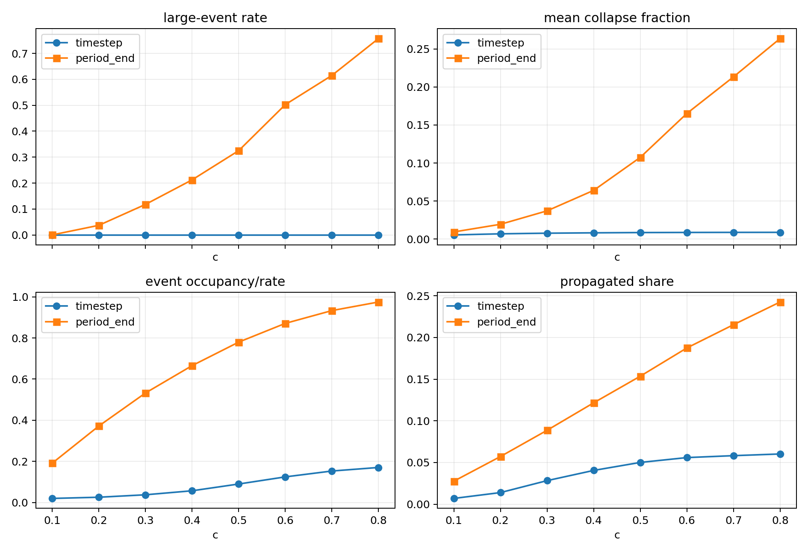

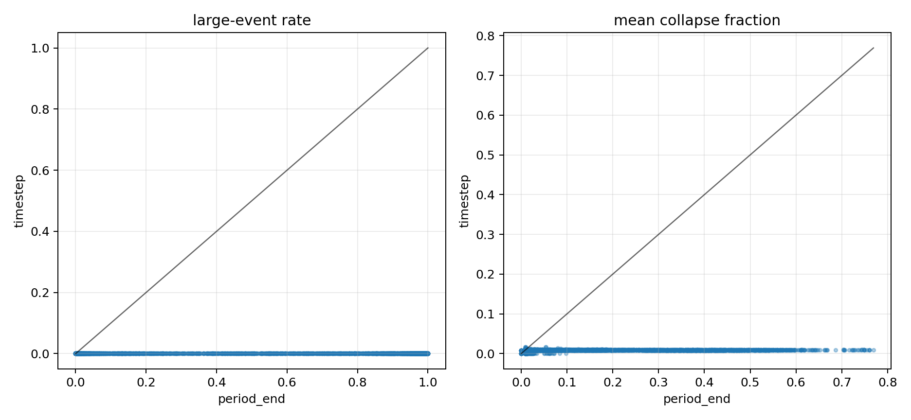

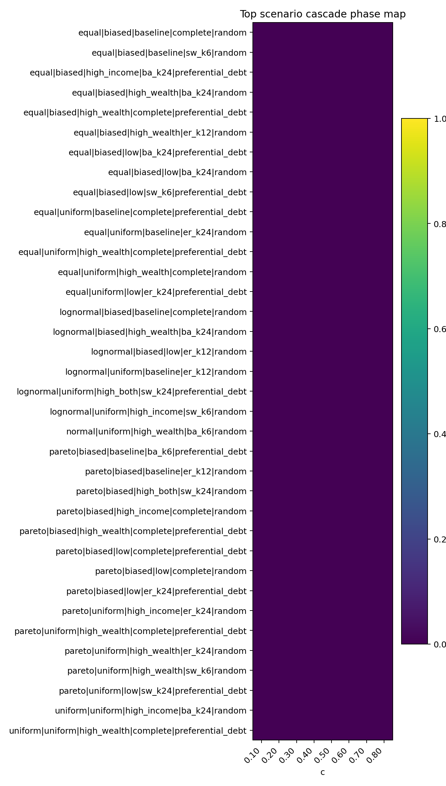

主要解释：

- timestep 协议下所有场景的大级联率均为 0，最大事件规模为 `10/120=0.0833`，低于 10%N 阈值。
- 高 `c` 仍会提高事件频率、period 占用率和重复违约占比，但不再产生 period_end 下的大规模同步崩塌。
- 这说明 period_end 大崩塌显著依赖期末批量结算窗口。

## 8. timestep 的尾部和 SOC 快筛

SOC gate 情况：

| gate | 通过场景数 | 通过率 |
| --- | ---: | ---: |
| 事件数足够 | 4758 | 0.5948 |
| 非饱和 | 7958 | 0.9948 |
| 处于转变区 | 0 | 0.0000 |
| 传播新增占比足够 | 150 | 0.0188 |
| 尾部幂律诊断可接受 | 146 | 0.0183 |
| 替代分布没有更优 | 131 | 0.0164 |
| 规模范围达标 | 0 | 0.0000 |
| 快速 SOC 候选 | 0 | 0.0000 |

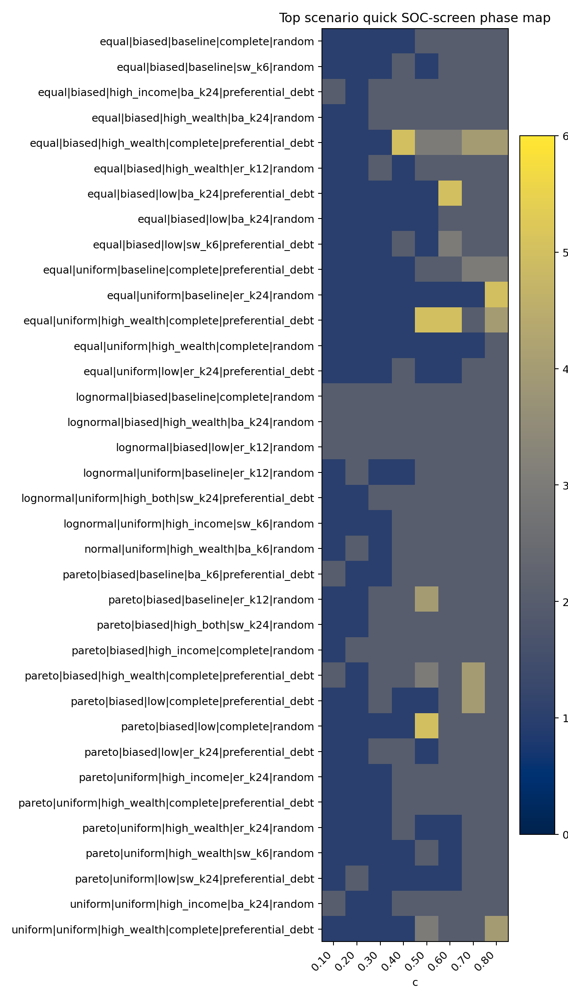

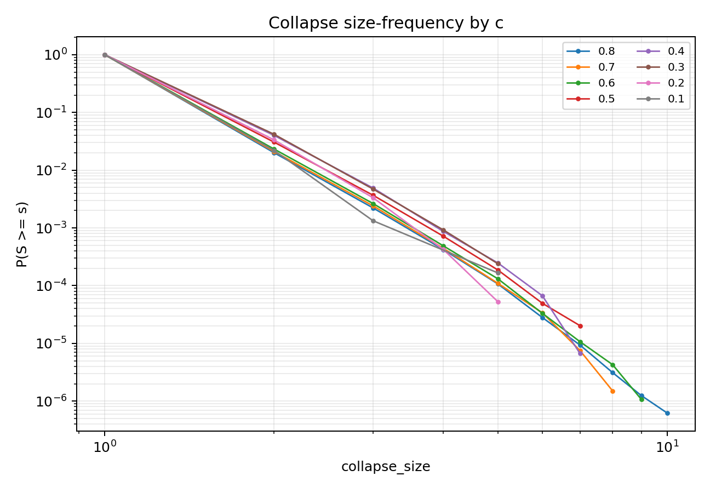

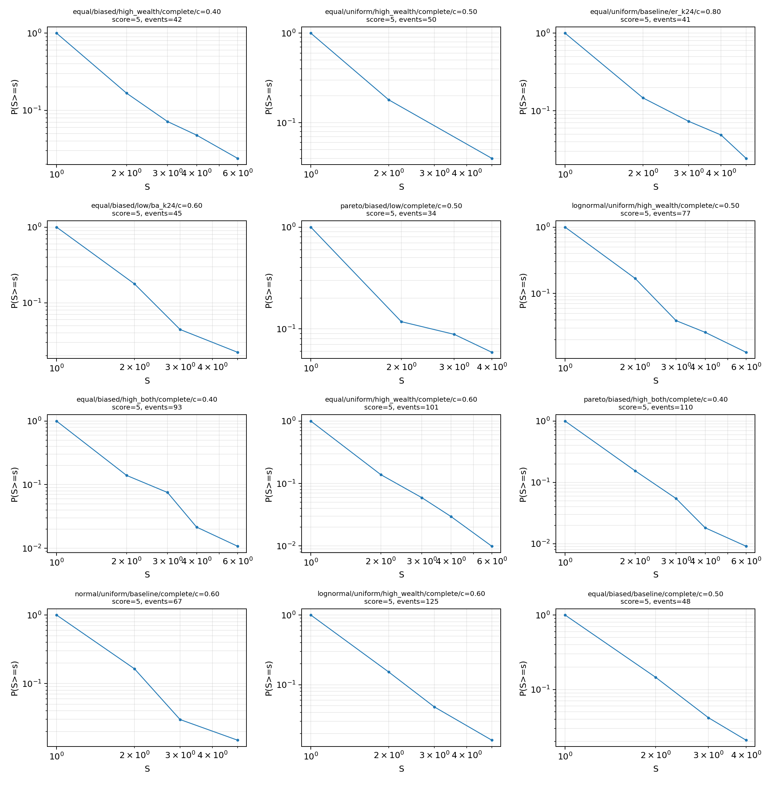

解释：

- timestep 下确实出现小尺度重尾/近幂律样貌；有 28 个“小尺度尾部候选”。
- 但这些候选没有跨过 10%N 尺度门槛，最大事件规模仍低于大级联阈值。
- 当前证据更适合表述为“高频小 avalanche 的小尺度重尾”，不能直接表述为严格 SOC。

## 9. 动画可视化

动画输出目录：`results/credit_soc_visual_evolution_20260609_v1/`  
渲染脚本：`scripts/render_creditnet_evolution_animations.py`

动画读法：

- 边表示活跃信贷暴露，越粗/越深表示权重越高。
- 节点颜色表示净资产，节点大小表示债务压力。
- 红/橙节点表示当前或新增违约节点。
- 红色高亮边表示当前级联清算波次中被减记影响的债权边。

### 9.1 period_end 批量结算过载

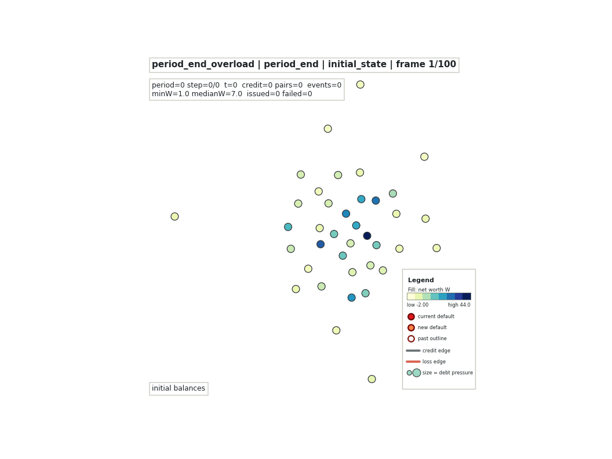

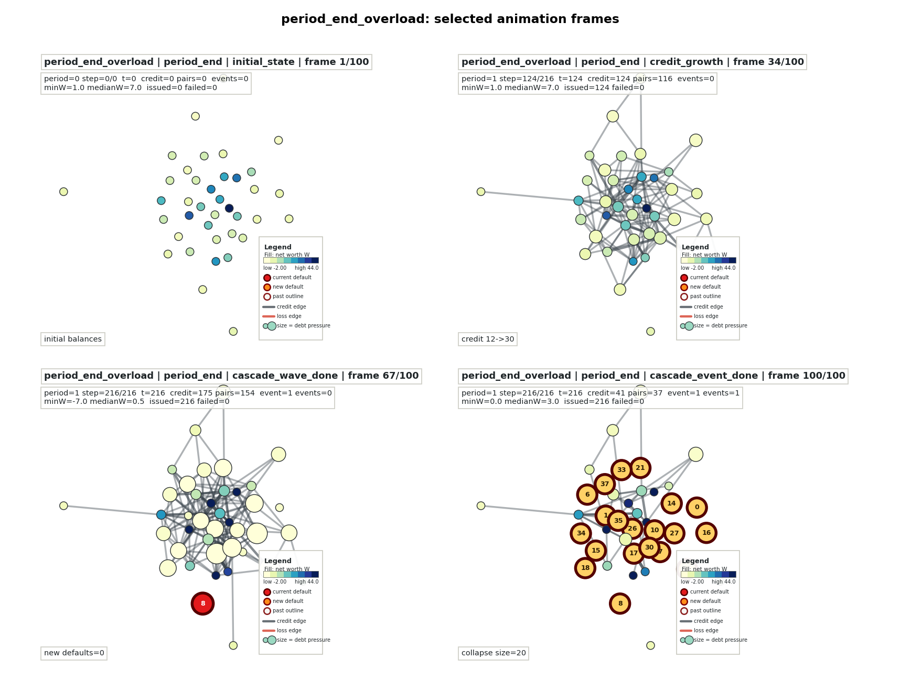

该场景使用 `N=40`、`c=0.90`、lognormal 本金、biased 收入、preferential_debt 和高支出压力。第一期累计 216 次单位信贷尝试后，在期末统一结算和检查。结果出现 13 个同步初始违约，总清算规模为 20/40，达到 50%。动画显示了 period_end 大崩塌的批量结算放大效应。

### 9.2 timestep 微步结算小 avalanche

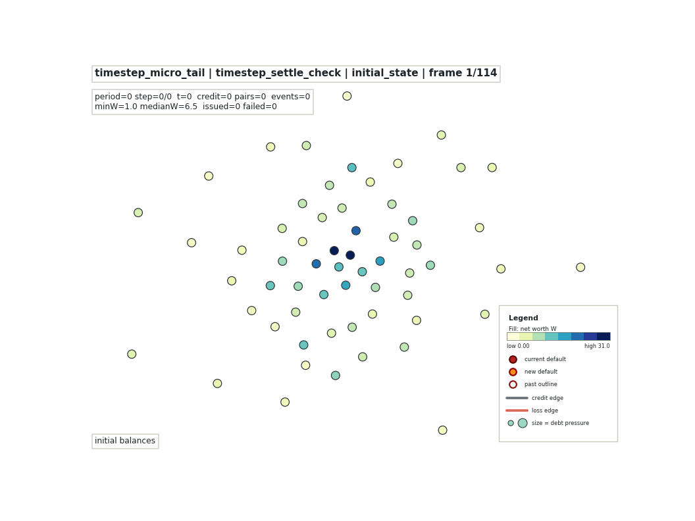

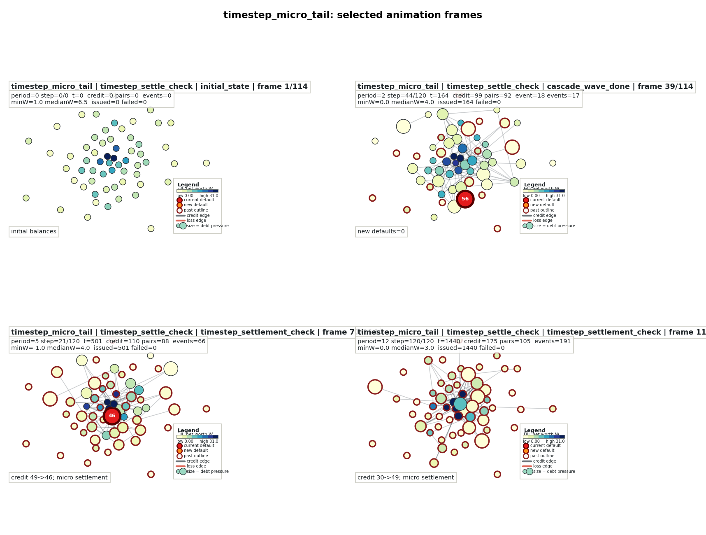

该场景使用 `N=60`、`c=0.80`、lognormal 本金、biased 收入、preferential_debt，并在每个微步后结算检查。12 个 period、1440 个 micro step 中出现 191 次 avalanche，但最大规模只有 4/60，没有大级联。动画显示了高频小事件如何替代 period_end 下的宏观大崩塌。

### 9.3 低驱动安静对照

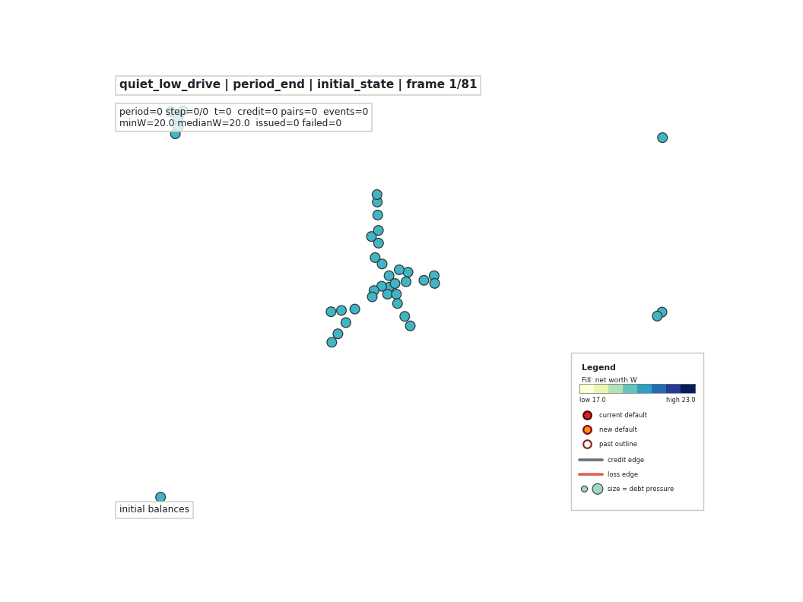

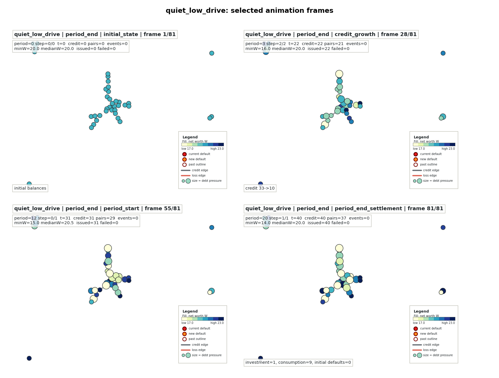

该场景使用 `N=40`、`c=0.10`、equal 本金、uniform 收入和 random 增长。20 个 period 内只完成 40 次信贷尝试，没有出现违约或 avalanche。它说明低驱动下信贷网络可以缓慢增强而不进入持续失败状态。

### 9.4 同参数 period/timestep 对照

新增同参数可视化输出目录：`results/credit_soc_visual_evolution_same_params_20260609_v3/`  
视觉支线报告：`docs/credit_soc_visual_evolution_report_20260609_v3.md`

v1 的 `period_end_overload.gif` 和 `timestep_micro_tail.gif` 是典型机制展示，参数并不完全相同。为避免把参数差异误读为协议差异，新增一组 paired 对照：两条轨迹使用相同 `N=60`、相同 seed `2009`、相同 lognormal 初始本金、相同 biased 收入、相同 `preferential_debt` 增长、相同 `high_both=(a=0.04,b=0.40)` 支出机制、相同 `c=0.80`，且 metadata 验证初始现金向量完全一致；唯一核心差异是 `period_end` 或 `timestep_settle_check` 的结算/违约检查粒度。

这个 seed 是在固定高风险同参数场景内从 `2000..2039` 中选择的视觉演示种子，选择标准是让 `period_end` 达到 `10%N` 大事件阈值而 `timestep_settle_check` 未达到该阈值。因此它适合做机制可视化和协议对照，不应单独解释为全局统计结论。全局结论仍以后文和前文扫描结果为准。

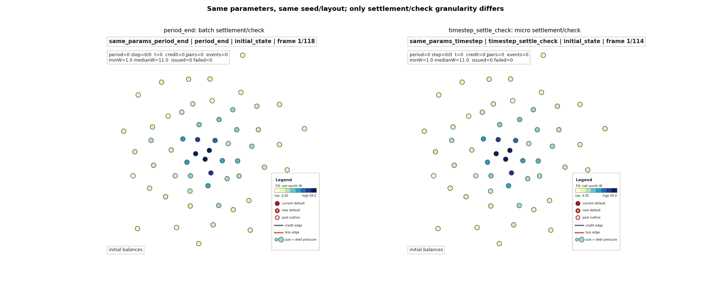

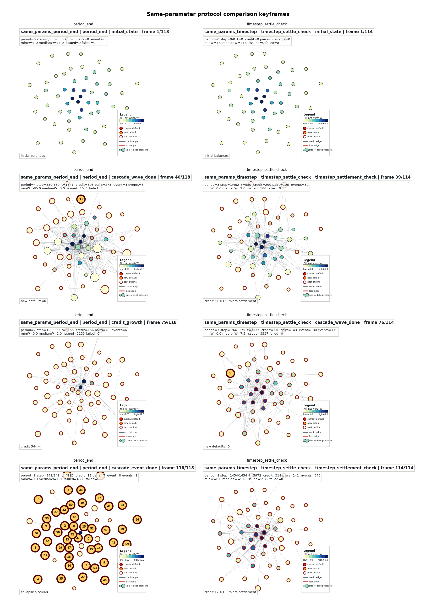

对照结果如下：

| 指标 | `period_end` | `timestep_settle_check` |
| --- | ---: | ---: |
| 完成 period 数 | 8 | 8 |
| 完成 time step 数 | 4883 | 5972 |
| avalanche/event 数 | 8 | 343 |
| event timestep rate | 0.00164 | 0.05743 |
| 最大级联规模 | 49 | 3 |
| 最大级联占比 | 0.8167 | 0.0500 |
| 是否达到 10%N | True | False |
| 初始本金 Gini | 0.5916 | 0.5916 |
| 最终净资产 Gini | 0.9524 | 0.7659 |

该对照说明：在相同高风险参数和相同初始状态下，`period_end` 会把一个宏观期内的信贷增长、完整支出和收入再分配集中到期末同一个检查点，容易形成同步初始违约并放大成大级联；`timestep_settle_check` 则在每个单位信贷后释放微结算压力，导致事件更频繁，但单次规模被切碎。本动画是机制解释，不替代全景扫描和严格 SOC 统计检验。

## 10. 综合结论

本项目当前证据层级应写为：

```text
大级联出现 < 稳健级联转变 < 重尾 < 统计上可信的幂律 < 严格 SOC
```

综合两轮扫描和动画可视化，结论如下：

1. **级联失效相图成立**：`period_end` 粒度下，系统随 `c`、支出强度、收入分配偏置和本金/拓扑结构出现清晰的过载转变。
2. **period_end 大崩塌有批量结算依赖**：期末统一结算会聚合同步初始违约和传播清算，显著放大单次事件规模。
3. **timestep 粒度下大级联消失**：同一 8000 场景轴改为微步结算后，没有任何场景达到 10%N 大级联阈值。
4. **timestep 下有小尺度重尾/近幂律现象**：部分场景在小 avalanche 范围内具有尾部候选，但尺度范围不足，不能提升为严格 SOC。
5. **period 的持续失败不是临界态证明**：高风险持续失败区更像超临界过载态或活动饱和区，不能直接等同于 SOC 的“临界态保持”。
6. **严格 SOC 当前不成立**：没有场景同时通过非饱和、转变区、传播占比、尾部可信、替代分布不过强和尺度范围门槛。

## 11. 边界与后续工作

当前报告的边界：

- `period_end` 完备扫描覆盖广，但仍是每 scenario 3 个 seed、120 periods 的相图筛查。
- `timestep` 对照是快速全景 v2：每 scenario 1 个 seed、20 periods、单期最多 500 微步。
- 动画是小规模代表性重跑，用于机制解释，不是新增严格统计证明。

后续若要继续检验 timestep 尺度的 SOC，应优先做：

1. 对 28 个小尺度尾部候选做多 seed、长时、无上限或更高 `max_period_length_steps` 复核。
2. 做 `N=120/240/500` 的有限尺寸标度，检查尾部 cutoff 是否随 `N` 扩展。
3. 明确拆分 `initial_default_count`、`propagated_default_count` 和 repeated defaults。
4. 比较 period_end、固定批次结算、timestep 结算在同一强度下的机制鲁棒性。

在当前证据下，最稳妥的表述是：该信贷网络模型存在机制敏感的级联失效和过载转变；timestep 尺度出现小 avalanche 重尾现象；但严格自组织临界尚无支持证据。
