# 信贷网络完备场景扫描与 SOC 相图报告 v1

生成时间：2026-06-08 23:21:32 CST

## 1. 扫描范围

- 原始扫描目录：`results/credit_soc_comprehensive_scan_20260608_v1`
- 分析目录：`results/credit_soc_comprehensive_scan_analysis_20260608_v1`
- run 数：24000
- avalanche 事件数：1915216
- scenario 数：8000
- scenario base 数：1000

本轮扫描覆盖本金初始化、收入分配、增长规则、支出参数、显式拓扑结构和 `c=0.10..0.80`。这是全因子筛选，用于形成相图和挑选 SOC 候选；严格 SOC 推断仍需有限尺寸和平稳性复核。

### 扫描轴与固定参数基线

为避免只看到“扫描参数变化”而忽略共同基线，本轮 8000 个 scenario 的共同实验框架如下。

扫描轴为：

| 轴 | 取值 |
| --- | --- |
| 收入到信贷尝试转换系数 `c` | `0.10, 0.20, 0.30, 0.40, 0.50, 0.60, 0.70, 0.80` |
| 初始本金分布 | `equal, uniform, normal, lognormal, pareto` |
| 收入分配规则 | `uniform, biased` |
| 信贷增长规则 | `random, preferential_debt` |
| 支出机制 `(a,b)` | `low=(0.01,0.10)`、`baseline=(0.02,0.20)`、`high_income=(0.02,0.40)`、`high_wealth=(0.04,0.20)`、`high_both=(0.04,0.40)` |
| 交易机会拓扑 | `complete`；`er/ba/sw` 的目标平均度 `k=6,12,24` |

除上述扫描轴外，本轮保持以下固定基线：

| 固定项 | 本轮取值与含义 |
| --- | --- |
| 节点数 | `N=120` |
| 独立重复 | 每个 scenario `3` 个 seed/run |
| 单 run 长度 | 最多 `120 periods`；`max_time_steps=0` 表示不额外限制累计 time_step |
| 初始本金规模 | `mean_initial_money=20.0`；具体样本由本金分布决定 |
| 初始参考收入 | `initial_income_per_capita=5.0`，所以初始 `Y_0=120*5=600` |
| period 长度规则 | 收入内生：`K_t=round(c*Y_(t-1))`；固定 `K` 参数不参与本轮计算 |
| 单位信贷规模 | 每个成功 credit `time_step` 只新增 `1` 单位有向信贷暴露 |
| 支出顺序 | 先投资支出，再消费支出；二者都受主体现金约束 |
| 违约阈值 | `default_threshold=0.0`，严格 `W_i<0` 才违约 |
| 大级联标签阈值 | `collapse_threshold_fraction=0.10`，在 `N=120` 下等价于至少 `12` 个节点 |
| 清算规则 | `wipe_defaulted_assets=True`；现金不额外扣除，贷款资产/债务负债表内减记 |
| 违约后节点状态 | `continue_after_avalanche`：清算后节点不永久退出，后续 period 仍可参与 |
| 违约检查粒度 | `period_end`：每个 period 的所有信贷尝试和流量结算结束后统一检查 |
| 会计校验 | `validate_accounting=True` |
| biased 基础权重 | `income_bias_floor=1.0` |
| SW 重连概率 | `sw_rewire_probability=0.10` |
| 随机种子基线 | 主演化 `seed_base=2026060800`，拓扑 `topology_seed_base=2026068800` |

拓扑变量的含义需要单独说明：`er/ba/sw` 并不是在初始化时直接放入一张已有信贷暴露网络。初始化时实际信贷暴露矩阵仍为空；拓扑先生成一张无向“交易机会图”，只规定哪些节点对可以在后续 credit `time_step` 中成为贷款人与借款人。实际信贷网络在运行过程中逐步形成，方向由当次贷款人/借款人决定，边权由重复成功借贷累积。`complete` 表示没有额外机会边界，任意两主体都可成为候选对手方。

### 执行摘要

本轮扫描给出的主结论是：**级联失效相图存在清楚的过载转变，但 SOC 相图没有出现通过快速证据门槛的区域**。

1. `c` 是最强的一维控制轴。随 `c=0.10` 增至 `0.80`，全场景平均事件级大级联率从 `0.0001` 增至 `0.7576`，平均事件规模占比从 `0.0094` 增至 `0.2637`，事件占用率从 `0.1913` 增至 `0.9749`。这说明高 `c` 不是把系统推向稀疏临界 avalanche，而是把大量场景推向近乎每期发生违约的过载区。
2. 收入分配机制影响最强：biased 收入下平均大级联率为 `0.5026`，uniform 收入下为 `0.1393`；biased 收入同时显著提高事件占用率和平均规模。
3. 支出机制呈单调放大：`high_both`、`high_income`、`high_wealth` 的平均规模和大事件率均高于 baseline/low，说明更强消费/投资流量压力会更早触发资产负债表违约。
4. 本金初始化中 lognormal、pareto、uniform 的平均事件规模较高，equal/normal 相对缓和；但大级联高发区域仍主要由 `c`、biased 收入和高支出共同决定。
5. 拓扑结构改变级联规模和传播占比，但在本轮 `N=120`、`K_t=round(cY)`、`period_end` 协议下，拓扑不是最主导因素；complete、BA/ER/SW 高平均度都会进入高风险区。
6. SOC 快速筛选中 `quick_soc_candidate=0`。160 个尾部候选全部可拟合出某种幂律诊断，但只有 81 个通过“幂律不拒绝”类门槛，且只有 1 个场景没有被 exponential/lognormal 等替代分布更好解释；没有任何场景同时满足非饱和、转变区、传播占比、尾部可信和替代分布不过强这些条件。

按项目定义，这意味着：**当前完备场景扫描支持“级联失效规模相图”和“过载转变相图”，但不支持严格 SOC 相图中存在稳定临界区域**。高风险区应解释为持续失败/过载吸引子，而非 SOC。

### 按 c 聚合的相图骨架

| c | 平均大级联率 | 平均事件规模占比 | 平均事件占用率 | 平均传播占比 | 近饱和场景数/1000 |
| ---: | ---: | ---: | ---: | ---: | ---: |
| 0.10 | 0.0001 | 0.0094 | 0.1913 | 0.0276 | 43 |
| 0.20 | 0.0371 | 0.0195 | 0.3720 | 0.0572 | 194 |
| 0.30 | 0.1177 | 0.0372 | 0.5324 | 0.0886 | 359 |
| 0.40 | 0.2124 | 0.0641 | 0.6655 | 0.1216 | 527 |
| 0.50 | 0.3251 | 0.1075 | 0.7798 | 0.1535 | 653 |
| 0.60 | 0.5026 | 0.1652 | 0.8710 | 0.1874 | 804 |
| 0.70 | 0.6153 | 0.2133 | 0.9332 | 0.2153 | 897 |
| 0.80 | 0.7576 | 0.2637 | 0.9749 | 0.2425 | 966 |

完整辅助表见 `results/credit_soc_comprehensive_scan_analysis_20260608_v1/phase_summary_by_c.csv`、`axis_effect_summary.csv`、`top_cascade_scenarios.csv` 和 `soc_gate_summary.csv`。

## 2. 级联失效规模相图

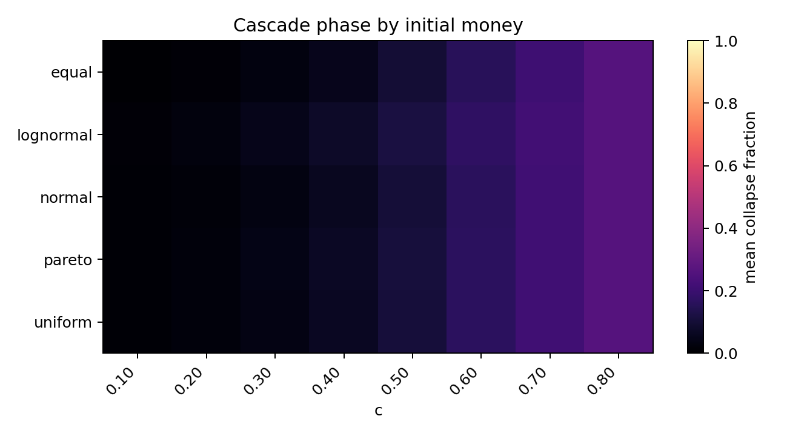

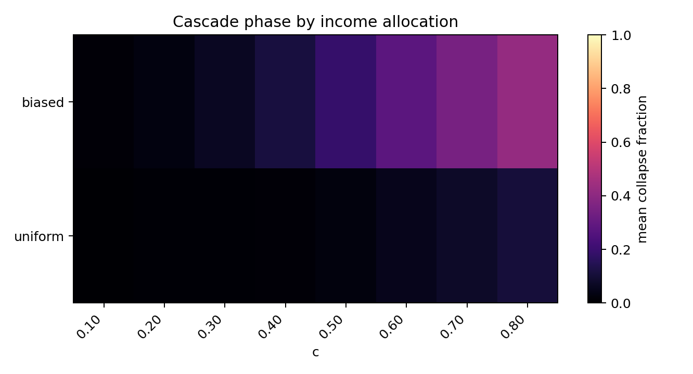

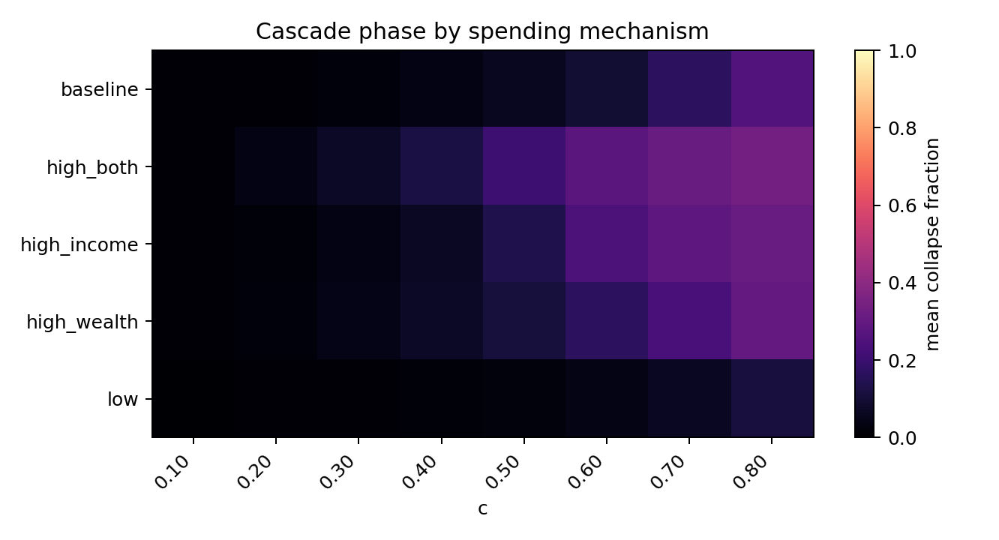

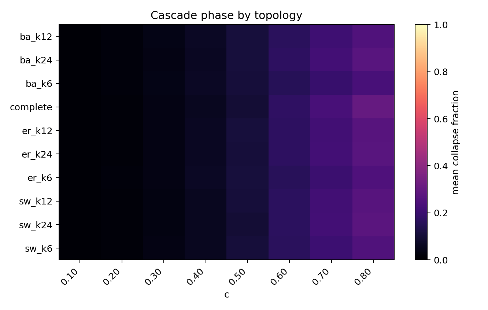

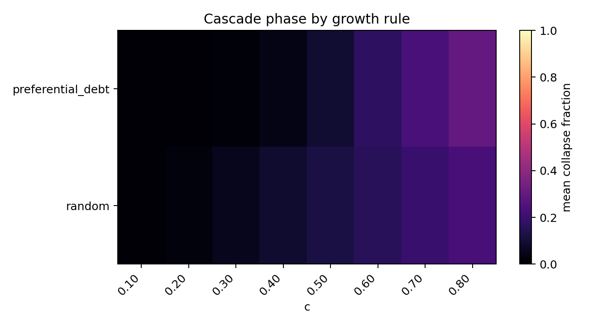

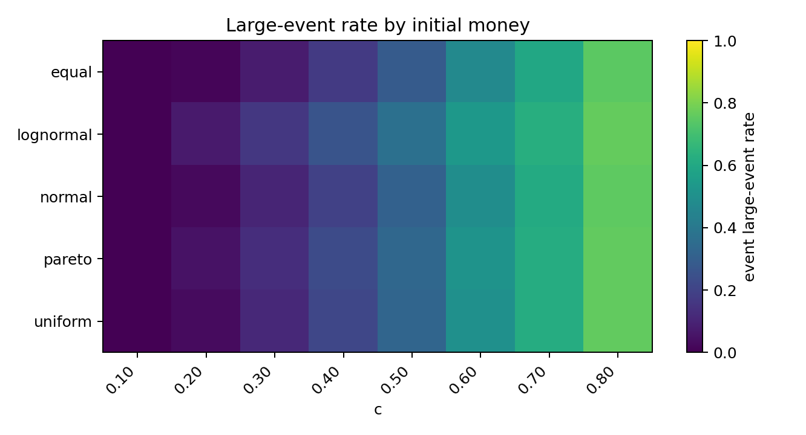

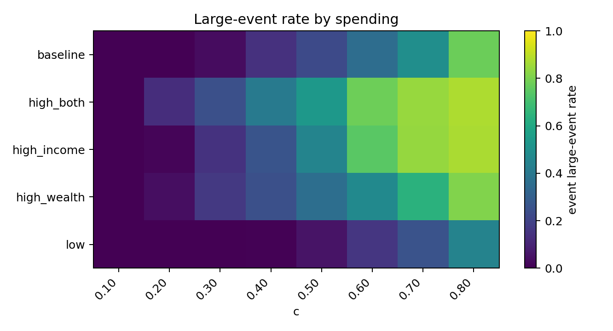

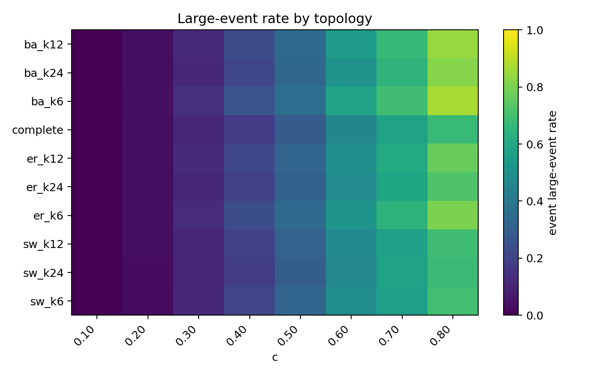

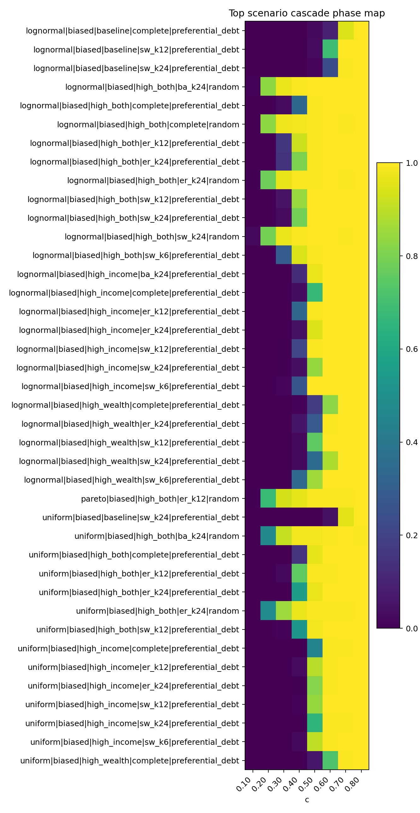

级联规模最高的场景如下：

| c | money_distribution | income_distribution_rule | growth_rule | spending_label | topology_label | event_large_event_rate | mean_event_fraction | propagated_share_total | event_occupancy |
| --- | --- | --- | --- | --- | --- | --- | --- | --- | --- |
| 0.8 | uniform | biased | preferential_debt | high_income | complete | 1 | 0.7601 | 0.08984 | 1 |
| 0.8 | lognormal | biased | preferential_debt | high_both | complete | 1 | 0.7593 | 0.09902 | 1 |
| 0.8 | lognormal | biased | preferential_debt | high_income | complete | 1 | 0.7541 | 0.09608 | 1 |
| 0.8 | uniform | biased | preferential_debt | high_both | complete | 1 | 0.7495 | 0.09945 | 1 |
| 0.7 | uniform | biased | preferential_debt | high_both | complete | 1 | 0.729 | 0.08161 | 1 |
| 0.7 | lognormal | biased | preferential_debt | high_income | complete | 1 | 0.7266 | 0.07605 | 1 |
| 0.7 | lognormal | biased | preferential_debt | high_both | complete | 1 | 0.7067 | 0.09522 | 1 |
| 0.8 | lognormal | biased | preferential_debt | high_wealth | complete | 1 | 0.7054 | 0.05861 | 1 |
| 0.8 | uniform | biased | preferential_debt | high_wealth | complete | 1 | 0.7044 | 0.0554 | 1 |
| 0.6 | lognormal | biased | preferential_debt | high_both | complete | 1 | 0.6682 | 0.07254 | 1 |
| 0.6 | uniform | biased | preferential_debt | high_both | complete | 1 | 0.6655 | 0.06724 | 1 |
| 0.8 | lognormal | biased | preferential_debt | high_both | sw_k24 | 1 | 0.6623 | 0.1003 | 1 |
| 0.8 | lognormal | biased | preferential_debt | baseline | complete | 1 | 0.6484 | 0.05491 | 1 |
| 0.7 | lognormal | biased | preferential_debt | high_both | sw_k24 | 1 | 0.6361 | 0.08719 | 1 |
| 0.8 | lognormal | biased | preferential_debt | high_both | sw_k12 | 1 | 0.6339 | 0.08987 | 1 |
| 0.7 | lognormal | biased | preferential_debt | high_income | sw_k24 | 1 | 0.6257 | 0.0784 | 1 |
| 0.8 | lognormal | biased | preferential_debt | high_income | sw_k24 | 1 | 0.6191 | 0.1055 | 1 |
| 0.8 | uniform | biased | preferential_debt | high_both | sw_k12 | 1 | 0.618 | 0.08952 | 1 |
| 0.6 | lognormal | biased | preferential_debt | high_income | complete | 1 | 0.6117 | 0.06384 | 1 |
| 0.8 | uniform | biased | preferential_debt | high_income | sw_k24 | 1 | 0.6107 | 0.1068 | 1 |

## 3. SOC 快速筛选相图

SOC 快速筛选不是最终证明。它只是把事件数、非饱和占用、级联转变、传播新增占比、尾部拟合和替代分布对照合成一个 0-6 分的候选指标。

- 快速候选数：0
- 近持续失败/饱和场景数（event occupancy >= 0.80）：4443

SOC gate 的通过情况如下：

| gate | 通过场景数 | 通过率 |
| --- | ---: | ---: |
| 事件数足够 | 6736 | 0.8420 |
| 非饱和占用 | 3557 | 0.4446 |
| 处于转变区 | 1365 | 0.1706 |
| 传播新增占比足够 | 2641 | 0.3301 |
| 尾部幂律诊断可接受 | 81 | 0.0101 |
| 替代分布没有更优 | 1 | 0.0001 |
| 快速 SOC 候选 | 0 | 0.0000 |

这里的“尾部幂律诊断可接受”只是快速 bootstrap 下的候选门槛；它不是最终严格幂律证明。关键在于：即使部分场景的幂律拟合不被拒绝，几乎全部场景仍被替代分布、饱和占用或非传播主导问题排除。

### SOC 相图读法

SOC 相图不等于“大级联越多越接近 SOC”。在本轮结果中，高 `c` 高风险区通常同时具有：

- `event_occupancy` 接近 1，即几乎每期都发生记录事件；
- `event_large_event_rate` 接近 1，即大级联不再是稀疏 avalanche，而是持续过载；
- `propagated_share_total` 在最大规模场景中往往只有 5%-10% 左右，说明总规模很大部分来自期末同步初始违约；
- tail fit 即便局部不拒绝幂律，`pl_vs_lognormal_R` 多为负，替代分布解释并不差。

因此，本轮 SOC 相图的结论是“没有候选临界带”，而不是“最高风险区就是 SOC 区”。

### 主要场景维度效应

| 维度 | 代表类别 | 平均大级联率 | 平均事件规模占比 | 平均事件占用率 | 平均传播占比 |
| --- | --- | ---: | ---: | ---: | ---: |
| 收入分配 | biased | 0.5026 | 0.1824 | 0.8330 | 0.1658 |
| 收入分配 | uniform | 0.1393 | 0.0376 | 0.4970 | 0.1077 |
| 支出机制 | high_both | 0.4782 | 0.1725 | 0.7892 | 0.1856 |
| 支出机制 | high_income | 0.4164 | 0.1390 | 0.7326 | 0.1556 |
| 支出机制 | high_wealth | 0.3415 | 0.1196 | 0.7038 | 0.1514 |
| 本金初始化 | lognormal | 0.3489 | 0.1166 | 0.7071 | 0.1447 |
| 本金初始化 | pareto | 0.3297 | 0.1110 | 0.6553 | 0.1505 |
| 本金初始化 | uniform | 0.3198 | 0.1099 | 0.6879 | 0.1274 |
| 增长规则 | random | 0.3414 | 0.1109 | 0.6173 | 0.1820 |
| 增长规则 | preferential_debt | 0.3005 | 0.1090 | 0.7128 | 0.0915 |
| 拓扑 | complete | 0.2903 | 0.1163 | 0.6191 | 0.1677 |
| 拓扑 | ba_k24 | 0.3346 | 0.1132 | 0.6966 | 0.1472 |
| 拓扑 | er_k24 | 0.3075 | 0.1124 | 0.6472 | 0.1470 |

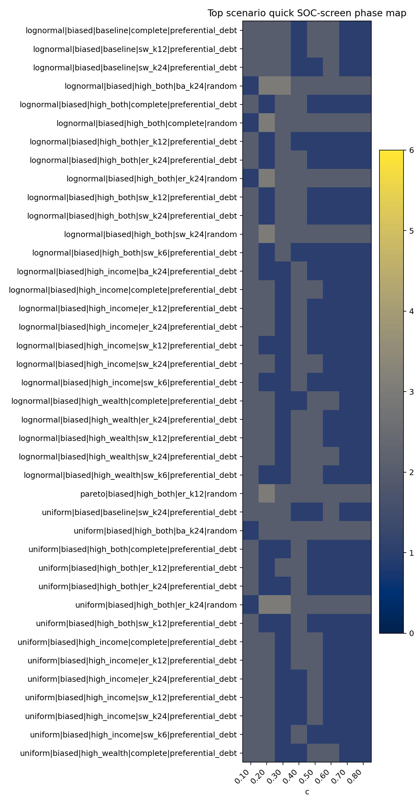

SOC 快速筛选分数最高的场景如下：

| soc_screen_score | quick_soc_candidate | c | money_distribution | income_distribution_rule | growth_rule | spending_label | topology_label | event_large_event_rate | propagated_share_total | event_occupancy | bootstrap_p | bounded_bootstrap_p | pl_vs_lognormal_R |
| --- | --- | --- | --- | --- | --- | --- | --- | --- | --- | --- | --- | --- | --- |
| 4 | False | 0.8 | normal | uniform | preferential_debt | high_both | sw_k24 | 0.975 | 0.2043 | 1 | 0.4615 | 0.3846 | -0.08833 |
| 4 | False | 0.3 | equal | biased | random | high_wealth | er_k24 | 0.507 | 0.168 | 0.7889 |  |  |  |
| 4 | False | 0.3 | equal | biased | random | high_wealth | complete | 0.4167 | 0.1564 | 0.7333 |  |  |  |
| 4 | False | 0.2 | pareto | biased | random | high_wealth | complete | 0.2085 | 0.166 | 0.7861 |  |  |  |
| 4 | False | 0.4 | pareto | biased | random | low | er_k12 | 0.1754 | 0.3765 | 0.7917 |  |  |  |
| 4 | False | 0.2 | pareto | biased | random | high_income | complete | 0.1608 | 0.1854 | 0.7944 |  |  |  |
| 4 | False | 0.6 | normal | uniform | random | high_both | complete | 0.03546 | 0.4303 | 0.7833 |  |  |  |
| 4 | False | 0.5 | equal | uniform | random | high_both | complete | 0.02151 | 0.32 | 0.2583 |  |  |  |
| 4 | False | 0.6 | pareto | uniform | random | high_both | complete | 0.0212 | 0.44 | 0.7861 |  |  |  |
| 3 | False | 0.6 | normal | biased | random | high_both | er_k24 | 0.9778 | 0.5013 | 1 | 0.2308 | 0.3077 | -1.71 |
| 3 | False | 0.6 | normal | biased | random | high_both | sw_k12 | 0.9778 | 0.4887 | 1 | 0.1538 | 0.07692 | -5.038 |
| 3 | False | 0.5 | normal | biased | random | high_both | complete | 0.9778 | 0.4597 | 1 | 0.07692 | 0.1538 | -5.762 |
| 3 | False | 0.6 | normal | biased | random | high_income | complete | 0.9778 | 0.4339 | 1 | 0.2308 | 0.3077 | -1.846 |
| 3 | False | 0.6 | normal | biased | random | high_wealth | ba_k24 | 0.9778 | 0.4009 | 1 | 0.1538 | 0.07692 | -3.942 |
| 3 | False | 0.5 | lognormal | biased | random | baseline | sw_k24 | 0.9778 | 0.3207 | 1 | 0.1538 | 0.1538 | -1.615 |
| 3 | False | 0.8 | normal | biased | random | low | sw_k24 | 0.9778 | 0.2761 | 1 | 0.07692 | 0.1538 | -5.056 |
| 3 | False | 0.8 | equal | uniform | preferential_debt | high_both | ba_k12 | 0.9778 | 0.2492 | 1 | 0.6923 | 0.7692 | -1.346 |
| 3 | False | 0.7 | lognormal | uniform | preferential_debt | high_both | ba_k24 | 0.9778 | 0.2292 | 1 | 0.1538 | 0.3077 | -3.042 |
| 3 | False | 0.8 | uniform | uniform | preferential_debt | high_income | er_k6 | 0.9778 | 0.2232 | 1 | 0.07692 | 0.1538 | -1.764 |
| 3 | False | 0.8 | uniform | uniform | preferential_debt | high_income | er_k12 | 0.9778 | 0.2105 | 1 | 0.4615 | 0.2308 | -1.328 |
| 3 | False | 0.7 | pareto | uniform | preferential_debt | high_both | er_k12 | 0.9778 | 0.2008 | 1 | 0.3077 | 0.1538 | -3.153 |
| 3 | False | 0.7 | lognormal | uniform | preferential_debt | high_both | er_k6 | 0.9778 | 0.199 | 1 | 0.2308 | 0.3077 | -1.709 |
| 3 | False | 0.7 | normal | uniform | preferential_debt | high_both | sw_k24 | 0.9778 | 0.1986 | 1 | 0.1538 | 0.1538 | -2.577 |
| 3 | False | 0.8 | uniform | uniform | preferential_debt | high_both | sw_k6 | 0.9778 | 0.1952 | 1 | 0.07692 | 0.1538 | -7.387 |
| 3 | False | 0.7 | uniform | biased | random | low | ba_k12 | 0.9778 | 0.1907 | 1 | 0.1538 | 0.3077 | -2.848 |

## 4. 级联失效规模-频率关系图

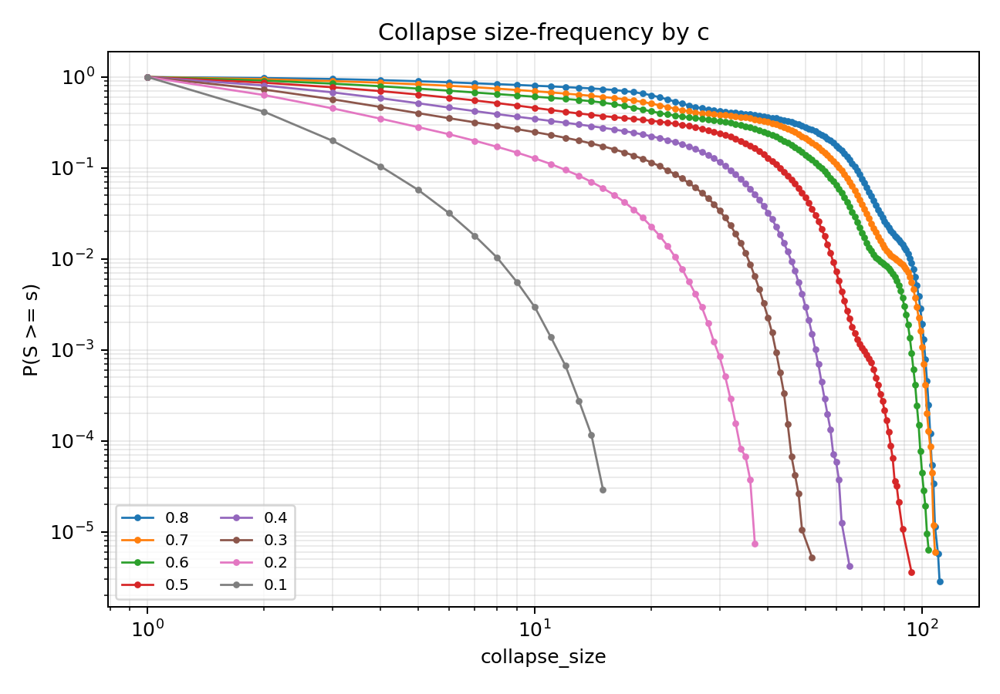

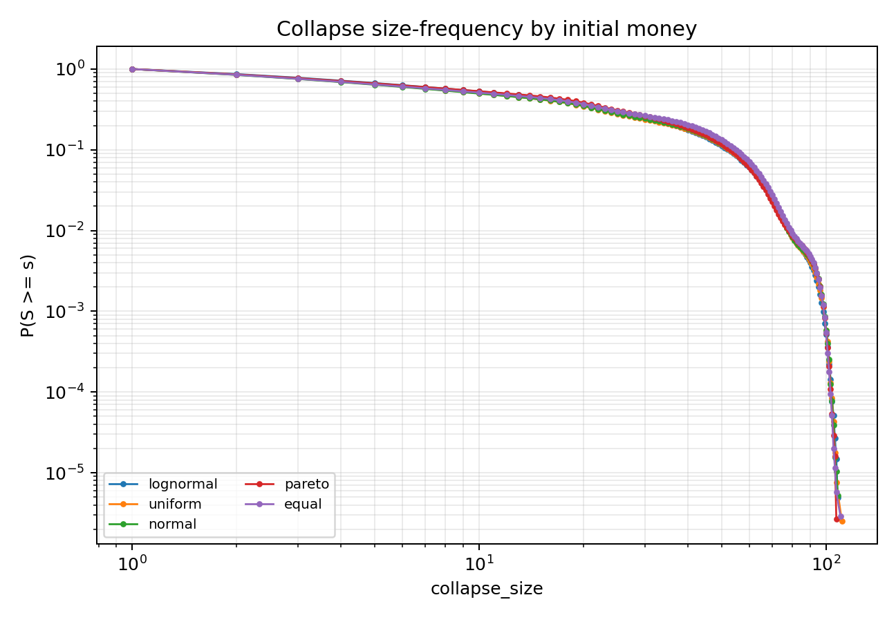

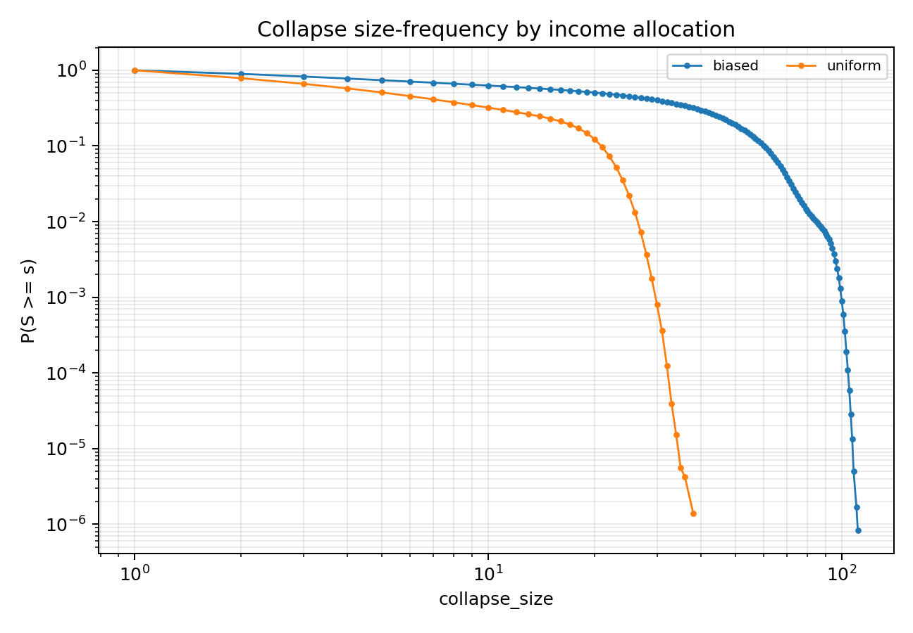

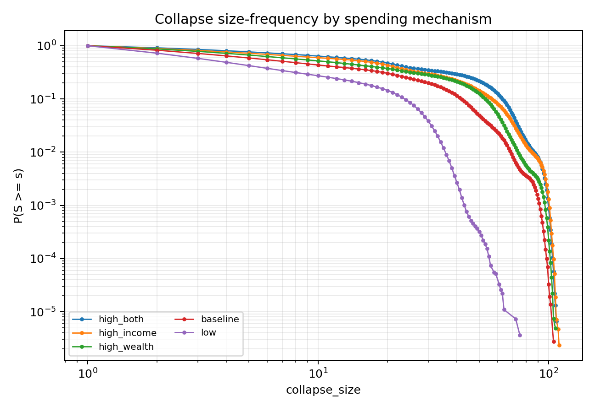

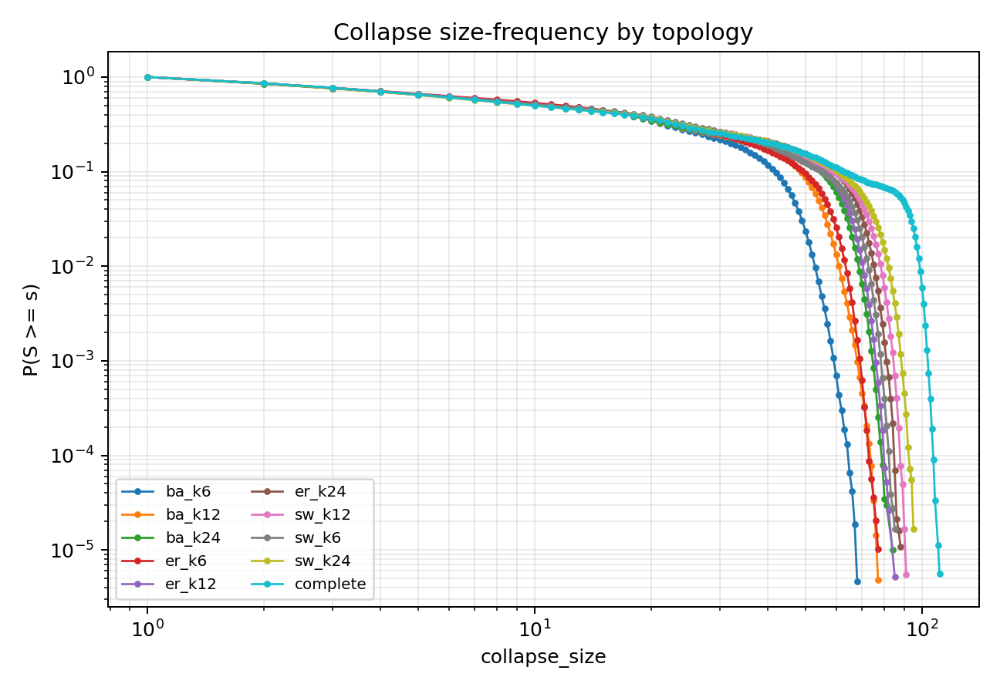

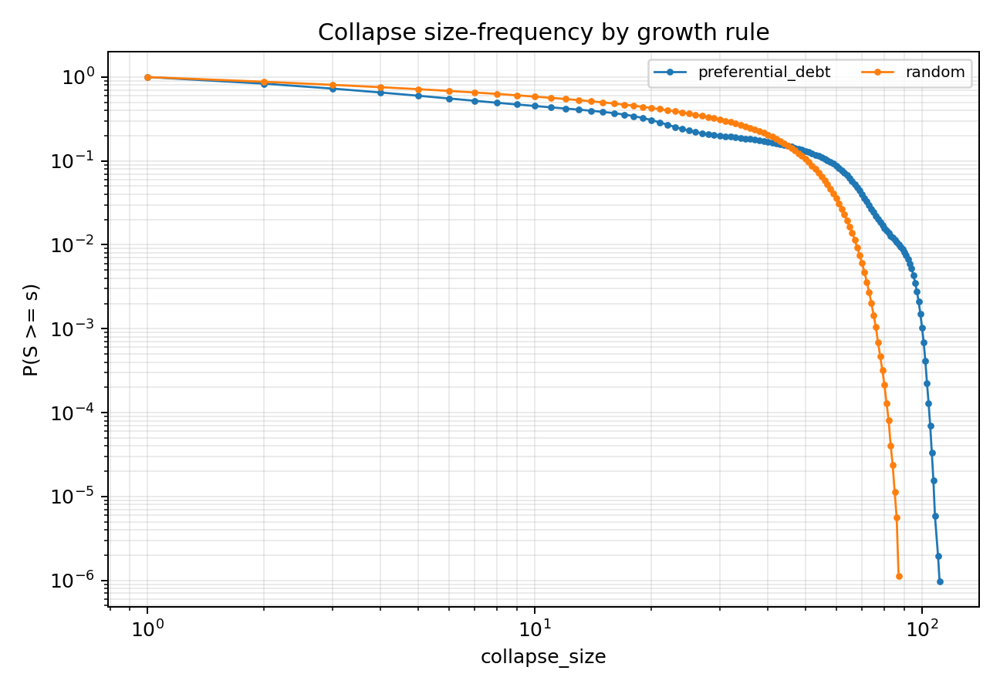

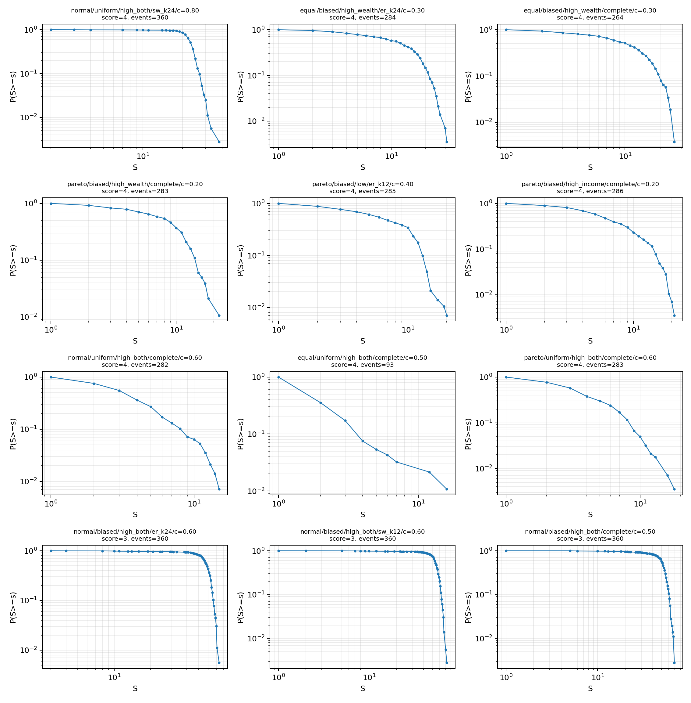

## 5. 尾部拟合摘要

| c | money_distribution | income_distribution_rule | growth_rule | spending_label | topology_label | events | fit_status | xmin | alpha | bootstrap_p | bounded_alpha | bounded_bootstrap_p | pl_vs_exponential_R | pl_vs_lognormal_R |
| --- | --- | --- | --- | --- | --- | --- | --- | --- | --- | --- | --- | --- | --- | --- |
| 0.7 | uniform | uniform | preferential_debt | high_both | er_k12 | 360 | ok | 23 | 13.71 | 0.8462 | 13.71 | 1 | -0.177 | -0.167 |
| 0.7 | normal | uniform | preferential_debt | high_income | complete | 360 | ok | 24 | 15.16 | 0.7692 | 15.16 | 0.9231 | -0.2481 | -0.2525 |
| 0.8 | equal | uniform | preferential_debt | high_both | ba_k12 | 360 | ok | 22 | 13.26 | 0.6923 | 13.26 | 0.7692 | -0.8878 | -1.346 |
| 0.5 | pareto | biased | preferential_debt | high_both | ba_k12 | 360 | ok | 46 | 18.43 | 0.6154 | 18.43 | 0.4615 | -0.8211 | -1.864 |
| 0.5 | uniform | biased | random | high_income | sw_k6 | 360 | ok | 35 | 13.31 | 0.5385 | 13.31 | 0.3077 | -0.9714 | -2.003 |
| 0.7 | lognormal | uniform | preferential_debt | high_income | er_k12 | 360 | ok | 23 | 13.8 | 0.5385 | 13.8 | 0.3846 | -1.129 | -2.407 |
| 0.8 | normal | uniform | preferential_debt | high_wealth | ba_k12 | 360 | ok | 22 | 16.89 | 0.5385 | 16.89 | 0.3846 | -0.3501 | -0.4529 |
| 0.8 | uniform | uniform | preferential_debt | high_income | sw_k6 | 360 | ok | 25 | 15.63 | 0.5385 | 15.63 | 0.6154 | -0.7829 | -1.843 |
| 0.8 | uniform | uniform | preferential_debt | high_income | er_k12 | 360 | ok | 24 | 14.27 | 0.4615 | 14.27 | 0.2308 | -0.8433 | -1.328 |
| 0.6 | normal | biased | preferential_debt | high_income | sw_k12 | 360 | ok | 69 | 25.8 | 0.4615 | 25.8 | 0.5385 | -0.4424 | -1.296 |
| 0.7 | normal | uniform | preferential_debt | high_both | ba_k12 | 360 | ok | 21 | 12.86 | 0.4615 | 12.86 | 0.4615 | -0.9408 | -1.661 |
| 0.8 | normal | uniform | preferential_debt | high_both | sw_k24 | 360 | ok | 24 | 13.16 | 0.4615 | 13.16 | 0.3846 | 0.01463 | -0.08833 |
| 0.5 | pareto | biased | preferential_debt | high_both | ba_k24 | 360 | ok | 53 | 19.91 | 0.3846 | 19.91 | 0.3077 | -0.5653 | -1.42 |
| 0.7 | uniform | uniform | preferential_debt | high_both | complete | 360 | ok | 24 | 13.76 | 0.3846 | 13.76 | 0.1538 | -1.017 | -2.345 |
| 0.6 | lognormal | biased | preferential_debt | baseline | er_k6 | 360 | ok | 29 | 13.87 | 0.3846 | 13.87 | 0.2308 | -1.204 | -3.058 |
| 0.7 | pareto | uniform | preferential_debt | high_both | er_k12 | 360 | ok | 23 | 14.3 | 0.3077 | 14.3 | 0.1538 | -1.185 | -3.153 |
| 0.4 | uniform | biased | random | high_both | complete | 360 | ok | 43 | 14.41 | 0.3077 | 14.41 | 0.3846 | -0.5911 | -0.8915 |
| 0.8 | uniform | uniform | preferential_debt | high_both | ba_k12 | 360 | ok | 22 | 14.08 | 0.3077 | 14.08 | 0.1538 | -1.056 | -2.419 |
| 0.7 | uniform | uniform | preferential_debt | high_income | complete | 360 | ok | 24 | 15.24 | 0.3077 | 15.24 | 0.3077 | -1.045 | -2.756 |
| 0.8 | normal | uniform | preferential_debt | high_wealth | complete | 360 | ok | 24 | 14.59 | 0.3077 | 14.59 | 0.1538 | -1.306 | -3.481 |
| 0.8 | uniform | uniform | preferential_debt | high_wealth | sw_k24 | 360 | ok | 24 | 15.39 | 0.3077 | 15.39 | 0.6154 | -0.7327 | -1.193 |
| 0.6 | normal | biased | preferential_debt | high_wealth | er_k6 | 360 | ok | 44 | 15.22 | 0.3077 | 15.22 | 0.3077 | -0.8312 | -1.691 |
| 0.6 | normal | biased | random | high_both | er_k24 | 360 | ok | 63 | 22.03 | 0.2308 | 22.03 | 0.3077 | -0.5928 | -1.71 |
| 0.6 | normal | biased | random | high_income | complete | 360 | ok | 49 | 18.24 | 0.2308 | 18.24 | 0.3077 | -0.6954 | -1.846 |
| 0.7 | lognormal | uniform | preferential_debt | high_both | er_k6 | 360 | ok | 23 | 14.49 | 0.2308 | 14.49 | 0.3077 | -0.8292 | -1.709 |

## 6. 当前判定

本轮完备场景扫描可以给出两个相图层面的结论：

1. 级联失效规模相图：高 `c`、高支出倾向、biased 收入分配、重尾本金和部分稀疏/异质拓扑会显著推高大级联率和平均规模。
2. SOC 相图：出现大级联或重尾的区域不等同于严格 SOC。凡是 event occupancy 接近 1、传播新增占比低、或尾部被替代分布更好解释的区域，应解释为过载/持续失败区，而不是 SOC。

最终 SOC 推断仍遵循项目定义：大级联出现 < 稳健级联转变 < 重尾 < 可信幂律 < 严格 SOC。后续如果要提升某个候选区，需要对该候选继续做 `N` 扩展、长时平稳性、重复违约与机制消融。

## 7. 解释边界和后续建议

本轮扫描是“完备场景筛选”，不是对每个场景都做最终严格 SOC 证明。为了在时间有限下覆盖更多机制，使用了 `N=120`、每 scenario 3 个 seed、每 run 120 periods 的统一协议，并用快速 SOC gate 排除明显不合格场景。这个设计适合画相图和找候选，但不适合把单个候选直接升级为严格 SOC。

后续如果需要进一步加强证据，应优先对 SOC 快筛分数最高但未过门槛的边界场景做三类复核：

1. 有限尺寸：`N=120/240/500`，保持收入内生 `c` 或等价强度，而不是固定绝对 `K`。
2. 长时平稳性：把 period 数扩展到 1000+，检查 early/late 漂移、重复违约和活跃信贷终态。
3. 事件定义复核：拆分 `initial_default_count`、`propagated_default_count` 和 repeated defaults，确认规模-频率图中的尾部是否来自网络传播，而非同步结算或重复失败。

在当前证据下，没有必要把高 `c` 过载区继续解释为 SOC 候选；更有价值的是研究它作为“信贷流量压力导致的系统性持续失败区”的政策含义。
