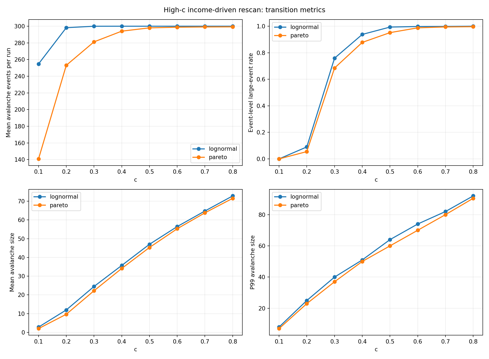
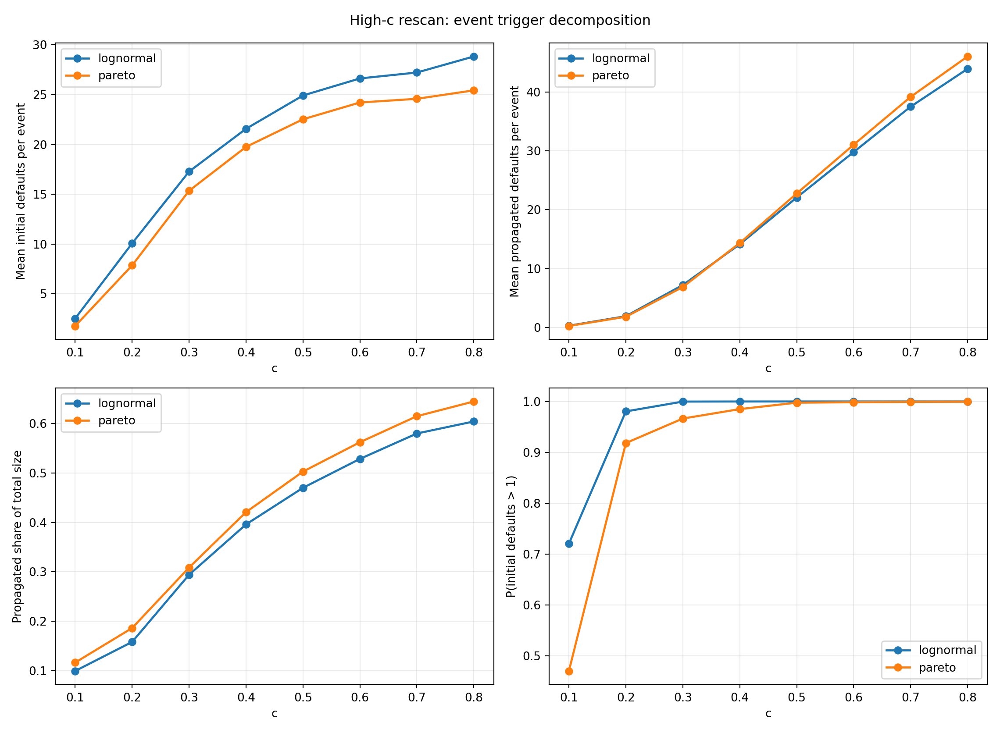
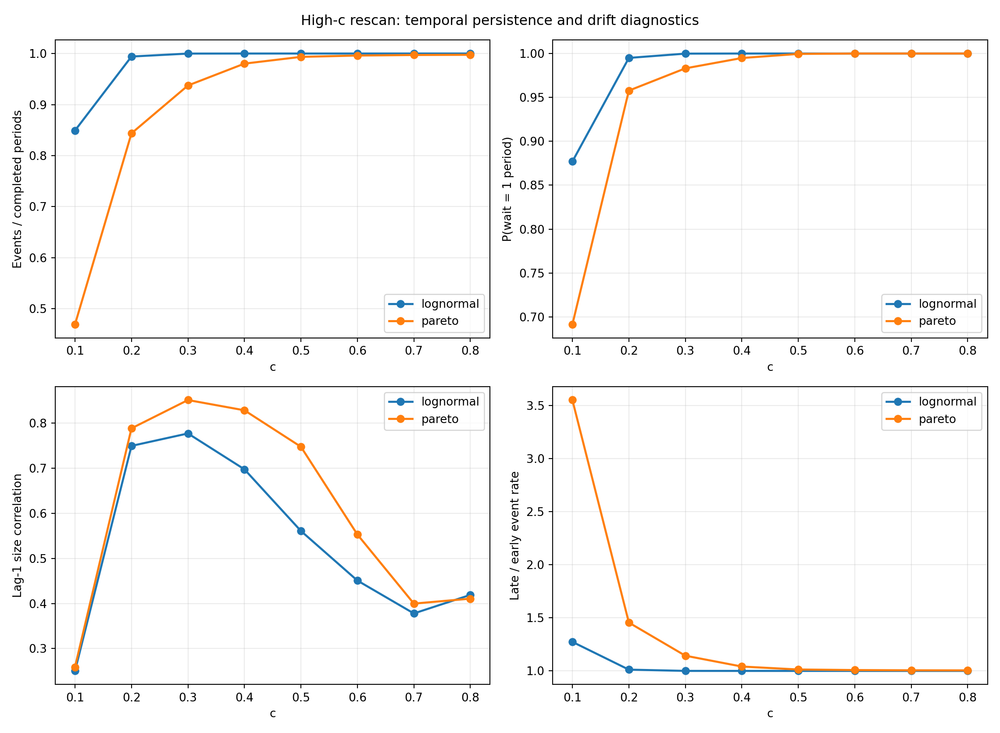
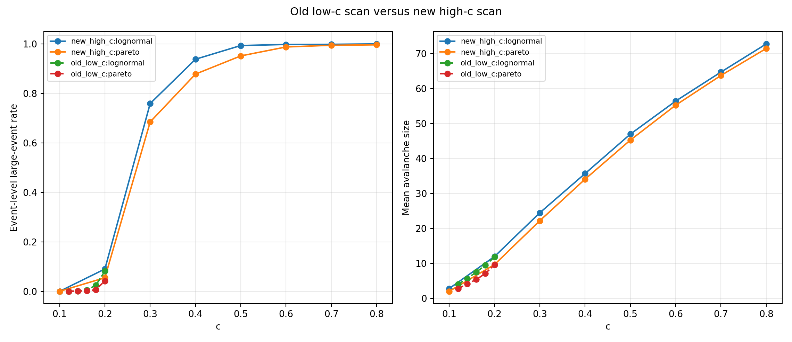
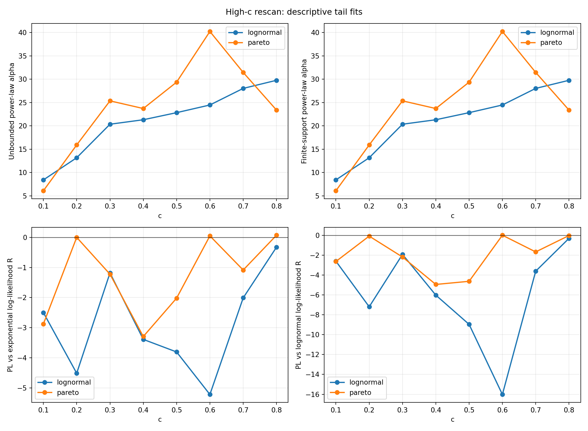

# 收入内生 c=0.10-0.80 重新实验分析报告

生成时间：2026-06-05 18:52:40 CST

## 实验设置

本次重新实验只改变收入内生时期长度中的 `c` 网格：`0.10, 0.20, ..., 0.80`。模型仍使用：

- `period_length_rule=income`，即 `K_t=round(c * Y_(t-1))`；
- `default_check_mode=period_end`，每期末做流量结算和违约检查；
- `avalanche_protocol=continue_after_avalanche`；
- `N=200`、biased 收入、random 增长；
- 初始本金分布：lognormal 与 pareto；
- 每个 scenario 60 次独立重复，最多 300 个 period。

新结果目录：`results/credit_soc_phase2_income_c010_c080_20260605_v1`

旧对照目录：`results/credit_soc_phase2_strict_soc_20260604_v1`。旧对照只用于比较此前 `c<=0.20` 的收入内生细扫，不重写旧的最终 SOC 判定。

本次新扫描共 16 个 scenario、960 个 run、271044 个 avalanche event。

## 核心结论

1. 把 `c` 扩展到 `0.80` 后，系统明显进入更强的 period-end 批量结算压力区：事件频率和连续期发生事件的比例整体上升。
2. 传播占比也随 `c` 上升，但它是在事件几乎每期发生、等待时间约等于 1 的过载背景中上升；因此不能把它解释为稳定、稀疏、单触发 avalanche 的临界传播。
3. `c=0.20` 的新旧重复结果方向一致，说明旧结论不是低 c 网格偶然造成的；新网格只是把高驱动过载区展示得更完整。
4. 尾部分布仍不应解读为严格 SOC：高 c 下可能出现重尾或大事件，但事件间隔、lag-1 相关和 early/late 漂移显示它更接近持续失败/过载吸引子。

## 高低 c 区间差异

下面把 `c<=0.20` 与 `c>=0.50` 做粗分组比较：

| money_distribution | events_per_run_ratio | large_event_rate_delta | mean_size_ratio | propagated_share_delta |
| --- | --- | --- | --- | --- |
| lognormal | 1.085 | 0.952 | 8.149 | 0.416 |
| pareto | 1.517 | 0.955 | 10.090 | 0.429 |

## 新网格逐点汇总

| money_distribution | c | mean_events_per_run | event_large_event_rate | mean_event_size | p99_event_size | propagated_share_of_total_size | wait_equal_1_fraction | late_over_early_event_rate |
| --- | --- | --- | --- | --- | --- | --- | --- | --- |
| lognormal | 0.100 | 254.8 | 0.000 | 2.815 | 8.000 | 0.100 | 0.877 | 1.273 |
| lognormal | 0.200 | 298.2 | 0.090 | 11.971 | 25.000 | 0.158 | 0.995 | 1.012 |
| lognormal | 0.300 | 300.0 | 0.759 | 24.485 | 40.000 | 0.294 | 1.000 | 1.000 |
| lognormal | 0.400 | 300.0 | 0.938 | 35.709 | 51.000 | 0.396 | 1.000 | 1.000 |
| lognormal | 0.500 | 300.0 | 0.993 | 46.996 | 64.000 | 0.470 | 1.000 | 1.000 |
| lognormal | 0.600 | 300.0 | 0.997 | 56.448 | 74.000 | 0.528 | 1.000 | 1.000 |
| lognormal | 0.700 | 300.0 | 0.998 | 64.752 | 82.000 | 0.580 | 1.000 | 1.000 |
| lognormal | 0.800 | 300.0 | 1.000 | 72.798 | 92.000 | 0.604 | 1.000 | 1.000 |
| pareto | 0.100 | 140.8 | 0.000 | 2.020 | 7.000 | 0.117 | 0.691 | 3.550 |
| pareto | 0.200 | 253.1 | 0.055 | 9.666 | 23.000 | 0.187 | 0.958 | 1.455 |
| pareto | 0.300 | 281.2 | 0.684 | 22.209 | 37.000 | 0.309 | 0.983 | 1.143 |
| pareto | 0.400 | 294.1 | 0.878 | 34.103 | 50.000 | 0.421 | 0.995 | 1.041 |
| pareto | 0.500 | 298.0 | 0.951 | 45.291 | 60.000 | 0.503 | 1.000 | 1.013 |
| pareto | 0.600 | 298.8 | 0.987 | 55.274 | 70.000 | 0.562 | 1.000 | 1.008 |
| pareto | 0.700 | 299.1 | 0.994 | 63.777 | 80.000 | 0.615 | 1.000 | 1.006 |
| pareto | 0.800 | 299.2 | 0.996 | 71.501 | 90.460 | 0.644 | 1.000 | 1.005 |

## c=0.20 新旧重复对照

| money_distribution | metric | old_c020 | new_c020 | absolute_delta | relative_delta |
| --- | --- | --- | --- | --- | --- |
| lognormal | mean_events_per_run | 298.3 | 298.2 | -0.050 | -0.000 |
| lognormal | event_large_event_rate | 0.082 | 0.090 | 0.008 | 0.101 |
| lognormal | mean_event_size | 11.836 | 11.971 | 0.135 | 0.011 |
| lognormal | p99_event_size | 24.000 | 25.000 | 1.000 | 0.042 |
| lognormal | propagated_share_of_total_size | 0.154 | 0.158 | 0.004 | 0.027 |
| lognormal | wait_equal_1_fraction | 0.995 | 0.995 | 0.001 | 0.001 |
| pareto | mean_events_per_run | 251.5 | 253.1 | 1.633 | 0.006 |
| pareto | event_large_event_rate | 0.042 | 0.055 | 0.013 | 0.310 |
| pareto | mean_event_size | 9.634 | 9.666 | 0.032 | 0.003 |
| pareto | p99_event_size | 22.000 | 23.000 | 1.000 | 0.045 |
| pareto | propagated_share_of_total_size | 0.156 | 0.187 | 0.031 | 0.196 |
| pareto | wait_equal_1_fraction | 0.958 | 0.958 | 0.000 | 0.000 |

## 单调趋势检查

Spearman 相关只用于描述新网格内 `c` 与指标的单调关系，不是机制证明。

| money_distribution | metric | spearman_r | p_value |
| --- | --- | --- | --- |
| lognormal | mean_events_per_run | 0.873 | 0.005 |
| lognormal | event_large_event_rate | 1.000 | 0.000 |
| lognormal | mean_event_size | 1.000 | 0.000 |
| lognormal | propagated_share_of_total_size | 1.000 | 0.000 |
| lognormal | wait_equal_1_fraction | 0.873 | 0.005 |
| pareto | mean_events_per_run | 1.000 | 0.000 |
| pareto | event_large_event_rate | 1.000 | 0.000 |
| pareto | mean_event_size | 1.000 | 0.000 |
| pareto | propagated_share_of_total_size | 1.000 | 0.000 |
| pareto | wait_equal_1_fraction | 0.976 | 0.000 |

## 尾部拟合摘要

尾部拟合使用自动 `xmin` 的离散幂律与有限支持幂律，并给出 exponential/lognormal 的描述性对照。这里的 bootstrap 次数为 40，只作为本次重扫的快速诊断，不等同于完整最终审计。

| money_distribution | c | events | fit_status | xmin | alpha | bootstrap_p | bounded_alpha | bounded_bootstrap_p | pl_vs_exponential_R | pl_vs_lognormal_R |
| --- | --- | --- | --- | --- | --- | --- | --- | --- | --- | --- |
| lognormal | 0.100 | 15286.0 | ok | 8.000 | 8.405 | 0.195 | 8.405 | 0.171 | -2.500 | -2.610 |
| lognormal | 0.200 | 17894.0 | ok | 23.000 | 13.155 | 0.024 | 13.155 | 0.024 | -4.515 | -7.199 |
| lognormal | 0.300 | 17998.0 | ok | 39.000 | 20.340 | 0.073 | 20.340 | 0.220 | -1.181 | -1.927 |
| lognormal | 0.400 | 18000.0 | ok | 48.000 | 21.300 | 0.024 | 21.300 | 0.024 | -3.390 | -6.025 |
| lognormal | 0.500 | 18000.0 | ok | 60.000 | 22.820 | 0.024 | 22.820 | 0.024 | -3.808 | -8.965 |
| lognormal | 0.600 | 18000.0 | ok | 69.000 | 24.464 | 0.024 | 24.464 | 0.024 | -5.221 | -16.022 |
| lognormal | 0.700 | 18000.0 | ok | 78.000 | 28.020 | 0.098 | 28.020 | 0.146 | -2.010 | -3.618 |
| lognormal | 0.800 | 18000.0 | ok | 90.000 | 29.757 | 0.146 | 29.757 | 0.098 | -0.327 | -0.314 |
| pareto | 0.100 | 8449.0 | ok | 6.000 | 6.079 | 0.122 | 6.079 | 0.146 | -2.877 | -2.641 |
| pareto | 0.200 | 15186.0 | ok | 23.000 | 15.901 | 0.683 | 15.901 | 0.732 | -0.001 | -0.089 |
| pareto | 0.300 | 16873.0 | ok | 36.000 | 25.351 | 0.098 | 25.351 | 0.073 | -1.225 | -2.191 |
| pareto | 0.400 | 17644.0 | ok | 46.000 | 23.705 | 0.049 | 23.705 | 0.024 | -3.295 | -4.951 |
| pareto | 0.500 | 17882.0 | ok | 58.000 | 29.360 | 0.049 | 29.360 | 0.098 | -2.020 | -4.635 |
| pareto | 0.600 | 17929.0 | ok | 72.000 | 40.224 | 0.732 | 40.224 | 0.683 | 0.048 | 0.001 |
| pareto | 0.700 | 17948.0 | ok | 77.000 | 31.447 | 0.244 | 31.447 | 0.195 | -1.086 | -1.678 |
| pareto | 0.800 | 17955.0 | ok | 89.000 | 23.375 | 0.512 | 23.375 | 0.317 | 0.071 | -0.032 |

## 图表

## 解释边界

- `c` 不是实际投资支出比例；它通过 `K_t=round(cY_(t-1))` 改变每次 `period_end` 前计划执行的单位信贷尝试数。
- 高 `c` 同时增加信贷积累和检查间隔，不能把结果解释为单独改变“加载速度”。
- 本报告没有新增有限尺寸缩放、机制消融或 drive/check-frequency 解耦实验；因此它能回答“新 c 网格和旧网格有什么差异”，不能单独推翻或证明严格 SOC。
