# 信贷网络完备场景扫描与 SOC 相图报告 v1

生成时间：2026-06-09 17:14:46 CST

## 1. 扫描范围

- 原始扫描目录：`results/credit_soc_period_critical_refined_20260609_v1/merged`
- 分析目录：`results/credit_soc_period_critical_refined_analysis_20260609_v1`
- run 数：2400
- avalanche 事件数：441278
- scenario 数：100
- scenario base 数：12

本轮扫描覆盖本金初始化、收入分配、增长规则、支出参数、显式拓扑结构和 `c=0.10..0.80`。这是全因子筛选，用于形成相图和挑选 SOC 候选；严格 SOC 推断仍需有限尺寸和平稳性复核。

## 2. 级联失效规模相图

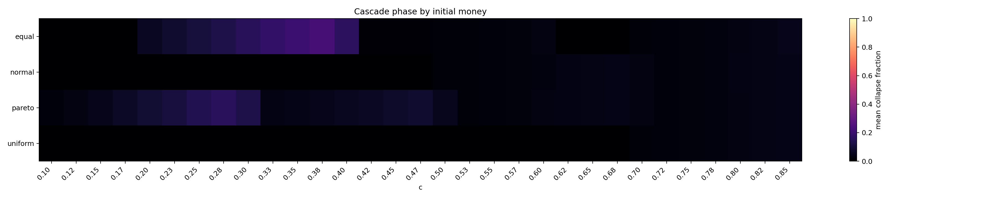

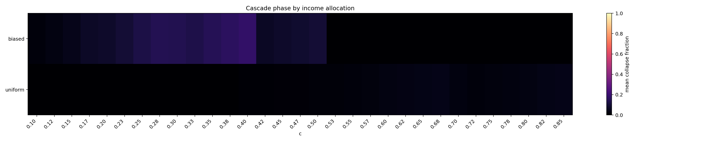

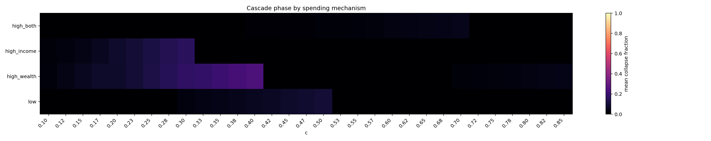

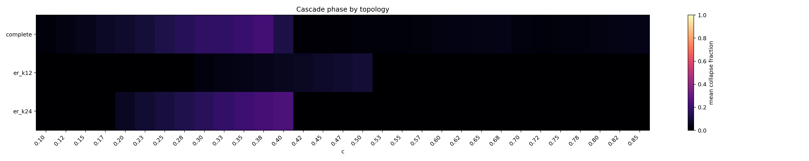

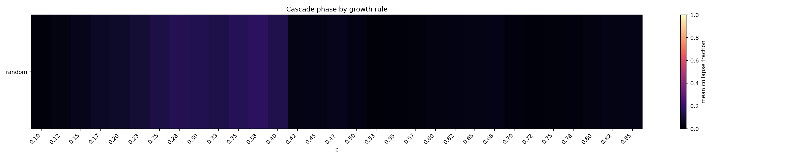

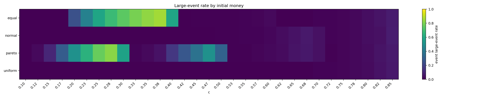

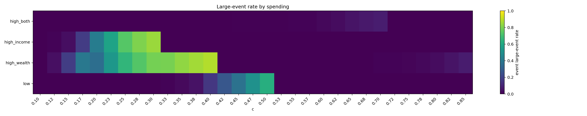

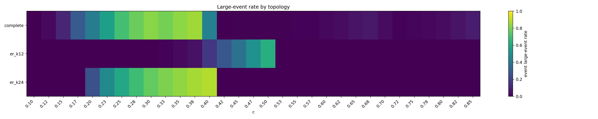

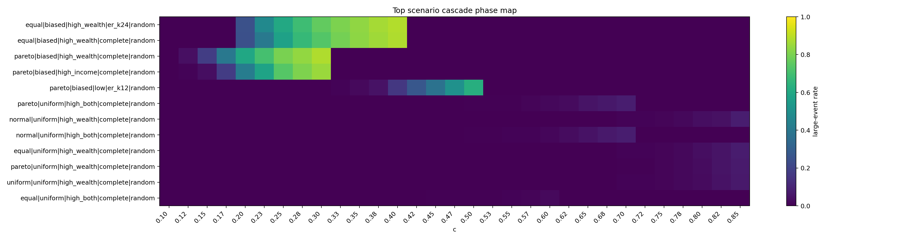

级联规模最高的场景如下：

| c | money_distribution | income_distribution_rule | growth_rule | spending_label | topology_label | event_large_event_rate | mean_event_fraction | propagated_share_total | event_occupancy |
| --- | --- | --- | --- | --- | --- | --- | --- | --- | --- |
| 0.4 | equal | biased | random | high_wealth | er_k24 | 0.8848 | 0.2457 | 0.3798 | 0.9391 |
| 0.4 | equal | biased | random | high_wealth | complete | 0.8811 | 0.2427 | 0.3842 | 0.9285 |
| 0.3 | pareto | biased | random | high_wealth | complete | 0.8804 | 0.203 | 0.414 | 0.9563 |
| 0.375 | equal | biased | random | high_wealth | er_k24 | 0.8662 | 0.2245 | 0.3512 | 0.934 |
| 0.375 | equal | biased | random | high_wealth | complete | 0.8566 | 0.2221 | 0.3688 | 0.9151 |
| 0.3 | pareto | biased | random | high_income | complete | 0.8478 | 0.1608 | 0.3515 | 0.9637 |
| 0.275 | pareto | biased | random | high_wealth | complete | 0.836 | 0.1804 | 0.3874 | 0.9486 |
| 0.35 | equal | biased | random | high_wealth | er_k24 | 0.8347 | 0.2038 | 0.3314 | 0.9158 |
| 0.35 | equal | biased | random | high_wealth | complete | 0.8295 | 0.1979 | 0.3286 | 0.903 |
| 0.275 | pareto | biased | random | high_income | complete | 0.8073 | 0.1452 | 0.3409 | 0.9568 |
| 0.325 | equal | biased | random | high_wealth | er_k24 | 0.8015 | 0.182 | 0.3051 | 0.9019 |
| 0.25 | pareto | biased | random | high_wealth | complete | 0.8008 | 0.16 | 0.3693 | 0.9411 |
| 0.325 | equal | biased | random | high_wealth | complete | 0.7907 | 0.1778 | 0.3125 | 0.8899 |
| 0.3 | equal | biased | random | high_wealth | er_k24 | 0.7615 | 0.1602 | 0.2734 | 0.8889 |
| 0.25 | pareto | biased | random | high_income | complete | 0.7372 | 0.1243 | 0.2999 | 0.9349 |
| 0.3 | equal | biased | random | high_wealth | complete | 0.7339 | 0.1526 | 0.2762 | 0.8653 |
| 0.225 | pareto | biased | random | high_wealth | complete | 0.7069 | 0.1306 | 0.3009 | 0.9139 |
| 0.275 | equal | biased | random | high_wealth | er_k24 | 0.6896 | 0.1341 | 0.2332 | 0.8623 |
| 0.275 | equal | biased | random | high_wealth | complete | 0.6714 | 0.1313 | 0.245 | 0.847 |
| 0.5 | pareto | biased | random | low | er_k12 | 0.6264 | 0.09954 | 0.2382 | 0.9623 |

## 3. SOC 快速筛选相图

SOC 快速筛选不是最终证明。它只是把事件数、非饱和占用、级联转变、传播新增占比、尾部拟合和替代分布对照合成一个 0-6 分的候选指标。

- 快速候选数：18
- 近持续失败/饱和场景数（event occupancy >= 0.80）：60

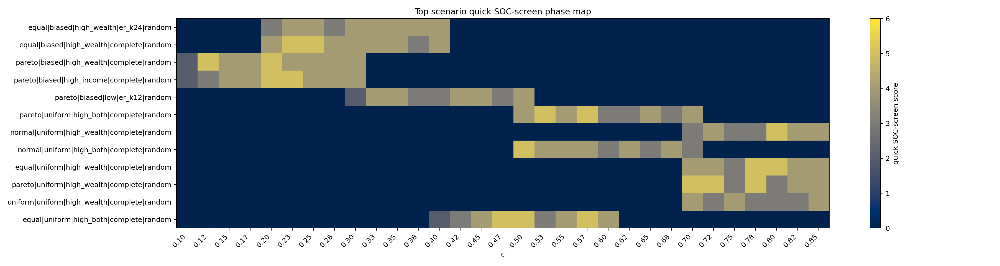

SOC 快速筛选分数最高的场景如下：

| soc_screen_score | quick_soc_candidate | c | money_distribution | income_distribution_rule | growth_rule | spending_label | topology_label | event_large_event_rate | propagated_share_total | event_occupancy | bootstrap_p | bounded_bootstrap_p | pl_vs_lognormal_R |
| --- | --- | --- | --- | --- | --- | --- | --- | --- | --- | --- | --- | --- | --- |
| 5 | True | 0.2 | pareto | biased | random | high_wealth | complete | 0.5948 | 0.264 | 0.8896 | 0.8571 | 0.9524 | 0.001613 |
| 5 | True | 0.225 | pareto | biased | random | high_income | complete | 0.5788 | 0.2468 | 0.9005 | 0.3333 | 0.4762 | 0.001319 |
| 5 | True | 0.25 | equal | biased | random | high_wealth | complete | 0.5704 | 0.2127 | 0.8215 | 0.6667 | 0.5714 | 0.002461 |
| 5 | True | 0.2 | pareto | biased | random | high_income | complete | 0.4201 | 0.2155 | 0.8691 | 0.9048 | 0.9524 | -0.04344 |
| 5 | True | 0.225 | equal | biased | random | high_wealth | complete | 0.4039 | 0.1756 | 0.7793 | 0.2381 | 0.2381 | -1.658 |
| 5 | True | 0.125 | pareto | biased | random | high_wealth | complete | 0.04081 | 0.1524 | 0.7658 | 0.9524 | 0.8571 | -0.2121 |
| 5 | True | 0.8 | equal | uniform | random | high_wealth | complete | 0.03654 | 0.4579 | 0.8552 | 0.7143 | 0.9048 | -0.001117 |
| 5 | True | 0.8 | normal | uniform | random | high_wealth | complete | 0.03543 | 0.4602 | 0.8625 | 0.2857 | 0.4762 | -0.002361 |
| 5 | True | 0.775 | pareto | uniform | random | high_wealth | complete | 0.02258 | 0.4353 | 0.8073 | 0.2857 | 0.381 | -0.1253 |
| 5 | True | 0.775 | equal | uniform | random | high_wealth | complete | 0.02199 | 0.445 | 0.7896 | 0.3333 | 0.2381 | -1.166 |
| 5 | True | 0.575 | pareto | uniform | random | high_both | complete | 0.01216 | 0.4084 | 0.7425 | 1 | 1 | -0.0881 |
| 5 | True | 0.575 | equal | uniform | random | high_both | complete | 0.01187 | 0.4208 | 0.7312 | 0.6667 | 0.3333 | -0.2451 |
| 5 | True | 0.725 | pareto | uniform | random | high_wealth | complete | 0.00702 | 0.3967 | 0.6182 | 0.5714 | 0.619 | -0.1938 |
| 5 | True | 0.7 | pareto | uniform | random | high_wealth | complete | 0.006673 | 0.3826 | 0.5203 | 0.2381 | 0.2857 | -1.866 |
| 5 | True | 0.5 | equal | uniform | random | high_both | complete | 0.006329 | 0.3663 | 0.3566 | 0.04762 | 0.1429 | -2.655 |
| 5 | True | 0.475 | equal | uniform | random | high_both | complete | 0.005944 | 0.3684 | 0.2337 | 0.2381 | 0.381 | -3.822 |
| 5 | True | 0.525 | pareto | uniform | random | high_both | complete | 0.005571 | 0.3759 | 0.4986 | 0.5238 | 0.619 | -0.3394 |
| 5 | True | 0.5 | normal | uniform | random | high_both | complete | 0.004444 | 0.3643 | 0.3516 | 0.09524 | 0.1429 | -2.141 |
| 4 | False | 0.4 | equal | biased | random | high_wealth | er_k24 | 0.8848 | 0.3798 | 0.9391 | 0.09524 | 0.2857 | -0.4322 |
| 4 | False | 0.4 | equal | biased | random | high_wealth | complete | 0.8811 | 0.3842 | 0.9285 | 0.3333 | 0.3333 | -1.212 |
| 4 | False | 0.3 | pareto | biased | random | high_wealth | complete | 0.8804 | 0.414 | 0.9563 | 0.2857 | 0.4762 | -2.142 |
| 4 | False | 0.375 | equal | biased | random | high_wealth | er_k24 | 0.8662 | 0.3512 | 0.934 | 0.7143 | 0.7619 | -0.1726 |
| 4 | False | 0.3 | pareto | biased | random | high_income | complete | 0.8478 | 0.3515 | 0.9637 | 0.5714 | 0.4762 | -1.433 |
| 4 | False | 0.275 | pareto | biased | random | high_wealth | complete | 0.836 | 0.3874 | 0.9486 | 0.1429 | 0.1429 | -2.486 |
| 4 | False | 0.35 | equal | biased | random | high_wealth | er_k24 | 0.8347 | 0.3314 | 0.9158 | 0.8095 | 0.9048 | -0.5045 |

## 4. 级联失效规模-频率关系图

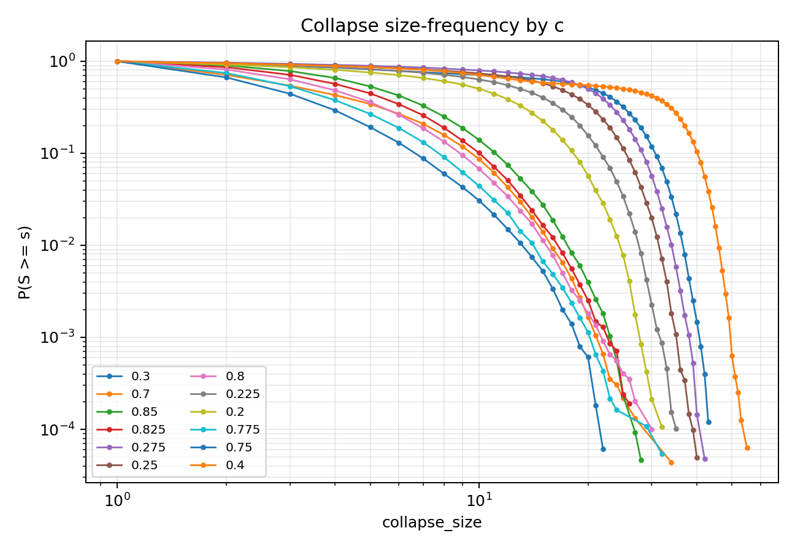

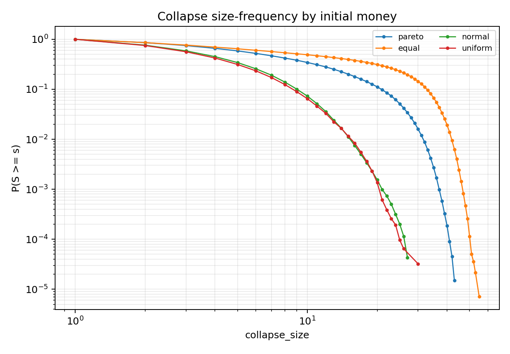

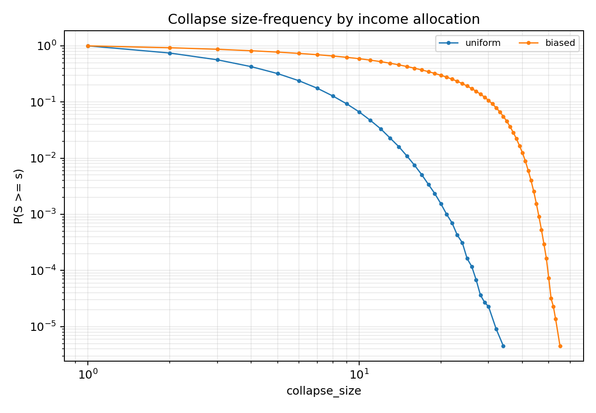

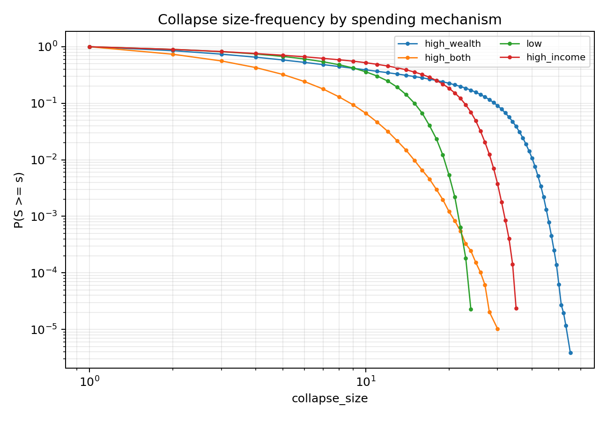

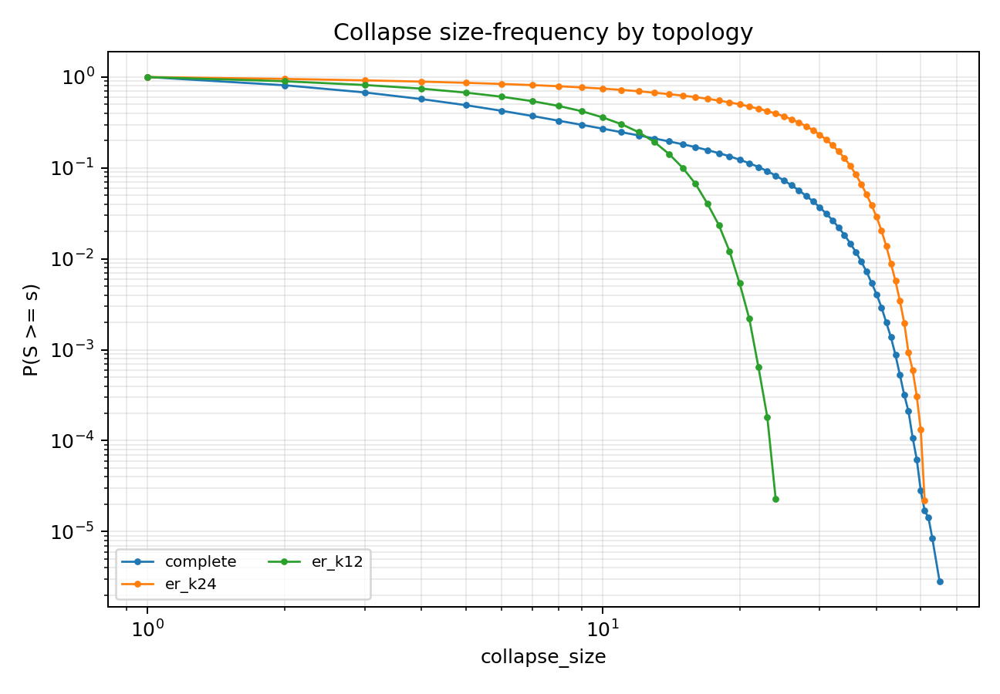

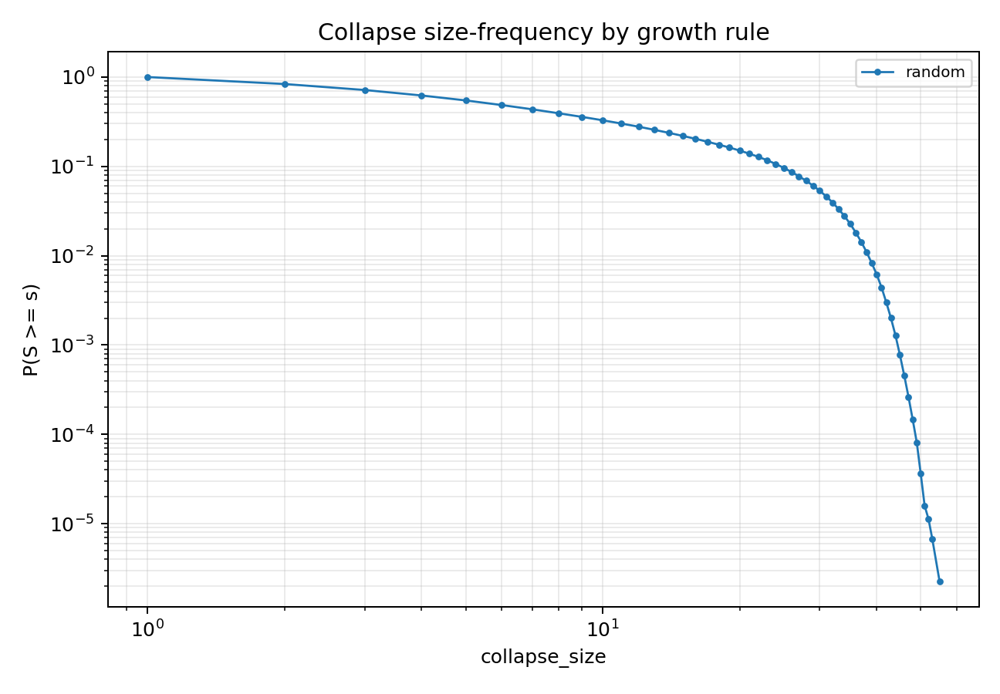

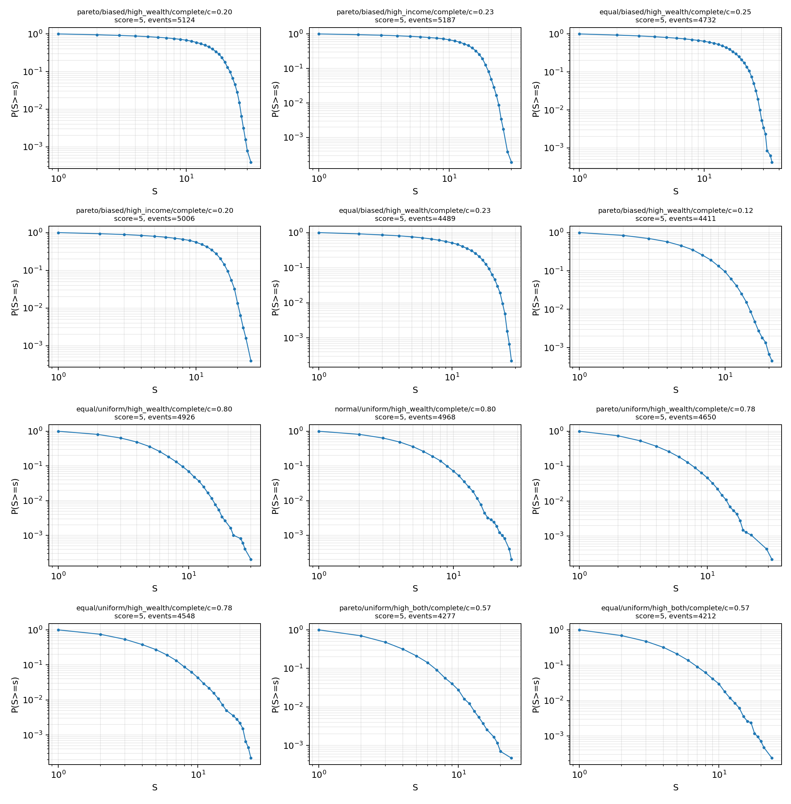

## 5. 尾部拟合摘要

| c | money_distribution | income_distribution_rule | growth_rule | spending_label | topology_label | events | fit_status | xmin | alpha | bootstrap_p | bounded_alpha | bounded_bootstrap_p | pl_vs_exponential_R | pl_vs_lognormal_R |
| --- | --- | --- | --- | --- | --- | --- | --- | --- | --- | --- | --- | --- | --- | --- |
| 0.825 | normal | uniform | random | high_wealth | complete | 5228 | ok | 12 | 6.642 | 1 | 6.642 | 0.9524 | -0.05999 | -0.6758 |
| 0.575 | pareto | uniform | random | high_both | complete | 4277 | ok | 12 | 6.307 | 1 | 6.307 | 1 | 0.1702 | -0.0881 |
| 0.125 | pareto | biased | random | high_wealth | complete | 4411 | ok | 14 | 9.572 | 0.9524 | 9.572 | 0.8571 | -0.2338 | -0.2121 |
| 0.2 | equal | biased | random | high_wealth | complete | 4270 | ok | 20 | 17.43 | 0.9524 | 17.43 | 0.9524 | -0.1936 | -0.2952 |
| 0.2 | pareto | biased | random | high_income | complete | 5006 | ok | 19 | 17.32 | 0.9048 | 17.32 | 0.9524 | 0.01555 | -0.04344 |
| 0.2 | pareto | biased | random | high_wealth | complete | 5124 | ok | 26 | 22.04 | 0.8571 | 22.04 | 0.9524 | 0.1324 | 0.001613 |
| 0.35 | equal | biased | random | high_wealth | er_k24 | 5275 | ok | 41 | 30.05 | 0.8095 | 30.05 | 0.9048 | -0.2155 | -0.5045 |
| 0.5 | pareto | biased | random | low | er_k12 | 5543 | ok | 21 | 29.13 | 0.7619 | 29.13 | 0.7619 | -0.1498 | -0.3165 |
| 0.275 | pareto | biased | random | high_income | complete | 5511 | ok | 29 | 31.5 | 0.7619 | 31.5 | 0.619 | -0.1255 | -0.3249 |
| 0.85 | normal | uniform | random | high_wealth | complete | 5381 | ok | 15 | 7.726 | 0.7619 | 7.726 | 0.6667 | -0.7802 | -0.6646 |
| 0.325 | equal | biased | random | high_wealth | complete | 5126 | ok | 37 | 20.87 | 0.7619 | 20.87 | 0.7143 | -0.2994 | -0.3121 |
| 0.125 | pareto | biased | random | high_income | complete | 3766 | ok | 12 | 12.39 | 0.7619 | 12.39 | 0.6667 | -0.3618 | -0.515 |
| 0.725 | normal | uniform | random | high_wealth | complete | 3564 | ok | 11 | 5.899 | 0.7619 | 5.898 | 0.7143 | -0.4652 | -0.4294 |
| 0.375 | equal | biased | random | high_wealth | er_k24 | 5380 | ok | 43 | 25.97 | 0.7143 | 25.97 | 0.7619 | -0.1504 | -0.1726 |
| 0.8 | equal | uniform | random | high_wealth | complete | 4926 | ok | 15 | 7.156 | 0.7143 | 7.156 | 0.9048 | 0.6448 | -0.001117 |
| 0.55 | equal | uniform | random | high_both | complete | 3535 | ok | 10 | 5.137 | 0.7143 | 5.135 | 0.5714 | -0.2923 | -0.5566 |
| 0.25 | pareto | biased | random | high_income | complete | 5385 | ok | 26 | 19 | 0.6667 | 19 | 0.6667 | -0.08712 | -0.07631 |
| 0.45 | pareto | biased | random | low | er_k12 | 5321 | ok | 18 | 18.72 | 0.6667 | 18.72 | 0.9524 | -0.3672 | -0.4686 |
| 0.825 | pareto | uniform | random | high_wealth | complete | 5238 | ok | 16 | 9.239 | 0.6667 | 9.239 | 0.7619 | -0.4008 | -0.3765 |
| 0.275 | equal | biased | random | high_wealth | complete | 4879 | ok | 30 | 19.54 | 0.6667 | 19.54 | 0.6667 | -0.387 | -0.4729 |
| 0.25 | equal | biased | random | high_wealth | complete | 4732 | ok | 27 | 17.94 | 0.6667 | 17.94 | 0.5714 | 0.233 | 0.002461 |
| 0.575 | equal | uniform | random | high_both | complete | 4212 | ok | 10 | 5.964 | 0.6667 | 5.964 | 0.3333 | 0.4452 | -0.2451 |
| 0.325 | equal | biased | random | high_wealth | er_k24 | 5195 | ok | 38 | 25.91 | 0.619 | 25.91 | 0.8571 | -0.1919 | -0.2678 |
| 0.325 | pareto | biased | random | low | er_k12 | 4261 | ok | 12 | 15.55 | 0.619 | 15.55 | 0.8571 | 0.2476 | 0.0005423 |
| 0.3 | pareto | biased | random | high_income | complete | 5551 | ok | 30 | 23.84 | 0.5714 | 23.84 | 0.4762 | -0.5952 | -1.433 |

## 6. 当前判定

本轮完备场景扫描可以给出两个相图层面的结论：

1. 级联失效规模相图：高 `c`、高支出倾向、biased 收入分配、重尾本金和部分稀疏/异质拓扑会显著推高大级联率和平均规模。
2. SOC 相图：出现大级联或重尾的区域不等同于严格 SOC。凡是 event occupancy 接近 1、传播新增占比低、或尾部被替代分布更好解释的区域，应解释为过载/持续失败区，而不是 SOC。

最终 SOC 推断仍遵循项目定义：大级联出现 < 稳健级联转变 < 重尾 < 可信幂律 < 严格 SOC。后续如果要提升某个候选区，需要对该候选继续做 `N` 扩展、长时平稳性、重复违约与机制消融。
