# 信贷网络完备场景扫描与 SOC 相图报告 v1

生成时间：2026-06-09 17:34:45 CST

## 1. 扫描范围

- 原始扫描目录：`results/credit_soc_period_critical_stage2_20260609_v1/merged_exact_c`
- 分析目录：`results/credit_soc_period_critical_stage2_exact_analysis_20260609_v1`
- run 数：4104
- avalanche 事件数：555638
- scenario 数：171
- scenario base 数：6

本轮扫描覆盖本金初始化、收入分配、增长规则、支出参数、显式拓扑结构和 `c=0.10..0.80`。这是全因子筛选，用于形成相图和挑选 SOC 候选；严格 SOC 推断仍需有限尺寸和平稳性复核。

## 2. 级联失效规模相图

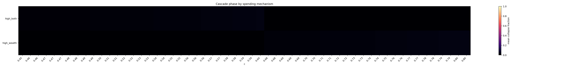

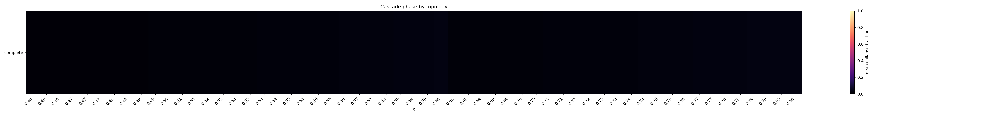

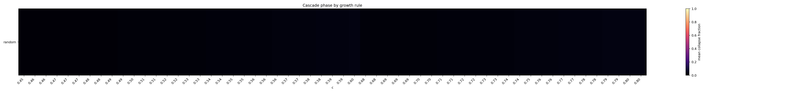

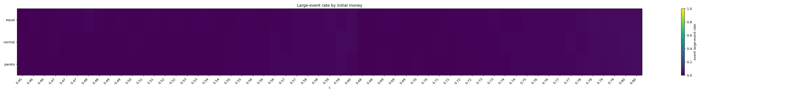

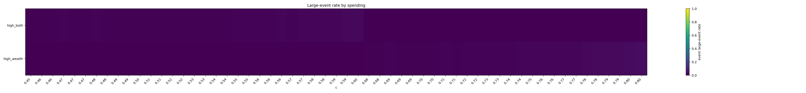

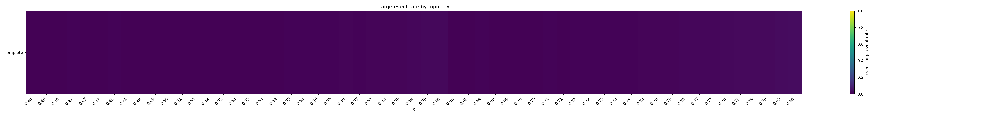

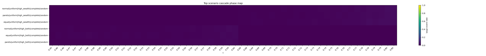

级联规模最高的场景如下：

| c | money_distribution | income_distribution_rule | growth_rule | spending_label | topology_label | event_large_event_rate | mean_event_fraction | propagated_share_total | event_occupancy |
| --- | --- | --- | --- | --- | --- | --- | --- | --- | --- |
| 0.8 | normal | uniform | random | high_wealth | complete | 0.03503 | 0.03442 | 0.4542 | 0.8674 |
| 0.795 | normal | uniform | random | high_wealth | complete | 0.03329 | 0.03394 | 0.4542 | 0.8554 |
| 0.8 | pareto | uniform | random | high_wealth | complete | 0.03295 | 0.03449 | 0.4499 | 0.8693 |
| 0.795 | pareto | uniform | random | high_wealth | complete | 0.03117 | 0.03376 | 0.4512 | 0.8578 |
| 0.8 | equal | uniform | random | high_wealth | complete | 0.03032 | 0.03555 | 0.4544 | 0.8531 |
| 0.795 | equal | uniform | random | high_wealth | complete | 0.02825 | 0.034 | 0.4491 | 0.8481 |
| 0.79 | equal | uniform | random | high_wealth | complete | 0.02784 | 0.03308 | 0.4567 | 0.8293 |
| 0.78 | equal | uniform | random | high_wealth | complete | 0.02747 | 0.03089 | 0.4521 | 0.7962 |
| 0.79 | normal | uniform | random | high_wealth | complete | 0.02725 | 0.03241 | 0.4468 | 0.841 |
| 0.79 | pareto | uniform | random | high_wealth | complete | 0.02622 | 0.03265 | 0.4443 | 0.8474 |
| 0.785 | normal | uniform | random | high_wealth | complete | 0.02491 | 0.031 | 0.441 | 0.8363 |
| 0.785 | equal | uniform | random | high_wealth | complete | 0.0242 | 0.03218 | 0.4468 | 0.8179 |
| 0.78 | pareto | uniform | random | high_wealth | complete | 0.02393 | 0.03045 | 0.4431 | 0.8052 |
| 0.78 | normal | uniform | random | high_wealth | complete | 0.02391 | 0.03026 | 0.4364 | 0.8205 |
| 0.595 | normal | uniform | random | high_both | complete | 0.02374 | 0.03011 | 0.4366 | 0.8116 |
| 0.775 | equal | uniform | random | high_wealth | complete | 0.02329 | 0.02991 | 0.4414 | 0.7901 |
| 0.785 | pareto | uniform | random | high_wealth | complete | 0.02272 | 0.03138 | 0.442 | 0.8328 |
| 0.6 | equal | uniform | random | high_both | complete | 0.02172 | 0.03195 | 0.4416 | 0.8155 |
| 0.77 | normal | uniform | random | high_wealth | complete | 0.02068 | 0.02863 | 0.429 | 0.7891 |
| 0.775 | pareto | uniform | random | high_wealth | complete | 0.02053 | 0.02956 | 0.4365 | 0.8033 |

## 3. SOC 快速筛选相图

SOC 快速筛选不是最终证明。它只是把事件数、非饱和占用、级联转变、传播新增占比、尾部拟合和替代分布对照合成一个 0-6 分的候选指标。

- 快速候选数：74
- 近持续失败/饱和场景数（event occupancy >= 0.80）：24

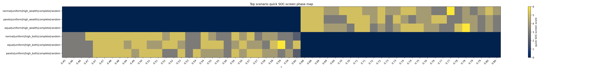

SOC 快速筛选分数最高的场景如下：

| soc_screen_score | quick_soc_candidate | c | money_distribution | income_distribution_rule | growth_rule | spending_label | topology_label | event_large_event_rate | propagated_share_total | event_occupancy | bootstrap_p | bounded_bootstrap_p | pl_vs_lognormal_R |
| --- | --- | --- | --- | --- | --- | --- | --- | --- | --- | --- | --- | --- | --- |
| 6 | True | 0.78 | equal | uniform | random | high_wealth | complete | 0.02747 | 0.4521 | 0.7962 | 0.3333 | 0.2857 | -0.4938 |
| 6 | True | 0.77 | normal | uniform | random | high_wealth | complete | 0.02068 | 0.429 | 0.7891 | 0.8095 | 0.7619 | -0.01831 |
| 6 | True | 0.59 | equal | uniform | random | high_both | complete | 0.02048 | 0.4333 | 0.7884 | 0.3333 | 0.381 | 0.003192 |
| 5 | True | 0.795 | normal | uniform | random | high_wealth | complete | 0.03329 | 0.4542 | 0.8554 | 0.8095 | 0.7143 | -0.2737 |
| 5 | True | 0.775 | equal | uniform | random | high_wealth | complete | 0.02329 | 0.4414 | 0.7901 | 0.3333 | 0.2857 | -0.4889 |
| 5 | True | 0.6 | equal | uniform | random | high_both | complete | 0.02172 | 0.4416 | 0.8155 | 1 | 1 | -0.01692 |
| 5 | True | 0.765 | pareto | uniform | random | high_wealth | complete | 0.01666 | 0.4328 | 0.7712 | 0.4762 | 0.5238 | -1.58 |
| 5 | True | 0.76 | pareto | uniform | random | high_wealth | complete | 0.01531 | 0.4275 | 0.7483 | 0.9048 | 0.9048 | -0.1416 |
| 5 | True | 0.745 | normal | uniform | random | high_wealth | complete | 0.0153 | 0.423 | 0.7036 | 0.5714 | 0.8095 | -0.1354 |
| 5 | True | 0.585 | equal | uniform | random | high_both | complete | 0.01403 | 0.4368 | 0.767 | 0.9048 | 1 | -0.3457 |
| 5 | True | 0.74 | normal | uniform | random | high_wealth | complete | 0.01386 | 0.4204 | 0.6766 | 0.8095 | 0.3333 | -0.5315 |
| 5 | True | 0.75 | equal | uniform | random | high_wealth | complete | 0.01232 | 0.4285 | 0.7047 | 0.4762 | 0.4286 | -0.3839 |
| 5 | True | 0.575 | pareto | uniform | random | high_both | complete | 0.01215 | 0.4188 | 0.7431 | 0.3333 | 0.381 | -0.7377 |
| 5 | True | 0.57 | pareto | uniform | random | high_both | complete | 0.01199 | 0.4096 | 0.7382 | 0.381 | 0.4762 | -0.001122 |
| 5 | True | 0.48 | equal | uniform | random | high_both | complete | 0.01196 | 0.3597 | 0.2467 | 0.6667 | 0.7143 | -0.589 |
| 5 | True | 0.57 | normal | uniform | random | high_both | complete | 0.01142 | 0.4172 | 0.7142 | 0.9048 | 0.8095 | -0.01416 |
| 5 | True | 0.56 | pareto | uniform | random | high_both | complete | 0.01088 | 0.4132 | 0.67 | 0.4762 | 0.4762 | -0.2136 |
| 5 | True | 0.565 | equal | uniform | random | high_both | complete | 0.01086 | 0.421 | 0.6873 | 0.3333 | 0.2381 | -0.008366 |
| 5 | True | 0.71 | normal | uniform | random | high_wealth | complete | 0.0105 | 0.389 | 0.5623 | 0.7619 | 0.6667 | -1.192 |
| 5 | True | 0.56 | normal | uniform | random | high_both | complete | 0.01025 | 0.4127 | 0.6776 | 0.381 | 0.4762 | -0.313 |
| 5 | True | 0.465 | normal | uniform | random | high_both | complete | 0.01018 | 0.3325 | 0.2047 | 0.8571 | 0.7143 | -0.1232 |
| 5 | True | 0.745 | equal | uniform | random | high_wealth | complete | 0.009801 | 0.4131 | 0.6908 | 0.4762 | 0.5714 | -0.2135 |
| 5 | True | 0.74 | equal | uniform | random | high_wealth | complete | 0.009701 | 0.4131 | 0.68 | 0.6667 | 0.7143 | -0.09516 |
| 5 | True | 0.685 | pareto | uniform | random | high_wealth | complete | 0.009189 | 0.3888 | 0.4345 | 0.04762 | 0.1905 | -3.43 |
| 5 | True | 0.475 | equal | uniform | random | high_both | complete | 0.009077 | 0.3607 | 0.2295 | 0.7619 | 0.6667 | -0.05505 |

## 4. 级联失效规模-频率关系图

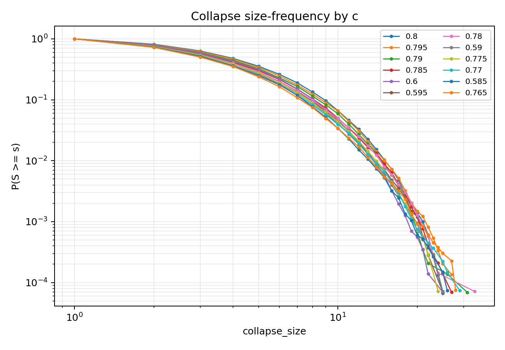

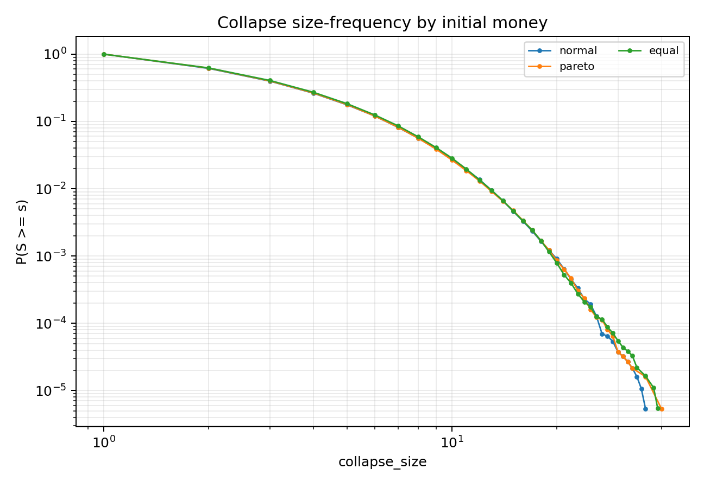

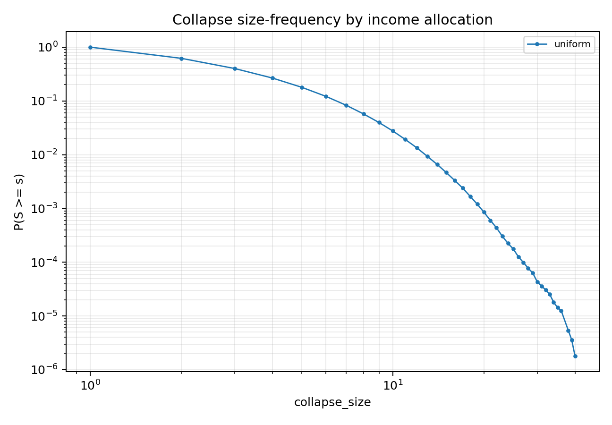

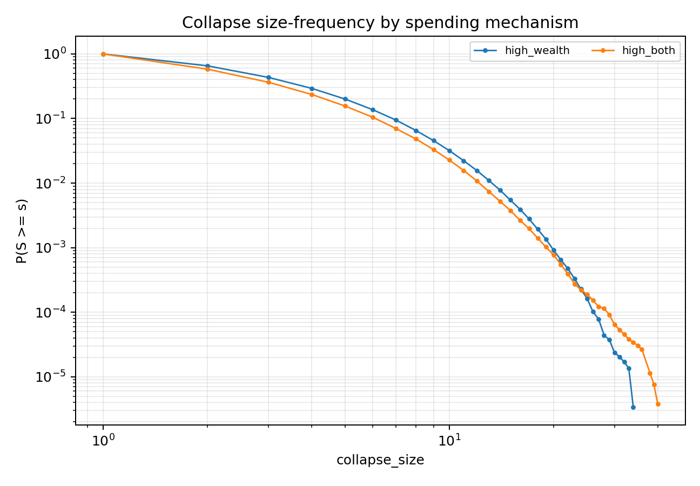

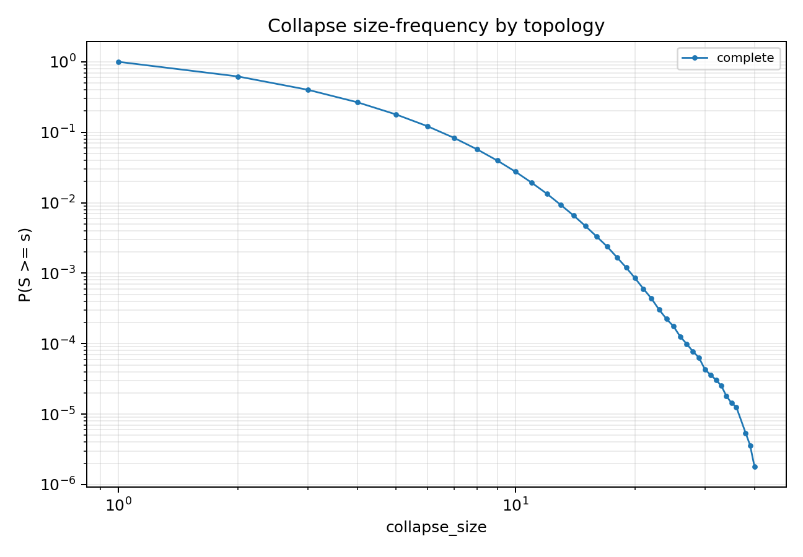

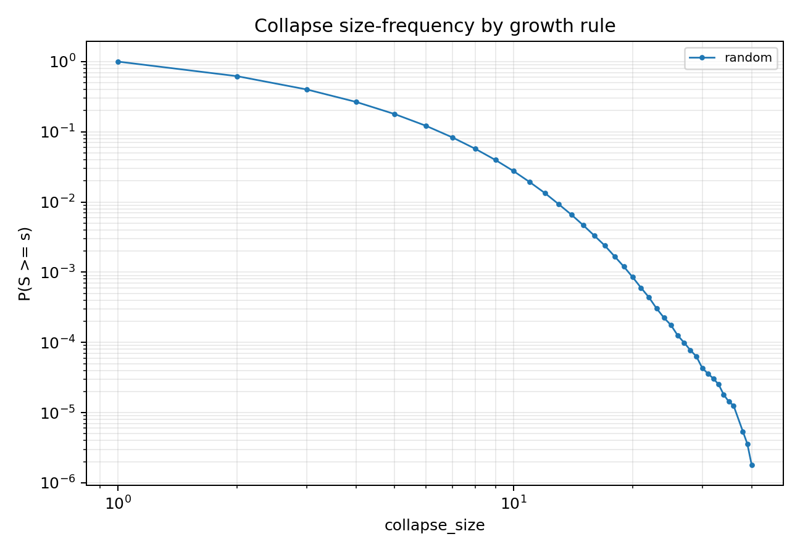

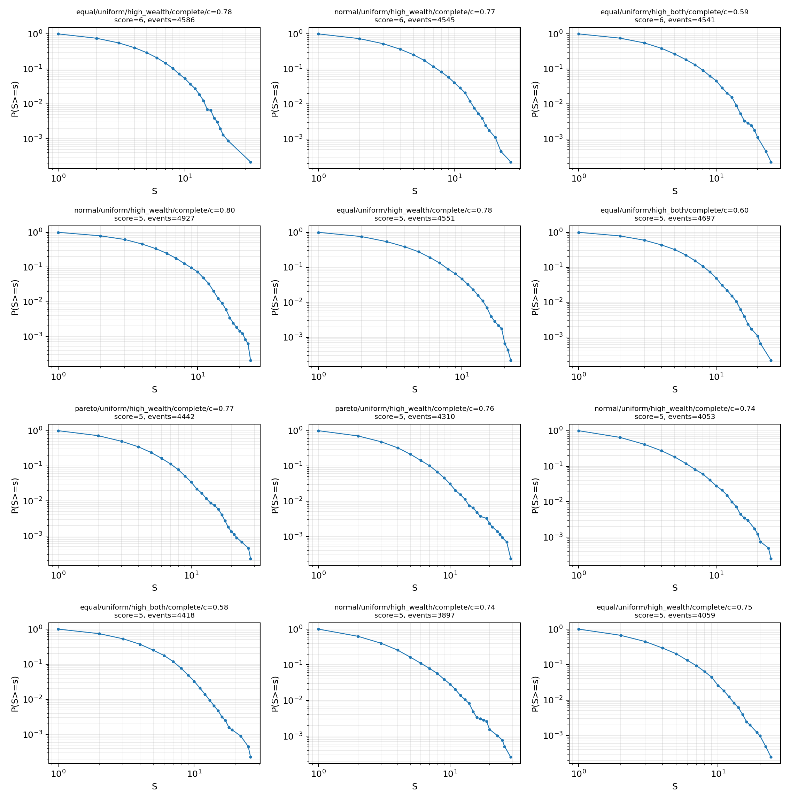

## 5. 尾部拟合摘要

| c | money_distribution | income_distribution_rule | growth_rule | spending_label | topology_label | events | fit_status | xmin | alpha | bootstrap_p | bounded_alpha | bounded_bootstrap_p | pl_vs_exponential_R | pl_vs_lognormal_R |
| --- | --- | --- | --- | --- | --- | --- | --- | --- | --- | --- | --- | --- | --- | --- |
| 0.6 | equal | uniform | random | high_both | complete | 4697 | ok | 14 | 8.265 | 1 | 8.265 | 1 | 0.2105 | -0.01692 |
| 0.52 | normal | uniform | random | high_both | complete | 2667 | ok | 5 | 3.736 | 1 | 3.733 | 1 | 8.95 | -0.3139 |
| 0.47 | equal | uniform | random | high_both | complete | 1253 | ok | 3 | 3.049 | 0.9524 | 3.042 | 0.9524 | 21.51 | -0.08877 |
| 0.8 | normal | uniform | random | high_wealth | complete | 4996 | ok | 14 | 7.686 | 0.9048 | 7.686 | 1 | -0.5984 | -0.5328 |
| 0.585 | equal | uniform | random | high_both | complete | 4418 | ok | 10 | 5.654 | 0.9048 | 5.654 | 1 | 0.7487 | -0.3457 |
| 0.76 | pareto | uniform | random | high_wealth | complete | 4310 | ok | 9 | 4.785 | 0.9048 | 4.783 | 0.9048 | 4.197 | -0.1416 |
| 0.57 | normal | uniform | random | high_both | complete | 4114 | ok | 13 | 7.249 | 0.9048 | 7.249 | 0.8095 | 0.2448 | -0.01416 |
| 0.785 | equal | uniform | random | high_wealth | complete | 4711 | ok | 15 | 8.962 | 0.8571 | 8.962 | 0.8095 | -0.1193 | -0.1662 |
| 0.545 | equal | uniform | random | high_both | complete | 3319 | ok | 8 | 4.897 | 0.8571 | 4.896 | 0.7619 | 1.806 | -0.1954 |
| 0.54 | equal | uniform | random | high_both | complete | 3186 | ok | 10 | 6.065 | 0.8571 | 6.065 | 1 | 0.224 | -0.1118 |
| 0.68 | normal | uniform | random | high_wealth | complete | 2491 | ok | 6 | 3.822 | 0.8571 | 3.817 | 0.8571 | 1.02 | -0.7245 |
| 0.49 | normal | uniform | random | high_both | complete | 1777 | ok | 3 | 3.077 | 0.8571 | 3.071 | 0.8571 | 23.69 | -0.3538 |
| 0.465 | normal | uniform | random | high_both | complete | 1179 | ok | 2 | 2.942 | 0.8571 | 2.938 | 0.7143 | 50.9 | -0.1232 |
| 0.795 | pareto | uniform | random | high_wealth | complete | 4941 | ok | 14 | 6.461 | 0.8095 | 6.461 | 0.9048 | -0.4671 | -0.4821 |
| 0.795 | normal | uniform | random | high_wealth | complete | 4927 | ok | 12 | 7.066 | 0.8095 | 7.066 | 0.7143 | 0.2986 | -0.2737 |
| 0.77 | normal | uniform | random | high_wealth | complete | 4545 | ok | 12 | 7.089 | 0.8095 | 7.089 | 0.7619 | 0.781 | -0.01831 |
| 0.74 | pareto | uniform | random | high_wealth | complete | 3969 | ok | 13 | 6.506 | 0.8095 | 6.506 | 0.7619 | -0.3608 | -0.3191 |
| 0.74 | normal | uniform | random | high_wealth | complete | 3897 | ok | 10 | 4.926 | 0.8095 | 4.924 | 0.3333 | 0.3319 | -0.5315 |
| 0.715 | pareto | uniform | random | high_wealth | complete | 3358 | ok | 7 | 4.591 | 0.8095 | 4.59 | 0.6667 | 3.707 | -0.1557 |
| 0.71 | pareto | uniform | random | high_wealth | complete | 3174 | ok | 6 | 4.153 | 0.8095 | 4.151 | 0.7619 | 4.372 | -0.6764 |
| 0.7 | normal | uniform | random | high_wealth | complete | 3020 | ok | 11 | 5.571 | 0.8095 | 5.57 | 0.5238 | 0.6233 | -0.001161 |
| 0.725 | pareto | uniform | random | high_wealth | complete | 3588 | ok | 9 | 5.374 | 0.7619 | 5.373 | 0.7619 | 1.228 | -0.1281 |
| 0.71 | normal | uniform | random | high_wealth | complete | 3239 | ok | 5 | 3.69 | 0.7619 | 3.687 | 0.6667 | 8.806 | -1.192 |
| 0.68 | equal | uniform | random | high_wealth | complete | 2438 | ok | 6 | 3.983 | 0.7619 | 3.981 | 0.619 | 2.468 | -0.5244 |
| 0.675 | equal | uniform | random | high_wealth | complete | 2243 | ok | 7 | 3.964 | 0.7619 | 3.959 | 0.619 | 3.055 | -0.07267 |

## 6. 当前判定

本轮完备场景扫描可以给出两个相图层面的结论：

1. 级联失效规模相图：高 `c`、高支出倾向、biased 收入分配、重尾本金和部分稀疏/异质拓扑会显著推高大级联率和平均规模。
2. SOC 相图：出现大级联或重尾的区域不等同于严格 SOC。凡是 event occupancy 接近 1、传播新增占比低、或尾部被替代分布更好解释的区域，应解释为过载/持续失败区，而不是 SOC。

最终 SOC 推断仍遵循项目定义：大级联出现 < 稳健级联转变 < 重尾 < 可信幂律 < 严格 SOC。后续如果要提升某个候选区，需要对该候选继续做 `N` 扩展、长时平稳性、重复违约与机制消融。
