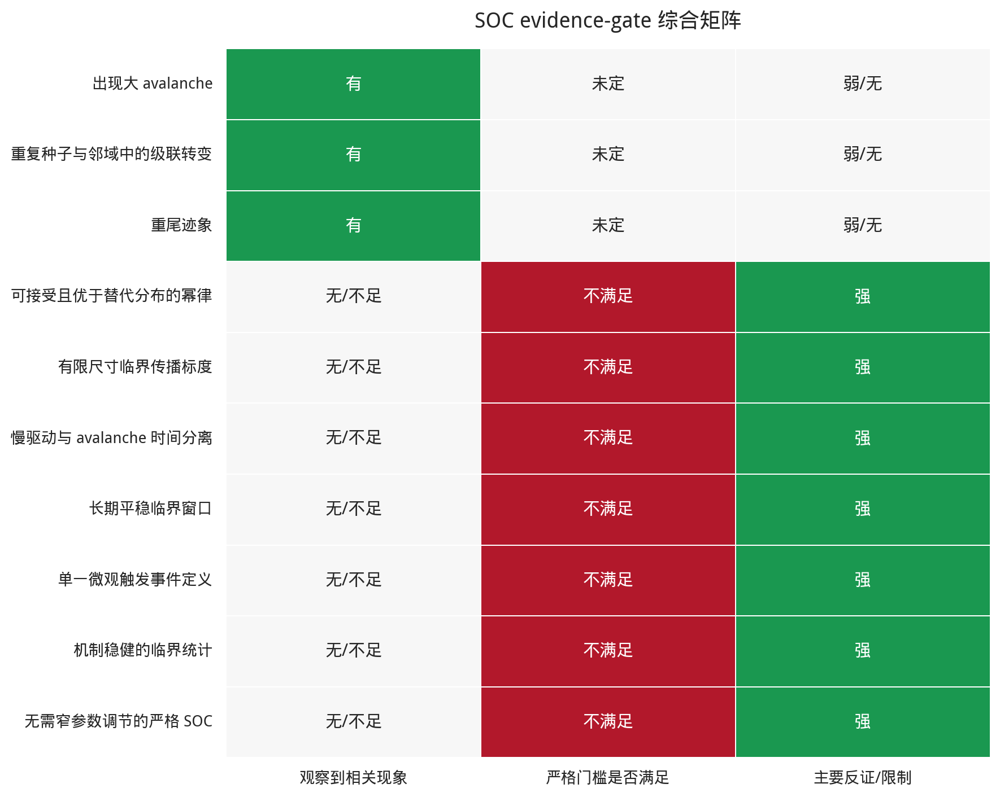
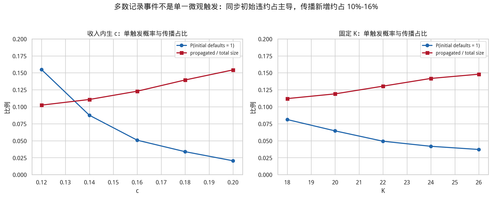
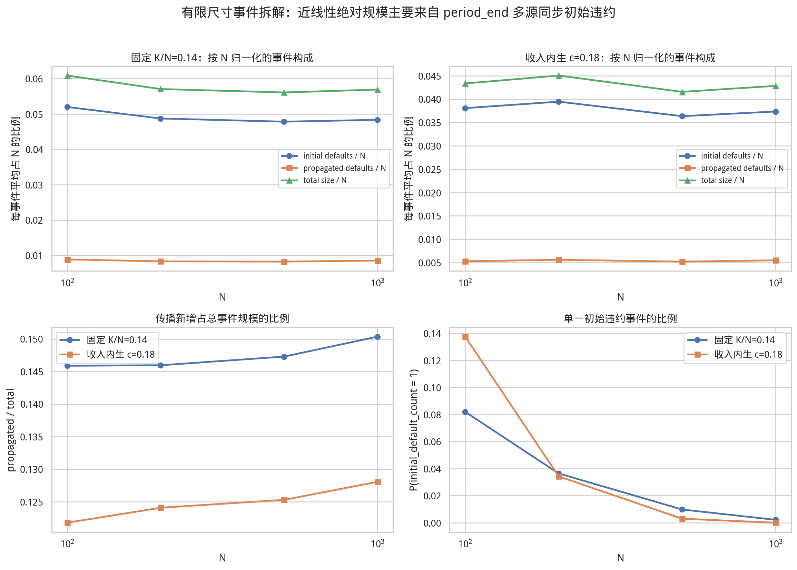

# 信贷网络 Phase-2 严格 SOC 综合证据报告 v1

生成时间：2026-06-04 13:27:08 CST  
报告定位：综合审计与主协调器最终判定输入；不覆盖任何旧报告。

## 1. 执行摘要

综合工作判定为：当前已实现 baseline、已扫描参数邻域与已测机制不支持严格 SOC。系统支持级联交叉和机制敏感的重尾现象，但高风险状态更符合非平稳、重复违约、低活跃信贷的持续失败/过载吸引子。最终判定权归主协调器。

必须严格区分以下 claim ladder：

| 层级 | 当前证据结论 |
| --- | --- |
| 大 avalanche | 已观察到，但 `critical_event` 只是达到人工阈值的标签。 |
| 可重复级联转变 | 固定 `K` 与收入内生 `c` 均观察到宽而随机的稳定区到持续失败区交叉。 |
| 重尾 | 多个场景有重尾迹象，但尾部对机制、窗口、参数和时间状态敏感。 |
| 可接受幂律 | 部分 pooled series 不拒绝 power law，但替代分布、序列依赖和非平稳性使其不足以晋级。 |
| 严格 SOC | 当前联合证据未满足；不能由大事件、log-log 图、单个 alpha 或绝对 cutoff 标度单独推出。 |

本报告不把高 occupancy 或 `P(wait=1)` 单独当作 SOC 反证。级联内部确实暂停驱动，但基线在
`period_end` 前可批量加载 `K>1` 次信贷尝试；最终解释依赖 occupancy、lag-1、非平稳漂移、
重复违约、退化终态、替代尾部、机制消融和 initial-default 广延增长的联合证据。

{width=92%}

| evidence gate | 综合解释 |
| --- | --- |
| 出现大 avalanche | 达到人工阈值；仅是最低层级现象 |
| 重复种子与邻域中的级联转变 | 支持宽交叉/转变 |
| 重尾迹象 | 尾部比小事件背景更宽 |
| 可接受且优于替代分布的幂律 | 不稳健；替代尾部常更优 |
| 有限尺寸临界传播标度 | 绝对标度由广延初始违约主导 |
| 慢驱动与 avalanche 时间分离 | 需联合依赖/漂移证据解释 |
| 长期平稳临界窗口 | 见低驱动长期搜索 |
| 单一微观触发事件定义 | 多数 event 为多源同步初始违约 |
| 机制稳健的临界统计 | 事件规模和阈值率对清算窗口敏感 |
| 无需窄参数调节的严格 SOC | 当前联合证据未满足 |

## 2. 当前模型框架与变量口径

### 2.1 时间层级

```text
scenario：固定参数和机制
  -> run：一个随机种子下的独立轨迹
     -> period：一批单位信贷尝试 + 一次期末流量结算和违约检查
        -> time_step：至多成功新增 1 单位信贷暴露的一次尝试
```

收入内生协议中：

```text
K_t = round(c * Y_(t-1))
```

`c` 对应代码字段 `investment_income_propensity`，是上一期全系统总收入到下一期计划信贷
尝试批量的转换系数，不是单笔贷款规模、实际投资支出比例或与检查频率独立的纯加载速度。
固定窗口协议直接令 `K_t=K`，此时元数据中的 `c` 不参与模拟。`period_end` 才完成全体节点的
流量结算、违约检查和整次级联；即使 `K=1`，仍然存在一次全系统期末流量结算。

### 2.2 第一层：模型参数与协议

| 参数/协议 | 准确定义与解释边界 |
| --- | --- |
| `N` | 节点数。有限尺寸比较必须保持可比的强度协议，不能跨 `N` 固定绝对 `K` 后直接解释。 |
| `a, b` | 正净资产与上一期个体收入进入计划消费的倾向；实际消费还受随机舍入和现金约束。 |
| `c` / `investment_income_propensity` | 上一期总收入到下一期计划信贷尝试批量的转换系数；不是单笔冲击、实际投资比例或纯加载速度。 |
| `period_length_rule, K_t, fixed K` | 决定一次 `period_end` 前计划多少个 time_step；固定 `K` 下 `c` 不生效。 |
| `income_distribution_rule` | `uniform` 或按正净资产加 floor 的 `biased` 收入再分配规则。 |
| `growth_rule` | 在允许交易的主体对中，动态选择实际有向贷款方向和时点的规则。 |
| `topology` | 固定无向、无权 opportunity graph，限制哪些主体对允许交易；它不同于动态、有向、带权的实际暴露网络和 `growth_rule`。 |
| `default_threshold/check_mode` | 基线违约为严格 `W_i<0`，并在 `period_end` 检查。 |
| `collapse_threshold_fraction` | 大事件的人工分类阈值，只改变标签，不改变传播。 |
| `avalanche_protocol` | `continue_after_avalanche` 允许同一节点跨期重复违约；stop 协议在首次事件后结束。 |
| `wipe_defaulted_assets` | 是否清除违约节点持有的贷款资产；会改变级联放大。 |
| `recovery_rate` | 目标面值回收比例，不等于代码记录的实际回收量 `actual_recovery_amount`；后者受违约债务人现有现金上限约束。 |
| `default_node_mode` | `continue/exit/reset`；exit 会耗尽参与者，reset 恢复节点现金，并由 `external_reset_cash_flow` 记录其可正可负的外部现金流。 |
| `validate_accounting` | 是否逐期执行会计不变量断言，不改变经济机制。 |

### 2.3 第二层：内生存量、流量与会计

| 类别 | 变量 | 定义 |
| --- | --- | --- |
| 存量 | `C_i,t` | 节点现金 |
| 存量 | `E_ij,t` | `i` 贷给 `j` 的当前未清算有向带权暴露 |
| 存量 | `A_i,t=sum_j E_ij,t` | 贷款资产 |
| 存量 | `D_i,t=sum_j E_ji,t` | 债务负债 |
| 存量 | `W_i,t=C_i,t+A_i,t-D_i,t` | 净资产；违约条件为严格 `<0` |
| 流量 | `Y_i,t, Y_t` | 个体收入与总收入；总收入等于当期实际总支出 |
| 流量 | `B_i,t` | 当期成功借入量 |
| 流量 | `I_i,t, X_i,t` | 受现金约束的实际投资支出和消费支出 |

单位信贷建立使贷款人现金减 1、贷款资产加 1，同时使借款人现金加 1、债务加 1，所以信贷
time_step 本身不改变双方净资产。风险主要在期末支出、收入再分配和既有暴露清算中形成。

### 2.4 第三层：事件分解

| 事件变量 | 准确定义与限制 |
| --- | --- |
| `initial_default_count` | 一次 `period_end` 流量结算后、网络传播前已经 `W_i<0` 的同步初始违约节点数。 |
| `propagated_default_count` | `collapse_size - initial_default_count`，即传播过程中新增的违约节点数。 |
| single-trigger | `initial_default_count=1` 的记录事件；它只是事件定义诊断，不保证满足其他 SOC 门槛。 |
| `collapse_size` | 本次记录事件最终清算的不同节点数；可能由多个同步 initial defaults 共同触发。 |
| wave | FIFO sticky queue 中节点最早被发现的传播代；不是同步物理时间。 |
| duration/generations | 非空传播代数，包含初始第 0 代；不同于 period、time_step 或 `cascade_steps`。 |
| branching | 相邻传播代规模比或传播新增数/前序父节点数；是当前顺序清算下的描述量，不是严格临界分支过程的无偏估计。 |
| repeated defaults | 同一节点跨 period 再次违约产生的重复节点出现次数；会放大事件总量和尾部。 |

### 2.5 第四层：统计证据

| 统计量 | 准确定义与解释边界 |
| --- | --- |
| occupancy | 发生记录 event 的 period 占比；高 occupancy 单独不是 SOC 反证。 |
| wait / `P(wait=1)` | 同一 run 中相邻记录 event 的 period 间隔；不是 avalanche 内部持续时间。 |
| size lag-1 | run 内相邻 event size 对汇总后的相关；不跨 run 连接，也不是 period-lag 因果估计。 |
| stationarity / drift | 早晚窗口或时间分位上的分布、规模、频率、active credit、Gini 等是否稳定。 |
| `xmin` | Phase-2 严格离散尾部拟合的自动候选最优下界。 |
| discrete `alpha` | 在自动 `xmin` 后对离散 power-law 尾部估计的指数。旧框架固定 `xmin=2` 的连续 Pareto alpha 只是描述性初筛，两者不能混用。 |
| KS bootstrap | 按拟合尾部生成并重新选择 `xmin` 的 goodness-of-fit；强序列依赖下 event-level p 值仅作诊断。 |
| Vuong comparison | 同一尾段上 power law 与 exponential/lognormal 的描述性似然比较；依赖事件下不能当作最终 iid 显著性证明。 |
| bounded cutoff | 显式使用有限支持 `[xmin,N]` 的尾部或 P99/矩等 cutoff 描述；绝对 cutoff 随 `N` 增长不自动等于临界传播。 |

### 2.6 计划量、实际量与统计量不能混用

| 名称 | 精确定义 |
| --- | --- |
| `period_length_steps=K_t` | 计划执行的 time_step 数 |
| `time_steps_completed` | 实际进入的信贷尝试数 |
| `total_credit_issued` | 累计成功新增的单位暴露 |
| `credit_scale_before_cascade` | 某事件清算前仍活跃的暴露存量 |
| `collapse_size` | 一次 `period_end` 记录事件中最终清算的节点数 |
| `critical_event` | `collapse_size/N >= 0.10` 的人工分类标签 |
| `total_collapse_size` | run 内事件规模之和；允许跨期重复计算同一节点 |
| `alpha, xmin, KS, Vuong` | 结果统计和诊断量，不参与模型传播 |

## 3. 事件定义审计：多数 event 不是单一微观触发

一次 `period_end` 流量结算可以同时产生多个净资产为负的 initial defaults。当前事件记录把这些
同步初始违约及其后续传播合并为一次 avalanche，因此记录的 size 分布不能直接等同于经典
“单一微观触发 -> 临界传播”的 SOC avalanche 分布。

收入内生 lognormal 扫描中，`P(initial_default_count=1)` 随 `c=.12 -> .20` 从约 `0.155`
下降到 `0.020`；固定 lognormal 扫描中，随 `K=18 -> 26` 从约 `0.081` 下降到 `0.037`。
传播新增只占总事件规模约 `10%-16%`。更准确的机制描述是：

```text
period_end 多源同步初始违约 + 通常亚临界的网络传播
```

| 协议 | 控制量 | events | P(initial=1) | mean initial | mean propagated | mean total | propagated/total |
| --- | --- | --- | --- | --- | --- | --- | --- |
| 固定 K | 18.000 | 17025 | 0.0812 | 5.474 | 0.691 | 6.165 | 0.1120 |
| 固定 K | 20.000 | 17275 | 0.0645 | 6.510 | 0.879 | 7.389 | 0.1190 |
| 固定 K | 22.000 | 17424 | 0.0492 | 7.623 | 1.143 | 8.765 | 0.1304 |
| 固定 K | 24.000 | 17525 | 0.0418 | 8.712 | 1.439 | 10.150 | 0.1417 |
| 固定 K | 26.000 | 17601 | 0.0371 | 9.609 | 1.669 | 11.277 | 0.1480 |
| 收入内生 c | 0.120 | 16615 | 0.1549 | 3.642 | 0.416 | 4.058 | 0.1024 |
| 收入内生 c | 0.140 | 17233 | 0.0875 | 5.056 | 0.630 | 5.686 | 0.1107 |
| 收入内生 c | 0.160 | 17525 | 0.0507 | 6.638 | 0.930 | 7.568 | 0.1229 |
| 收入内生 c | 0.180 | 17764 | 0.0338 | 8.143 | 1.320 | 9.462 | 0.1395 |
| 收入内生 c | 0.200 | 17897 | 0.0205 | 10.010 | 1.826 | 11.836 | 0.1543 |

{width=92%}

## 4. 级联转变、严格尾部与 claim ladder

修正版严格统计目录：`/data/WYC/class/creditNet/results/credit_soc_phase2_strict_soc_20260604_v1/analysis_final_v5`。最终方法审计：
`/data/WYC/class/creditNet/results/credit_soc_phase2_strict_soc_20260604_v1/method_audit_final_v4.md`。

- 全部 39 个关键 series 中，无界 pure power-law KS bootstrap 不拒绝
  26 个、拒绝 13 个；bounded
  power law 不拒绝 27 个、拒绝
  12 个。
- 描述性 Vuong 比较中，exponential 显著优于 power law 的 series 为
  21 个，lognormal 显著优于 power law 的 series 为
  10 个。全部 39 个
  lognormal MLE 成功且最终方法审计未发现边界命中。
- 全部 series 的 alpha 范围为 4.947-27.567；
  20 个新增 `N=200` 收入/固定细扫 series 的 alpha 中位数为
  11.990。指数随参数、seed 和 `N` 改变，不构成稳定普适指数。
- pooled event 存在强时间依赖，event-level iid KS bootstrap 与 Vuong p 值只能作为描述性诊断。

{width=92%}

{width=92%}

{width=92%}

## 5. 有限尺寸：绝对 size 近线性增长不等于传播临界

在保持可比驱动的有限尺寸协议中，绝对平均 size、P99 和矩随 `N` 增长。但独立拆解显示：

- `finite_fixed` 的传播新增只占总 size `14.6%-15.0%`；
- `finite_income c=.18` 的传播新增只占总 size `12.2%-12.8%`；
- initial defaults/N 与 propagated defaults/N 随 `N` 基本不变；
- mean total/initial/propagated size 的 log-log 斜率分别约为
  `0.972/0.970/0.985` 和 `0.983/0.981/1.004`。

因此，绝对 size 的近线性标度主要来自 `period_end` 同步初始违约的广延增长，而不是传播
分支过程逐渐接近临界。该拆解显著削弱了把 cutoff/矩增长解释为严格 SOC 的依据。

| 协议 | N | events | P(initial=1) | mean initial/N | mean propagated/N | propagated/total |
| --- | --- | --- | --- | --- | --- | --- |
| 固定 K/N=0.14 | 100 | 7125 | 0.0820 | 0.05199 | 0.00888 | 0.1459 |
| 固定 K/N=0.14 | 200 | 7328 | 0.0364 | 0.04873 | 0.00833 | 0.1460 |
| 固定 K/N=0.14 | 500 | 7473 | 0.0098 | 0.04783 | 0.00826 | 0.1473 |
| 固定 K/N=0.14 | 1000 | 7492 | 0.0021 | 0.04836 | 0.00856 | 0.1504 |
| 收入内生 c=0.18 | 100 | 6992 | 0.1376 | 0.03808 | 0.00528 | 0.1218 |
| 收入内生 c=0.18 | 200 | 7408 | 0.0343 | 0.03946 | 0.00559 | 0.1241 |
| 收入内生 c=0.18 | 500 | 7494 | 0.0029 | 0.03635 | 0.00521 | 0.1253 |
| 收入内生 c=0.18 | 1000 | 7500 | 0.0000 | 0.03735 | 0.00549 | 0.1281 |

{width=92%}

{width=92%}

{width=92%}

## 6. 时间分离、长期漂移与低驱动搜索

高 occupancy 或 `P(wait=1)` 本身不能单独排除 SOC；本报告将它们与以下证据联合解释：

1. 事件规模 lag-1 相关；
2. Q1 到 Q4 的规模和大事件率持续漂移；
3. 同一节点跨期重复违约；
4. 终态活跃信贷下降、Gini 接近 1；
5. 多数 event 为多源同步 initial defaults；
6. 严格尾部替代分布和 per-seed 不稳定性；
7. 固定 `K=1` 最慢驱动对照。

低驱动长期搜索中的固定 `K=1` 证据摘录：

- 最慢 fixed `K=1` 对照的 late occupancy 为 `0.0275-0.0354`，late `P(wait=1)` 为 `0.0083-0.0443`，lag-1 为 `-0.0572--0.0414`。其事件均由单个 initial default 开始，但传播新增只占 `0.1146-0.1852`，late P99 size 仅 `3.00-3.69`，没有 10% 大事件。
- `K=1` 仍不是平稳候选：late/early active-credit 比为 `7.17-7.36`。它是当前 period-end 协议的最慢批量控制，但全体节点每期仍同时完成流量结算。
- `initial_default_count` 是同一次 period-end 全体流量结算后同步出现的负净资产节点数；`propagated_default_count = collapse_size - initial_default_count` 才是网络清算传播新增违约。一次记录的 avalanche 可能有多个同步初始源，并不等同于单一微观触发。即使 fixed `K=1`，每期仍对全体节点进行期末流量结算，因此它只是当前协议最慢的批量控制，不自动等于单微观触发 SOC。

正式长期搜索共分类 42 个场景，其中 `soc_candidate=True` 为
0 个；会计/一致性审计通过
11/11 项。完整候选门槛见
`/data/WYC/class/creditNet/results/credit_soc_phase2_stationarity_search_20260604_v1/candidate_gate.json`。

| 协议族 | 分类 | 场景数 |
| --- | --- | --- |
| fixed | drift_or_persistent_failure | 18 |
| fixed | sparse_but_nonstationary | 4 |
| income | drift_or_persistent_failure | 18 |
| income | sparse_but_nonstationary | 2 |

固定 `K=1` 是当前协议最慢批量控制，但仍会在全系统 `period_end` 流量结算后产生零个、一个或
多个 initial defaults；因此它不自动等同于单一微观触发 SOC。

| 本金 | early occupancy | late occupancy | late mean size | late active credit | late Gini | late P(initial=1) | late propagated/total | late repeated share | 分类 | SOC候选 |
| --- | --- | --- | --- | --- | --- | --- | --- | --- | --- | --- |
| lognormal | 0.0460 | 0.0354 | 1.129 | 1351.2 | 0.4429 | 1.0000 | 0.1146 | 0.2083 | sparse_but_nonstationary | False |
| pareto | 0.0110 | 0.0275 | 1.227 | 1410.6 | 0.4520 | 1.0000 | 0.1852 | 0.1975 | sparse_but_nonstationary | False |

{width=92%}

{width=92%}

{width=92%}

{width=92%}

{width=92%}

{width=92%}

## 7. Cascade 内部传播动态

动态分支的正式 280-run / 80,353-event 审计显示，单次事件内部平均 weighted branching 明显
低于 1；同时长期 continue 协议趋向近连续、强相关的持续失败状态。传播 generation 是顺序
FIFO sticky queue 的最早发现代，不是同步物理时间；`cascade_steps` 也只是处理节点数。

这与事件定义拆解一致：观察到的大 size 主要不是单一初始节点引发接近临界的分支传播，而是
多个同步初始违约再叠加有限传播。

{width=92%}

## 8. 检查频率、清算、恢复、退出与重置

credit-only 中间检查与 reference 完全等价，因为单位信贷不改变净资产。固定流量结算序列下，
提高检查频率会把批量事件碎片化为更多小事件，但没有恢复低频、相互分离的健康状态。
Reference 中 repeated default 占比超过 98%；保留违约节点资产显著降低单次规模但持续小违约
仍存在；永久退出通过耗尽参与者停止事件；reset 引入外部现金并依赖驱动规则。

| 协议 | 机制 | run大事件率 | avalanche活跃期率 | 平均事件规模 | 重复违约占比 | 终态活跃信贷 | 终态active节点 | 终态Gini |
| --- | --- | --- | --- | --- | --- | --- | --- | --- |
| high_risk_income_c020 | reference_period_end | 1.000 | 0.998 | 16.860 | 0.988 | 72.7 | 200.0 | 0.987 |
| high_risk_income_c020 | flow_split_b10_check_q1 | 0.000 | 0.999 | 2.210 | 0.990 | 25.3 | 200.0 | 0.993 |
| high_risk_income_c020 | keep_defaulted_assets | 0.917 | 0.913 | 4.010 | 0.946 | 1294.8 | 200.0 | 0.876 |
| high_risk_income_c020 | permanent_exit | 0.000 | 0.118 | 1.688 | 0.000 | 0.0 | 1.0 | 0.966 |
| boundary_fixed_k20 | reference_period_end | 1.000 | 0.987 | 13.648 | 0.986 | 86.5 | 200.0 | 0.988 |
| boundary_fixed_k20 | flow_split_b10_check_q1 | 0.000 | 0.989 | 1.776 | 0.987 | 39.8 | 200.0 | 0.991 |
| boundary_fixed_k20 | keep_defaulted_assets | 1.000 | 0.864 | 3.624 | 0.937 | 1317.7 | 200.0 | 0.875 |
| boundary_fixed_k20 | permanent_exit | 0.000 | 0.128 | 1.558 | 0.000 | 1490.7 | 1.2 | 0.966 |

{width=92%}

{width=92%}

{width=92%}

{width=92%}

## 9. `project.md` 因素与 ER/BA/SW 影响

固定 `K=20`、240-period 瞬态因素扫描显示：

- biased 收入相对 uniform 收入显著提前首次事件、增大级联并提高终态不平等；
- lognormal 初始本金与较大级联同时出现，但本金分布未逐 run 严格配平总现金；
- random 实际有向暴露增长的事件规模显著高于 `preferential_debt`；
- 匹配平均度后 ER、BA-derived、SW 家族差异较弱，平均度效应也只是弱探索性证据；
- 这些结论是独立种子、短时域描述性比较，不能外推为长期拓扑排序或严格因果效应。

收入规则对照：

| 收入规则 | 首次事件前活跃信贷 | 平均最大事件 | 平均事件规模 | 终态Gini |
| --- | --- | --- | --- | --- |
| uniform | 450.0 | 0.750 | 1.000 | 0.131 |
| biased | 72.5 | 15.875 | 6.204 | 0.857 |

匹配平均度拓扑对照：

| 机会图 | 平均度 | 聚类 | 度CV | 平均最大事件 | 平均事件规模 |
| --- | --- | --- | --- | --- | --- |
| er | 12 | 0.060 | 0.273 | 15.750 | 6.176 |
| ba | 12 | 0.138 | 0.738 | 15.000 | 6.439 |
| sw | 12 | 0.498 | 0.089 | 15.625 | 5.891 |

{width=92%}

{width=92%}

{width=92%}

## 10. 综合经验结论与边界

### 10.1 当前支持

1. 当前模型明确存在由驱动批量、流量分配、初始本金和暴露增长共同决定的级联交叉。
2. 部分协议存在机制敏感的重尾和大事件。
3. 高风险 continue 协议长期趋向高不平等、低活跃信贷、重复违约的持续失败状态。
4. 清算聚合窗口会显著改变单次事件 size 和人工大事件率。
5. biased 收入、lognormal 本金和 random 增长是当前已测条件下的重要脆弱性因素。

### 10.2 当前不支持或不能外推

1. 不能把 `critical_event`、log-log 近直线、单个 alpha 或 failure-to-reject 当作严格 SOC 证明。
2. 不能把高 occupancy 或 `P(wait=1)` 单独当作反证；它们只在联合证据中有解释力。
3. 不能把一次记录 event 默认当作单一微观触发 avalanche；多数 event 含多个同步 initial defaults。
4. 不能把绝对 size 近线性有限尺寸标度解释为传播临界；初始违约广延增长占主导。
5. 当前经验判定只适用于已实现 baseline、扫描邻域和已测机制，不是所有信贷网络模型的数学否定。
6. 当前没有正常还款、利息、生产回报、动态真实机会网络和经过验证的稳态更新机制。

## 11. 可复现性与证据路径

- 综合结果目录：`/data/WYC/class/creditNet/results/credit_soc_phase2_comprehensive_20260604_v1`
- 修正版严格统计：`/data/WYC/class/creditNet/results/credit_soc_phase2_strict_soc_20260604_v1/analysis_final_v5`
- strict 原始 run/event：`/data/WYC/class/creditNet/results/credit_soc_phase2_strict_soc_20260604_v1/run_summary.csv`、`/data/WYC/class/creditNet/results/credit_soc_phase2_strict_soc_20260604_v1/avalanche_events.csv`
- stationarity 结果：`/data/WYC/class/creditNet/results/credit_soc_phase2_stationarity_search_20260604_v1`
- stationarity 报告：`/data/WYC/class/creditNet/docs/credit_soc_phase2_stationarity_search_report_20260604_v1.md`
- 最终 strict 方法审计：`/data/WYC/class/creditNet/results/credit_soc_phase2_strict_soc_20260604_v1/method_audit_final_v4.md`
- 模型变量口径审计 v3：`/data/WYC/class/creditNet/docs/credit_soc_project_framework_detailed_analysis_20260604_v3.md`
- 动态结果：`/data/WYC/class/creditNet/results/credit_soc_phase2_dynamics_20260604_v1`
- 机制结果：`/data/WYC/class/creditNet/results/credit_soc_phase2_mechanism_20260604_v1/longrun_20260604_1244_r2`
- 因素与拓扑结果：`/data/WYC/class/creditNet/results/credit_soc_phase2_factors_topology_20260604_v1`
- 本报告 figure manifest：`/data/WYC/class/creditNet/results/credit_soc_phase2_comprehensive_20260604_v1/figure_manifest.csv`
- 完整 evidence manifest：`/data/WYC/class/creditNet/results/credit_soc_phase2_comprehensive_20260604_v1/evidence_manifest.csv`
- 复现命令：`/data/WYC/class/creditNet/results/credit_soc_phase2_comprehensive_20260604_v1/reproduction_commands.md`
- Word/LibreOffice 验证：`/data/WYC/class/creditNet/results/credit_soc_phase2_comprehensive_20260604_v1/validation_report.md`
