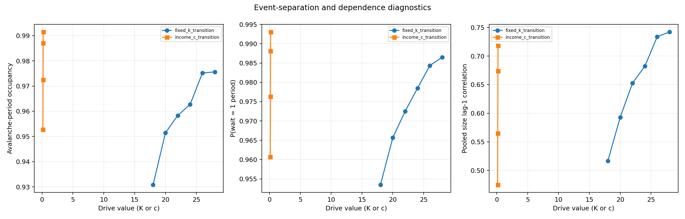
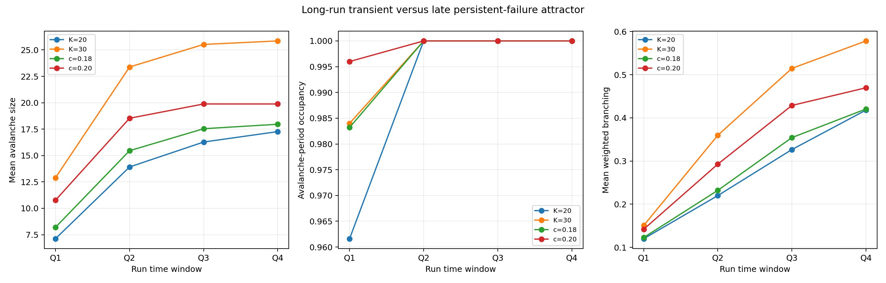
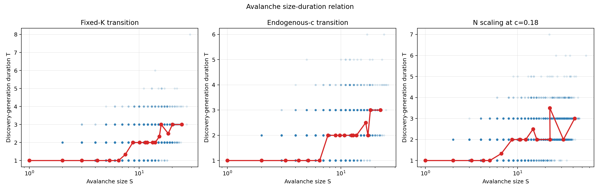
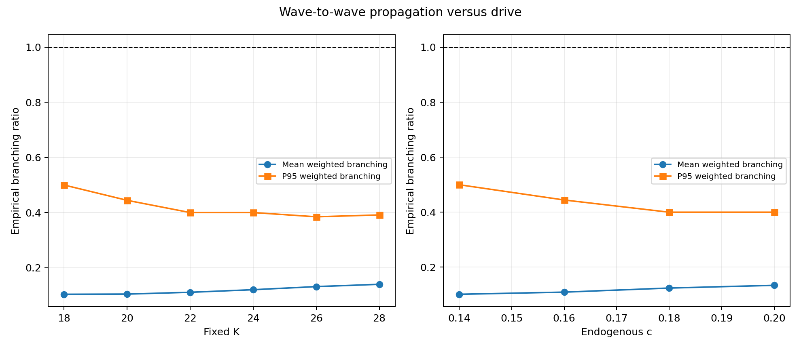
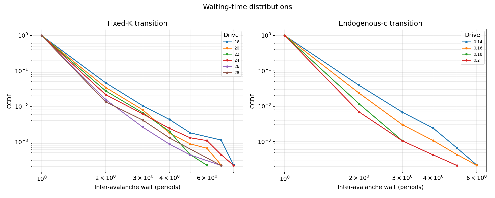
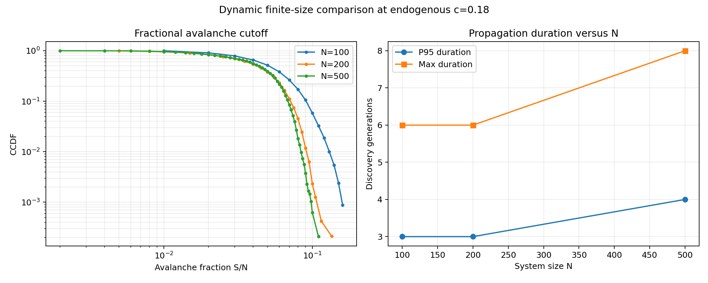

# 信贷网络 Phase-2 Avalanche 动态与临界传播报告

生成时间：2026-06-04 13:01:32 CST

## 协议与口径

- 正式实验：280 个 run、80353 个 avalanche、158737 个非空传播波。
- 主机制：lognormal 初始本金、biased 收入、random 信贷增长、continue_after_avalanche、period_end 检查。
- 扫描：固定 `K=18/20/22/24/26/28`；收入内生 `c=0.14/0.16/0.18/0.20`；`c=0.18` 下 `N=100/200/500`。
- 所有正式 run 开启 `validate_accounting=True`，种子和完整参数见 `metadata.json`。
- 持续时间定义为 FIFO 顺序清算中节点最早被发现的传播代数，初始违约集合为第 0 代；`cascade_steps` 只是处理节点数，未被误称为持续时间。
- 正式 sweep 前与当前基线逐种子校验：6/6 行完全一致；最终方法审计另覆盖 502 个随机级联状态和 16 个完整 run。

## 模型框架与动态变量

当前模型先在一个 period 内逐 time_step 尝试增加单位信贷暴露，再在 period_end 完成投资/消费支出、收入分配、负净资产识别和级联清算。级联在同一 period_end 内完成；传播代数是算法清算顺序上的动态标注，不等同于 period 或 time_step。

节点净资产为 `W_i = cash_i + loan_assets_i - debt_liabilities_i`，初始违约条件为严格 `W_i < 0`。清算债务人的入边会使其债权人减记贷款资产，可能产生下一传播代；当前 `wipe_defaulted_assets=True` 还会清除违约节点持有的贷款资产。`continue_after_avalanche` 不让节点永久退出，因此同一节点可跨 period 重复违约。

| 变量 | 明确定义 | 不能误解为 |
| --- | --- | --- |
| avalanche size / `collapse_size` | 本次级联中最终被处理并清算的不同节点数，等于所有 wave size 之和 | 初始违约数或持续时间 |
| initial default count | 收入分配后、传播清算前已经净资产 `<0` 的节点数，也是第 0 代 wave size | 由网络传播新增的违约数 |
| wave size | 某一最早发现传播代中的新违约节点数 | 整次 avalanche size |
| duration/generations | 非空 FIFO 最早发现代数量，包含第 0 代；传播代数为 duration-1 | 同步更新波数、物理时间、period 数、time_step 数或处理节点数 |
| branching ratio | 相邻波 `wave_(g+1)/wave_g`；weighted branching 为传播新增总数除以前序波父节点总数 | 严格临界分支过程的无偏估计 |
| period/time-step waiting time | 同一 run 中相邻 avalanche 的检测 period 差，以及检测时累计已执行信贷尝试步数差 | avalanche 内部持续时间、计划 K 差、成功贷款差或物理时间 |
| avalanche-period occupancy | pooled 观测 period 中发生 avalanche 的比例；当前 period_end 协议每期最多记录一次 | 独立事件概率 |
| size lag-1 correlation | 将每个 run 内相邻 avalanche-event size 对汇总后的 Pearson 相关；跨 run 不连接，事件不必相隔 1 period | period-lag 相关、逐 run 相关平均、因果关系或平稳性证明 |
| baseline `cascade_steps` | 基线 FIFO 清算中被处理的违约节点数，数值上等于 avalanche size | duration/generations |

基线清算为顺序 FIFO 队列，不是同步批量更新。节点一旦在净资产为负时进入队列，之后即使其他顺序清算使其净资产恢复，基线仍会处理该节点。因此本文 wave/generation 只表示“最早进入队列的算法发现代”，受节点处理顺序和 sticky queue 语义影响，不能解释为客观传播时间。

## 最终方法审计

- 数值与分母错误：未发现。
- Baseline equivalence：正式 sweep 前 6/6 seed 行匹配；最终独立审计的 502 个随机级联状态与 16 个完整 run 均为 0 mismatch。
- 校验器加固：baseline equivalence 现比较全部共享 run/event 字段和浮点字段；修改后另跑 6 行，全部匹配。
- 原始时钟：280 个有事件 run 的首事件 waiting 均为空；后续 period/time-step waiting 全部等于相邻事件检测时钟之差；每个 run-period 最多一个事件。
- 独立重算：occupancy、P(wait=1)、pooled event-lag1、Q1-Q4 与 burn-in 全部匹配，最大差异仅为浮点舍入量级。
- 机器可读审计：`/data/WYC/class/creditNet/results/credit_soc_phase2_dynamics_20260604_v1/final_method_audit_20260604.json`。

## 核心判断

17/17 个场景触发持续活跃/事件依赖标志；事件平均分支比最高为 0.402。动态证据支持从亚临界传播向持续活跃或过载状态的转变，但不能把逐期相关事件当作独立 SOC avalanche，严格 SOC 在当前协议下不可识别。

平均分支比低于 1 并不自动表示整个长期过程独立亚临界：一次 period_end 可以同时产生多个初始违约，且 continue 协议可使相邻时期事件高度相关。严格 SOC 仍需独立事件定义、尾部分布检验、有限尺寸标度和慢驱动/快 avalanche 分离共同支持。

本分支对当前 continue 协议的直接分类是：单次事件内部传播通常为亚临界分支，但系统长期状态向持续失败/过载吸引子漂移；因此 pooled avalanche 动态不是平稳独立的临界事件样本。该结论是对当前协议下严格 SOC 解释的不支持证据，而不是对所有可能清算、退出或驱动协议的普遍否定。

## 事件分离与相关性

持续活跃标志在 occupancy>=0.50、P(wait=1)>=0.80 或 size lag-1 corr>=0.50 任一满足时触发。

这里的 occupancy 使用 `事件数 / pooled 已观测 period 数`；P(wait=1) 排除每个 run 的首个无前序事件；lag-1 将 run 内相邻事件对合并后计算 Pearson 相关，不跨 run 连接。

### 固定 K

| K | events | avalanche_period_occupancy | one_period_wait_fraction | pooled_size_lag1_correlation | persistent_active_flag |
| --- | --- | --- | --- | --- | --- |
| 18.0000 | 4468 | 0.9308 | 0.9535 | 0.5166 | True |
| 20.0000 | 4567 | 0.9515 | 0.9657 | 0.5930 | True |
| 22.0000 | 4600 | 0.9583 | 0.9725 | 0.6528 | True |
| 24.0000 | 4621 | 0.9627 | 0.9785 | 0.6823 | True |
| 26.0000 | 4681 | 0.9752 | 0.9843 | 0.7339 | True |
| 28.0000 | 4683 | 0.9756 | 0.9865 | 0.7420 | True |

### 收入内生 c

| c | events | avalanche_period_occupancy | one_period_wait_fraction | pooled_size_lag1_correlation | persistent_active_flag |
| --- | --- | --- | --- | --- | --- |
| 0.1400 | 4573 | 0.9527 | 0.9607 | 0.4749 | True |
| 0.1600 | 4668 | 0.9725 | 0.9763 | 0.5648 | True |
| 0.1800 | 4738 | 0.9871 | 0.9881 | 0.6740 | True |
| 0.2000 | 4759 | 0.9915 | 0.9930 | 0.7182 | True |

## 时间漂移、burn-in 与长期吸引子

为避免把非平稳漂移混入 pooled dynamics，长跑面板对每个 run 按时间四等分，并同时报告去除 Q1 后的统计。Q4 与 Q1 的差异用于识别早期瞬态向晚期持续失败/过载吸引子的迁移。

每个长期协议均为 5 个完整 1000-period run。Q1-Q4 按各 run 的相对 period 位置划分；occupancy 使用窗口内 pooled period 分母，size、duration、branching 和 active credit 是窗口内 pooled event 均值，不是先算逐 run 均值再平均。`post_Q1_burn_in` 删除各 run 前 25% period；这些窗口比较是非平稳性诊断，不是正式平稳性检验。

四个长期协议的 Q4 事件期占比均为 1.0。最强的固定 `K=30` 场景从 Q1 到 Q4 出现：平均 size `12.89 -> 25.85`、大事件率 `0.165 -> 0.966`、平均 duration `1.99 -> 4.81`、平均 weighted branching `0.151 -> 0.578`，同时 avalanche 前活跃信贷 `778.50 -> 96.44`。这更符合脆弱低信贷存量上的持续失败吸引子，而非平稳临界态附近彼此分离的 avalanche。

| protocol | time_window | period_count | event_count | avalanche_period_occupancy | mean_event_size | large_event_rate | mean_duration_generations | mean_weighted_branching | mean_credit_before |
| --- | --- | --- | --- | --- | --- | --- | --- | --- | --- |
| K=20 | Q1 | 1250 | 1202 | 0.9616 | 7.1165 | 0.0008 | 1.6007 | 0.1200 | 775.3894 |
| K=20 | Q4 | 1250 | 1250 | 1.0000 | 17.2648 | 0.1984 | 3.3456 | 0.4181 | 181.9224 |
| K=20 | post_Q1_burn_in | 3750 | 3750 | 1.0000 | 15.8187 | 0.1205 | 2.8528 | 0.3215 | 355.9421 |
| K=30 | Q1 | 1250 | 1230 | 0.9840 | 12.8862 | 0.1650 | 1.9927 | 0.1506 | 778.4984 |
| K=30 | Q4 | 1250 | 1250 | 1.0000 | 25.8528 | 0.9664 | 4.8088 | 0.5783 | 96.4400 |
| K=30 | post_Q1_burn_in | 3750 | 3750 | 1.0000 | 24.9192 | 0.9320 | 4.1155 | 0.4842 | 183.7208 |
| c=0.18 | Q1 | 1250 | 1229 | 0.9832 | 8.1937 | 0.0024 | 1.6737 | 0.1228 | 885.9040 |
| c=0.18 | Q4 | 1250 | 1250 | 1.0000 | 17.9608 | 0.2904 | 3.3832 | 0.4206 | 155.9848 |
| c=0.18 | post_Q1_burn_in | 3750 | 3750 | 1.0000 | 16.9848 | 0.2347 | 2.9699 | 0.3356 | 321.8533 |
| c=0.20 | Q1 | 1250 | 1245 | 0.9960 | 10.7606 | 0.0369 | 1.8651 | 0.1419 | 816.0546 |
| c=0.20 | Q4 | 1250 | 1250 | 1.0000 | 19.8800 | 0.5680 | 3.7416 | 0.4697 | 151.7864 |
| c=0.20 | post_Q1_burn_in | 3750 | 3750 | 1.0000 | 19.4299 | 0.5091 | 3.3387 | 0.3971 | 232.6493 |

## 传播分支与 size-duration

| family | n_nodes | drive_value | event_count | mean_weighted_branching | p95_weighted_branching | mean_duration | p95_duration |
| --- | --- | --- | --- | --- | --- | --- | --- |
| fixed_k_transition | 200 | 18.0000 | 4468 | 0.1034 | 0.5000 | 1.4282 | 3.0000 |
| fixed_k_transition | 200 | 20.0000 | 4567 | 0.1041 | 0.4444 | 1.4822 | 3.0000 |
| fixed_k_transition | 200 | 22.0000 | 4600 | 0.1106 | 0.4000 | 1.5796 | 3.0000 |
| fixed_k_transition | 200 | 24.0000 | 4621 | 0.1200 | 0.4000 | 1.6845 | 3.0000 |
| fixed_k_transition | 200 | 26.0000 | 4681 | 0.1312 | 0.3846 | 1.7879 | 3.0000 |
| fixed_k_transition | 200 | 28.0000 | 4683 | 0.1395 | 0.3913 | 1.8791 | 3.0000 |
| income_c_transition | 200 | 0.1400 | 4573 | 0.1015 | 0.5000 | 1.3958 | 3.0000 |
| income_c_transition | 200 | 0.1600 | 4668 | 0.1092 | 0.4444 | 1.5122 | 3.0000 |
| income_c_transition | 200 | 0.1800 | 4738 | 0.1241 | 0.4000 | 1.7026 | 3.0000 |
| income_c_transition | 200 | 0.2000 | 4759 | 0.1340 | 0.4000 | 1.7979 | 3.0000 |
| long_run_attractor | 200 | 0.1800 | 4979 | 0.2831 | 0.5556 | 2.6499 | 5.0000 |
| long_run_attractor | 200 | 0.2000 | 4995 | 0.3335 | 0.6000 | 2.9714 | 5.0000 |
| long_run_attractor | 200 | 20.0000 | 4952 | 0.2726 | 0.5833 | 2.5489 | 5.0000 |
| long_run_attractor | 200 | 30.0000 | 4980 | 0.4018 | 0.6667 | 3.5912 | 6.0000 |
| size_scaling_income_c018 | 100 | 0.1800 | 4562 | 0.1305 | 0.5000 | 1.4862 | 3.0000 |
| size_scaling_income_c018 | 200 | 0.1800 | 4729 | 0.1193 | 0.4000 | 1.6464 | 3.0000 |
| size_scaling_income_c018 | 500 | 0.1800 | 4798 | 0.1262 | 0.2941 | 2.1248 | 4.0000 |

## 系统规模动态对照

规模对照使用收入内生 `c=0.18`，使第一期及后续驱动随总收入扩展，避免固定绝对 K 改变人均驱动。

| n_nodes | events | mean_size | p95_size | max_size | p95_size_fraction | max_size_fraction | mean_duration_generations | p95_duration_generations | max_duration_generations | mean_weighted_branching | avalanche_period_occupancy | one_period_wait_fraction | pooled_size_lag1_correlation |
| --- | --- | --- | --- | --- | --- | --- | --- | --- | --- | --- | --- | --- | --- |
| 100.0000 | 4562.0000 | 4.9255 | 10.0000 | 16.0000 | 0.1000 | 0.1600 | 1.4862 | 3.0000 | 6.0000 | 0.1305 | 0.9504 | 0.9584 | 0.5416 |
| 200.0000 | 4729.0000 | 8.1432 | 15.0000 | 27.0000 | 0.0750 | 0.1350 | 1.6464 | 3.0000 | 6.0000 | 0.1193 | 0.9852 | 0.9875 | 0.6349 |
| 500.0000 | 4798.0000 | 20.9769 | 37.0000 | 55.0000 | 0.0740 | 0.1100 | 2.1248 | 4.0000 | 8.0000 | 0.1262 | 0.9996 | 0.9996 | 0.8324 |

## 证据边界

- 传播波是对当前顺序清算算法的最早发现代数标注，不是假设同时更新的物理时间。
- event 表中的相邻 avalanche 在 continue 协议下可能来自持续失败态；等待时间和 lag-1 相关已用于标记这一风险。
- period waiting 是事件检测期索引差；time-step waiting 是检测时累计已执行信贷尝试步数差。二者都不是 avalanche 内部传播时间。
- pooled lag-1 和 pooled quartile 均会按事件数给高事件 run 更大权重；本报告明确将其作为依赖/漂移诊断，不作为独立同分布统计。
- size-duration 对数回归仅为描述性动态 scaling，不替代严格幂律与有限尺寸塌缩检验。
- 当前动态证据可区分亚临界传播、转变区和持续活跃/过载风险，但不足以证明严格 SOC。

## 证据文件

- 原始 run/event/wave：`/data/WYC/class/creditNet/results/credit_soc_phase2_dynamics_20260604_v1/run_summary.csv`、`avalanche_events.csv`、`avalanche_waves.csv`
- 基线一致性：`/data/WYC/class/creditNet/results/credit_soc_phase2_dynamics_20260604_v1/baseline_equivalence.csv`
- 独立性诊断：`/data/WYC/class/creditNet/results/credit_soc_phase2_dynamics_20260604_v1/independence_diagnostics.csv`
- 动态规模对照：`/data/WYC/class/creditNet/results/credit_soc_phase2_dynamics_20260604_v1/system_size_dynamics.csv`
- 时间窗口与 burn-in：`/data/WYC/class/creditNet/results/credit_soc_phase2_dynamics_20260604_v1/time_window_dynamics.csv`
- size-duration 回归：`/data/WYC/class/creditNet/results/credit_soc_phase2_dynamics_20260604_v1/duration_size_regressions.csv`
- 最终方法审计：`/data/WYC/class/creditNet/results/credit_soc_phase2_dynamics_20260604_v1/final_method_audit_20260604.json`
