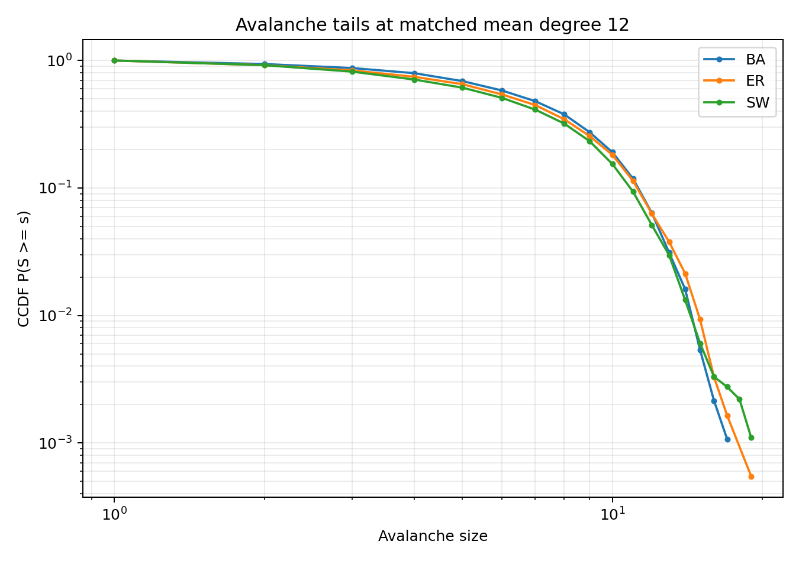
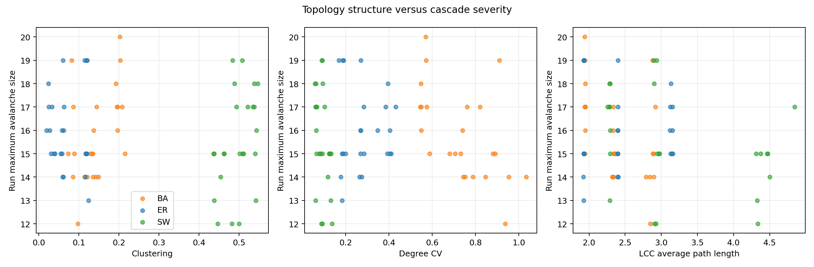
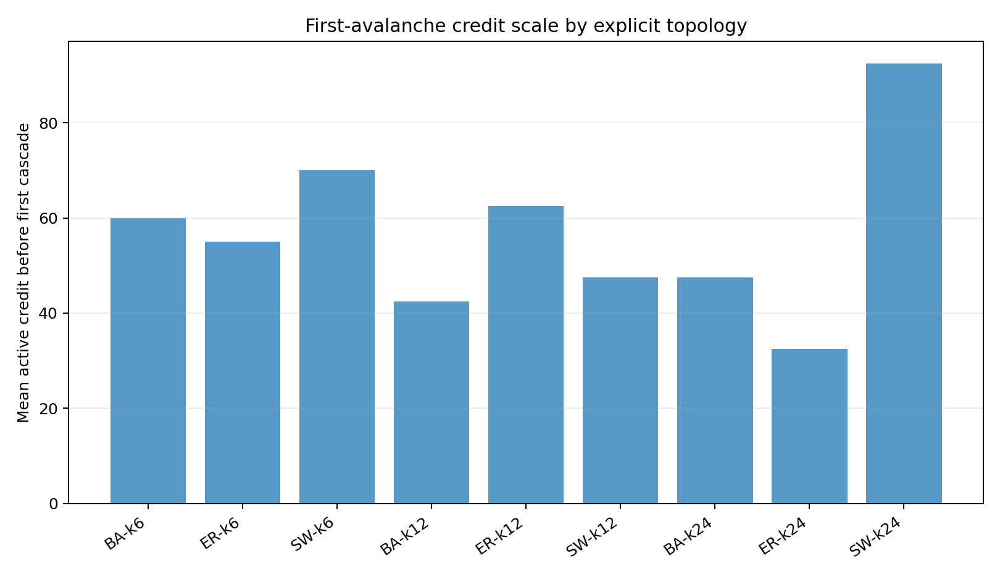
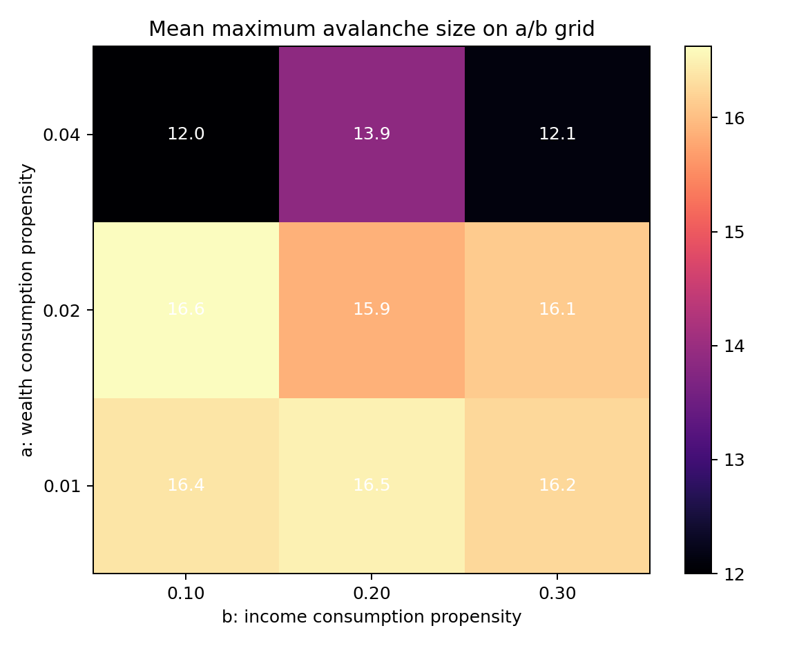

# 信贷网络 Phase-2 因素覆盖与显式拓扑分支报告 v1

生成时间：2026-06-04 12:42:58 CST

最终覆盖审计更新时间：2026-06-04 13:05:33 CST

## 1. 任务与结论边界

本分支补充 `project.md` 的三个关注点：

1. 初始本金分布如何影响首次级联前信贷规模与级联严重度；
2. 网络增长规则、显式 ER/BA/SW 可借贷拓扑及其密度如何影响级联；
3. 收入分配与消费参数 `a/b` 如何影响级联和财富分化。

本实验是统一 `240 period` 的固定时域瞬态比较，不代表长期稳态或长期拓扑排序。大 avalanche、CCDF 尾部和固定 `xmin=2` 的 alpha 仅是描述性证据，不构成严格 SOC 或幂律证明。

本报告严格区分两个信贷规模口径：

- **首次 avalanche 前信贷规模**：run 中第一次出现任意规模违约/级联前的活跃信贷；`scenario_summary.csv` 字段为 `mean_first_cascade_credit`。
- **阈值定义的临界信贷规模**：达到 `collapse_size / N >= 0.10` 的大 avalanche 前活跃信贷。正式 248-run 实验只出现 3 个此类事件，因此多数因素场景的阈值临界信贷规模当前不可识别。

原图文件 `critical_credit_by_topology.png` 名称不准确，内容实际是首次 avalanche 前信贷规模。最终覆盖审计已将分析脚本和正式报告改用 `first_cascade_credit_by_topology.png`；旧文件保留，不再作为阈值临界信贷证据。

### 1.1 对照 `project.md` 的最终覆盖矩阵

| `project.md` 关注因素 | 本分支协议 | 已覆盖范围 | 当前可回答内容 | 当前不能回答内容 |
| --- | --- | --- | --- | --- |
| 初始本金/初始净资产分布 | 初始资产负债表为空，所以 `W_i,0 = C_i,0`；目标人均本金 20 | equal、uniform、normal、lognormal、pareto | 首次 avalanche 时点、级联严重度、最终 Gini 的描述性差异 | 各分布的阈值临界信贷规模；严格控制相同实际总现金后的纯分布效应 |
| 收入分配 | 总实际支出重新分配为总收入 | uniform、biased | 是否发生传播、首次 avalanche 时点、财富分化 | 阈值临界信贷规模；更多收入分配函数 |
| 消费参数 `a/b` | `planned consumption = a * 正净资产 + b * 上期收入`；固定 `K=20` | `a={0.01,0.02,0.04}` × `b={0.10,0.20,0.30}` | 统一固定驱动量下的瞬态级联与 Gini 变化 | `a/b` 通过收入反馈改变内生 `K_t` 时的联合效应；阈值临界信贷规模 |
| 信贷增长规则 | 仅在 opportunity graph 邻居中选择实际方向 | random、preferential_debt | 实际有向暴露增长规则的描述性差异 | 其余增长规则、配对随机种子下的因果差异 |
| 显式拓扑 | 固定无向 opportunity graph，实际暴露有向带权 | ER、BA-derived、SW；目标平均度 6/12/24 | 匹配平均度下家族差异、固定 N 下的密度变化、结构量相关 | 动态/有向/真实机会图；跨 N 独立区分固定平均度与固定密度；长期稳态排序 |

覆盖结论：请求中的五类因素均有直接实验，但这是围绕共同高风险基准的一因素/小网格扫描，不是配对种子全因子实验。多数场景没有达到 10% 大 avalanche 阈值，所以只能回答首次 avalanche 和级联严重度，不能把它们重新命名为“已识别的临界信贷规模”。

## 2. 显式拓扑实现

新增实现：

- `src/creditnet/phase2_topology.py`
- `scripts/run_phase2_factor_topology_sweeps.py`
- `scripts/analyze_phase2_factor_topology.py`

使用 `networkx 3.4.2` 生成固定无向可借贷机会图：

- `ER`：`gnm_random_graph`，直接固定边数；
- `BA`：`barabasi_albert_graph`，再增补少量随机边以精确匹配目标边数；
- `SW`：`watts_strogatz_graph`，重连概率 `0.10`，再精确匹配目标边数。

因此本报告中的 BA 更准确地是 **BA-derived matched-edge graph**：它保留优先连接骨架，但为严格匹配 ER/SW 边数加入了少量随机缺失边，不应解释为未经修改的纯 BA 生成模型。SW 只覆盖 `rewire_probability=0.10`，不能代表全部 small-world 参数区间。

无向机会边 `{i,j}` 表示 `i` 与 `j` 之间允许发生信贷，但实际暴露仍为带权有向矩阵。每个 time step 先选择有现金的贷款人，再仅从其机会图邻居中选择借款人，因此实际方向仍为 `lender -> borrower`。每期会计校验同时检查：现金守恒、资产负债与暴露矩阵一致、无自环、所有正暴露均位于机会图边上。

### 2.1 模型层次与变量定义

本分支同时包含两个不同的网络概念，不能混用：

| 概念/变量 | 定义与作用 |
| --- | --- |
| `opportunity graph` | run 开始时生成并在整个 run 内固定的无向、无权可交易约束图。只有存在无向边 `{i,j}` 的主体对才允许发生信贷；它不表示已经存在贷款，也不规定贷款方向。 |
| 实际信贷暴露网络 `E_ij` | 随 time step 增长和级联清算变化的有向带权网络。`E_ij` 表示 `i` 贷给 `j` 的当前未清算单位信贷数，同一方向可反复增加权重。 |
| `growth_rule` | 在 opportunity graph 给定的允许邻居范围内，动态选择当次贷款人与借款人的规则。`random` 等概率选择，`preferential_debt` 按贷款人现金和借款人现有债务加权。它改变实际有向暴露如何增长，不改变固定 opportunity graph 的边。 |
| `topology_seed` | 单独用于生成 opportunity graph 的随机种子；与驱动现金、收入分配和借贷选择的 run `seed` 分开记录，使机会图实例可复现。 |
| `target_mean_degree` | opportunity graph 的目标无向平均度。固定 `N` 时通过目标边数 `M = N * target_mean_degree / 2` 精确实现。 |
| `density` / `topology_density` | opportunity graph 的无向边密度，定义为 `2M / [N(N-1)]`。本实验固定 `N=200`，因此与 `target_mean_degree` 一一对应。 |
| `clustering` / `topology_clustering` | opportunity graph 的平均局部聚类系数，衡量一个节点的邻居之间彼此相连的程度。 |
| `degree_cv` / `topology_degree_cv` | opportunity graph 无向度的变异系数，即度标准差除以平均度；用于描述连接机会异质性。 |
| `LCC` / `topology_lcc_fraction` | 最大连通分量及其节点占比；用于识别机会图是否存在无法互相到达的孤立部分。 |
| `topology_lcc_average_path_length` | opportunity graph 最大连通分量内的平均最短路径长度；只在 LCC 内计算，避免不连通节点导致无穷路径。 |

因此，`ER/BA/SW + target_mean_degree + topology_seed` 决定“哪些主体对允许交易”；`growth_rule + run seed + 当前现金/债务状态` 决定“允许交易的主体对中，哪一个方向在何时实际增加多少信贷暴露”。

不同场景使用互异的 run seed 和 topology seed，而不是共享同一初始本金样本、同一机会图和同一随机流的配对设计。因此场景均值是独立重复的描述性比较；特别是样本量只有 8 时，不能把小差异解释成精确因果效应。

在固定 `N=200` 下，平均度与密度一一对应。本报告将两类问题分开解释：

- 同一目标平均度下比较 ER/BA/SW，避免把密度差异误判为拓扑家族效应；
- 在每个拓扑家族内比较目标平均度 `6/12/24`，解释密度变化。

| 目标平均度 | 精确无向边数 | 密度 |
| ---: | ---: | ---: |
| 6 | 600 | 0.030151 |
| 12 | 1200 | 0.060302 |
| 24 | 2400 | 0.120603 |

所有 248 个 run 均精确匹配目标边数和平均度。BA、SW 以及平均度 12/24 的 ER 全部连通；平均度 6 的 ER 仅有一个实例出现两个连通分量，其最大连通分量仍覆盖 99.5% 节点。完整结构量见 `topology_instances.csv`。

## 3. 实验协议与审计

| 项目 | 设置 |
| --- | --- |
| 运行环境 | `/home/wuyangcheng/.conda/envs/myenv/bin/python` |
| 主要库 | networkx 3.4.2、numpy 1.26.4、pandas 2.3.3、scipy 1.15.3、matplotlib 3.10.7 |
| 节点数 | `N=200` |
| 时期长度 | 固定 `K=20`，接近已有固定 K 转变边界 |
| 运行时域 | 每 run `max_periods=240` |
| Avalanche 协议 | `continue_after_avalanche` |
| 违约检查 | `period_end` |
| 大 avalanche 阈值 | `collapse_size / N >= 0.10`，即规模至少 20 |
| 基准因素 | lognormal 本金、biased 收入、random 增长、`a=0.02,b=0.20`、ER 平均度 12 |
| 每场景重复 | 8 |
| 场景 / run / event | 31 / 248 / 51,401 |
| run 种子 | 2026060400--2026060647，248 个互异种子 |
| 拓扑种子 | 2026064400--2026064647，248 个互异种子 |
| 会计校验 | 全部 run 开启 |

31 个 `scenario_id` 是按 factor family 标记的比较单元，其中共同基准会在不同 family 中用新的独立种子重复。因此共有 31 个比较单元、25 组唯一参数配置；重复基准用于各 family 内部对照，但没有池化成一个共同基准估计。

### 3.1 固定模型框架与关键变量

| 变量/机制 | 本分支设置与含义 |
| --- | --- |
| `C_i, E_ij, A_i, D_i, W_i` | 现金、`i -> j` 有向带权暴露、贷款资产、债务负债、净资产；`W_i=C_i+A_i-D_i` |
| 单位信贷 | 每个 time step 至多新增 1 单位暴露；贷款人现金至少为 1 |
| `period_length_rule` / `K` | `fixed` / 20；每期计划 20 次单位信贷尝试 |
| `investment_income_propensity=c` | 元数据仍记录默认值 0.20，但固定 K 下不参与 period 长度计算，因此本分支没有扫描或识别 `c` 效应 |
| 期末支出 | 先支付受现金约束的当期借款投资支出，再支付受现金约束的消费 |
| 收入 | 当期实际总支出等于当期总收入，并以多项分布重新加入主体现金 |
| 违约与级联 | `W_i<0`；债务人违约使债权人对应贷款资产减记，`wipe_defaulted_assets=True` |
| 继续协议 | `continue_after_avalanche`；清算后节点下一期仍可参与，允许重复违约 |
| 观测时域 | 每 run 统一 240 period；不是长期稳态 |

### 3.2 初始本金分布协议

初始资产负债表为空，所以初始本金、初始现金和初始净资产相同。所有样本为非负整数：

| 分布 | 代码参数化 |
| --- | --- |
| equal | 每个节点固定为 20 |
| uniform | 整数区间 `[0,40]` 等概率抽样 |
| normal | `Normal(mean=20, std=10)`，四舍五入后负值截断为 0 |
| lognormal | `sigma=1`，选择 `mu` 使理论均值约为 20，再四舍五入 |
| pareto | `alpha=2`，每个样本批次按样本均值缩放到目标均值 20，再四舍五入 |

所有分布共享目标均值 20，但除 equal 外没有强制每个 run 的实际总现金完全相同。正式本金扫描中，平均实际总现金为 equal 4000.0、uniform 3960.9、normal 3983.8、lognormal 4138.3、pareto 3998.6；lognormal 单 run 范围为 3668--4421。因而本金结果同时包含形状差异和有限样本实际总现金差异，不能解释成严格总量控制后的纯分布效应。

### 3.3 收入分配与 `a/b` 协议

计划消费为：

```text
planned_consumption_i,t
  = a * max(W_i,t, 0) + b * max(Y_i,t-1, 0)
```

计划消费先随机舍入成整数，再受投资支出后的剩余现金约束。收入分配概率为：

```text
uniform: p_i = 1/N
biased:  p_i = [max(W_i, 0) + 1] / sum_j[max(W_j, 0) + 1]
```

biased 权重使用支出后、收入分配前的净资产；加 1 的 floor 保证非正净资产节点仍有非零收入概率。本分支使用固定 K，因此 `a/b` 改变现金流和收入分配，但不会通过总收入反馈改变下一期信贷尝试数。

### 3.4 增长规则协议

两种规则都必须先满足 opportunity graph 邻接约束：

- `random`：从有现金且至少有一个机会图邻居的贷款人中等概率选择，再从其邻居中等概率选择借款人；
- `preferential_debt`：贷款人按当前现金加权，借款人仅在该贷款人的机会图邻居中按当前债务加 1 加权；借款人权重每个 time step 更新。

该规则定义的是选择概率，不直接记录“债务集中度”或“贷款能力集中度”。报告若讨论集中机制，只能作为规则含义，不应声称已直接测量集中程度。

扫描包含：

- 本金：equal、uniform、normal、lognormal、pareto；
- 收入：uniform、biased；
- 消费参数：`a in {0.01,0.02,0.04}`，`b in {0.10,0.20,0.30}`；
- 增长规则：random、preferential_debt；
- 显式拓扑：ER、BA-derived、SW；
- 目标平均度：6、12、24。

未覆盖的基线增长规则包括 `cash_weighted`、`borrower_preferential`、`preferential` 和 `borrower_debt_preferential`；本分支只满足“random 与至少一种偏好增长”的任务范围。

审计结果：

- 248/248 个 run 达到统一 240-period 时域；
- 初始总现金与最终总现金不一致数为 0；
- 目标边数或平均度不一致数为 0；
- `run_summary.csv` 中 `avalanche_count` 合计与 `avalanche_events.csv` 的 51,401 行完全一致，逐 run 最大规模和 `critical_event` 标志也与事件表重算一致；
- 31 个场景的首个 run 历史均完整包含 240 行，历史内现金总量保持不变；
- 31 个场景均为 8 个 run，run seed 与 topology seed 均完整、互异且和元数据一致；
- 正式 31 个 factor-family 单元对应 25 组唯一参数配置；重复基准单元使用独立种子，未做配对；
- 完整参数、种子、结构量、run/event 数和 CST 时间戳均写入 `metadata.json` 与 CSV。

## 4. 结果总览

本批次只出现 3 个达到 10% 阈值的大 avalanche：

| 分支 | 场景 | period | 级联前活跃信贷 | collapse size |
| --- | --- | ---: | ---: | ---: |
| 拓扑密度 | BA，平均度 24，random | 168 | 808 | 20 |
| 拓扑×增长 | BA，平均度 12，random | 226 | 666 | 23 |
| 拓扑×增长 | SW，平均度 12，random | 236 | 531 | 20 |

这 3 个事件是本分支唯一可直接称为“阈值临界信贷规模”的观测，分别为 808、666 和 531。初始本金、收入分配和 `a/b` 扫描全部没有大 avalanche，不能从本批数据估计这些因素对应的阈值临界信贷规模。

因此，场景间差异主要应从平均最大 avalanche、事件规模、首次 avalanche 前信贷规模和最终净资产 Gini 解读。首次 avalanche 前信贷规模回答“系统何时开始失效”，不等于 `project.md` 中“大面积崩塌时的临界信贷规模”。

## 5. 关注点一：初始本金分布

| 本金分布 | 平均实际总现金 | 初始 Gini | 首次 avalanche 前平均活跃信贷 | 平均最大 avalanche | 最大 event | 最终净资产 Gini |
| --- | ---: | ---: | ---: | ---: | ---: | ---: |
| equal | 4000.0 | 0.000 | 1392.5 | 7.000 | 9 | 0.527 |
| normal | 3983.8 | 0.280 | 25.0 | 9.625 | 12 | 0.636 |
| uniform | 3960.9 | 0.337 | 42.5 | 11.125 | 13 | 0.655 |
| pareto | 3998.6 | 0.338 | 607.5 | 13.000 | 17 | 0.807 |
| lognormal | 4138.3 | 0.521 | 72.5 | 16.250 | 18 | 0.846 |

对 `project.md` 第一个关注点的回答：

- 在当前独立种子样本中，equal 本金观察到更晚的首次 avalanche：首次 avalanche 前平均活跃信贷达到 1392.5，并且平均最大 avalanche 为 7；
- lognormal 的初始不平等最高，观察到平均最大 avalanche 16.25、最终 Gini 0.846，是本批本金单因素单元中最高；
- 首次 avalanche 信贷规模不是初始 Gini 的单调函数。normal/uniform 较早发生小级联，pareto 则较晚发生但级联更大，说明低本金节点比例、尾部主体和现金可贷性可能共同决定首次失效，不能只用一个 Gini 指标解释；
- 五种本金单元均没有达到 10% 大 avalanche，因此本分支没有识别出不同本金分布的阈值临界信贷规模；
- 比较未使用配对种子，且实际总现金没有逐 run 严格匹配。特别是 lognormal 的平均总现金更高，所以这些结果是描述性关联，不能解释成严格控制总现金后的纯分布因果效应。


## 6. 关注点二：网络结构、密度与增长规则

### 6.1 匹配平均度 12 的 ER/BA/SW

基准均为 lognormal 本金、biased 收入、random 增长、`a=0.02,b=0.20`。

| 拓扑 | 聚类系数 | 度 CV | LCC 平均路径 | 首次 avalanche 前平均信贷 | 平均最大 avalanche | 平均 event size |
| --- | ---: | ---: | ---: | ---: | ---: | ---: |
| ER | 0.060 | 0.273 | 2.399 | 62.5 | 15.750 | 6.176 |
| BA | 0.138 | 0.738 | 2.340 | 42.5 | 15.000 | 6.439 |
| SW | 0.498 | 0.089 | 2.932 | 47.5 | 15.625 | 5.891 |

在匹配平均度和密度后，三类拓扑的平均最大 avalanche 都约为 15--16，当前 8-run 独立重复下没有稳定家族排序。BA 的度异质性和 SW 的聚类明显不同，但聚类系数与最大 avalanche 的 pooled Spearman 相关仅 `rho=0.020, p=0.870`，度 CV 相关为 `rho=-0.075, p=0.532`。这些比较没有共享同一 run seed 或 topology seed，因此不能声称 BA 或 SW 本身必然更危险。



### 6.2 拓扑内密度变化

| 拓扑 | 平均度 6 的平均最大 avalanche | 平均度 12 | 平均度 24 |
| --- | ---: | ---: | ---: |
| ER | 16.125 | 15.750 | 16.125 |
| BA | 15.000 | 15.000 | 17.375 |
| SW | 14.500 | 15.625 | 16.375 |

跨 72 个拓扑密度 run，平均度与最大 avalanche 的 Spearman 相关为 `rho=0.293, p=0.0125`，LCC 平均路径长度与最大 avalanche 的相关为 `rho=-0.233, p=0.0492`。这提供了“更密、路径更短时级联略严重”的弱探索性证据，但效应量较小，ER 内部也没有单调变化；相关检验还未控制拓扑家族、实际总现金或多重比较。当前不能把它解释为普遍的密度定律。






### 6.3 增长规则比拓扑家族效应更强

| 拓扑 | growth rule | 平均最大 avalanche | 最大 event | 最终净资产 Gini |
| --- | --- | ---: | ---: | ---: |
| ER | random | 15.625 | 17 | 0.857 |
| ER | preferential_debt | 5.750 | 8 | 0.570 |
| BA | random | 16.250 | 23 | 0.847 |
| BA | preferential_debt | 5.375 | 8 | 0.561 |
| SW | random | 15.875 | 20 | 0.844 |
| SW | preferential_debt | 5.375 | 7 | 0.594 |

对 `project.md` 第二个关注点的回答：

- 在同一机会图密度下，ER/BA/SW 家族效应较弱；
- random 增长在所有拓扑上都观察到更大的事件时有向关系覆盖：avalanche 前平均有向关系数约为 ER 505、BA 406、SW 527，而 `preferential_debt` 分别约为 427、336、442；这些是事件条件均值，不是全时域网络集中度；
- `preferential_debt` 的规则按现金加权贷款人、按债务加权邻接借款人；当前清算机制下观察到平均最大 avalanche 被压低到约 5.4--5.8，但本分支没有直接计算债务或贷款能力集中度；
- 因此，当前模型中“实际有向暴露如何在机会图上增长”比无向机会图家族标签更能解释级联严重度。
- 增长规则比较使用不同机会图和演化种子，属于分布层面的独立重复比较，不是同一图同一种子的配对消融。

## 7. 关注点三：收入分配与消费参数

### 7.1 收入分配

| 收入规则 | 首次级联前平均活跃信贷 | 平均最大 avalanche | 最大 event | 最终净资产 Gini |
| --- | ---: | ---: | ---: | ---: |
| uniform | 450.0 | 0.750 | 1 | 0.131 |
| biased | 72.5 | 15.875 | 18 | 0.857 |

uniform 收入并没有完全消除初始违约：8 个 run 中 6 个至少发生过一次违约，共记录 7 个 avalanche；但所有 event 规模均为 1，因此在本样本中没有观察到传播到其他节点的级联。表中的 450.0 只对这 6 个发生过 avalanche 的 run 求平均。

biased 收入的 8 个 run 均发生违约，共记录 1830 个 avalanche，最大 event 为 18，最终 Gini 为 0.857。它使首次 avalanche 更早且传播规模更大，是本批独立重复扫描中观察到的最大描述性因素对比；但两种收入规则都没有达到 10% 大 avalanche，因此阈值临界信贷规模仍不可识别。

### 7.2 `a/b` 温和网格

按 `a` 汇总：

| a | 平均最大 avalanche | 平均 event size | 平均最终 Gini |
| ---: | ---: | ---: | ---: |
| 0.01 | 16.375 | 7.084 | 0.870 |
| 0.02 | 16.208 | 6.348 | 0.848 |
| 0.04 | 12.667 | 4.474 | 0.786 |

按 `b` 汇总后，平均最大 avalanche 在 14.83--15.42 之间，最终 Gini 在 0.834--0.837 之间，变化很小。

对 `project.md` 第三个关注点的回答：

- biased 收入分配在本批独立重复中与更高财富分化和更大级联同时出现，是观察到的最大因素对比；
- 在当前固定 `K=20` 独立重复协议下，提高财富消费倾向 `a` 到 0.04 与较低的平均 event size、最大 avalanche 和最终 Gini 同时出现；
- `b=0.10/0.20/0.30` 的温和变化没有显示稳定严重度效应；
- 所有 `a/b` 单元都没有达到 10% 大 avalanche，不能识别阈值临界信贷规模；各单元未使用配对种子，8-run 小差异不应解释为精确因果效应；
- 固定 K 切断了 `a/b -> 总收入 -> 下一期 K_t` 的反馈，因此本结论只说明相同计划信贷尝试量下的现金流效应，不等于收入内生时期长度协议下的 `a/b` 效应；
- 这些是 240-period 瞬态结果。更长时域下高风险协议会继续向高频失效、高 Gini、低活跃信贷状态漂移，不能外推为稳态福利结论。



## 8. 尾部与 SOC 解释

random 增长下，显式拓扑场景固定 `xmin=2` 的连续 Pareto alpha 初筛约为 1.69--1.78；`preferential_debt` 场景约为 3.06--3.22。在这一描述性筛查口径下，random 的 alpha 更低、尾部看起来更重，但不能证明幂律。

本分支只支持以下判断：

> 在接近固定 K 转变边界的统一 240-period 瞬态协议下，lognormal 本金、biased 收入和 random 增长分别与更大的级联同时出现；显式机会图密度存在弱描述性影响，而匹配密度后的 ER/BA/SW 家族差异较小。

更严格的表述是：本批独立种子样本中，lognormal 本金、biased 收入和 random 增长分别与更大的 avalanche 同时出现；只有 3 个事件达到人为 10% 阈值，且没有完成配对消融、严格尾部检验或有限尺寸标度。因此这里的“放大”是描述性机制证据，不是严格因果估计或 SOC 证明。

本分支不支持“已经证明严格 SOC”“已经得到长期稳态拓扑排序”或“BA/SW 必然比 ER 危险”等结论。

## 9. 当前无法覆盖的因素

- 正常还款、债务到期、利息、抵押与回收率；
- 违约节点永久退出、重置或进入限制；
- 动态机会图、信贷关系退出和真实网络拓扑；
- 有向机会图约束；当前机会图无向，只有实际暴露有向；
- 在变化 `N` 时独立区分固定平均度与固定密度；
- 高重复数的窄边界定位、严格 power-law/lognormal/exponential 检验和有限尺寸标度；
- 超过 240 period 的长期状态与稳态识别；
- 因素交互的完整全因子设计；当前主要是围绕统一高风险基准的一因素扫描。
- 配对随机种子/共同随机数设计；当前每个 factor cell 使用独立 run seed 和 topology seed；
- 每个本金分布逐 run 匹配完全相同的实际总现金；
- 对 `a/b` 使用收入内生 `K_t` 的反馈实验；当前固定 K 下 `c=0.20` 仅存在于元数据且不生效；
- 全部基线增长规则；当前只比较 random 和 preferential_debt；
- 多个 SW 重连概率以及未经补边的纯 BA 对照；
- 多数因素的阈值临界信贷规模；当前初始本金、收入和 `a/b` 单元没有 10% 大 avalanche。

## 10. 最终独立覆盖审计

最终覆盖审计不复用自动摘要结论，而是从 `run_summary.csv`、`avalanche_events.csv`、`topology_instances.csv`、`first_run_histories.json` 和 `metadata.json` 独立重算。结果：

- 31 个 factor-family 单元、25 组唯一参数配置、248 个 run、51,401 个 event；
- 每个 factor-family 单元恰有 8 个 run；
- `sum(run.avalanche_count) = 51,401`，逐 run 最大 event 与 `critical_event` 均和事件表重算一致；
- 248/248 个 run 完成 240 period，且 `last_period_length_steps=max_period_length_steps=20`；
- 248/248 个 run 初始总现金等于最终总现金；
- 248/248 个 run 的无向机会图满足 `2M=N*target_mean_degree`，密度满足 `target_mean_degree/(N-1)`；
- 31 个首 run 历史均为 240 行且各自现金总量恒定；
- 10% 阈值公式重算得到 3 个大 avalanche，与报告表格一致。

审计修正：

1. 将原来容易误解为“临界信贷规模”的图和表述明确改为“首次 avalanche 前信贷规模”；
2. 明确 31 个单元中只有 25 组唯一配置，基准单元在不同 factor family 中使用独立种子重复；
3. 明确初始分布没有逐 run 匹配相同实际总现金；
4. 明确场景之间不使用配对 run/topology seed；
5. 明确 random 的“更广泛关系覆盖”来自 event 条件的有向关系数，而债务集中度未直接测量；
6. 明确固定 K 下 `c` 不生效，`a/b` 结果不包含收入到下一期 K 的反馈。

独立审计记录：`results/credit_soc_phase2_factors_topology_20260604_v1/coverage_audit_20260604_v1.md`。

## 11. 证据路径

主要结果：

- `results/credit_soc_phase2_factors_topology_20260604_v1/run_summary.csv`
- `results/credit_soc_phase2_factors_topology_20260604_v1/avalanche_events.csv`
- `results/credit_soc_phase2_factors_topology_20260604_v1/scenario_summary.csv`
- `results/credit_soc_phase2_factors_topology_20260604_v1/topology_instances.csv`
- `results/credit_soc_phase2_factors_topology_20260604_v1/topology_matched_degree_summary.csv`
- `results/credit_soc_phase2_factors_topology_20260604_v1/topology_degree_density_sweep_summary.csv`
- `results/credit_soc_phase2_factors_topology_20260604_v1/structure_outcome_correlations.csv`
- `results/credit_soc_phase2_factors_topology_20260604_v1/tail_alpha_screen.csv`
- `results/credit_soc_phase2_factors_topology_20260604_v1/metadata.json`
- `results/credit_soc_phase2_factors_topology_20260604_v1/analysis_metadata.json`
- `results/credit_soc_phase2_factors_topology_20260604_v1/coverage_audit_20260604_v1.md`

图表：

- `results/credit_soc_phase2_factors_topology_20260604_v1/topology_degree_effects.png`
- `results/credit_soc_phase2_factors_topology_20260604_v1/structure_vs_cascade.png`
- `results/credit_soc_phase2_factors_topology_20260604_v1/factor_effects.png`
- `results/credit_soc_phase2_factors_topology_20260604_v1/ab_grid_heatmap.png`
- `results/credit_soc_phase2_factors_topology_20260604_v1/topology_matched_degree_ccdf.png`
- `results/credit_soc_phase2_factors_topology_20260604_v1/first_cascade_credit_by_topology.png`

启动审计说明：

- 首次相对路径后台启动和一次 `nohup` 重试均被执行包装器回收，未产生结果且日志为空；
- 完整实验最终在持久 tmux 窗口 `cwsoc-factors-topology:factors-sweep` 运行，完成时间为 2026-06-04 12:40:52 CST；
- 启动前的 2-run 小规模命令验证保留在 `results/credit_soc_phase2_factors_topology_20260604_v1/launch_smoke/`，不计入上述 248-run 正式结果。
