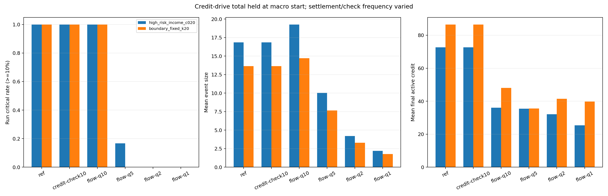
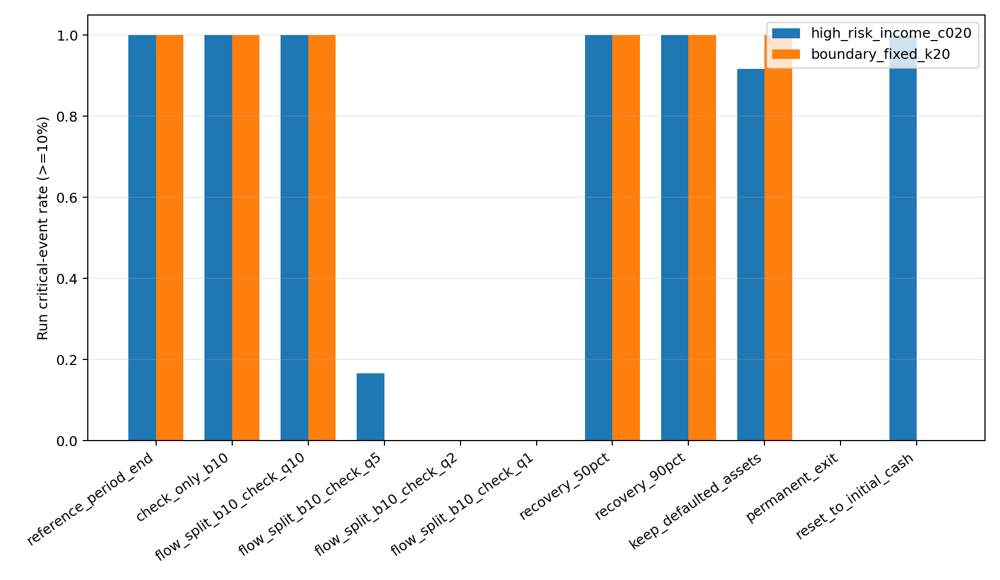
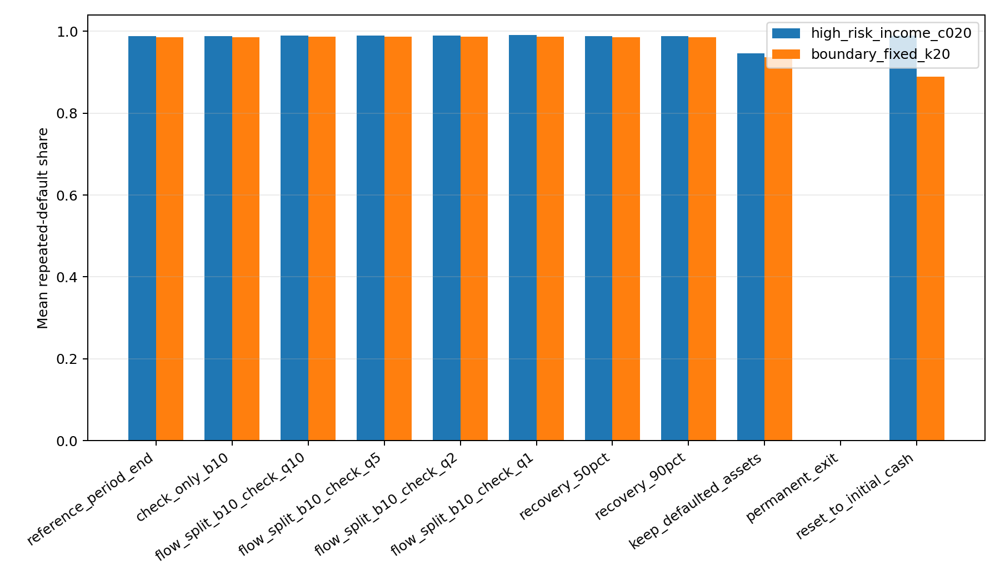
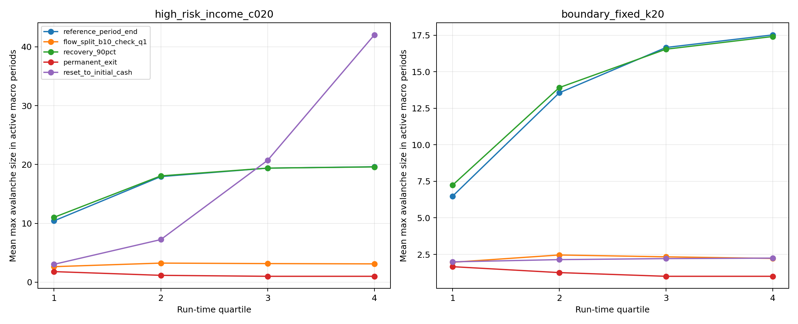
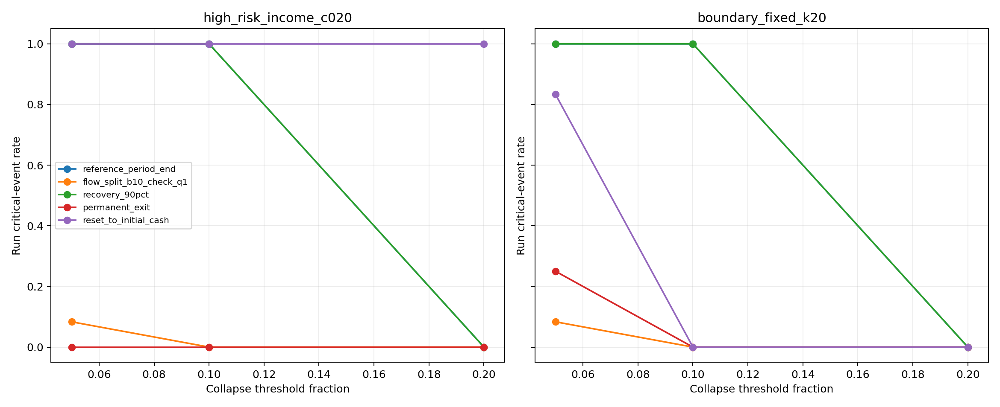
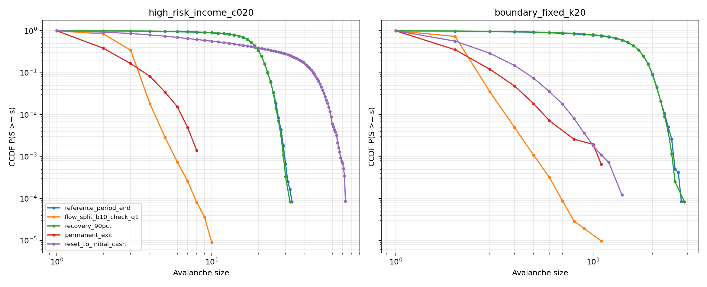

# 信贷网络第二阶段机制解耦与清算稳健性报告

更新时间：2026-06-04 13:03:00 CST

## 1. 任务、结论边界与证据标准

本分支检验当前信贷网络中的大级联、重尾迹象和近连续违约状态是否依赖以下实现选择：

1. 只在 `period_end` 批量完成流量结算和违约检查；
2. 债务人违约时债权资产按全额损失处理；
3. 是否清除违约节点持有的贷款资产；
4. 违约节点在后续时期继续参与、永久退出或重置；
5. 大崩塌阈值的人工选择；
6. 长期运行中同一节点可重复违约。

本报告只判断机制稳健性、级联转变、重尾迹象和长期退化状态。连续 Pareto 尾部指数仅作初筛，不构成严格幂律或严格自组织临界（SOC）证明。

核心证据目录：

- 正式长时段结果：`results/credit_soc_phase2_mechanism_20260604_v1/longrun_20260604_1244_r2/`
- 会计开启的 N=200 pilot：`results/credit_soc_phase2_mechanism_20260604_v1/pilot_n200_20260604_1243/`
- 全机制 smoke：`results/credit_soc_phase2_mechanism_20260604_v1/smoke_20260604_1242/`

## 2. Baseline 与本分支独立扩展的边界

### 2.1 Baseline 模型

Baseline 位于 `src/creditnet/simulation.py`。对节点 `i`：

```text
C_i = cash
A_i = sum_j(E_ij) = loan_assets
D_i = sum_j(E_ji) = debt_liabilities
W_i = C_i + A_i - D_i = net_worth
```

成功发放一单位信贷 `i -> j` 时：

```text
贷款人 i：C_i -= 1，A_i += 1
借款人 j：C_j += 1，D_j += 1
```

因此，单位信贷本身不改变任一交易对手净资产，也不改变系统总现金。Baseline 在一个 period 内先执行多次单位信贷尝试，在期末统一完成投资支出、消费支出、收入分配、违约检查和级联清算。默认节点在清算后仍可在后续时期继续参与。

### 2.2 独立扩展

本分支只新增 `src/creditnet/phase2_mechanism.py`，不修改 baseline。扩展保留相同资产负债表、随机信贷、支出与 biased 收入分配思想，但增加：

- 宏观期初固定信贷驱动总量，再把总量拆成多个批次；
- credit-only 检查负对照；
- 固定流量结算序列下的纯检查频率对照；
- 从违约债务人现有现金支付、受现金上限约束的回收率；
- 是否清除违约节点持有的贷款资产；
- 违约节点继续参与、永久退出或重置；
- unique/repeated default、外部 reset 现金流和长期时间结构诊断。

扩展当前只实现 `growth_rule=random`。它不是对所有 baseline 增长规则的完整替代，也不应与 baseline 使用相同 seed 时期待逐步路径完全一致。

## 3. 扩展变量与协议准确定义

| 变量 | 准确定义 | 会计或识别限制 |
| --- | --- | --- |
| `drive_rule` | 宏观期初如何确定该期计划信贷尝试总量；`income` 使用上一宏观期总收入，`fixed` 使用固定值 | 只确定期初总量，不在批次中途重算 |
| `fixed_drive_steps` | `drive_rule=fixed` 时每个宏观期计划的单位信贷尝试数 | 是尝试数，不保证全部成功发放 |
| `max_drive_steps_per_macro` | 每宏观期信贷尝试总量的显式上限 | 防止收入内生反馈产生不可控计算量；正式实验需报告是否触发 |
| `settlement_mode=period_end` | 整个宏观期只结算一次流量，并在结算后检查清算 | 对应 baseline 的主要结算节奏 |
| `settlement_mode=check_only` | 信贷总量拆批，中间只检查净资产，不结算流量；宏观期末才真正结算 | 因单位信贷保持净资产，它只能是负对照，理论上不应新增违约 |
| `settlement_mode=settle_and_check` | 每个批次后都结算流量；是否立即清算由检查间隔决定 | 相对单次期末结算会改变收入/消费动态 |
| `settlement_batches` | 一个宏观期的信贷总量和流量结算被拆成多少批 | 在纯检查频率比较中固定为 10 |
| `default_check_every_settlements` | 在 `settle_and_check` 下，每隔多少次固定流量结算执行一次违约检查和清算 | `q=10/5/2/1` 比较保持十次流量结算不变，只改变检查频率 |
| `recovery_rate` | 债权人对违约债务面值的目标回收比例 | 实际支付来自债务人现有现金并受现金上限约束；不注入外部现金 |
| `wipe_defaulted_assets` | 是否取消违约节点持有的贷款资产，并同步解除对应借款人负债 | `False` 时违约节点仍可持有并继续受偿，属于不同清算机制 |
| `default_node_mode=continue` | 本次清算后节点保留 active 状态，可继续借贷、支出、获得收入 | 允许同一节点跨时期重复违约 |
| `default_node_mode=exit` | 首次违约后节点永久变为 inactive | inactive 节点不再借贷、支出或获得收入；其剩余现金仍留在系统账面 |
| `default_node_mode=reset` | 清算后清空相关资产负债表，并把现金恢复到该 run 的初始现金 | 这是明确的外部现金流机制，不满足原始系统现金守恒 |
| `active` | 节点是否可以参与信贷、支出和收入分配 | 只在 `exit` 下永久减少；`continue/reset` 保持 active |
| `unique_default_nodes` | 一个 run 中至少违约一次的不同节点数 | 每个节点最多计一次 |
| `total_default_occurrences` | 一个 run 中各次 avalanche 涉及节点数的总和 | 同一节点可跨事件重复计入 |
| `repeat_default_occurrences` | `total_default_occurrences - unique_default_nodes` | 衡量事件规模尾部被重复违约放大的程度 |
| `external_reset_cash_flow` | reset 时恢复初始现金带来的累计现金变化 | 满足 `final cash = initial cash + external reset cash flow`，可正可负 |

## 4. 可识别性设计

### 4.1 为什么逐个信贷 time step 检查不能识别检查频率效应

单位信贷同时增加贷款人的贷款资产和减少其现金，也同时增加借款人的现金和债务，因此双方净资产不变。若两个检查之间没有支出、收入分配或清算，重复检查不会产生新的负净资产节点。

由此，本分支把 `check_only_b10` 作为会计和可识别性负对照。相同 seed 下，它必须与 `reference_period_end` 在信贷、级联、unique/repeated default 和终态上完全一致。

### 4.2 纯检查频率对照

`flow_split_b10_check_q10/q5/q2/q1` 都执行相同的十次批次信贷和十次流量结算，只改变清算间隔：

```text
q=10：第 10 次结算后检查
q=5：第 5、10 次结算后检查
q=2：第 2、4、6、8、10 次结算后检查
q=1：每次结算后检查
```

这是本分支可解释的检查频率对照。相反，`reference_period_end` 与 `flow_split_b10_check_q10` 的差异同时包含“单次结算变为十次结算”的收入和消费动态变化，不能称为纯检查频率效应。

## 5. 会计规则与校验

### 5.1 回收率

债务人违约时，对其入边按面值关闭。债权人的目标回收为：

```text
target_recovery_creditor = face_exposure_creditor * recovery_rate
```

实际总回收不超过违约债务人现有现金，并按目标回收额比例分配给债权人。未回收面值形成债权损失。该过程只是现金转移，系统总现金守恒。

### 5.2 Reset

Reset 在本次级联清算后将违约节点现金恢复为其 run-specific 初始现金，并清除仍存的贷款资产。因此它引入外部现金流：

```text
external_reset_cash_flow += reset_cash - cash_before_reset
final_cash_total = initial_cash_total + external_reset_cash_flow
```

Reset 的稳定化效果不能解释为原始封闭现金系统中的纯清算稳健性。

### 5.3 已执行校验

正式长时段实验前完成：

1. 单位信贷保持交易双方净资产；
2. credit-only 拆批检查与一次期末检查路径完全一致；
3. cash-capped recovery 保持系统总现金；
4. reset 外部现金流恒等式成立；
5. 全机制 smoke 和 N=200 会计开启 pilot。

校验证据：`results/credit_soc_phase2_mechanism_20260604_v1/*/accounting_checks.json`。

## 6. 正式实验设计

正式长时段实验使用：

- `N=200`；
- 初始本金 `lognormal`，目标均值 20；
- biased 收入分配；
- random 信贷增长；
- `a=0.02`，`b=0.20`；
- 12 个 paired seeds，每个协议和机制复用相同 seed；
- 高风险协议 seeds：`2026086000-2026086011`；
- 边界协议 seeds：`2026186000-2026186011`；
- 高风险协议：收入内生 `c=0.20`，1000 个 macro-period；
- 边界协议：固定 `K=20`，1000 个 macro-period；
- 11 个机制版本；
- 大崩塌阈值重分类：5%、10%、20%。

结果不仅比较 run 级大崩塌率、事件规模、活跃信贷、重复违约和尾部，还比较：

- avalanche 活跃 macro-period 比例；
- 相邻事件等待期为 1 的比例；
- macro-period 最大事件规模 lag-1 相关；
- Q1 到 Q4 的事件规模和大事件率变化；
- 末 20% 窗口的持续失效；
- final Gini、final active credit 和 active nodes。

## 7. 结果

正式实验完成 264 个 run、22 个场景、537387 个 avalanche 事件。完整场景表、事件表和时间诊断分别位于：

- `scenario_summary.csv`
- `avalanche_events.csv`
- `temporal_diagnostics.csv`
- `temporal_quartiles.csv`
- `threshold_sensitivity.csv`
- `tail_screen.csv`

### 7.1 可识别性负对照完全通过

在两个协议的 12 个 paired seeds 中，`reference_period_end` 与 `check_only_b10` 对以下字段全部为 0 mismatch：

- 总信贷发放量；
- avalanche 数、最大规模和总规模；
- unique default 与 repeated default；
- final active credit、final cash 和 final Gini。

这直接验证：只在 credit-only time step 后增加检查、但不结算流量，不能产生新的违约。原模型中 `c` 的作用不能通过“多插入几次无流量检查”来分离。

### 7.2 固定流量序列下，增加检查频率会碎片化事件，但不消除持续失效

| 协议 | 机制 | 10% run大事件率 | events/run | 平均事件规模 | repeated default占比 | final active credit | final Gini | 末20% avalanche活跃率 |
| --- | --- | ---: | ---: | ---: | ---: | ---: | ---: | ---: |
| `c=0.20` | reference | 1.000 | 997.8 | 16.86 | 0.988 | 72.7 | 0.987 | 1.000 |
| `c=0.20` | flow q=10 | 1.000 | 999.3 | 19.26 | 0.990 | 36.0 | 0.994 | 1.000 |
| `c=0.20` | flow q=5 | 0.167 | 1983.8 | 10.04 | 0.990 | 35.5 | 0.993 | 1.000 |
| `c=0.20` | flow q=2 | 0.000 | 4834.7 | 4.20 | 0.990 | 32.1 | 0.993 | 1.000 |
| `c=0.20` | flow q=1 | 0.000 | 9216.8 | 2.21 | 0.990 | 25.3 | 0.993 | 1.000 |
| fixed `K=20` | reference | 1.000 | 986.8 | 13.65 | 0.986 | 86.5 | 0.988 | 1.000 |
| fixed `K=20` | flow q=10 | 1.000 | 988.3 | 14.71 | 0.986 | 48.0 | 0.991 | 1.000 |
| fixed `K=20` | flow q=5 | 0.000 | 1945.3 | 7.64 | 0.987 | 35.6 | 0.992 | 1.000 |
| fixed `K=20` | flow q=2 | 0.000 | 4635.6 | 3.29 | 0.987 | 41.4 | 0.992 | 1.000 |
| fixed `K=20` | flow q=1 | 0.000 | 8559.8 | 1.78 | 0.987 | 39.8 | 0.991 | 1.000 |

在固定十次流量结算的条件下，`q` 越小，单次事件越小，10% 阈值事件消失，但：

- avalanche 活跃 macro-period 比例仍约为 0.99；
- 末 20% 窗口每个 macro-period 仍发生 avalanche；
- repeated default 占比仍约 0.99；
- final Gini 仍约 0.99；
- final active credit 反而更低。

因此，更高检查频率主要把一个批量大事件切分为多个小事件。它能改变“大崩塌”分类，却没有恢复为低频、相互分离的 avalanche 状态。

`reference` 与 `flow q=10` 的差异还说明：即使检查都只在宏观期末发生，把一次流量结算改为十次流量结算也会显著改变事件规模和终态。该差异属于收入/消费流量动态，不是纯检查频率效应。

### 7.3 全额清算、回收率、保留资产、退出和重置

| 协议 | 机制 | 10% run大事件率 | 平均事件规模 | repeated占比 | final active credit | final active nodes | final Gini | 末20%大事件率/period |
| --- | --- | ---: | ---: | ---: | ---: | ---: | ---: | ---: |
| `c=0.20` | reference | 1.000 | 16.86 | 0.988 | 72.7 | 200.0 | 0.987 | 0.525 |
| `c=0.20` | recovery 90% target | 1.000 | 17.03 | 0.988 | 75.0 | 200.0 | 0.988 | 0.521 |
| `c=0.20` | keep defaulted assets | 0.917 | 4.01 | 0.946 | 1294.8 | 200.0 | 0.876 | 0.007 |
| `c=0.20` | permanent exit | 0.000 | 1.69 | 0.000 | 0.0 | 1.0 | 0.966 | 0.000 |
| `c=0.20` | reset | 1.000 | 18.80 | 0.990 | 2579.8 | 200.0 | 0.951 | 0.999 |
| fixed `K=20` | reference | 1.000 | 13.65 | 0.986 | 86.5 | 200.0 | 0.988 | 0.218 |
| fixed `K=20` | recovery 90% target | 1.000 | 13.84 | 0.986 | 86.3 | 200.0 | 0.987 | 0.213 |
| fixed `K=20` | keep defaulted assets | 1.000 | 3.62 | 0.937 | 1317.7 | 200.0 | 0.875 | 0.005 |
| fixed `K=20` | permanent exit | 0.000 | 1.56 | 0.000 | 1490.7 | 1.3 | 0.966 | 0.000 |
| fixed `K=20` | reset | 0.000 | 2.15 | 0.889 | 2181.5 | 200.0 | 0.844 | 0.000 |

机制含义如下：

1. **高目标回收率没有修复持续失效。** `recovery_rate=0.90` 在两个协议中几乎复制 reference。原因不是“90% 面值真的被回收”：`c=0.20` 中平均目标回收约 18823.5，但受债务人现金约束，平均实际回收只有约 603.5；fixed `K=20` 中平均实际回收约 605.1。现金稀缺使目标回收率大幅失效。
2. **保留违约节点资产显著降低单次事件规模和不平等，但持续小违约仍存在。** 其 final active credit 提高到约 1300，Gini 降至约 0.875，末窗口大事件率接近零；但末窗口 avalanche 活跃率仍为 0.938 和 0.924，repeated default 占比仍超过 0.93。因此，清除违约节点持有的资产是放大大级联的重要机制，但不是持续违约的唯一来源。
3. **永久退出消除重复违约的代价是参与系统退化。** repeated default 确实归零，但 1000 期后平均只剩约 1 个 active 节点。它不是恢复稳态，而是通过移除几乎全部参与者终止 avalanche。
4. **Reset 强烈依赖驱动规则。** fixed `K=20` 下 reset 把 10% 大事件率降为零，并降低 Gini；但仍有 0.716 的末窗口 avalanche 活跃率和 0.889 的 repeated default 占比。`c=0.20` 下 reset 反而形成外部现金注入、收入、下一期信贷驱动之间的正反馈，末窗口大事件率升至 0.999，Q1 到 Q4 平均事件规模从 3.04 升至 42.03。

### 7.4 长期运行显示的是持续失效和非平稳退化

Reference 的时间结构为：

| 协议 | avalanche活跃期率 | wait=1占比 | 事件规模lag-1相关 | Q1平均规模 | Q4平均规模 | 末20%大事件率/period |
| --- | ---: | ---: | ---: | ---: | ---: | ---: |
| `c=0.20` | 0.998 | 0.998 | 0.696 | 10.42 | 19.62 | 0.525 |
| fixed `K=20` | 0.987 | 0.992 | 0.752 | 6.47 | 17.52 | 0.218 |

两个 reference 协议几乎每期都发生 avalanche，且事件规模随时间上升、相邻规模高度相关。1000 期后 final Gini 接近 0.99，active credit 仅约 73/87。该状态更符合“低信贷、高不平等、重复违约的持续失效状态”，不是由慢驱动分隔的独立 avalanche 稳态。

提高检查频率可降低 lag-1 相关和单次事件规模，却不降低末窗口 avalanche 活跃率。保留违约资产可减弱规模和相关性，却仍维持高频违约。永久退出只通过主体耗尽结束失效。

### 7.5 大崩塌阈值高度影响分类结论

| 协议 | 阈值 | reference run大事件率 | reference event大事件率 |
| --- | ---: | ---: | ---: |
| `c=0.20` | 5% | 1.000 | 0.890 |
| `c=0.20` | 10% | 1.000 | 0.339 |
| `c=0.20` | 20% | 0.000 | 0.000 |
| fixed `K=20` | 5% | 1.000 | 0.787 |
| fixed `K=20` | 10% | 1.000 | 0.092 |
| fixed `K=20` | 20% | 0.000 | 0.000 |

Reference 在 5% 和 10% 阈值下可以被称为反复出现“大事件”，但在 20% 阈值下完全没有大事件。由于传播过程没有改变，这证明“大崩塌率”是阈值敏感的分类指标，不能等同于内生临界点。

### 7.6 Unique 与 repeated defaults

Reference 中，一个 run 平均约有 195-196 个不同节点至少违约一次，但总违约节点出现次数达到：

- `c=0.20`：约 16823 次；
- fixed `K=20`：约 13468 次。

因此 repeated default 占比约为 0.988 和 0.986。当前长期事件规模和尾部的绝大部分质量来自同一批节点跨期重复失效，而不是不断有新节点首次进入违约。

### 7.7 尾部只构成机制敏感的重尾初筛

以 `xmin=2` 的连续 Pareto 近似为例：

- reference alpha：`c=0.20` 为 1.425，fixed `K=20` 为 1.470；
- q=1 高频检查：分别升至 3.170 和 4.232；
- 保留违约资产：分别约 2.027 和 2.091。

尾部指数随清算窗口显著变化，而且样本处于强非平稳、近连续、重复违约状态。该结果支持“存在机制敏感的重尾/级联规模分布”，不支持严格幂律或严格 SOC 证明。

### 7.8 `c` 与结算间隔能分离到什么程度

本分支实现了两个层次的分离：

1. 每个 macro-period 开始时固定该期信贷驱动总量，再改变批次和检查间隔；
2. fixed `K=20` 协议在所有非退出场景中总驱动严格保持为每 run 20000 次，因此清算差异独立于 `c`。

但收入内生 `c=0.20` 下，改变流量结算或清算会改变本期收入，进而改变下一期 `c * income` 驱动总量。因此，跨多个 macro-period 的“纯 `c` 效应”在当前反馈结构下不可完全识别。能识别的是：

- credit-only 检查本身无效；
- 固定流量序列下的检查频率效应；
- 固定 `K` 下与 `c` 无关的清算机制效应；
- 收入内生反馈下机制与 `c` 的联合作用。

### 7.9 会计与计算上限审计

- 正式 run 的非 reset 场景现金守恒残差最大值小于 `1e-12`；
- reset 场景满足 `final cash = initial cash + external reset cash flow`，残差为 0；
- 除 `c=0.20 + reset` 外，所有场景均未触发 `max_drive_steps_per_macro=500`；
- `c=0.20 + reset` 共触发 2002 个 capped macro-period，单 run 最多 221 次。其正反馈方向明确，但事件规模和信贷驱动的精确幅度受上限约束，不能外推为无上限结果。

### 7.10 与 avalanche dynamics 分支的交叉验证

动态分支在相同 baseline continue 协议下发现：

- fixed `K=30` 从 Q1 到 Q4 的平均事件规模 `12.89 -> 25.85`；
- 大事件率 `0.165 -> 0.966`；
- 平均持续时间 `1.99 -> 4.81`；
- avalanche 前 active credit `778.50 -> 96.44`。

证据位于 `results/credit_soc_phase2_dynamics_20260604_v1/time_window_dynamics.csv` 和 `docs/credit_soc_phase2_dynamics_report_20260604_v1.md`。它独立支持“低信贷、高脆弱度的晚期持续失败吸引子”判断。

本分支的 exit/reset 对照进一步说明：

- permanent exit 的 Q4 avalanche 活跃率降至 `c=0.20` 的 0.001 和 fixed `K=20` 的 0.002，但终态只剩约 1 个 active 节点。因此它通过主体耗尽破坏持续失败吸引子；
- fixed `K=20 + reset` 的 Q1/Q4 平均事件规模仅 `1.99 -> 2.24`，但仍有 0.714 的 Q4 avalanche 活跃率、0.889 的 repeated default 占比，并累计注入约 7966 单位外部现金；
- `c=0.20 + reset` 的 Q1/Q4 平均事件规模反而 `3.04 -> 42.03`，Q4 大事件率 0.995，说明收入内生驱动把 reset 外部现金转化为更强的晚期失效反馈。

因此，动态分支识别的 baseline 持续失败吸引子不是单纯统计假象；exit/reset 可以改变它，但分别以主体退出或外部现金反馈为代价。

### 7.11 对 `project.md` 因素与显式拓扑覆盖的独立审计

本分支对 factors/topology 分支的正式 CSV、metadata 和报告做了只读独立审计。完整记录位于
`results/credit_soc_phase2_mechanism_20260604_v1/project_factor_coverage_audit_20260604_v1.md`。

覆盖与协议如下：

| `project.md` 关注点 | 已执行覆盖 | 协议边界 |
| --- | --- | --- |
| 初始本金 | equal、uniform、normal、lognormal、pareto | 初始资产负债表为空，本金同时是初始净资产；不同分布实际总现金未严格配平 |
| 收入分配 | uniform、biased | 总实际支出重新分配为收入 |
| 消费参数 `a/b` | `a={0.01,0.02,0.04}` x `b={0.10,0.20,0.30}` | fixed `K=20`，不识别收入内生 `K_t` 交互 |
| 增长规则 | random、preferential_debt | 改变实际有向暴露如何在机会图上增长 |
| 显式拓扑 | ER、BA-derived、SW；平均度 6/12/24 | opportunity graph 固定、无向、无权；实际暴露动态、有向、带权 |

`topology + target_mean_degree + topology_seed` 决定允许交易的机会图；`growth_rule + run seed + 当前状态`
决定实际贷款方向和时点。拓扑 seed 与 run seed 分离记录，但不同场景使用互异种子，并非配对
common-random-number 设计。

独立对账得到：

- metadata、run 表和事件表均为 `31 scenarios / 248 runs / 51,401 events`，每场景 8 runs；
- 248/248 runs 均完成 240 periods、开启会计校验，现金、事件数、最大事件和 critical 标志重算不一致数均为 0；
- 目标边数、平均度、密度公式不一致数均为 0，10% 阈值事件总数为 3；
- factors/topology 报告称平均度 6 的 ER “仅有一个实例”不连通，但原始表实际有 **2 个 run 实例**，两者 LCC fraction 都为 0.995。该文字修正不改变结论。
- 初次审计时，factors/topology 分析脚本和报告正文引用的新图 `first_cascade_credit_by_topology.png` 尚未出现在正式目录；通知所有者后，该图已于 13:02 CST 补生成，报告证据清单也已改用新名。旧名 `critical_credit_by_topology.png` 按保留旧产物约束继续存在。

因此，可以条件性合并的结论是：在 baseline 清算、fixed `K=20` 和 240-period 瞬态下，biased 收入、
初始本金不平等和 random 交叉暴露是较大效应，匹配平均度后的 ER/BA-derived/SW 家族效应较弱，
`b` 温和网格效应也较小。不能把这些结论外推为长期拓扑排序、机制交互效应或严格 SOC 证据。

## 8. 机制稳健结论与限制

### 8.1 对机制稳健的结论

1. **持续重复失效对检查频率和现金受限回收率稳健。** 更频繁检查和 90% 目标回收都没有恢复低频、分离的 avalanche 状态。
2. **长期状态具有强非平稳退化。** Reference 在两个协议中均趋向高 Gini、低 active credit、几乎每期违约和高 repeated default。
3. **清除违约节点持有资产会放大大级联。** 保留资产显著降低事件规模和不平等，但仍未消除持续小违约。
4. **同一节点重复违约是事件总量和尾部的重要来源。** Reference 超过 98% 的违约节点出现次数属于重复计数。

### 8.2 当前协议的产物

1. **10% 大事件率强烈依赖检查/清算聚合窗口。** 高频清算把大事件切分为更多小事件。
2. **“大崩塌”结论依赖人工阈值。** Reference 在 20% 阈值下没有大事件。
3. **永久退出的稳定化是假稳定。** 它通过耗尽 active 节点而非恢复经济网络。
4. **Reset 不是封闭系统机制。** 它引入外部现金；在收入内生 `c` 下还会产生强正反馈。

### 8.3 限制

- 只覆盖 `random` 增长、lognormal 本金和 biased 收入；
- 正式 run 为 12 seeds/场景，适合机制判别但不是所有参数的最终置信区间；
- 正式 run 为速度关闭逐期会计检查，但会计开启 pilot、显式不变量测试和正式结果后验残差审计均通过；
- 当前无正常还款、到期、利息和生产性投资回报；
- recovery 受现有现金约束，尚未实现抵押物或外部破产财产；
- 尾部拟合只是初筛；严格 SOC 仍需平稳事件定义、有限尺寸标度和正式分布检验。
- factors/topology 分支的五类因素使用不同且不配对的 run/topology seeds，每场景仅 8 runs；大效应可作条件性描述，小拓扑或 `b` 差异不能作精确因果解释。
- factors/topology 分支只含 baseline 清算下的 240-period 瞬态，本分支未把本金、收入、`a/b`、增长规则和 ER/BA/SW 与检查频率、回收、资产保留、exit/reset 做全交互。
- 当前显式 opportunity graph 固定、无向、无权；尚未覆盖动态、有向或真实机会网络，也未跨 `N` 独立区分固定平均度和固定密度。

## 9. 图表

### 9.1 信贷驱动、流量与检查频率



### 9.2 清算机制的大事件率



### 9.3 重复违约占比



### 9.4 时间四分位上的事件规模



### 9.5 大事件阈值敏感性



### 9.6 选定机制的 CCDF



## 10. 复现实验入口

```bash
/home/wuyangcheng/.conda/envs/myenv/bin/python scripts/run_phase2_mechanism_ablation.py \
  --output-dir results/credit_soc_phase2_mechanism_20260604_v1/longrun_20260604_1244_r2 \
  --suite full \
  --runs 12 \
  --seed-base 2026086000 \
  --high-risk-periods 1000 \
  --boundary-periods 1000 \
  --keep-first-history \
  --progress-every 12

/home/wuyangcheng/.conda/envs/myenv/bin/python scripts/analyze_phase2_mechanism.py \
  --result-dir results/credit_soc_phase2_mechanism_20260604_v1/longrun_20260604_1244_r2 \
  --thresholds 0.05 0.10 0.20
```
