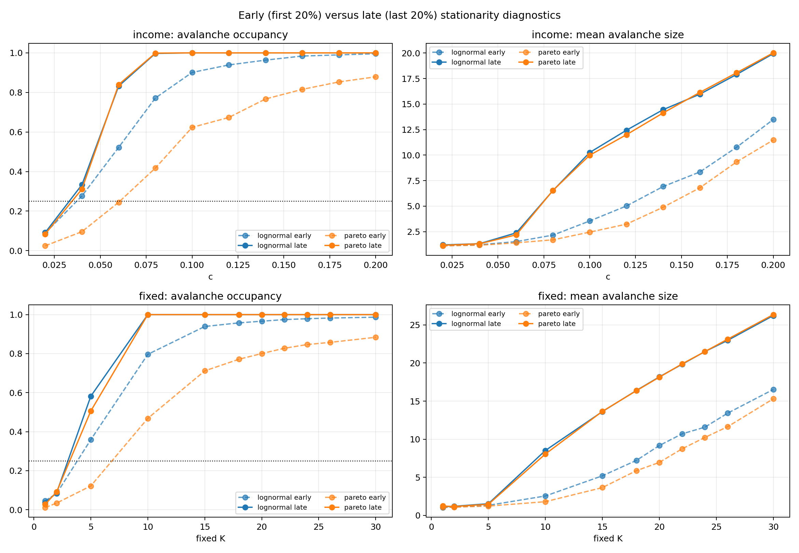
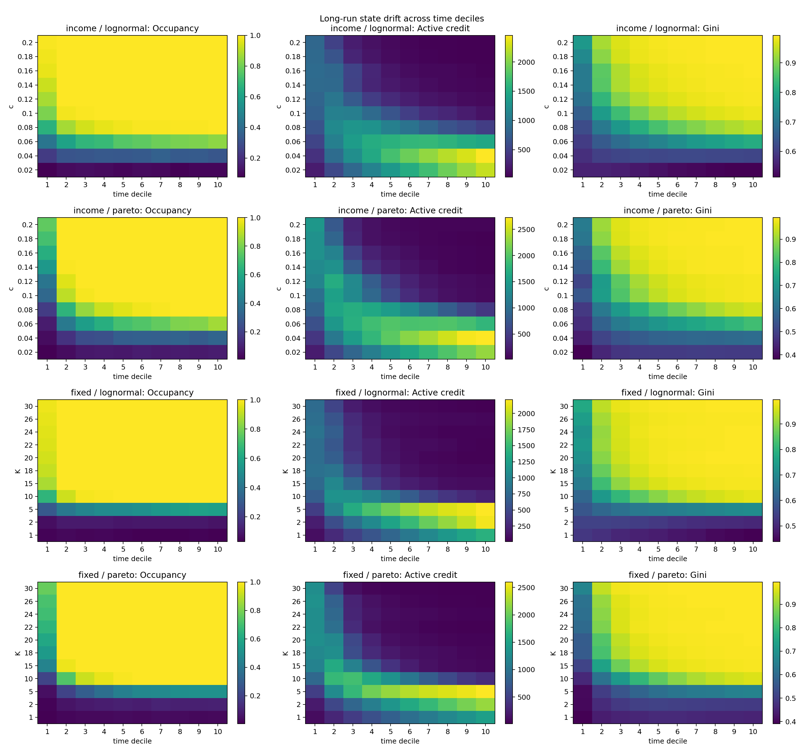
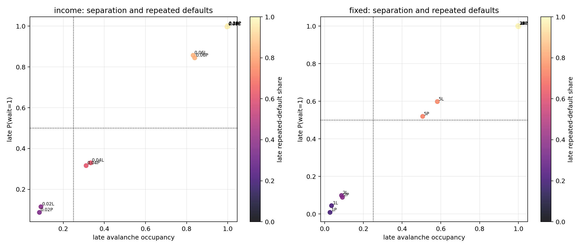

# 信贷网络长期平稳性与稀有分离 Avalanche 搜索报告

生成时间：2026-06-04 13:23:43 CST
结果版本：`credit_soc_phase2_stationarity_search_20260604_v1`

## 1. 任务与结论

本分支在不修改 baseline 的前提下，执行从低到高驱动的 2000 期长期搜索，目标是排除此前短跑可能遗漏的“稀有、相互分离且统计平稳”的 avalanche 窗口。搜索只判断当前 baseline + `continue_after_avalanche` + `period_end` 约束；大事件、重尾、转变与严格 SOC 仍严格区分。

- 场景：42；独立 run：504；总 period：1008000；avalanche：773242。
- 每场景 12 seeds、每 run 2000 periods；N=200；lognormal/pareto 本金；biased 收入；random 增长；会计校验开启。
- early/late 分别定义为每个 run 的前 20%（1-400 期）和后 20%（1601-2000 期）。
- 对账结论：全部通过。
- 候选结论：42 个场景中没有任何场景通过 SOC 候选门槛，因此按任务要求不追加有限尺寸验证。

## 2. SOC 候选门槛

只有同时满足下列条件才升级为候选；该门槛只是决定是否值得追加有限尺寸验证，不等于严格 SOC 证明：

1. late 窗口至少 60 个事件，occupancy 至少 `0.001`；高 occupancy 和 `P(wait=1)` 只作为事件相关/批量触发风险报告，不单独否决；
2. late size lag-1 绝对值 `<=0.30`；
3. early/late occupancy 差不超过 `max(0.02, 25% * max(early,late))`；均值 size 相对漂移 `<=25%`；active credit 相对漂移 `<=20%`；Gini 绝对漂移 `<=0.05`；传播占比绝对漂移 `<=0.10`；
4. late `P(initial_default_count=1) >= 0.50`，传播新增违约占全部违约 `>=0.10`，避免把同步多源初始违约广延增长直接当成单触发 avalanche；
5. late repeated-default share `<=0.80`；late P99 至少达到 `0.05N`，且至少出现一次 `0.10N` 大事件。

分类还区分：全程无事件且存量稳定区、无事件但持续累积的非平稳区、稀有平稳事件区、稀疏但非平稳区、平稳高占用触发风险区，以及漂移/持续失败区。

## 3. 分类结果

| classification | scenario_count |
| --- | --- |
| drift_or_persistent_failure | 36 |
| sparse_but_nonstationary | 6 |

各协议/本金分布中 late occupancy 最低的边界场景：

| family | money | control | class | early_occ | late_occ | late_wait1 | late_lag1 | late_repeat_share | late_P_initial1 | late_prop_share |
| --- | --- | --- | --- | --- | --- | --- | --- | --- | --- | --- |
| fixed | pareto | 1.0000 | sparse_but_nonstationary | 0.0110 | 0.0275 | 0.0083 | -0.0414 | 0.1975 | 1.0000 | 0.1852 |
| fixed | lognormal | 1.0000 | sparse_but_nonstationary | 0.0460 | 0.0354 | 0.0443 | -0.0572 | 0.2083 | 1.0000 | 0.1146 |
| income | pareto | 0.0200 | sparse_but_nonstationary | 0.0246 | 0.0842 | 0.0867 | -0.0526 | 0.3475 | 0.9851 | 0.1314 |
| fixed | lognormal | 2.0000 | sparse_but_nonstationary | 0.0831 | 0.0869 | 0.0988 | -0.0075 | 0.3501 | 0.9736 | 0.1388 |
| income | lognormal | 0.0200 | sparse_but_nonstationary | 0.0892 | 0.0917 | 0.1145 | 0.0206 | 0.3717 | 0.9682 | 0.1434 |
| fixed | pareto | 2.0000 | sparse_but_nonstationary | 0.0340 | 0.0917 | 0.0888 | -0.0224 | 0.3745 | 0.9682 | 0.1098 |
| income | pareto | 0.0400 | drift_or_persistent_failure | 0.0960 | 0.3115 | 0.3163 | -0.0044 | 0.6139 | 0.8622 | 0.1261 |
| income | lognormal | 0.0400 | drift_or_persistent_failure | 0.2767 | 0.3335 | 0.3298 | 0.0345 | 0.6215 | 0.8438 | 0.1186 |

完整 42 场景 early/late 统计与分类：

| family | control | money | class | early_occ | late_occ | late_wait1 | late_lag1 | early_mean_S | late_mean_S | credit_rel_drift | gini_drift | late_repeat_share | late_P_initial1 | late_prop_share | prop_share_drift | candidate |
| --- | --- | --- | --- | --- | --- | --- | --- | --- | --- | --- | --- | --- | --- | --- | --- | --- |
| fixed | 1.0000 | lognormal | sparse_but_nonstationary | 0.0460 | 0.0354 | 0.0443 | -0.0572 | 1.0271 | 1.1294 | 6.3573 | -0.0793 | 0.2083 | 1.0000 | 0.1146 | 0.0882 | False |
| fixed | 1.0000 | pareto | sparse_but_nonstationary | 0.0110 | 0.0275 | 0.0083 | -0.0414 | 1.0566 | 1.2273 | 6.1713 | 0.0372 | 0.1975 | 1.0000 | 0.1852 | 0.1316 | False |
| fixed | 2.0000 | lognormal | sparse_but_nonstationary | 0.0831 | 0.0869 | 0.0988 | -0.0075 | 1.0952 | 1.1918 | 4.8394 | -0.0452 | 0.3501 | 0.9736 | 0.1388 | 0.0770 | False |
| fixed | 2.0000 | pareto | sparse_but_nonstationary | 0.0340 | 0.0917 | 0.0888 | -0.0224 | 1.0798 | 1.1591 | 4.6454 | 0.0599 | 0.3745 | 0.9682 | 0.1098 | 0.0530 | False |
| fixed | 5.0000 | lognormal | drift_or_persistent_failure | 0.3592 | 0.5819 | 0.5983 | 0.0360 | 1.3208 | 1.5317 | 2.0825 | 0.1006 | 0.7377 | 0.6950 | 0.1124 | 0.0176 | False |
| fixed | 5.0000 | pareto | drift_or_persistent_failure | 0.1219 | 0.5060 | 0.5197 | 0.0165 | 1.2205 | 1.4599 | 1.9403 | 0.2047 | 0.7211 | 0.7340 | 0.1024 | -0.0027 | False |
| fixed | 10.0000 | lognormal | drift_or_persistent_failure | 0.7963 | 1.0000 | 1.0000 | 0.0347 | 2.5450 | 8.5177 | 0.7324 | 0.2907 | 0.9441 | 0.0000 | 0.2065 | 0.1029 | False |
| fixed | 10.0000 | pareto | drift_or_persistent_failure | 0.4681 | 1.0000 | 1.0000 | 0.0745 | 1.7971 | 8.0515 | 0.7099 | 0.4194 | 0.9423 | 0.0002 | 0.1787 | 0.0712 | False |
| fixed | 15.0000 | lognormal | drift_or_persistent_failure | 0.9392 | 1.0000 | 1.0000 | -0.1538 | 5.1917 | 13.6208 | 0.9061 | 0.2406 | 0.9639 | 0.0000 | 0.3888 | 0.2806 | False |
| fixed | 15.0000 | pareto | drift_or_persistent_failure | 0.7117 | 1.0000 | 1.0000 | -0.1232 | 3.6437 | 13.6477 | 0.9480 | 0.3613 | 0.9639 | 0.0000 | 0.3949 | 0.2889 | False |
| fixed | 18.0000 | lognormal | drift_or_persistent_failure | 0.9577 | 1.0000 | 1.0000 | -0.1927 | 7.2243 | 16.4054 | 0.9459 | 0.2110 | 0.9699 | 0.0002 | 0.4917 | 0.3672 | False |
| fixed | 18.0000 | pareto | drift_or_persistent_failure | 0.7712 | 1.0000 | 1.0000 | -0.1881 | 5.8741 | 16.3754 | 0.9550 | 0.3000 | 0.9698 | 0.0000 | 0.4948 | 0.3602 | False |
| fixed | 20.0000 | lognormal | drift_or_persistent_failure | 0.9663 | 1.0000 | 1.0000 | -0.2370 | 9.1652 | 18.1783 | 0.9648 | 0.1867 | 0.9727 | 0.0000 | 0.5647 | 0.4224 | False |
| fixed | 20.0000 | pareto | drift_or_persistent_failure | 0.8004 | 1.0000 | 1.0000 | -0.2207 | 6.9508 | 18.1377 | 0.9690 | 0.2927 | 0.9727 | 0.0000 | 0.5484 | 0.4163 | False |
| fixed | 22.0000 | lognormal | drift_or_persistent_failure | 0.9746 | 1.0000 | 1.0000 | -0.2312 | 10.7035 | 19.8362 | 0.9564 | 0.1705 | 0.9750 | 0.0000 | 0.5763 | 0.4139 | False |
| fixed | 22.0000 | pareto | drift_or_persistent_failure | 0.8277 | 1.0000 | 1.0000 | -0.2268 | 8.7375 | 19.8848 | 0.9815 | 0.2545 | 0.9750 | 0.0000 | 0.5876 | 0.4385 | False |
| fixed | 24.0000 | lognormal | drift_or_persistent_failure | 0.9790 | 1.0000 | 1.0000 | -0.2298 | 11.5754 | 21.5000 | 0.9585 | 0.1776 | 0.9769 | 0.0000 | 0.5952 | 0.4362 | False |
| fixed | 24.0000 | pareto | drift_or_persistent_failure | 0.8467 | 1.0000 | 1.0000 | -0.2456 | 10.2276 | 21.5002 | 0.9674 | 0.2429 | 0.9769 | 0.0000 | 0.5914 | 0.4216 | False |
| fixed | 26.0000 | lognormal | drift_or_persistent_failure | 0.9825 | 1.0000 | 1.0000 | -0.2505 | 13.4201 | 22.9727 | 0.9216 | 0.1586 | 0.9785 | 0.0000 | 0.5947 | 0.4102 | False |
| fixed | 26.0000 | pareto | drift_or_persistent_failure | 0.8577 | 1.0000 | 1.0000 | -0.2382 | 11.6410 | 23.1285 | 0.9788 | 0.2342 | 0.9785 | 0.0002 | 0.6264 | 0.4260 | False |
| fixed | 30.0000 | lognormal | drift_or_persistent_failure | 0.9869 | 1.0000 | 1.0000 | -0.2021 | 16.5218 | 26.2215 | 0.9735 | 0.1377 | 0.9810 | 0.0000 | 0.6632 | 0.4413 | False |
| fixed | 30.0000 | pareto | drift_or_persistent_failure | 0.8838 | 1.0000 | 1.0000 | -0.2421 | 15.2961 | 26.3535 | 0.9860 | 0.1941 | 0.9811 | 0.0000 | 0.6718 | 0.4251 | False |
| income | 0.0200 | lognormal | sparse_but_nonstationary | 0.0892 | 0.0917 | 0.1145 | 0.0206 | 1.1215 | 1.2045 | 4.6074 | -0.0463 | 0.3717 | 0.9682 | 0.1434 | 0.0726 | False |
| income | 0.0200 | pareto | sparse_but_nonstationary | 0.0246 | 0.0842 | 0.0867 | -0.0526 | 1.1186 | 1.1683 | 4.4380 | 0.0749 | 0.3475 | 0.9851 | 0.1314 | 0.0253 | False |
| income | 0.0400 | lognormal | drift_or_persistent_failure | 0.2767 | 0.3335 | 0.3298 | 0.0345 | 1.2191 | 1.3267 | 2.7841 | 0.0237 | 0.6215 | 0.8438 | 0.1186 | 0.0451 | False |
| income | 0.0400 | pareto | drift_or_persistent_failure | 0.0960 | 0.3115 | 0.3163 | -0.0044 | 1.1757 | 1.3151 | 2.5037 | 0.1267 | 0.6139 | 0.8622 | 0.1261 | 0.0191 | False |
| income | 0.0600 | lognormal | drift_or_persistent_failure | 0.5223 | 0.8321 | 0.8569 | 0.1206 | 1.5281 | 2.3856 | 0.8627 | 0.1803 | 0.8341 | 0.3708 | 0.1250 | 0.0318 | False |
| income | 0.0600 | pareto | drift_or_persistent_failure | 0.2446 | 0.8396 | 0.8447 | 0.0589 | 1.4097 | 2.1926 | 0.7478 | 0.2775 | 0.8290 | 0.4045 | 0.1199 | -0.0040 | False |
| income | 0.0800 | lognormal | drift_or_persistent_failure | 0.7717 | 0.9971 | 0.9971 | 0.3195 | 2.1636 | 6.5255 | 0.4342 | 0.2762 | 0.9306 | 0.0138 | 0.1611 | 0.0647 | False |
| income | 0.0800 | pareto | drift_or_persistent_failure | 0.4177 | 0.9988 | 0.9987 | 0.2235 | 1.7042 | 6.5417 | 0.5814 | 0.3908 | 0.9305 | 0.0063 | 0.1621 | 0.0482 | False |
| income | 0.1000 | lognormal | drift_or_persistent_failure | 0.9010 | 1.0000 | 1.0000 | 0.2551 | 3.5475 | 10.2525 | 0.8042 | 0.2610 | 0.9530 | 0.0000 | 0.2652 | 0.1674 | False |
| income | 0.1000 | pareto | drift_or_persistent_failure | 0.6233 | 1.0000 | 1.0000 | -0.0823 | 2.4559 | 9.9842 | 0.9272 | 0.3505 | 0.9511 | 0.0000 | 0.2999 | 0.1867 | False |
| income | 0.1200 | lognormal | drift_or_persistent_failure | 0.9390 | 1.0000 | 1.0000 | 0.0640 | 5.0158 | 12.4329 | 0.8900 | 0.2271 | 0.9606 | 0.0000 | 0.3536 | 0.2455 | False |
| income | 0.1200 | pareto | drift_or_persistent_failure | 0.6733 | 1.0000 | 1.0000 | -0.1318 | 3.2348 | 11.9935 | 0.9389 | 0.3709 | 0.9592 | 0.0000 | 0.3369 | 0.2284 | False |
| income | 0.1400 | lognormal | drift_or_persistent_failure | 0.9633 | 1.0000 | 1.0000 | -0.0246 | 6.9204 | 14.4490 | 0.9253 | 0.2006 | 0.9659 | 0.0000 | 0.4376 | 0.3173 | False |
| income | 0.1400 | pareto | drift_or_persistent_failure | 0.7669 | 1.0000 | 1.0000 | -0.1695 | 4.8941 | 14.1277 | 0.9721 | 0.3151 | 0.9650 | 0.0000 | 0.4493 | 0.3335 | False |
| income | 0.1600 | lognormal | drift_or_persistent_failure | 0.9840 | 1.0000 | 1.0000 | 0.0037 | 8.3481 | 15.9646 | 0.9358 | 0.1994 | 0.9691 | 0.0000 | 0.4780 | 0.3447 | False |
| income | 0.1600 | pareto | drift_or_persistent_failure | 0.8154 | 1.0000 | 1.0000 | -0.1929 | 6.7951 | 16.1392 | 0.9703 | 0.2849 | 0.9694 | 0.0002 | 0.4888 | 0.3608 | False |
| income | 0.1800 | lognormal | drift_or_persistent_failure | 0.9898 | 1.0000 | 1.0000 | 0.0570 | 10.7655 | 17.8929 | 0.9573 | 0.1674 | 0.9723 | 0.0000 | 0.5421 | 0.3858 | False |
| income | 0.1800 | pareto | drift_or_persistent_failure | 0.8531 | 1.0000 | 1.0000 | -0.2004 | 9.3289 | 18.0606 | 0.9792 | 0.2381 | 0.9725 | 0.0000 | 0.5573 | 0.4013 | False |
| income | 0.2000 | lognormal | drift_or_persistent_failure | 0.9956 | 1.0000 | 1.0000 | 0.0875 | 13.4852 | 19.9294 | 0.9485 | 0.1432 | 0.9751 | 0.0000 | 0.5671 | 0.3767 | False |
| income | 0.2000 | pareto | drift_or_persistent_failure | 0.8788 | 1.0000 | 1.0000 | -0.2224 | 11.4753 | 20.0119 | 0.9493 | 0.2214 | 0.9753 | 0.0000 | 0.5531 | 0.3805 | False |

## 4. 核心数值判断

- 最慢 fixed `K=1` 对照的 late occupancy 为 `0.0275-0.0354`，late `P(wait=1)` 为 `0.0083-0.0443`，lag-1 为 `-0.0572--0.0414`。其事件均由单个 initial default 开始，但传播新增只占 `0.1146-0.1852`，late P99 size 仅 `3.00-3.69`，没有 10% 大事件。
- `K=1` 仍不是平稳候选：late/early active-credit 比为 `7.17-7.36`。它是当前 period-end 协议的最慢批量控制，但全体节点每期仍同时完成流量结算。
- 六个低驱动 sparse 场景的 late/early active-credit 比为 `5.44-7.36`，late P99 size 不超过 `3.69`，且全部没有 10% 大事件；因此它们是稀疏但仍在累积存量的非平稳区，而不是遗漏的稀有平稳 SOC 窗口。
- `30` 个场景的 late occupancy 至少 0.99。这些场景的 late repeated-default share 为 `0.9305-0.9811`，`P(initial_default_count=1)` 为 `0.0000-0.0138`；结合 active credit/Gini 漂移和事件规模上升，更符合持续失败/退化终态风险。

低驱动 sparse 场景：

| family | control | money | early_occ | late_occ | late_lag1 | late_P_initial1 | late_prop_share | late_repeat_share | late/early_credit | late_P99 | late_large_events |
| --- | --- | --- | --- | --- | --- | --- | --- | --- | --- | --- | --- |
| fixed | 1.0000 | lognormal | 0.0460 | 0.0354 | -0.0572 | 1.0000 | 0.1146 | 0.2083 | 7.3573 | 3.0000 | 0 |
| fixed | 1.0000 | pareto | 0.0110 | 0.0275 | -0.0414 | 1.0000 | 0.1852 | 0.1975 | 7.1713 | 3.6900 | 0 |
| fixed | 2.0000 | lognormal | 0.0831 | 0.0869 | -0.0075 | 0.9736 | 0.1388 | 0.3501 | 5.8394 | 3.0000 | 0 |
| fixed | 2.0000 | pareto | 0.0340 | 0.0917 | -0.0224 | 0.9682 | 0.1098 | 0.3745 | 5.6454 | 3.0000 | 0 |
| income | 0.0200 | lognormal | 0.0892 | 0.0917 | 0.0206 | 0.9682 | 0.1434 | 0.3717 | 5.6074 | 3.6100 | 0 |
| income | 0.0200 | pareto | 0.0246 | 0.0842 | -0.0526 | 0.9851 | 0.1314 | 0.3475 | 5.4380 | 3.0000 | 0 |

late occupancy 至少 0.99 的持续失败风险场景：

| family | control | money | late_occ | late_wait1 | early_mean_S | late_mean_S | late_P_initial1 | late_prop_share | late_repeat_share | early_credit | late_credit | early_gini | late_gini |
| --- | --- | --- | --- | --- | --- | --- | --- | --- | --- | --- | --- | --- | --- |
| fixed | 10.0000 | lognormal | 1.0000 | 1.0000 | 2.5450 | 8.5177 | 0.0000 | 0.2065 | 0.9441 | 893.0979 | 239.0229 | 0.6795 | 0.9702 |
| fixed | 10.0000 | pareto | 1.0000 | 1.0000 | 1.7971 | 8.0515 | 0.0002 | 0.1787 | 0.9423 | 1316.8540 | 381.9977 | 0.5393 | 0.9587 |
| fixed | 15.0000 | lognormal | 1.0000 | 1.0000 | 5.1917 | 13.6208 | 0.0000 | 0.3888 | 0.9639 | 894.3813 | 84.0221 | 0.7465 | 0.9871 |
| fixed | 15.0000 | pareto | 1.0000 | 1.0000 | 3.6437 | 13.6477 | 0.0000 | 0.3949 | 0.9639 | 1374.9896 | 71.5615 | 0.6267 | 0.9880 |
| fixed | 18.0000 | lognormal | 1.0000 | 1.0000 | 7.2243 | 16.4054 | 0.0002 | 0.4917 | 0.9699 | 840.9119 | 45.4817 | 0.7795 | 0.9906 |
| fixed | 18.0000 | pareto | 1.0000 | 1.0000 | 5.8741 | 16.3754 | 0.0000 | 0.4948 | 0.9698 | 1255.7027 | 56.5542 | 0.6912 | 0.9912 |
| fixed | 20.0000 | lognormal | 1.0000 | 1.0000 | 9.1652 | 18.1783 | 0.0000 | 0.5647 | 0.9727 | 732.0263 | 25.7667 | 0.8075 | 0.9942 |
| fixed | 20.0000 | pareto | 1.0000 | 1.0000 | 6.9508 | 18.1377 | 0.0000 | 0.5484 | 0.9727 | 1260.5754 | 39.0506 | 0.6997 | 0.9924 |
| fixed | 22.0000 | lognormal | 1.0000 | 1.0000 | 10.7035 | 19.8362 | 0.0000 | 0.5763 | 0.9750 | 699.0694 | 30.4529 | 0.8227 | 0.9931 |
| fixed | 22.0000 | pareto | 1.0000 | 1.0000 | 8.7375 | 19.8848 | 0.0000 | 0.5876 | 0.9750 | 1119.7260 | 20.7648 | 0.7389 | 0.9935 |
| fixed | 24.0000 | lognormal | 1.0000 | 1.0000 | 11.5754 | 21.5000 | 0.0000 | 0.5952 | 0.9769 | 761.3579 | 31.5777 | 0.8156 | 0.9932 |
| fixed | 24.0000 | pareto | 1.0000 | 1.0000 | 10.2276 | 21.5002 | 0.0000 | 0.5914 | 0.9769 | 1081.2648 | 35.2596 | 0.7502 | 0.9931 |
| fixed | 26.0000 | lognormal | 1.0000 | 1.0000 | 13.4201 | 22.9727 | 0.0000 | 0.5947 | 0.9785 | 694.1427 | 54.4015 | 0.8336 | 0.9922 |
| fixed | 26.0000 | pareto | 1.0000 | 1.0000 | 11.6410 | 23.1285 | 0.0002 | 0.6264 | 0.9785 | 1068.6373 | 22.6019 | 0.7598 | 0.9940 |
| fixed | 30.0000 | lognormal | 1.0000 | 1.0000 | 16.5218 | 26.2215 | 0.0000 | 0.6632 | 0.9810 | 621.6806 | 16.4975 | 0.8570 | 0.9947 |
| fixed | 30.0000 | pareto | 1.0000 | 1.0000 | 15.2961 | 26.3535 | 0.0000 | 0.6718 | 0.9811 | 904.8802 | 12.6738 | 0.8006 | 0.9947 |
| income | 0.0800 | lognormal | 0.9971 | 0.9971 | 2.1636 | 6.5255 | 0.0138 | 0.1611 | 0.9306 | 918.3577 | 519.5871 | 0.6658 | 0.9419 |
| income | 0.0800 | pareto | 0.9988 | 0.9987 | 1.7042 | 6.5417 | 0.0063 | 0.1621 | 0.9305 | 1245.0790 | 521.1348 | 0.5554 | 0.9461 |
| income | 0.1000 | lognormal | 1.0000 | 1.0000 | 3.5475 | 10.2525 | 0.0000 | 0.2652 | 0.9530 | 929.8321 | 182.0594 | 0.7178 | 0.9787 |
| income | 0.1000 | pareto | 1.0000 | 1.0000 | 2.4559 | 9.9842 | 0.0000 | 0.2999 | 0.9511 | 1286.7792 | 93.6804 | 0.6339 | 0.9844 |
| income | 0.1200 | lognormal | 1.0000 | 1.0000 | 5.0158 | 12.4329 | 0.0000 | 0.3536 | 0.9606 | 904.4944 | 99.4765 | 0.7600 | 0.9872 |
| income | 0.1200 | pareto | 1.0000 | 1.0000 | 3.2348 | 11.9935 | 0.0000 | 0.3369 | 0.9592 | 1468.1125 | 89.6319 | 0.6133 | 0.9842 |
| income | 0.1400 | lognormal | 1.0000 | 1.0000 | 6.9204 | 14.4490 | 0.0000 | 0.4376 | 0.9659 | 865.9694 | 64.6569 | 0.7889 | 0.9896 |
| income | 0.1400 | pareto | 1.0000 | 1.0000 | 4.8941 | 14.1277 | 0.0000 | 0.4493 | 0.9650 | 1351.7125 | 37.6640 | 0.6761 | 0.9911 |
| income | 0.1600 | lognormal | 1.0000 | 1.0000 | 8.3481 | 15.9646 | 0.0000 | 0.4780 | 0.9691 | 860.9783 | 55.2800 | 0.7916 | 0.9909 |
| income | 0.1600 | pareto | 1.0000 | 1.0000 | 6.7951 | 16.1392 | 0.0002 | 0.4888 | 0.9694 | 1302.6765 | 38.6577 | 0.7062 | 0.9911 |
| income | 0.1800 | lognormal | 1.0000 | 1.0000 | 10.7655 | 17.8929 | 0.0000 | 0.5421 | 0.9723 | 759.7800 | 32.4294 | 0.8249 | 0.9923 |
| income | 0.1800 | pareto | 1.0000 | 1.0000 | 9.3289 | 18.0606 | 0.0000 | 0.5573 | 0.9725 | 1146.1652 | 23.8323 | 0.7554 | 0.9934 |
| income | 0.2000 | lognormal | 1.0000 | 1.0000 | 13.4852 | 19.9294 | 0.0000 | 0.5671 | 0.9751 | 668.7119 | 34.4231 | 0.8497 | 0.9929 |
| income | 0.2000 | pareto | 1.0000 | 1.0000 | 11.4753 | 20.0119 | 0.0000 | 0.5531 | 0.9753 | 1109.8319 | 56.2296 | 0.7706 | 0.9920 |

## 5. 时间分离、漂移与重复违约

候选判定同时使用 occupancy、等待时间、lag-1、active credit、Gini、initial/propagated 拆解和 exact node identity。`unique_default_nodes` 是每个 run/window 内至少违约一次的不同节点数；`repeated_default_occurrences = total occurrences - unique nodes`，因此可精确识别同一节点跨期重复违约的贡献，而不是估计范围。

`initial_default_count` 是同一次 period-end 全体流量结算后同步出现的负净资产节点数；`propagated_default_count = collapse_size - initial_default_count` 才是网络清算传播新增违约。一次记录的 avalanche 可能有多个同步初始源，并不等同于单一微观触发。即使 fixed `K=1`，每期仍对全体节点进行期末流量结算，因此它只是当前协议最慢的批量控制，不自动等于单微观触发 SOC。

完整窗口统计：`../results/credit_soc_phase2_stationarity_search_20260604_v1/window_summary.csv`。
时间十分位漂移：`../results/credit_soc_phase2_stationarity_search_20260604_v1/time_bin_summary.csv`。
场景分类与门槛布尔量：`../results/credit_soc_phase2_stationarity_search_20260604_v1/classification.csv`。

## 6. 可复现性与对账

| check | passed | detail |
| --- | --- | --- |
| required_run_count_from_metadata | True | runs=504 expected=504 |
| all_runs_match_requested_periods | True | requested=[2000] min=2000 max=2000 |
| all_cash_residuals_zero | True | max_abs=0 |
| event_rows_match_run_counts | True | mismatches=0 |
| event_sizes_match_run_totals | True | mismatches=0 |
| initial_plus_propagated_match_event_sizes | True | mismatches=0 |
| event_unique_counts_match_runs | True | mismatches=0 |
| event_repeated_counts_match_runs | True | mismatches=0 |
| early_late_window_periods_complete | True | expected=400 min=400 max=400 |
| metadata_accounting_pass | True | True;True |
| metadata_baseline_equivalence_pass | True | True;True |

每个 shard 的 `metadata.json` 记录完整参数、种子范围、命令、开始/结束 CST 时间、run/event/period 数和输出路径；`baseline_equivalence.csv` 对首个长 run 与原 baseline 做事件序列哈希及终态逐项一致性验证。

- income shard：`../results/credit_soc_phase2_stationarity_search_20260604_v1/income`
- fixed shard：`../results/credit_soc_phase2_stationarity_search_20260604_v1/fixed`
- 对账表：`../results/credit_soc_phase2_stationarity_search_20260604_v1/accounting_audit.csv`
- 候选门槛：`../results/credit_soc_phase2_stationarity_search_20260604_v1/candidate_gate.json`

## 7. 证据边界

- `critical_event` 仍只是 `collapse_size >= 0.10N` 的人工标签。
- 高 event occupancy 或 `P(wait=1)` 本身不是 SOC 的充分反证；本文只在其与批量驱动、lag-1、非平稳漂移、多源同步初始违约和退化终态共同出现时解释为风险。
- 当前结果只排查 baseline `continue_after_avalanche`、period-end 检查和指定参数扫描；不能否定其他退出、重置、清算或流量结算机制。
- 即使存在稀有平稳窗口，也仍需严格尾部拟合、替代分布比较、有限尺寸标度和无精细调参证据才能宣称严格 SOC。
