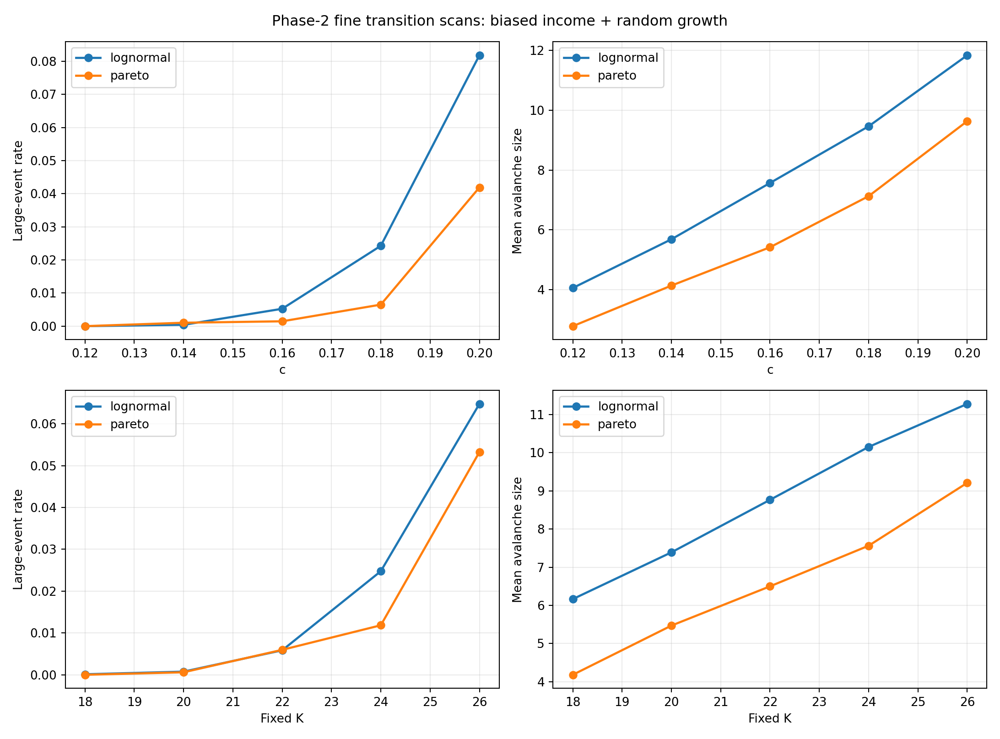
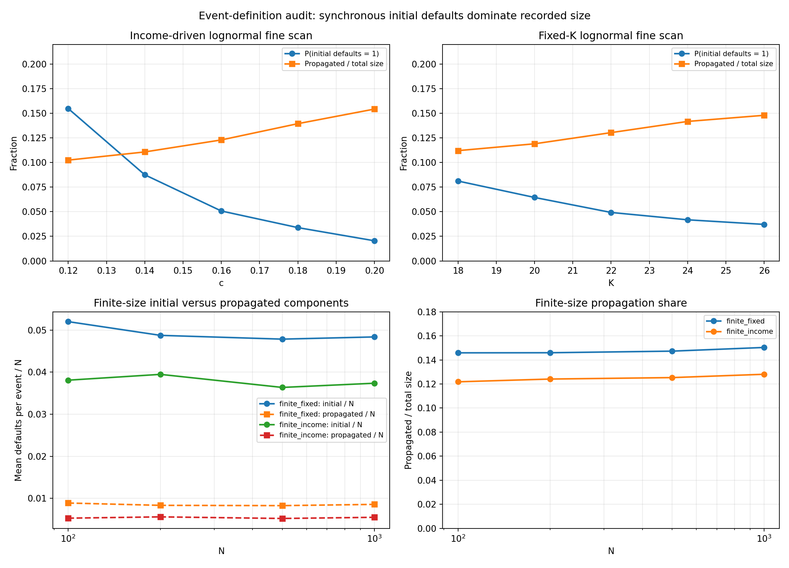
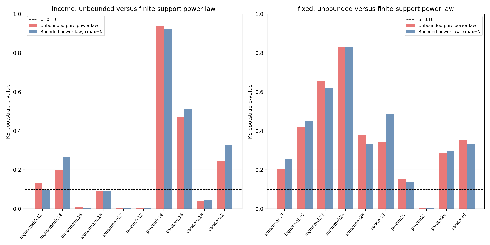
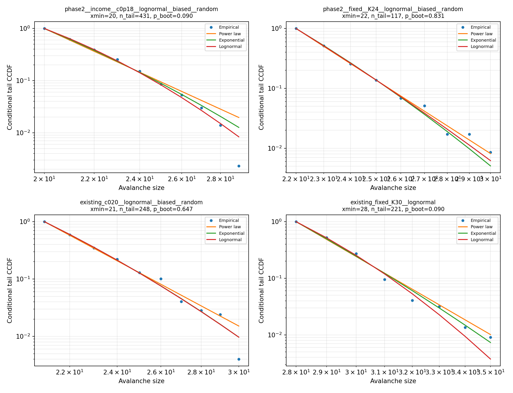
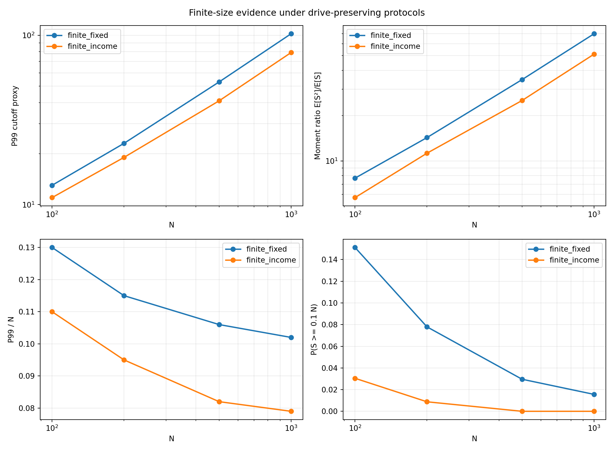
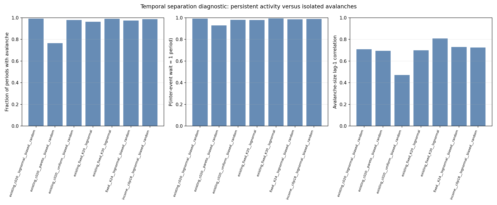
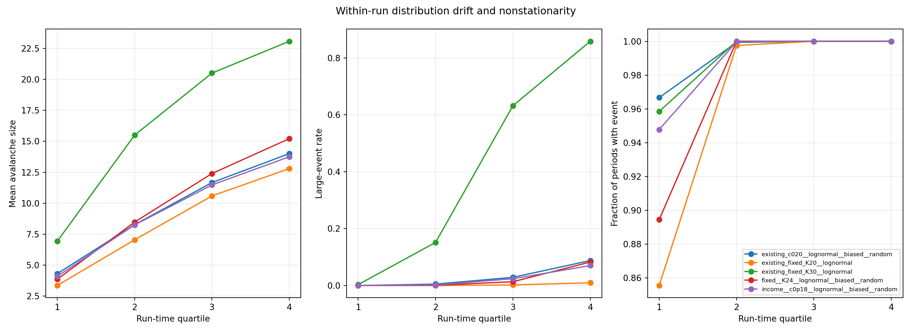

# 信贷网络严格 SOC 证据报告：离散尾部、有限尺寸、时间分离与长期退化

生成时间：2026-06-04 12:52:05 CST；严格统计最终修订：2026-06-04 13:14:55 CST  
实验版本：`credit_soc_phase2_strict_soc_20260604_v1`

## 1. 结论边界

本报告区分四种不能混用的结论：

1. **出现大级联**：一次 avalanche 的违约节点数达到人为阈值 `0.10 * N`。
2. **出现重尾**：较大 avalanche 比指数尾部更常见，但不要求严格幂律。
3. **出现级联转变或过载交叉**：控制参数变化时，级联规模或频率快速上升。
4. **严格 SOC**：系统在没有精细调参的慢驱动条件下进入统计稳定的临界态，avalanche 彼此有时间分离，尾部与幂律相容，且存在可信的有限尺寸标度。

本报告的严格判据不允许仅凭 log-log 图近似直线、单个 `alpha`、单个参数点或 pooled event 拟合宣布 SOC。

## 2. 模型框架与变量定义

### 2.1 存量状态与网络

系统包含 `N` 个个体节点。对个体 `i`：

```text
C_i,t = cash，期末现金
E_ij,t = 个体 i 贷给个体 j 的未清算单位信贷暴露
A_i,t = sum_j(E_ij,t)，贷款资产
D_i,t = sum_j(E_ji,t)，债务负债
W_i,t = C_i,t + A_i,t - D_i,t，净资产
```

一次成功的微观信贷尝试只新增 1 单位暴露。贷款人现金减少 1、贷款资产增加 1；借款人现金增加 1、债务负债增加 1，因此信贷建立本身不改变双方净资产。

### 2.2 两层时间尺度、`c` 与 `K_t`

一个 `time_step` 至多尝试新增 1 单位信贷。多个 `time_step` 构成一个 `period`；流量结算、违约检查和整次级联只在 `period_end` 发生。

收入内生协议使用：

```text
K_t = round(c * Y_(t-1))
```

- `Y_(t-1)`：上一期全系统总收入。
- `K_t`：第 `t` 期在下一次 `period_end` 前计划执行的单位信贷尝试批量。
- `c`：上一期总收入转换为下一期计划信贷尝试批量的无量纲系数。

`c` **不是**单笔冲击规模，也不是与检查间隔独立的纯驱动率。由于当前模型只在 `period_end` 检查违约，提高 `c` 会同时改变信贷尝试批量和两次流量结算/违约检查之间的累积区间。

固定窗口协议直接令 `K_t=K`。为避免有限尺寸扫描中固定绝对 `K` 改变人均驱动，本报告使用固定 `K/N=0.14`，并用收入内生 `c=0.18` 做第二组有限尺寸对照。

### 2.3 流量、收入分配与 avalanche

期末先支付投资支出，再支付消费支出；总支出重新分配为总收入。本文聚焦：

- 初始本金：`lognormal` 与 `pareto`；
- 收入分配：`biased`，按正净资产加 floor 分配；
- 信贷增长：`random`；
- avalanche 协议：`continue_after_avalanche`；
- 会计校验：所有新增实验均开启 `validate_accounting=True`。

一次记录的 avalanche 是一个 `period_end` 内由初始违约集合触发并传播完成的级联。本文定义：

```text
initial_default_count = period_end 流量结算后、传播开始前同时满足违约条件的节点数
propagated_default_count = collapse_size - initial_default_count
collapse_size = initial_default_count + propagated_default_count
```

一次全体节点的期末流量结算可以同时产生多个 initial defaults，因此记录的一次 avalanche **不一定由单一微观触发**。即使固定 `K=1`，系统仍会在 `period_end` 对全体节点统一结算。`collapse_size` 天然满足 `1 <= collapse_size <= N`，但不能未经拆解就等同于单触发 SOC avalanche size。

## 3. 严格统计量定义与局限

### 3.1 `xmin`、`alpha` 与 KS bootstrap

- `xmin`：进入尾部拟合的最小 avalanche size，由候选值中最小化 Kolmogorov-Smirnov 距离者自动选择。
- `alpha`：离散幂律尾部指数。无界纯幂律假设为  
  `P(X=x | X>=xmin) = x^(-alpha) / zeta(alpha, xmin)`。
- KS：经验尾部 CDF 与拟合模型 CDF 的最大距离。
- KS bootstrap：按拟合模型生成合成尾部、重采样经验 body，并在每个 bootstrap 样本上重新选择 `xmin`。较小 p 值表示可拒绝该幂律假设。

因为 `collapse_size <= N`，本报告同时拟合显式有限支持 `[xmin, N]` 的 bounded power law。bounded power law 与数据相容只说明有限支持幂律形状可描述该区间，不能单独证明严格 SOC。

本报告的严格 `alpha` 是对自动选择 `xmin` 后的整数尾部做离散 MLE 得到的指数，和旧框架报告中固定 `xmin=2` 的连续 Pareto 初筛不是同一个统计量，不能直接比较或替换。

### 3.2 替代分布与 Vuong 比较

同一 `xmin` 尾部上比较：

- 无界离散 power law；
- shifted discrete exponential；
- 取整并按 `X>=xmin` 条件化的 lognormal。

本文报告 `R = log L_powerlaw - log L_alternative`：

- `R > 0`：power law 的似然更高；
- `R < 0`：替代分布的似然更高；
- Vuong p 值用于描述非嵌套模型差异，但由于事件存在强序列相关，不能按 iid 样本解释为最终 SOC 证明。

### 3.3 cutoff、矩与有限尺寸

本文把 P99、最大值和矩比 `E[S^2]/E[S]` 作为有限尺寸 cutoff/规模增长的描述量。cutoff 指尾部被有限系统规模截断的特征尺度，不等同于自动存在幂律。

只有在保持可比驱动协议时，cutoff 或矩随 `N` 增长才可作为有限尺寸证据。本报告使用：

- 固定人均批量：`K/N=0.14`；
- 收入内生对照：`c=0.18`，因初始总收入与 `N` 成比例。

四个系统尺寸只能显示增长趋势，不能可靠确定普适临界指数。

### 3.4 时间分离、序列依赖与非平稳性

严格慢驱动 SOC 通常要求 avalanche 之间具有清晰时间分离。本文额外分析：

- event-period fraction：发生 avalanche 的 period 比例；
- `P(wait=1)`：相邻 avalanche 只间隔 1 个 period 的比例；
- avalanche size 的 lag-1 相关；
- run 内四个时间分位的均值、大事件率和事件期占比。

其中 lag-1 是把每个 run 内相邻事件对汇总后的 pooled adjacent-event 相关；四分位统计也是 pooled event/window 描述，不是独立-run 显著性检验。高 event occupancy 或 `P(wait=1)` 本身不能单独排除 SOC；本文只把它们作为强依赖和批量活动诊断，并与 `K>1` 的检查前批量加载、lag-1 相关、分布漂移、重复违约、退化终态、替代尾部和 initial-default 广延增长联合解释。

## 4. 实验协议

### 4.1 新增细扫

| 实验族 | 参数 | 场景 | 重复数 | 最大 period |
| --- | --- | --- | ---: | ---: |
| 收入内生细扫 | `c=0.12/0.14/0.16/0.18/0.20` | lognormal/pareto + biased + random | 每场景 60 | 300 |
| 固定窗口细扫 | `K=18/20/22/24/26` | lognormal/pareto + biased + random | 每场景 60 | 300 |
| 有限尺寸固定人均驱动 | `N=100/200/500/1000`，`K/N=0.14` | lognormal + biased + random | 每尺寸 30 | 250 |
| 有限尺寸收入内生 | `N=100/200/500/1000`，`c=0.18` | lognormal + biased + random | 每尺寸 30 | 250 |

完整参数、28 个场景、1440 个 run、种子范围、命令和时间戳记录在：

- `results/credit_soc_phase2_strict_soc_20260604_v1/sweep_metadata.json`
- `results/credit_soc_phase2_strict_soc_20260604_v1/sweep_summary.csv`

### 4.2 现有关键证据复用

严格尾部和时间分析还复用：

- `results/credit_soc_continue_income_c020_random_focus_20260604_v1`
- `results/credit_soc_fixedK_sweep_20260604_v1`

现有结果审计表位于：

- `results/credit_soc_phase2_strict_soc_20260604_v1/existing_result_audit.csv`

## 5. 新增实验结果

新增实验共完成 1440 个独立 seed run、420000 个 period 和 368042 个 avalanche 事件。所有 1440 个 run 均记录 `validate_accounting=True`，未出现会计校验失败。全部新实验中有 672 个 run 至少出现过一次 10% 阈值大事件，但该总体比例混合了不同协议和参数，不能作为单一临界概率解释。

### 5.1 收入内生 `c` 细扫

| `c` | 初始本金 | run 大事件率及 95% Wilson CI | 事件级大事件率 | 平均规模 | P99 | 最大规模 |
| ---: | --- | ---: | ---: | ---: | ---: | ---: |
| 0.12 | lognormal | 0.000 [0.000, 0.060] | 0.0000 | 4.06 | 11 | 17 |
| 0.12 | pareto | 0.000 [0.000, 0.060] | 0.0000 | 2.78 | 10 | 16 |
| 0.14 | lognormal | 0.067 [0.026, 0.159] | 0.0004 | 5.69 | 15 | 24 |
| 0.14 | pareto | 0.050 [0.017, 0.137] | 0.0010 | 4.14 | 16 | 24 |
| 0.16 | lognormal | 0.383 [0.271, 0.510] | 0.0052 | 7.57 | 18 | 29 |
| 0.16 | pareto | 0.067 [0.026, 0.159] | 0.0015 | 5.42 | 17 | 24 |
| 0.18 | lognormal | 0.733 [0.610, 0.829] | 0.0243 | 9.46 | 21 | 29 |
| 0.18 | pareto | 0.533 [0.409, 0.654] | 0.0065 | 7.13 | 19 | 26 |
| 0.20 | lognormal | 0.983 [0.911, 0.997] | 0.0818 | 11.84 | 24 | 33 |
| 0.20 | pareto | 0.983 [0.911, 0.997] | 0.0419 | 9.63 | 22 | 30 |

结果支持 `c≈0.14-0.20` 内存在宽而随机的级联交叉区，而不是一个由当前重复数可定位的尖锐临界点。lognormal 通常比 pareto 更早进入大事件区，但 pareto 在 `c=0.20` 也达到 0.983 的 run 级大事件率，说明旧 60-run `c=0.20` 结果中的较低 pareto 比例具有明显 seed/时长敏感性。

大事件不是由第一期较大的 `K_1=cY_0` 直接触发。新实验中：

- `c=0.18` lognormal 大事件中位 period 为 253，中位事件期 `K_t=26`，范围 20-29；
- `c=0.20` lognormal 大事件中位 period 为 249.5，中位事件期 `K_t=27`，范围 20-35；
- `c=0.20` lognormal 大/小事件的级联前活跃信贷中位数分别为 587/828。

这说明大事件主要出现在系统长期演化后的低 `K_t`、较低活跃信贷状态，而不是初始高批量信贷冲击阶段。

### 5.2 固定 `K` 细扫

| `K` | 初始本金 | run 大事件率及 95% Wilson CI | 事件级大事件率 | 平均规模 | P99 | 最大规模 |
| ---: | --- | ---: | ---: | ---: | ---: | ---: |
| 18 | lognormal | 0.033 [0.009, 0.114] | 0.0001 | 6.17 | 14 | 21 |
| 18 | pareto | 0.000 [0.000, 0.060] | 0.0000 | 4.18 | 13 | 19 |
| 20 | lognormal | 0.217 [0.131, 0.336] | 0.0008 | 7.39 | 17 | 23 |
| 20 | pareto | 0.067 [0.026, 0.159] | 0.0006 | 5.47 | 15 | 23 |
| 22 | lognormal | 0.717 [0.592, 0.815] | 0.0059 | 8.77 | 19 | 25 |
| 22 | pareto | 0.200 [0.118, 0.318] | 0.0060 | 6.50 | 18 | 28 |
| 24 | lognormal | 0.983 [0.911, 0.997] | 0.0248 | 10.15 | 21 | 30 |
| 24 | pareto | 0.567 [0.441, 0.684] | 0.0118 | 7.56 | 20 | 28 |
| 26 | lognormal | 1.000 [0.940, 1.000] | 0.0648 | 11.28 | 23 | 28 |
| 26 | pareto | 0.900 [0.799, 0.953] | 0.0533 | 9.21 | 24 | 31 |

固定窗口同样表现为 `K≈18-26` 内的连续交叉，而不是单一阈值。lognormal 的 run 大事件率在 `K=18/20/22/24/26` 上为 `0.033/0.217/0.717/0.983/1.000`。



### 5.3 单触发与传播拆解

从正式 `avalanche_events.csv` 独立复算后，lognormal 细扫结果为：

| 协议 | 控制值 | `P(initial_default_count=1)` | propagated / total size |
| --- | ---: | ---: | ---: |
| income | `c=0.12` | 0.1549 | 0.1024 |
| income | `c=0.14` | 0.0875 | 0.1107 |
| income | `c=0.16` | 0.0507 | 0.1229 |
| income | `c=0.18` | 0.0338 | 0.1395 |
| income | `c=0.20` | 0.0205 | 0.1543 |
| fixed | `K=18` | 0.0812 | 0.1120 |
| fixed | `K=20` | 0.0645 | 0.1190 |
| fixed | `K=22` | 0.0492 | 0.1304 |
| fixed | `K=24` | 0.0418 | 0.1417 |
| fixed | `K=26` | 0.0371 | 0.1480 |

随着驱动增强，单一 initial default 的事件概率降至 2%-4%，传播新增仍只占总规模约 10%-16%。因此多数记录事件是 `period_end` 多源同步初始违约加较小传播增量，而不是单一微观触发后产生宽级联。



## 6. 严格尾部拟合

### 6.1 pooled 尾部结果

39 个新旧关键 series 中：

- 26 个 series 在 `p>=0.10` 下不能拒绝无界纯离散 power law；
- 13 个 series 在 `p<0.10` 下拒绝无界纯离散 power law；
- 21 个 series 的 exponential、10 个 series 的 lognormal 在描述性 Vuong `p<0.10` 下优于 power law。

对 20 个新增 `N=200` 细扫场景：

- 收入内生：5/10 不能拒绝，5/10 拒绝；7/10 的 exponential、5/10 的 lognormal 在描述性 `p<0.10` 下更优。
- 固定 `K`：9/10 不能拒绝，1/10 拒绝；5/10 的 exponential、1/10 的 lognormal 在描述性 `p<0.10` 下更优。

不能拒绝 power law 的场景为：

- 收入内生：`c=0.12 lognormal`、`c=0.14 lognormal/pareto`、`c=0.16 pareto`、`c=0.20 pareto`；
- 固定窗口：除 `K=22 pareto` 外的其余 9 个场景。

可以拒绝 power law 的场景为：

- 收入内生：`c=0.12 pareto`、`c=0.16 lognormal`、`c=0.18 lognormal/pareto`、`c=0.20 lognormal`；
- 固定窗口：`K=22 pareto`。

“不拒绝”不等于支持严格幂律。最终实现把 `alpha` 搜索上界提高到 50，39 个拟合均未触边；自动 `xmin` 下 pooled `alpha` 约为 4.95-27.57，尾段通常短且下降很陡。`c=0.18 lognormal` 的 pure power-law bootstrap 已修正为 `p=0.0896`，同时 exponential 和 lognormal 分别以 `R=-3.83, p=0.000829` 和 `R=-4.84, p=0.0411` 优于 power law。

### 6.2 有限支持与 per-seed 稳健性

显式使用 `[xmin,N]` 的 bounded power law 没有实质改变结论：39 个 series 中 27 个不拒绝、12 个拒绝；新增收入内生场景为 4/10 不拒绝、6/10 拒绝，固定窗口为 9/10 不拒绝、1/10 拒绝。

每个独立 seed 的拟合进一步显示没有稳定的普适指数：

- 收入内生 lognormal 的 per-seed `alpha` 中位数随 `c=0.12→0.20` 从 6.15 上升到 10.40；
- 固定窗口 lognormal 的 per-seed `alpha` 中位数随 `K=18→26` 从 6.69 上升到 9.90；
- 固定人均驱动有限尺寸场景随 `N=100→1000` 从 7.23 上升到 15.17，收入内生有限尺寸场景从 6.32 上升到 13.89。

因此，pooled 尾部的“不拒绝”主要表示某个短且陡的尾段可被幂律近似描述，不构成跨 seed、跨参数或跨尺寸稳定的 scale-free 证据。





## 7. 有限尺寸证据

| 协议 | `N` | `K` | 每 run 事件数 | 平均规模 | `E[S²]/E[S]` | P99 | P99/N | 最大规模 | 事件级大事件率 |
| --- | ---: | ---: | ---: | ---: | ---: | ---: | ---: | ---: | ---: |
| `K/N=0.14` | 100 | 14 | 237.5 | 6.09 | 7.70 | 13 | 0.130 | 18 | 0.1512 |
| `K/N=0.14` | 200 | 28 | 244.3 | 11.41 | 14.31 | 23 | 0.115 | 29 | 0.0779 |
| `K/N=0.14` | 500 | 70 | 249.1 | 28.05 | 34.69 | 53 | 0.106 | 67 | 0.0296 |
| `K/N=0.14` | 1000 | 140 | 249.7 | 56.91 | 69.84 | 102 | 0.102 | 114 | 0.0156 |
| `c=0.18` | 100 | 100* | 233.1 | 4.34 | 5.72 | 11 | 0.110 | 15 | 0.0305 |
| `c=0.18` | 200 | 100* | 246.9 | 9.01 | 11.27 | 19 | 0.095 | 25 | 0.0088 |
| `c=0.18` | 500 | 100* | 249.8 | 20.78 | 25.21 | 41 | 0.082 | 47 | 0.0000 |
| `c=0.18` | 1000 | 100* | 250.0 | 42.84 | 51.14 | 79 | 0.079 | 89 | 0.0000 |

`*`：收入内生场景中的元数据字段 `fixed_period_length_steps=100` 不参与模拟，实际 `K_t=round(cY_(t-1))`。

保持驱动可比后，绝对 cutoff 与矩确实随 `N` 增长：

- `K/N=0.14`：平均规模、矩比、P99 的 log-log 斜率分别为 0.972、0.959、0.897；
- `c=0.18`：对应斜率为 0.984、0.941、0.854；
- 两个协议的二阶矩斜率约为 1.93。

这构成“绝对记录事件尺度随系统增大”的直接证据，但不能单独识别严格 SOC。拆解结果进一步给出：

| 协议 | `N` | mean initial / `N` | mean propagated / `N` | propagated / total size |
| --- | ---: | ---: | ---: | ---: |
| `K/N=0.14` | 100 | 0.0520 | 0.00888 | 0.1459 |
| `K/N=0.14` | 200 | 0.0487 | 0.00833 | 0.1460 |
| `K/N=0.14` | 500 | 0.0478 | 0.00826 | 0.1473 |
| `K/N=0.14` | 1000 | 0.0484 | 0.00856 | 0.1504 |
| `c=0.18` | 100 | 0.0381 | 0.00528 | 0.1218 |
| `c=0.18` | 200 | 0.0395 | 0.00559 | 0.1241 |
| `c=0.18` | 500 | 0.0364 | 0.00521 | 0.1253 |
| `c=0.18` | 1000 | 0.0374 | 0.00549 | 0.1281 |

两个分量各自除以 `N` 后基本稳定，但传播只占总规模约 12%-15%。因此近线性的绝对规模增长主要由 `period_end` 同步 initial defaults 的广延增长主导，而不是传播分支趋近临界。与此同时，P99/N 在 `K/N=0.14` 下从 0.130 降到 0.102，在 `c=0.18` 下从 0.110 降到 0.079，10% 人为阈值事件率也随 `N` 快速下降；每 run 约有 233-250 个事件，而最大 period 只有 250。



## 8. 时间分离、非平稳性与长期行为

### 8.1 Avalanche 不具时间分离

| 场景 | event-period fraction | `P(wait=1)` | size lag-1 相关 |
| --- | ---: | ---: | ---: |
| income `c=0.12` lognormal | 0.9231 | 0.9398 | 0.4395 |
| income `c=0.18` lognormal | 0.9869 | 0.9888 | 0.7244 |
| income `c=0.20` lognormal | 0.9943 | 0.9945 | 0.7474 |
| fixed `K=20` lognormal | 0.9597 | 0.9744 | 0.6438 |
| fixed `K=24` lognormal | 0.9736 | 0.9848 | 0.7301 |
| fixed `K=26` lognormal | 0.9778 | 0.9855 | 0.7612 |
| finite fixed `N=1000,K=140` | 0.9989 | 0.9996 | 0.9434 |
| finite income `N=1000,c=0.18` | 1.0000 | 1.0000 | 0.9084 |

高参数和大尺寸场景中，记录事件几乎每个 period 都发生，连续事件规模高度相关。高 occupancy 不是独立反证；在这里它与 `K>1` 检查前批量加载、低单触发率、正 lag-1 和下述非平稳漂移共同表明 pooled event 不是独立平稳样本。

### 8.2 分布随 run 时间持续漂移

以新增 lognormal 场景为例：

- income `c=0.18`：Q1-Q4 平均规模 `4.10/8.24/11.47/13.75`，大事件率 `0/0.0020/0.0238/0.0700`；
- income `c=0.20`：平均规模 `5.25/10.70/14.42/16.82`，大事件率 `0.0005/0.0133/0.0893/0.2222`；
- fixed `K=24`：平均规模 `3.86/8.47/12.40/15.21`，大事件率 `0/0.0007/0.0133/0.0824`；
- fixed `K=26`：平均规模 `4.30/9.60/13.80/16.79`，大事件率 `0/0.0044/0.0493/0.1996`。

因此 pooled event 分布混合了明显不同的早期与晚期状态，不满足平稳尾部的基本解释前提。

### 8.3 1000-period 长期证据

协调器完成的独立 1000-period、每场景 5-run 会计校验实验显示，在最后 250 periods：

- 大事件率：fixed `K=20` 为 0.196，fixed `K=30` 为 0.962，income `c=0.18` 为 0.399，income `c=0.20` 为 0.614；
- avalanche 基本每期发生；
- 最终净资产 Gini 约为 0.97-0.99；
- 平均活跃信贷分别退化到约 185/102/151/120。

该长期证据说明 200-300 period 细扫观察到的是向持续失败/过载吸引子的有限时长交叉，而不是已经达到平稳的稀有 avalanche 临界态。





## 9. 严格 SOC 判定

### 9.1 支持的结论

- 当前模型明确存在随 `c` 或固定 `K` 增大而增强的宽随机级联转变。
- 多个场景存在比简单小事件背景更宽的 avalanche size 分布。
- 保持可比驱动后，绝对记录事件 cutoff 和矩随 `N` 显著增长，但拆解显示主要来自同步初始违约的广延增长。
- 初始本金分布改变转变位置和级联规模，lognormal 通常更早进入高风险状态。

### 9.2 不支持严格 SOC 的直接证据

1. **事件不是通常的单触发 avalanche**：单触发概率随驱动降至 2%-4%，传播仅占总规模约 10%-16%，多数事件由多源同步初始违约主导。
2. **纯幂律缺乏稳健性**：39 个关键 series 中 13 个拒绝 pure power law；exponential 或 lognormal 在多组场景中描述性更优。
3. **指数不普适**：自动 `xmin` 的离散-tail `alpha` 很陡，在 4.95-27.57 间随参数、seed 和 `N` 系统变化；这与旧固定 `xmin=2` 连续-Pareto 初筛不同。
4. **有限支持修正不改变判定**：bounded power law 没有系统性改变结论。
5. **有限尺寸增长不是传播临界证据**：近线性总规模主要由同步 initial defaults 的广延增长主导，传播仅占约 12%-15%。
6. **联合依赖证据**：高 occupancy/短等待与 `K>1` 批量、低单触发率及 lag-1 相关共同表明 pooled event 不能视为 iid 样本；occupancy 本身不作单独反证。
7. **明显非平稳和长期退化**：级联规模与大事件率从 Q1 到 Q4 持续上升；1000-period 对照进入高 Gini、低活跃信贷、持续失败的过载吸引子。

### 9.3 最终判定

**当前模型与协议不支持严格 SOC。最符合全部证据的解释是：系统存在有限时长的宽随机级联交叉，随后趋向非平稳、强相关、几乎每期发生 avalanche 的持续失败/过载状态。**

部分 pooled 尾部在 KS bootstrap 中不能拒绝幂律，记录事件的有限尺寸 cutoff 也随 `N` 增长，但这些证据无法克服事件定义由多源同步违约主导、传播占比低、强依赖、非平稳、替代分布更优、指数不普适和长期退化的联合证据。若后续要重新检验严格 SOC，需要先建立单触发或可识别触发集合、可验证平稳窗口和彼此分离的 avalanche，再进行 run/block bootstrap 与传播分量的有限尺寸 collapse。

## 10. 证据文件

- 新实验 run：`results/credit_soc_phase2_strict_soc_20260604_v1/run_summary.csv`
- 新实验 avalanche：`results/credit_soc_phase2_strict_soc_20260604_v1/avalanche_events.csv`
- 最终严格尾部：`results/credit_soc_phase2_strict_soc_20260604_v1/analysis_final_v5/strict_tail_fits.csv`
- per-seed 稳健性：`results/credit_soc_phase2_strict_soc_20260604_v1/analysis_final_v5/per_seed_tail_fits.csv`
- 有限尺寸：`results/credit_soc_phase2_strict_soc_20260604_v1/analysis_final_v5/finite_size_summary.csv`
- 事件触发拆解：`results/credit_soc_phase2_strict_soc_20260604_v1/analysis_final_v5/event_trigger_decomposition.csv`
- 有限尺寸 initial/propagated 拆解：`results/credit_soc_phase2_strict_soc_20260604_v1/analysis_final_v5/finite_size_initial_vs_propagated.csv`
- 时间分离：`results/credit_soc_phase2_strict_soc_20260604_v1/analysis_final_v5/temporal_separation_summary.csv`
- 时间窗口漂移：`results/credit_soc_phase2_strict_soc_20260604_v1/analysis_final_v5/time_window_summary.csv`
- 完整分析元数据：`results/credit_soc_phase2_strict_soc_20260604_v1/analysis_final_v5/analysis_metadata.json`
- 最终方法审计：`results/credit_soc_phase2_strict_soc_20260604_v1/method_audit_final_v4.md`

根目录首版分析、`analysis_alpha50_v2/` 和 `analysis_final_allxmin_v3/` 均为保留的中间/已取代产物；正式引用应使用 `analysis_final_v5/`。
