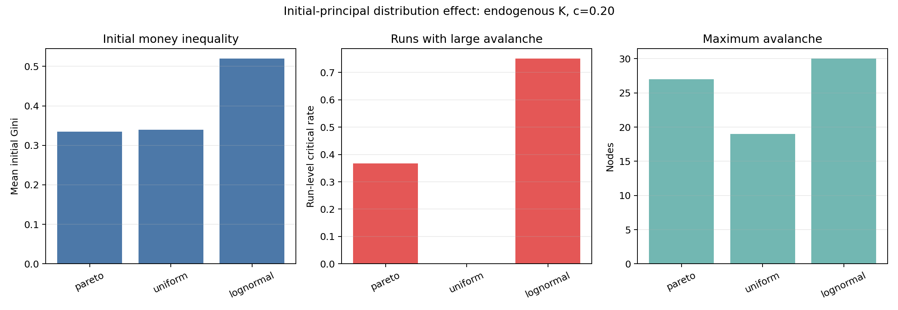
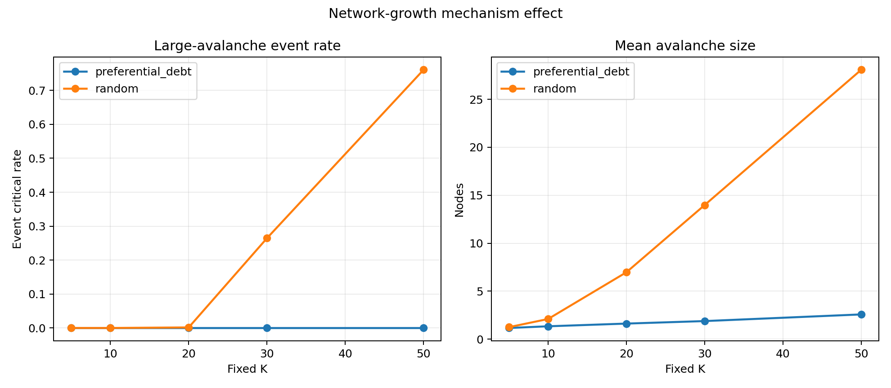
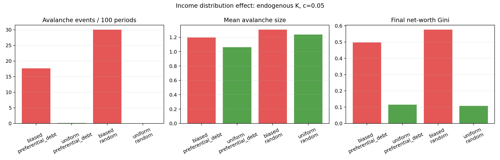
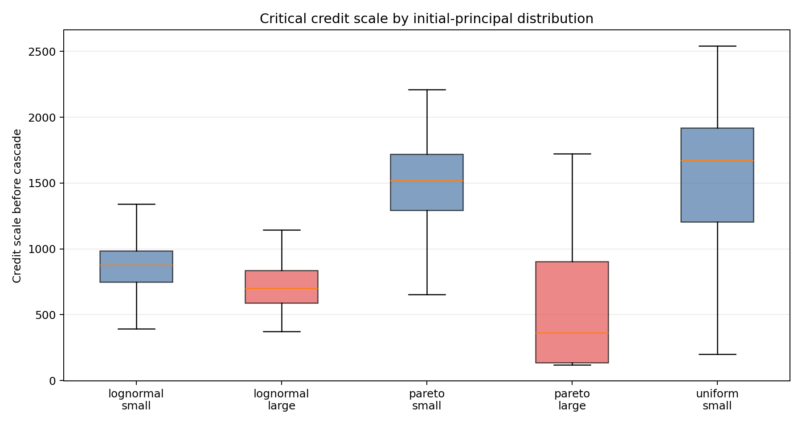
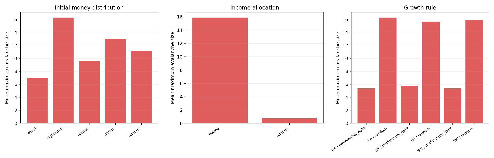
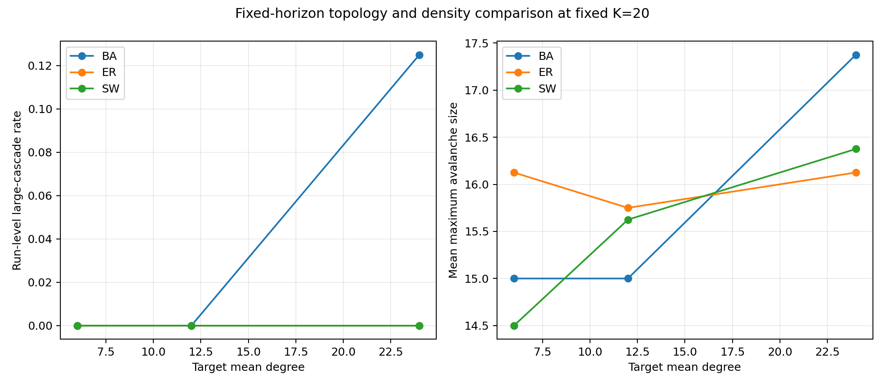

# 信贷网络自组织临界详细分析报告 v2：基于 project.md 框架

更新时间：2026-06-04 12:46:01 CST

## 1. 报告目的

本报告严格按照 `/data/WYC/class/creditNet/project.md` 的问题框架，对当前信贷网络自组织临界实验进行机制解释、结果分类和证据审计。

本版在旧版实验结果和图片基础上，重点补充模型框架与变量口径审计。凡是报告中使用的“驱动强度”“时期长度”“信贷规模”“大崩塌”“临界事件”等术语，均在第 2 节给出可对应到代码字段的准确定义。

报告重点回答：

1. 存量资产负债表与流量收入支出如何共同驱动风险积累？
2. 初始本金分布如何影响临界信贷规模和级联规模？
3. 网络增长机制如何影响级联传播？
4. 收入分配机制如何影响净资产分化和系统脆弱性？
5. 当前结果是否足以说明存在自组织临界或幂律？
6. `project.md` 中哪些设定已经实现，哪些仍需补充？

本报告的主要证据来自 2026-06-04 新协议实验：

- 1500 个有效 run；
- 254752 个 avalanche 事件；
- 33292 个达到 10% 节点阈值的大 avalanche；
- 固定 `K=5/10/20/30/50` 扫描；
- 收入内生 `K_t=round(c * 上一期总收入)` 的 `c=0.02/0.05/0.10/0.20` 扫描；
- `c=0.20 + biased收入 + random增长` 的 180-run 聚焦确认。

详细数据和补充图表位于：

- `/data/WYC/class/creditNet/results/credit_soc_project_framework_analysis_20260604_v1`
- `/data/WYC/class/creditNet/results/credit_soc_fixedK_sweep_20260604_v1`
- `/data/WYC/class/creditNet/results/credit_soc_income_c_sweep_20260604_v1`
- `/data/WYC/class/creditNet/results/credit_soc_continue_income_c020_random_focus_20260604_v1`

### v2 证据边界更新

本报告主体保留旧版 200-400 period 实验结果与图片，以便解释各变量的作用。但截至 2026-06-04 12:46:01 CST，第二阶段预审计已发现：高风险基线协议中的 avalanche 接近每期发生，事件规模具有明显时间相关和非平稳漂移；1000-period 小样本长程审计进一步显示系统趋向低活跃信贷、高净资产不平等和重复违约的持续失败状态。因此，正文中的“转变”“稳定出现大 avalanche”和重尾结果应解释为有限时域级联现象，不能单独证明严格 SOC 或平稳临界态。

## 2. project.md 框架与当前实现的对应关系

| project.md 模块 | 当前实现 | 实验覆盖 | 当前状态 |
| --- | --- | --- | --- |
| 个体节点 | 每个节点持有现金、贷款资产、债务负债、净资产 | 所有实验 | 已实现 |
| 存量资产负债表 | `net_worth = cash + loan_assets - debt_liabilities` | 所有实验 | 已实现 |
| 货币流量 | 支出减少现金，收入分配增加现金 | 所有实验 | 已实现 |
| 消费支出 | `a * max(net_worth, 0) + b * last_income`，随机舍入并受现金约束 | 旧主实验固定；第二阶段已完成温和 a/b 网格 | 已实现，首批因素扫描已完成 |
| 投资支出 | 当期成功借入资金作为 period_end 投资支出目标，实际支出受现金约束 | 所有新协议实验 | 已实现，但可能小于当期借入量 |
| 总收入等于总支出 | 支出总量通过 multinomial 重新分配为收入 | 所有实验 | 已实现 |
| 随机收入分配 | 每个节点等概率获得每单位收入 | `uniform` 场景 | 已实现 |
| 偏好收入分配 | 按正净资产加 floor 分配收入 | `biased` 场景 | 已实现 |
| 单位信贷边 | 每个 time_step 尝试新增 1 单位信贷暴露 | 所有新协议实验 | 已实现，尝试可能失败 |
| 贷款人本金约束 | 贷款人现金必须至少为 1 | 所有实验 | 已实现 |
| time_step + period | 一个 period 包含多个单位信贷 time_step | 固定K和收入内生K实验 | 已实现 |
| period_end 检查 | 每期末统一做流量结算、违约判断和级联 | 所有新协议实验 | 已实现 |
| 首次违约即重启 | `stop_on_first_default` | 旧基线和 sanity check | 已实现 |
| avalanche后继续增长 | `continue_after_avalanche` | 2026-06-04 主实验 | 已实现 |
| 级联失效 | 债务人违约后债权人贷款资产减记，净资产转负则继续传播 | 所有实验 | 已实现 |
| 本金分布比较 | equal/uniform/normal/lognormal/pareto | 新协议重点比较 uniform/lognormal/pareto | 部分完成 |
| 稀疏/密集、SW、BA | 固定无向机会图约束实际有向带权信贷增长 | 第二阶段 ER/BA/SW、平均度 6/12/24 共 248 runs | 扩展实现和首批固定时域扫描已完成 |
| 还款和债务消失 | 正常还款、到期、利息 | 尚无 | 未实现 |
| 严格幂律检验 | 自动 xmin、KS、替代分布比较与有限尺寸检查 | 第二阶段独立分支 | 正在完成与审计 |

### 2.1 当前模型的一句话定义

当前模型是一个离散时间、带权有向信贷暴露网络：主体之间以每个 time_step 至多 1 单位的速度建立信贷暴露；多个 time_step 构成一个 period；每个 period 末统一完成投资支出、消费支出、收入再分配、违约检查和瞬时级联清算。

一个完整 period 的顺序为：

```text
上一期总收入 Y_(t-1)
-> 计算本期计划time_step数 K_t
-> 逐步尝试发放 K_t 个单位信贷
-> period_end先支付投资支出，再支付消费支出
-> 将总支出作为总收入重新分配
-> 检查净资产 W_i,t < 0
-> 在本期末完成整次avalanche清算
-> 进入下一period
```

这里不存在“一个实验轮次只做一次结算”的设定。一个 run 会连续经历最多 `max_periods` 个 period；在 `continue_after_avalanche` 协议下，单次 avalanche 完成后同一个 run 继续演化。

结果中“级联发生在第 1 期”表示系统已经先执行第一期计划的 `K_1` 个信贷尝试，再在第一次 `period_end` 完成流量结算和违约检查，并在该期末发现级联。它不表示级联发生在第 1 个 time_step。例如 `c=0.20` 的主实验中，第一期通常计划先尝试 200 个单位信贷。

### 2.1.1 一页式模型框架

当前基线模型可以压缩为以下闭环：

```text
外生参数与随机种子
N, 初始本金分布, a, b, c或固定K, 收入分配规则, 增长规则, 清算规则, seed
        |
        v
期初状态
现金C、贷款资产A、债务D、暴露矩阵E、上一期收入Y_(t-1)
        |
        v
计划驱动批量
收入内生：K_t = round(c * Y_(t-1))；固定窗口：K_t = K
        |
        v
逐个执行至多K_t次单位信贷尝试
成功一次：贷款人现金-1/资产+1，借款人现金+1/负债+1，E_ij+1
        |
        v
period_end流量结算
先实际投资支出，再实际消费支出；总支出S_t重新分配为总收入Y_t
        |
        v
违约检查与瞬时级联
W_i,t = C_i,t + A_i,t - D_i,t < default_threshold
        |
        v
记录事件；按协议停止或清算后进入下一period
```

这个闭环有一个关键机制含义：**单位信贷建立本身不改变借贷双方净资产**。贷款人只是把现金换成贷款资产，借款人同时增加现金和等额债务。因此，在基线模型中，负净资产主要由期末支出和收入重新分配产生；信贷增长的作用是改变期末结算前的总暴露和损失传播网络。

### 2.1.2 变量分为三类

| 类型 | 代表变量 | 是否随 run 演化 | 是否直接改变模型 |
| --- | --- | ---: | ---: |
| 外生参数/实验控制量 | `N, a, b, c, K, default_threshold, collapse_threshold_fraction` | 否 | 是；但分类阈值只改变标签 |
| 内生状态与流量 | `C_i,t, E_ij,t, A_i,t, D_i,t, W_i,t, Y_i,t, B_i,t, K_t` | 是 | 是 |
| 结果统计与诊断量 | `collapse_size, critical_event, Gini, CCDF, alpha, xmin` | 由轨迹计算 | 通常否 |

这一区分很重要：`critical_event` 名称中虽然有 “critical”，但它只是达到人工规模阈值的结果标签；`alpha` 和 `xmin` 是尾部统计量；二者都不参与模型内的违约传播。

### 2.1.3 “驱动强度 c”到底是什么

报告中的“驱动强度 `c`”是便于叙述的简称，代码字段为 `investment_income_propensity`。它更准确的名称应是**上一期收入到下一期计划信贷尝试批量的转换系数**：

```text
K_t = round(c * Y_(t-1))
```

- `Y_(t-1)` 是上一期全系统实际总收入；
- `K_t` 是本期计划执行的单位信贷尝试数；
- `c` 不改变每笔信贷的 1 单位规模；
- `c` 不直接改变净资产、收入分配概率或违约阈值；
- `c` 不保证实际成功发放 `K_t` 单位信贷，也不等于实际投资支出；
- 固定 `K` 实验中，`c` 虽可能留在元数据中，但完全不参与模拟。

严格按量纲说，`c` 是“计划信贷尝试数/上一期收入单位”。由于模型将 1 个货币单位、1 个信贷单位和 1 次单位尝试统一归一化，实验中可把它当作无量纲比例。它不是传统连续时间模型中的纯外生加载速度，也不是单笔压力冲击。

在当前协议中，流量结算和违约检查都只发生在 `period_end`。所以提高 `c` 会同时增加：

1. 下一期计划信贷尝试数；
2. 期末流量结算前形成的总暴露批量；
3. 一次统一清算时可能连接到的损失传播路径。

因此，报告中的“`c` 效应”是信贷驱动与结算/检查批量的联合效应，不能直接解释成已经识别出的纯驱动速度效应。第二阶段机制消融专门用于分离这些作用。

### 2.2 存量状态、网络方向和会计恒等式

对节点 `i`，当前实现使用以下状态量：

| 符号/字段 | 定义 |
| --- | --- |
| `C_i,t` / `cash` | 个体 `i` 持有的现金 |
| `E_ij,t` / `exposure[i,j]` | 个体 `i` 贷给个体 `j` 的未清算信贷单位数 |
| `A_i,t` / `loan_assets` | 贷款资产，`A_i,t = sum_j(E_ij,t)` |
| `D_i,t` / `debt_liabilities` | 债务负债，`D_i,t = sum_j(E_ji,t)` |
| `W_i,t` / `net_worth` | 净资产，`W_i,t = C_i,t + A_i,t - D_i,t` |

`E_ij,t` 是带权有向暴露矩阵，而不是二值邻接矩阵。同一贷款人和借款人之间可以多次新增单位信贷，因此：

- 一个成功 time_step 新增 1 单位暴露；
- 它不一定新增一条此前不存在的唯一连边；
- 当前报告中的“活跃信贷规模”是 `sum_ij(E_ij,t)`，不是唯一边数量。

成功发放一单位信贷时：

```text
贷款人i：C_i -= 1，A_i += 1
借款人j：C_j += 1，D_j += 1
暴露矩阵：E_ij += 1
```

该动作不改变双方净资产，也不改变系统总现金。所有收入分配也只是将当期支出重新分配回主体现金，因此当前模型在一个 run 内保持：

```text
sum_i(C_i,t) = 初始总现金
sum_i(A_i,t) = sum_i(D_i,t)
sum_i(W_i,t) = 初始总现金
```

系统风险来自个体间净资产和暴露分布，而不是系统总净资产减少。

### 2.2.1 流量变量与一期内的四种信贷量

| 符号/字段 | 定义 |
| --- | --- |
| `Y_i,t` / `last_income` | 节点 `i` 在第 `t` 期获得的收入 |
| `Y_t` / `total_income` | 第 `t` 期全系统总收入，严格等于当期实际总支出 |
| `B_i,t` / `borrowed_this_period` | 节点 `i` 本期成功借入的单位信贷数 |
| `P_i,t` / `planned_consumption` | 随机舍入后的计划消费 |
| `I_i,t` / `investment_spending` | 节点 `i` 本期实际投资支出 |
| `X_i,t` / `consumption_spending` | 节点 `i` 本期实际消费支出 |
| `S_t` / `total_spending` | `sum_i(I_i,t + X_i,t)`，并有 `Y_t=S_t` |

一个 period 内还必须区分四个名字相近但数值不一定相同的量：

| 量 | 字段 | 准确定义 |
| --- | --- | --- |
| 计划信贷尝试数 | `period_length_steps = K_t` | 期初计划执行多少个 time_step |
| 实际信贷尝试数 | 当期 `attempted`，累计 `time_steps_completed` | 实际进入过多少次尝试循环 |
| 成功发放量 | 当期 `issued_credit`，累计 `total_credit_issued` | 成功新增的单位信贷暴露数 |
| 失败尝试量 | `failed_credit_events` | 已实际记录的失败尝试数 |

若没有现金至少为 1 的贷款人，基线实现会记录当前失败并提前结束本期后续尝试，而不会把所有未执行的剩余计划步数都记为失败。因此通常有：

```text
成功发放量 <= 实际尝试数 <= 计划尝试数K_t
实际投资支出 <= 成功借入量
当前活跃信贷 <= 累计成功发放量
```

最后一个不等式来自级联清算会移除既有暴露。计划驱动、实际尝试、成功发放、投资支出和当前信贷存量不能互换。

### 2.3 核心参数表

| 参数 | 当前含义 | 主实验取值或范围 | 是否直接参与当前模拟 |
| --- | --- | --- | --- |
| `N` / `n_nodes` | 节点数 | 200 | 是 |
| `M` / `runs` | 每个场景独立重复 run 数 | 20 或 60 | 否；它控制采样精度，不改变单个 run 的机制 |
| `seed` | 控制初始本金抽样、信贷对象选择、消费随机舍入和收入多项分配的随机种子 | 每个 run 独立 | 是；用于复现随机轨迹 |
| `mean_initial_money` | 初始本金分布的目标均值 | 20 | 是 |
| `money_distribution` | 初始本金分布类型 | uniform、lognormal、pareto 等 | 是 |
| `a` / `consumption_wealth_propensity` | 正净资产转化为计划消费的比例 | 0.02 | 是 |
| `b` / `consumption_income_propensity` | 上一期收入转化为计划消费的比例 | 0.20 | 是 |
| `c` / `investment_income_propensity` | 上一期总收入转化为下一期计划信贷尝试批量的系数；不是单笔冲击或实际投资支出比例 | 0.02、0.05、0.10、0.20 | 仅收入内生 `K_t` 实验生效 |
| `K_t` / `period_length_steps` | 第 `t` 期计划包含的 time_step 数 | 收入内生或固定 | 是 |
| `period_length_rule` | `K_t` 使用收入内生公式还是固定值 | `income` 或 `fixed` | 是 |
| `fixed_period_length_steps` | 固定时期长度 `K` | 5、10、20、30、50 | 仅固定 `K` 实验生效 |
| `initial_income_per_capita` | 第一期开始前的每人参考收入；代码先按每人四舍五入为整数 | 5 | 是，但不注入现金 |
| `income_distribution_rule` | 收入按均匀概率或净资产偏好分配 | `uniform` 或 `biased` | 是 |
| `growth_rule` | 贷款人和借款人的选择规则 | 重点为 `random`、`preferential_debt` | 是 |
| `f` / `income_bias_floor` | biased 收入和偏好选择中的基础权重 | 1 | 是 |
| `default_threshold` | 违约净资产阈值 | 0，判定条件为严格 `< 0` | 是 |
| `default_check_mode` | 在哪个时间尺度检查违约 | 当前只实现 `period_end` | 是 |
| `collapse_threshold_fraction` | 大 avalanche 分类阈值 | 0.10 | 只影响分类，不影响传播 |
| `max_periods` | 单个 run 的最大 period 数 | 聚焦实验 200，主要扫描 400 | 是 |
| `max_time_steps` | 单个 run 的累计尝试步数期末软上限；完整 period 后才检查，最后一期可越过设定值 | 0，表示不单独限制 | 是 |
| `wipe_defaulted_assets` | 是否清除违约节点持有的贷款资产 | `True` | 是 |
| `validate_accounting` | 是否每期运行会计恒等式检查 | sanity check 开启，大规模实验为速度关闭 | 只影响校验，不改变机制 |
| `avalanche_protocol` | 首次级联停止或级联后继续 | 主实验为 `continue_after_avalanche` | 是 |
| `keep_period_history` | 是否保存逐 period 诊断记录 | 仅部分首个 run 开启 | 否，只改变输出 |

固定 `K` 实验的元数据中仍保存 `c=0.20`，但由于 `period_length_rule=fixed`，该 `c` 不参与模拟。相反，收入内生实验元数据中的 `fixed_period_length_steps=100` 也不生效。

`income_bias_floor` 这个名称容易造成误解：它不仅用于 biased 收入分配，也在部分偏好借款人选择规则中作为基础权重使用。`validate_accounting` 只控制是否逐期执行现金守恒、暴露行列和资产负债一致性断言，不改变经济机制。

### 2.4 初始本金分布的具体生成方式

所有本金均舍入为非负整数。当前代码中的五种分布不是只有名称不同，其参数化方式如下：

| 分布 | 当前实现 |
| --- | --- |
| `equal` | 每个节点均为 `round(mean_initial_money)` |
| `uniform` | 在整数区间 `[0, 2 * mean_initial_money]` 上均匀抽样 |
| `normal` | 均值为目标均值、标准差为目标均值的 0.5 倍，负值截断为 0 |
| `lognormal` | `sigma=1`，调整 `mu` 使理论均值接近目标均值 |
| `pareto` | `alpha=2`，每个样本批次按样本均值重新缩放到目标均值 |

除 `equal` 外，每个 run 的实际初始总现金会因抽样和整数舍入略有变化，但该 run 内总现金保持不变。

### 2.5 `a`、`b`、`c` 和收入分配的完整公式

对第 `t` 期，计划消费为：

```text
planned_consumption_i,t
    = a * max(W_i,t, 0) + b * max(Y_i,t-1, 0)
```

`a` 与 `b` 都是无量纲的个体计划消费倾向：当前 `a=0.02` 表示把正净资产的 2% 纳入计划消费，`b=0.20` 表示把上一期个体收入的 20% 纳入计划消费。由于之后还有随机舍入和现金约束，实际消费不保证严格等于这两个比例对应的金额。

这里的 `W_i,t` 具体指本期信贷增长完成后、期末支出开始前的净资产；`Y_i,t-1` 是上一期实际分配到该节点的收入。计划消费先逐节点做随机舍入，再受现金约束。

计划消费经过随机舍入成为整数。期末先支付投资，再支付消费：

```text
investment_spending_i,t = min(投资支付前现金, B_i,t)
consumption_spending_i,t = min(投资支付后剩余现金, planned_consumption_i,t)
```

其中 `B_i,t` 是节点 `i` 当期成功借入的单位信贷量。模型目标是让当期借款成为当期投资支出，但如果借款人在 period 内又把现金贷出，期末可用现金可能不足，因此实际投资支出可以小于 `B_i,t`。

全系统第 `t` 期总支出和总收入满足：

```text
S_t = sum_i(investment_spending_i,t + consumption_spending_i,t)
Y_t = S_t
```

然后使用多项分布，将 `Y_t` 个整数收入单位分配给节点：

```text
uniform: p_i,t = 1/N
biased:  p_i,t = [max(W_i,t, 0) + f] / sum_j[max(W_j,t, 0) + f]
```

biased 规则使用支出之后、收入分配之前的净资产计算权重。`f=1` 使净资产为零或负数的节点仍具有非零收入概率。

### 2.6 `c` 的准确定义：它控制什么，不控制什么

收入内生时期长度使用：

```text
K_t = round(c * Y_(t-1))
```

因此，`c` 是“上一期全系统总收入转化为下一期计划信贷尝试步数的转换系数”。在统一单位归一化下可把它作为无量纲比例；严格按量纲说，它表示“计划信贷尝试数/上一期收入单位”。它：

- 控制下一期计划进行多少次单位信贷尝试；
- 不改变每笔信贷的 1 单位规模；
- 不直接改变消费公式；
- 不直接改变收入分配概率；
- 在固定 `K` 实验中完全不生效。

当前常用 `N=200`、`initial_income_per_capita=5`，所以初始化时：

```text
Y_0 = 200 * 5 = 1000
```

由此得到第一期计划长度：

| c | K_1 | 第一时期含义 |
| ---: | ---: | --- |
| 0.02 | 20 | period_end 前计划尝试 20 个单位信贷 |
| 0.05 | 50 | period_end 前计划尝试 50 个单位信贷 |
| 0.10 | 100 | period_end 前计划尝试 100 个单位信贷 |
| 0.20 | 200 | period_end 前计划尝试 200 个单位信贷 |

第一期以后，`Y_t` 由实际投资支出和消费支出共同决定，所以 `K_(t+1)` 会内生变化。收入下降会降低下一期 `K`，形成负反馈。

需要特别说明：由于当前模型只在 `period_end` 完成流量结算和违约检查，增大 `c` 不仅增加信贷驱动量，也增加下一次流量结算与违约检查前形成的信贷批量。因此报告中的“`c` 效应”同时包含：

1. 更强的信贷增长驱动；
2. 更大的期内暴露累积批量；
3. 在统一检查前积累更多潜在脆弱暴露。

单位信贷建立不改变净资产，所以只在每个 credit time_step 后增加检查、但不结算流量，是一个理论上不应产生新违约的负对照。若要真正分离“纯驱动批量”与“结算/检查频率”，需要固定宏观总驱动并改变流量结算频率，或固定结算频率并单独改变成功发放概率。

### 2.7 信贷选择规则、违约清算和节点后续状态

当前代码支持五种增长规则，其中本轮重点实验比较 `random` 与 `preferential_debt`：

| 规则 | 贷款人选择 | 借款人选择 |
| --- | --- | --- |
| `random` | 在现金至少为 1 的节点中等概率选择 | 在贷款人以外的节点中等概率选择 |
| `borrower_preferential` | 在现金至少为 1 的节点中等概率选择 | 按 period 开始时的正净资产加 `f=1` 加权选择 |
| `preferential` | 在现金至少为 1 的节点中按现金量加权选择 | 按 period 开始时的正净资产加 `f=1` 加权选择 |
| `borrower_debt_preferential` | 在现金至少为 1 的节点中等概率选择 | 按每个 time_step 更新后的债务量加 `f=1` 加权选择 |
| `preferential_debt` | 在现金至少为 1 的节点中按现金量加权选择 | 按当前债务量加 `f=1` 的权重选择 |

正净资产偏好规则的借款人权重在一个 period 开始时计算并在该 period 内保持不变；债务偏好规则会在每个 time_step 根据当前债务重新计算借款人权重。

每个 time_step 是一次信贷尝试。若没有现金至少为 1 的贷款人，该尝试失败，并可能提前结束当期后续尝试。因此 `K_t` 是计划步数，不保证等于成功发放量。

在 `period_end` 收入分配后，严格按照 `W_i,t < 0` 识别初始违约节点。级联清算执行：

1. 清除违约债务人的所有入边，债权人同步减记贷款资产；
2. 重新计算所有未违约节点净资产；
3. 将新出现的负净资产节点加入级联；
4. 因 `wipe_defaulted_assets=True`，同时清除违约节点持有的贷款资产，并解除对应借款人的负债；
5. 直到没有新违约节点。

级联不直接扣减现金。在 `continue_after_avalanche` 协议中，违约节点清算后不永久退出，下一期仍可获得收入、借款或贷款。因此 `total_collapse_size` 可以重复统计同一节点在不同 period 的再次违约。

### 2.8 结果字段与统计口径

这里使用三个层级：

- `scenario`：一组固定参数与机制的组合；
- `run`：某个 scenario 下使用一个独立随机种子的完整演化轨迹；
- `avalanche event`：某个 run 中一次 `period_end` 触发并完成的级联。

| 字段 | 准确定义 |
| --- | --- |
| `scenario_id` | 一组固定参数与机制的可读标识；不参与模拟 |
| `run_index` / `seed` | 场景内重复编号与复现随机轨迹的种子 |
| `avalanche_index` | 一个 run 内 avalanche 事件的先后编号 |
| `params` | run 使用的完整参数快照；写入汇总表时会展开为各参数列 |
| `period_length_steps` | 本期计划执行的 time_step 数，即 `K_t` |
| `time_steps_completed` | 实际执行过的信贷尝试步数；不一定等于成功发放量 |
| `periods_completed` | run 实际完成的 period 数 |
| `first_cascade_period` | 首次 avalanche 所在 period；若无 avalanche，当前实现为 0 |
| `first_cascade_time_steps` | 首次 avalanche 前累计实际尝试数；若无 avalanche，当前实现为 0 |
| `last_period_length_steps` / `max_period_length_steps` | 最后一期和整个 run 最大的计划 `K_t` |
| `total_credit_issued` | 一个 run 内累计成功发放的单位信贷量 |
| `failed_credit_events` | 实际记录的失败尝试数；基线在无可用贷款人时会提前结束当期，未执行的剩余计划步数不全部计入 |
| `credit_scale_before_cascade` | 事件表中为该次级联前活跃信贷暴露总量；run 汇总表中为首次级联前活跃信贷，若无级联则为 run 结束时活跃信贷 |
| `active_credit_after_cascade` | 事件表中为该次级联后的活跃信贷；run 汇总表中为 run 结束时活跃信贷 |
| `initial_default_count` | 期末收入分配后、级联传播前已净资产为负的节点数 |
| `collapse_size` | 事件表中为单次 avalanche 规模；run 汇总表中为该 run 最大 avalanche |
| `max_collapse_size` | run 最大 avalanche；基线 run 汇总中与 `collapse_size` 相同 |
| `total_collapse_size` | 一个 run 中各次 avalanche 规模之和，可重复计入同一节点 |
| `avalanche_count` | 一个 run 中记录的 avalanche 事件数 |
| `collapse_fraction` | `collapse_size / N` |
| `critical_event` | 事件表中为该事件是否达到阈值；run 汇总表中为是否至少发生过一次大事件 |
| `ended_by_default` | 该 run 是否曾发生过违约；在继续协议中不代表 run 当时终止 |
| `initial_total_money` / `final_cash_total` | run 初始抽样现金总量与最终现金总量；基线会计守恒下应相等 |
| `final_active_credit` | run 结束时仍未被清算的活跃信贷暴露总量 |
| `total_income_last_period` | 最后完成 period 的总收入，不是整个 run 的累计收入 |
| `initial_money_gini` / `final_net_worth_gini` | 初始现金和最终净资产的不平等度 |
| `period_history` / `avalanche_history` | 可选逐 period 诊断序列与逐 avalanche 事件序列 |

因此，报告中的“run 级大崩塌率”是至少出现一次大 avalanche 的 run 比例；“事件级大崩塌率”是所有 avalanche 中达到阈值的事件比例。两者不能互换。

`final_net_worth_gini` 使用最终净资产向量计算；如果向量中存在负值，当前 Gini 函数会先整体平移，使最小值变为零，再计算 Gini。因此它适合比较分化程度，但不是唯一可能的负财富 Gini 定义。

`max_time_steps` 容易被误读为严格硬上限。当前代码只在一个完整 period 结束后检查该值，因此最后一个 period 可能使 `time_steps_completed` 超过 `max_time_steps`；它应解释为期末软上限。

基线 `resolve_cascade` 内部返回的 `cascade_steps` 当前只是已处理违约节点数，数值上等于该次 `collapse_size`，不是 avalanche 的传播持续时间或代数。第二阶段动态分支另行使用传播 wave/generation 定义真正的 duration 和 branching ratio。

报告中其余常用统计量的含义为：

- `Gini`：分配不平等指标，通常越接近 0 越均等，越接近 1 越集中；
- `P90`：avalanche 规模的第 90 百分位数；
- `CCDF`：互补累积分布，图中表示 `P(collapse_size >= s)`；
- `xmin`：尾部拟合纳入样本的最小 avalanche 规模；
- `alpha`：当前连续 Pareto 近似下的尾部指数初筛值，不是严格幂律证明；
- “每 100 期事件数”：事件总数除以所有 run 的累计 period 数后乘以 100；
- “稳健出现大级联”：指大级联在多个独立随机种子或重复 run 中反复出现，而不是只出现一次；它仍不等于统计上证明 SOC。

字段名 `critical_event` 只是表示该 avalanche 达到人为设置的 10% 大崩塌阈值，不表示该事件本身已经证明系统处于临界态。

### 2.9 一个 period 的数值化示例

以 `N=200`、`initial_income_per_capita=5`、`c=0.20` 为例：

1. 初始化参考总收入为 `Y_0=200*5=1000`，所以第一期计划长度 `K_1=round(0.20*1000)=200`。
2. 系统依次执行最多 200 次信贷尝试，每次至多新增 1 单位暴露。假设其中成功 198 次，则当期累计成功发放量增加 198，而不是 200。
3. 到第一期末，每个节点先按其当期成功借入量形成投资支出目标，再按 `0.02*正净资产 + 0.20*上一期个体收入` 形成计划消费，并受现金约束实际支付。
4. 假设全系统实际投资与消费支出合计为 850，则第一期总收入严格为 `Y_1=850`，再按照 uniform 或 biased 规则分配给 200 个节点。
5. 收入分配完成后检查 `W_i,1<0`。若出现负净资产节点，则在第一期末完成整次级联。因此“发生在第 1 期”指发生在上述 200 次计划信贷尝试和第一次流量结算之后。
6. 若采用继续协议，则级联清算后进入第二期，并计算 `K_2=round(0.20*850)=170`。

该示例说明了 `c`、`K_t`、成功发放量、实际支出、总收入和 avalanche 之间的先后关系。

### 2.10 第二阶段扩展变量：不要与基线变量混用

第二阶段正在运行显式拓扑和清算机制消融。以下变量用于扩展实验，不属于上述基线 `simulation.py` 的默认机制；本报告后续引用这些结果时将单独标注。

#### 显式拓扑扩展

| 变量 | 准确定义 |
| --- | --- |
| `topology` | `er/ba/sw` 无向交易机会图，只限制哪些主体可成为信贷对手方 |
| `target_mean_degree` | 机会图目标平均度；ER/BA/SW 主对照匹配边数，因此平均度和密度可比 |
| `sw_rewire_probability` | Watts-Strogatz 机会图重连概率 |
| `topology_seed` | 机会图生成随机种子，与主体演化的 `seed` 分离 |
| `topology_density` | 机会图实际边数占所有可能无向边的比例 |
| `topology_clustering` | 机会图平均聚类系数 |
| `topology_degree_cv` | 度标准差除以平均度，用于表示度异质性 |
| `topology_lcc_fraction` | 最大连通分量节点数占比 |
| `topology_lcc_average_path_length` | 最大连通分量内的平均最短路径长度 |

机会图是无向的“可交易约束”，实际贷款仍有方向，暴露矩阵仍是有向、带权且允许同一方向重复累积。`topology` 与 `growth_rule` 不是一回事：前者决定可选对手方集合，后者决定在集合内如何抽取贷款人与借款人。

#### 机制解耦扩展

| 变量 | 准确定义 |
| --- | --- |
| `drive_rule` / `fixed_drive_steps` | 宏观期总驱动使用收入内生规则还是固定计划步数 |
| `max_drive_steps_per_macro` | 每个宏观期执行的最大驱动步数，用于限制极端收入反馈下的计算量 |
| `settlement_mode` | `period_end`、只增加中间检查的 `check_only`，或分批流量结算并检查的 `settle_and_check` |
| `settlement_batches` | 一个宏观期内把总驱动拆成多少个结算批次 |
| `default_check_every_settlements` | 每完成多少次流量结算检查一次违约 |
| `recovery_rate` | 债务人违约时目标回收比例；实际支付还受债务人现有现金约束 |
| `default_node_mode` | 违约清算后节点继续参与、永久退出，或以显式外部现金流重置到初始现金 |

`check_only` 是一个关键负对照：单位信贷建立保持净资产不变，因此只增加中间检查而不进行流量结算，理论上不应产生新的违约。`settle_and_check` 才真正改变负净资产出现和被识别的时机。

## 3. 存量机制分析

### 3.1 个体资产负债表

每个个体的净资产定义为：

```text
net_worth_i = cash_i + loan_assets_i - debt_liabilities_i
```

新增一单位信贷时：

```text
贷款人：cash - 1，loan_assets + 1
借款人：cash + 1，debt_liabilities + 1
```

因此，信贷建立本身不改变双方净资产，只改变资产负债表结构和网络暴露关系。

这意味着模型中的风险不是由“借款动作立即减少净资产”产生，而是由后续投资支出、消费支出、收入分配不均和违约资产减记共同产生。

### 3.2 系统总量守恒与分布风险

当前模型中：

- 全系统现金总量守恒；
- 每条贷款资产对应一条等量债务负债；
- 全系统贷款资产总额与债务负债总额相等；
- 级联清算时，资产与对应负债同时从暴露矩阵中移除。

因此，全系统总净资产主要由初始现金总量决定，模型中的系统性风险主要来自：

1. 净资产在个体之间分配不均；
2. 信用资产暴露的网络结构；
3. 某些个体违约后，债权人的贷款资产被减记；
4. 资产损失沿网络传播。

当前结果印证了这一点：高风险场景的最终净资产 Gini 显著升高，但全系统现金总量并未减少。

### 3.3 当前存量机制的局限

- 没有利息；
- 没有正常还款；
- 没有债务到期；
- 没有抵押物和回收率；
- 没有银行；
- 违约节点完成本次清算后仍可继续参与后续 period；
- 没有显式生产资本，投资支出只表现为现金流出并重新分配为收入。

因此，本模型应解释为“信用暴露与收入分配驱动的简化资产负债表网络”，不能直接等同于完整现实信贷市场。

## 4. 流量机制分析

### 4.1 time_step 与 period

当前新协议严格区分：

```text
1 time_step = 尝试新增 1 单位信贷暴露
1 period = 计划执行 K 或 K_t 个 time_step + 一次期末流量结算与违约检查
```

主协议中：

```text
K_t = round(c * 上一期总收入)
```

若贷款人现金约束无法满足，time_step 尝试可能失败；因此计划步数 `K_t`、实际尝试步数、成功发放量三者需要区分。固定 `K` 实验用于直接控制每次期末检查前的信贷尝试批量，收入内生 `K_t` 实验用于观察流量反馈。

### 4.2 支出与收入反馈

period_end 的处理顺序为：

1. 当期成功借入资金作为投资支出目标，实际支付受现金约束；
2. 消费支出由财富和上一期收入决定；
3. 总支出形成同等总收入；
4. 总收入按照 uniform 或 biased 规则分配；
5. 检查净资产是否为负；
6. 发生级联后进入下一 period。

收入内生 K 形成了重要负反馈：

```text
收入下降
-> 下一期 K_t 下降
-> 新增信贷减少
-> 信用暴露增长放缓
-> 大级联受到抑制
```

该反馈解释了为什么固定 `K=30/50` 会进入高频大 avalanche 状态，而收入内生 `c=0.10` 仍未出现 10% 大 avalanche。

### 4.3 收入到信贷批量转换系数 c 的结果

这里的 `c` 不是单笔贷款规模，也不是直接施加到节点净资产上的冲击。它通过 `K_t=round(c * Y_(t-1))` 决定下一期计划执行多少个单位信贷 time_step。由于违约只在期末检查，较大的 `c` 同时意味着更强的信贷驱动和更大的期内累积批量。

在 biased收入 + random增长主线上：

| c | lognormal大崩塌run率 | pareto大崩塌run率 | uniform大崩塌run率 | 最大avalanche |
| ---: | ---: | ---: | ---: | ---: |
| 0.02 | 0.000 | 0.000 | 0.000 | 3 |
| 0.05 | 0.000 | 0.000 | 0.000 | 8 |
| 0.10 | 0.000 | 0.000 | 0.000 | 15 |
| 0.20 | 0.750 | 0.367 | 0.000 | 30 |

解释：

- `c=0.02/0.05` 属于弱驱动区；
- `c=0.10` 已形成频繁 avalanche，但仍未越过 10% 阈值；
- `c=0.20` 出现明显的大 avalanche 转变；
- `c=0.20` 正好对应 `project.md` 建议的初始值 `1/5`，说明该转换系数在当前模型中会形成高风险信贷批量，而不是温和基线。

这里的“转变”应解释为当前 period_end 批量检查机制下的联合效应，不能直接断言为只由信贷增长速度产生的纯临界点。

证据：

- `results/credit_soc_income_c_sweep_20260604_v1/income_c_sweep_summary.csv`
- `results/credit_soc_income_c_sweep_20260604_v1/critical_rate_by_c.png`
- `results/credit_soc_income_c_sweep_20260604_v1/max_collapse_by_c.png`

{width=88%}

图4-1显示，`c=0.02-0.10` 区间尚未出现达到 10% 节点阈值的大崩塌，而 `c=0.20` 下 lognormal 和 pareto 本金分布的大崩塌 run 率明显跃升，说明收入到信贷批量的转换系数附近存在非线性转变。

{width=88%}

图4-2进一步表明，最大 avalanche 随 `c` 增长而扩大，但不同本金分布跨越大崩塌阈值的能力不同；uniform 分布即使在 `c=0.20` 下也未形成稳定的大崩塌。

## 5. 第一关注点：初始本金分布如何影响临界信贷规模

### 5.1 聚焦实验设置

本节使用：

- `N=200`
- `c=0.20`
- `biased` 收入分配
- `random` 信贷增长
- `continue_after_avalanche`
- 每种本金分布 60 runs
- 每个 run 200 periods

### 5.2 结果

| 本金分布 | 初始Gini | 最终净资产Gini | run级大崩塌率 | 事件级大崩塌率 | 每100期大崩塌数 | 最大avalanche | 首次级联中位期 | 首次级联前信贷规模中位数 |
| --- | ---: | ---: | ---: | ---: | ---: | ---: | ---: | ---: |
| pareto | 0.334 | 0.851 | 0.367 | 0.0069 | 0.525 | 27 | 24 | 923.5 |
| uniform | 0.340 | 0.682 | 0.000 | 0.0000 | 0.000 | 19 | 1 | 200.0 |
| lognormal | 0.519 | 0.885 | 0.750 | 0.0306 | 3.033 | 30 | 1 | 200.0 |

证据：

- `results/credit_soc_project_framework_analysis_20260604_v1/initial_distribution_effect.csv`
- `results/credit_soc_project_framework_analysis_20260604_v1/initial_distribution_effect.png`

{width=95%}

图5-1把初始 Gini、run 级大崩塌率和最大 avalanche 放在同一组对照中。lognormal 分布同时呈现更高的初始不平等与大崩塌风险；pareto 与 uniform 的初始 Gini 接近，但级联结果不同，说明尾部结构不能被单一 Gini 指标替代。

### 5.3 解释

#### 结论一：高初始不平等显著放大大级联风险

lognormal 初始本金的平均 Gini 为 0.519，明显高于 uniform 和 pareto。其结果是：

- 75% 的 run 至少出现一次大 avalanche；
- 每 100 period 平均出现约 3.03 个大 avalanche；
- 最大 avalanche 为 30/200；
- 最终净资产 Gini 升至 0.885。

这说明初始本金不平等会通过后续 biased 收入分配继续放大，形成明显的财富与风险累积。

#### 结论二：Gini 不能单独解释本金分布效应

uniform 与 pareto 的初始 Gini 接近，分别约为 0.340 和 0.334，但结果明显不同：

- uniform 没有达到 10% 大崩塌阈值；
- pareto 有 36.7% 的 run 出现大 avalanche。

因此，影响临界性的不是只有 Gini，还包括：

- 分布尾部形状；
- 极少数高本金节点对贷款能力的影响；
- 大量低本金节点的脆弱程度；
- 信用暴露在不同本金节点之间的组合方式。

#### 结论三：首次小级联时间不等于大级联时间

uniform 和 lognormal 的首次级联中位数都在第 1 period，但只有 lognormal 形成大 avalanche。

这说明“首次出现违约”不是临界性的充分条件。真正需要分析的是长期 avalanche 序列、事件规模分布和大事件频率。

## 6. 第二关注点：网络增长机制如何影响临界信贷规模

### 6.1 当前比较的增长机制

本轮重点比较：

- `random`：贷款人和借款人随机选择；
- `preferential_debt`：贷款人按现金偏好选择，借款人按既有债务规模偏好选择。

需要明确：这属于内生信贷边选择机制，不等同于显式 ER、BA 或 SW 固定机会图。第二阶段现已另行实现显式机会图约束并完成首批固定时域对照；旧版结果中的 `random/preferential_debt` 比较仍只能解释增长规则，不能反推 ER/BA/SW 家族效应。

### 6.2 固定K聚合结果

| K | 增长机制 | 事件级大崩塌率 | 每100期大崩塌数 | 平均avalanche | P90 | 最大avalanche | 最终净资产Gini |
| ---: | --- | ---: | ---: | ---: | ---: | ---: | ---: |
| 5 | random | 0.000 | 0.000 | 1.252 | 2 | 6 | 0.559 |
| 5 | preferential_debt | 0.000 | 0.000 | 1.165 | 2 | 5 | 0.502 |
| 10 | random | 0.000 | 0.000 | 2.101 | 4 | 11 | 0.688 |
| 10 | preferential_debt | 0.000 | 0.000 | 1.341 | 2 | 7 | 0.495 |
| 20 | random | 0.0017 | 0.150 | 6.970 | 13 | 24 | 0.867 |
| 20 | preferential_debt | 0.000 | 0.000 | 1.623 | 3 | 8 | 0.509 |
| 30 | random | 0.2647 | 25.183 | 13.979 | 24 | 35 | 0.933 |
| 30 | preferential_debt | 0.000 | 0.000 | 1.885 | 3 | 11 | 0.528 |
| 50 | random | 0.7608 | 74.272 | 28.077 | 41 | 54 | 0.972 |
| 50 | preferential_debt | 0.000 | 0.000 | 2.579 | 5 | 14 | 0.557 |

证据：

- `results/credit_soc_project_framework_analysis_20260604_v1/growth_rule_effect_fixed_k.csv`
- `results/credit_soc_project_framework_analysis_20260604_v1/growth_rule_effect.png`

{width=95%}

图6-1显示，在相同固定 `K` 下，random 增长的 avalanche 规模和大崩塌事件率随 `K` 快速增加，而 preferential_debt 增长整体保持在较低级联水平。

{width=88%}

图6-2突出显示了 random 增长在 `K=20-30` 附近从稀有大级联向高频大级联的转变；preferential_debt 在当前参数范围内没有出现相同跃迁。

### 6.3 解释

#### 结论一：random增长更容易产生广泛级联

在当前清算规则下，random 增长把信用暴露更广泛地分散到系统中。当一个债务人违约时，资产减记会影响更多不同债权人，从而更容易产生宽范围传播。

#### 结论二：债务集中不必然导致大级联

`preferential_debt` 会形成债务集中，但在当前结果中，其 avalanche 多数较小。可能原因包括：

- 债务集中使损失集中在较少债权关系中；
- 现金较多的节点更常成为贷款人，具有更高净资产缓冲；
- 违约清算会同时移除相应负债，部分节点得到债务解除；
- 当前没有利息和持续偿债压力。

因此，“hub越强，级联越大”在本模型中并不成立。网络结构对级联的影响取决于暴露分散、节点缓冲和清算规则的组合。

#### 结论三：固定K存在明显转变区

- `K=5/10`：低驱动稳定区；
- `K=20`：开始出现稀有大 avalanche，更接近临界边界；
- `K=30/50`：高频大 avalanche，属于持续脆弱或过载区。

因此，后续严格 SOC 检验应优先细扫 `K=18-26`，而不是使用已经过载的 `K=50`。

## 7. 第三关注点：收入分配机制如何影响临界信贷规模

### 7.1 对照实验设置

本节使用收入内生 K、`c=0.05` 的完整矩阵，聚合三种本金分布：

- uniform 收入：每单位收入等概率分配；
- biased 收入：按正净资产加 floor 分配；
- growth rule：random 或 preferential_debt。

### 7.2 结果

| 收入分配 | 增长机制 | 发生过违约的run比例 | 每run平均avalanche数 | 每100期avalanche数 | 平均avalanche | 最大avalanche | 最终净资产Gini | 首次级联前平均信贷规模 |
| --- | --- | ---: | ---: | ---: | ---: | ---: | ---: | ---: |
| biased | preferential_debt | 1.000 | 70.55 | 17.64 | 1.196 | 7 | 0.497 | 131.6 |
| uniform | preferential_debt | 0.400 | 0.53 | 0.13 | 1.063 | 2 | 0.115 | 1375.7 |
| biased | random | 1.000 | 120.17 | 30.04 | 1.305 | 8 | 0.576 | 199.5 |
| uniform | random | 0.267 | 0.35 | 0.09 | 1.238 | 4 | 0.108 | 1640.1 |

证据：

- `results/credit_soc_project_framework_analysis_20260604_v1/income_distribution_effect_c005.csv`
- `results/credit_soc_project_framework_analysis_20260604_v1/income_distribution_effect.png`

{width=95%}

图7-1显示，biased 收入分配显著提高 avalanche 频率并扩大最终净资产不平等；这一效应在 random 和 preferential_debt 两种增长机制下均存在，因此收入分配规则是独立且强烈的脆弱性来源。

### 7.3 解释

#### 结论一：biased收入分配是当前模型中最强的脆弱性放大器

以 random 增长为例：

- biased 收入下，每 100 period 约有 30.04 次 avalanche；
- uniform 收入下，每 100 period 只有约 0.09 次 avalanche；
- biased 收入下最终净资产 Gini 为 0.576；
- uniform 收入下最终净资产 Gini 仅为 0.108。

偏好分配形成：

```text
高净资产
-> 更高收入概率
-> 净资产进一步上升
-> 低净资产节点更难获得收入
-> 支出后更容易净资产转负
-> 违约和级联增加
```

#### 结论二：biased收入显著降低首次级联前信贷规模

random 增长下：

- biased 收入首次级联前平均信贷规模约 199.5；
- uniform 收入约 1640.1。

这说明 biased 收入分配不是让系统积累更多信贷后才崩塌，而是使系统在较低信贷存量下就变得脆弱。

#### 结论三：收入分配影响大于当前两种增长规则差异

在 `c=0.05` 下，从 uniform 切换到 biased 带来的 avalanche 频率变化，远大于从 random 切换到 preferential_debt 的变化。

因此，在当前模型中，流量分配机制比网络增长机制更直接地决定短期违约发生率。

## 8. 信贷网络级联失效分析

### 8.1 级联过程

当 period_end 检测到某节点净资产为负时：

1. 该节点作为债务人的入边被清零；
2. 债权人的贷款资产同步减记；
3. 若债权人净资产因此转负，则继续违约；
4. 若启用 `wipe_defaulted_assets`，违约节点的贷款资产也被清零；
5. 直到不再出现新违约节点。

级联在一个 period_end 内瞬时完成，符合 `project.md` 的简化设定。

### 8.2 大崩塌阈值

当前定义：

```text
critical_event = collapse_size / N >= 0.10
```

在 `N=200` 下，大崩塌阈值为 20 个节点。

该阈值用于实验分类，不是由模型内生推导。后续应增加 5%、10%、20% 阈值敏感性分析。

### 8.3 临界信贷规模并非简单“越高越危险”

在 `c=0.20 + biased + random` 聚焦实验中：

| 本金分布 | 事件类型 | 事件数 | 级联前信贷规模中位数 | 级联发生期中位数 | 平均avalanche |
| --- | --- | ---: | ---: | ---: | ---: |
| lognormal | 小级联 | 11534 | 877 | 99 | 9.22 |
| lognormal | 大级联 | 364 | 702 | 171 | 21.69 |
| pareto | 小级联 | 9126 | 1519 | 123 | 6.44 |
| pareto | 大级联 | 63 | 363 | 181 | 21.25 |
| uniform | 小级联 | 11739 | 1671 | 103 | 5.62 |

证据：

- `results/credit_soc_project_framework_analysis_20260604_v1/critical_credit_scale.csv`
- `results/credit_soc_project_framework_analysis_20260604_v1/critical_credit_scale.png`

{width=88%}

图8-1显示，大级联发生前的活跃信贷规模并不总是高于小级联。尤其在 pareto 场景中，大级联前的信贷规模中位数反而更低，支持“临界信贷规模是状态依赖条件而非单一阈值”的判断。

{width=92%}

图8-2从事件层面展示 avalanche 规模与级联前信贷规模的关系。散点分布说明相似信贷规模下可以出现不同级联规模，网络暴露结构、财富分化和历史级联共同影响最终结果。

重要解释：

- 大级联通常发生得更晚；
- 但大级联发生前的活跃信贷存量不一定更高；
- 多轮小级联会不断破坏网络和清除信贷边；
- 系统可能在活跃信贷存量较低时，因净资产高度分化和暴露结构脆弱而发生大级联。

因此，`credit_scale_before_cascade` 需要与以下指标联合解释：

- 累计 time_step；
- 累计发放信贷量；
- 当前活跃信贷存量；
- 最终净资产 Gini；
- avalanche 历史。

“临界信贷规模”不是单一固定阈值，而是状态依赖的临界条件。

## 9. 自组织临界分析

### 9.1 当前支持的证据

当前结果已展示：

- 单位信贷逐步加入；
- period_end 发生瞬时 avalanche；
- avalanche 后系统继续增长；
- avalanche 规模从单节点事件扩展到数十节点事件，形成较宽的规模范围；
- 固定 K 存在从稳定到过载的转变；
- 收入内生 K 随 `c` 呈现从低风险到高风险的有限时域转变；
- 初始本金、收入分配和增长机制显著改变 avalanche 分布。

### 9.2 尾部初筛

`c=0.20 + biased + random` 聚焦实验使用 `xmin=2` 的连续 Pareto 近似：

| 本金分布 | tail样本数 | alpha初筛 |
| --- | ---: | ---: |
| lognormal | 11597 | 1.58 |
| pareto | 8059 | 1.71 |
| uniform | 11054 | 1.80 |

这些数值说明 avalanche 分布具有较重尾部，但不能直接作为幂律证明。

{width=88%}

图9-1显示三种本金分布的 avalanche 规模均形成长尾，但尾部长度和衰减速度存在差异。该图支持开展严格尾部拟合，但不足以单独证明幂律或 SOC。

{width=95%}

图9-2展示了 avalanche 在 period 轴上的出现方式：系统在级联后继续接受单位信贷驱动，并在后续 period_end 再次发生不同规模的级联。大级联并非只在首次检查时出现，而是嵌入持续增长与清算循环中。

### 9.3 为什么尚不能宣布严格SOC

严格 SOC 结论至少还需要：

1. 自动选择最优 `xmin`；
2. 对幂律拟合做 KS goodness-of-fit；
3. 与 exponential 和 lognormal 做似然比比较；
4. 在不同 `N` 下做有限尺寸标度；
5. 证明临界行为不是由固定过载参数直接造成；
6. 在相近参数邻域重复出现；
7. 对清算规则、阈值和随机种子保持稳健。

当前最合理的表述是：

> 模型已经观察到由驱动强度、初始本金分布、收入分配和网络增长机制共同决定的级联转变，并在部分主协议场景中形成稳定的大 avalanche 和重尾迹象；但严格自组织临界与幂律尚待进一步检验。

## 10. project.md 实验结果分类与讨论

### 10.1 不同本金初始化

已经完成：

- uniform、lognormal、pareto 的新协议重点对照；
- 初始 Gini、最终净资产 Gini、大 avalanche 频率、临界信贷规模对照。

主要结论：

- lognormal 风险最高；
- pareto 次之；
- uniform 未达到当前 10% 阈值；
- 分布形状比单独 Gini 更重要。

尚需完成：

- equal、normal 在新协议下的同规模重复；
- 控制相同 Gini、改变分布形状的实验；
- 控制相同尾部、改变平均本金的实验。

### 10.2 不同支出与收入分配机制

已经完成：

- uniform 与 biased 收入分配对照；
- `c=0.02/0.05/0.10/0.20` 扫描。
- 第二阶段在 `fixed K=20`、240-period 固定时域下完成 `a in {0.01,0.02,0.04}`、`b in {0.10,0.20,0.30}` 温和网格。

主要结论：

- biased 收入显著提高净资产不平等、违约频率和 avalanche 数量；
- uniform 收入具有显著稳定作用；
- `c=0.20` 是当前收入内生 K 主协议的关键高风险区。
- 第二阶段固定时域网格中，提高 `a` 到 0.04 会降低平均事件规模、最大 avalanche 和最终 Gini；`b=0.10-0.30` 未显示稳定严重度效应。

{width=95%}

尚需完成：

- 在更宽参数范围和更长时域下确认 `a/b` 效应；
- 增加收入分配偏好强度参数，而不是只有 uniform/biased 两档；
- 增加投资收益或生产回报机制。

### 10.3 不同网络拓扑结构

已经完成：

- random 与 preferential_debt 内生增长规则对照；
- 固定 K 下的增长机制转变分析。
- 第二阶段完成显式 ER/BA/SW 无向机会图扩展，在平均度 6/12/24 下匹配边数，并记录密度、聚类、度 CV、LCC 和路径长度；首批扫描为 31 场景、248 runs、51,401 个事件。

主要结论：

- random 交叉暴露比当前 preferential_debt 更容易形成广泛级联；
- 债务集中不必然产生更大 avalanche。
- 在匹配平均度 12 后，ER/BA/SW 的平均最大 avalanche 均约为 15-16，当前 8-run 重复下没有稳定家族排序；
- 跨拓扑密度 run，平均度与最大 avalanche 呈弱正相关，但效应较小，不能解释为普遍密度定律；
- 实际有向暴露的 `growth_rule` 效应明显强于无向机会图家族标签。

{width=95%}

以上是统一 240-period 固定时域瞬态比较，不代表长期稳态拓扑排序。

尚需完成：

- 增加每场景重复数并做长时域确认；
- 在变化 `N` 时区分固定平均度与固定密度；
- 增加动态、有向或真实信贷机会图；
- 将事件发生时的动态实际暴露网络结构量写入每个 avalanche 事件。

## 11. 当前结果的稳健性与风险

### 已有稳健性证据

- 使用多个随机种子重复；
- 独立 sanity check 在 `validate_accounting=True` 下通过现金守恒、暴露矩阵与资产负债一致性检查；
- 固定 K 和收入内生 K 两类协议得到一致的驱动强度转变方向；
- lognormal 与 pareto 在 `c=0.20` 下均稳定出现大 avalanche；
- uniform 收入分配在多个 c 下均表现稳定；
- random 与 preferential_debt 差异在多个 K 下持续存在。

### 主要风险

- 当前 10% 大崩塌阈值是人为设定；
- 当前尾部 alpha 使用固定 `xmin=2`；
- 新协议聚焦实验主要使用 `N=200`；
- 违约节点未永久退出系统；
- 没有正常还款；
- 显式 ER/BA/SW 和 `a/b` 首批扫描只有固定 240-period、每场景 8 runs，尚不能外推长期稳态；
- 当前“投资支出”没有产生未来收益，只形成当期收入流。
- `c` 同时改变信贷驱动批量和下一次流量结算/违约检查前形成的暴露批量，尚未与结算频率效应分离。
- 计划信贷步数、成功发放量和实际投资支出可能不同，当前报告主要按实际记录字段分别解释。
- 为提高大规模实验速度，主实验元数据中使用了 `no_validate_accounting=true`，即未在每个 period 执行运行时会计断言；会计机制通过独立 sanity check 验证，但后续关键确认实验应重新开启逐期校验。

## 12. 综合结论

基于 `project.md` 的三个核心关注点，当前实验得到以下结论：

1. **初始本金分布影响临界性。** 高不平等 lognormal 分布显著提高大 avalanche 频率；但 pareto 与 uniform 的差异说明分布形状不能被 Gini 单独替代。
2. **网络增长机制影响级联传播。** 当前 random 增长形成广泛交叉暴露，比 preferential_debt 更容易产生大 avalanche。
3. **收入分配机制是强脆弱性驱动。** biased 收入显著提高净资产分化，使系统在较低信贷存量下就开始违约。
4. **当前批量驱动与 period_end 结算/检查机制下存在有限时域转变区。** 固定 K 在 `K=20` 左右开始出现稀有大 avalanche；收入内生 K 在 `c=0.20` 下多个独立 run 反复越过大 avalanche 阈值，但 `c` 的纯驱动效应尚未与结算/检查批量效应分离，长程状态也并非已确认的平稳临界态。
5. **临界信贷规模是状态依赖的。** 大级联并不总发生在活跃信贷存量最高时，而常发生在长期演化、净资产高度分化和网络多次清算之后。
6. **当前尚未严格证明SOC。** 已观察到级联转变和重尾迹象，但还需要严格统计检验、有限尺寸分析和机制消融。

## 13. 推荐下一阶段

优先级从高到低：

1. 实现严格幂律检验脚本，比较 power-law、exponential、lognormal。
2. 分离 `c` 的信贷驱动效应与 period_end 流量结算/检查批量效应。
3. 细扫收入内生 `c=0.12/0.14/0.16/0.18/0.20`。
4. 细扫固定 `K=18/20/22/24/26`。
5. 扫描 `N=100/200/500/1000`，做有限尺寸标度。
6. 对已完成的显式 ER/BA/SW 和 `a/b` 首批扫描增加重复数、长时域与系统尺寸确认。
7. 增加还款、利息、违约回收率和节点退出/重置机制。

只有在完成严格尾部检验、有限尺寸分析和关键机制消融后，才适合将结论从“存在级联转变和重尾迹象”提升为“存在自组织临界”。
