# timestep尺度信贷网络SOC对照实验报告 v2

生成时间：2026-06-09 13:26:58 CST

## 1. 实验协议

- timestep扫描目录：`results/credit_soc_timestep_scan_20260609_v2/merged`
- 分析目录：`results/credit_soc_timestep_scan_analysis_20260609_v2`
- period_end 对照目录：`/data/WYC/class/creditNet/results/credit_soc_comprehensive_scan_20260608_v1`
- run 数：8000
- avalanche 事件数：4539260
- scenario 数：8000
- 每宏观期微步上限：`max_period_length_steps=500`

本轮保持上一轮完备扫描的场景轴：初始本金分布、收入分配、信贷增长规则、支出机制、网络拓扑和 `c=0.10..0.80`。区别只在事件观测尺度：原协议在 `period_end` 统一结算检查；本协议把一个宏观期的计划 `K_t` 个单位信贷尝试拆成 `K_t` 个微步，每个成功或失败的 credit `time_step` 后立即按 `1/K_t` 缩放结算支出/收入、检查违约，并在下一次信贷增长前完成整次 avalanche 清算。

为使 8000 个场景的全景筛查在有限时间内完成，本轮 v2 对照设置 `max_period_length_steps=500`：理论 `K_t` 仍记录为未截断指标，实际每个宏观期最多执行 500 个 credit 微步。这一上限不会改变单个微步的单位信贷规模，但会限制高 `c`、高支出反馈下的单期计算长度，因此本报告结论应解释为“带 500 微步上限的 timestep 快速全景对照”，不是 120-period、3-seed、无上限长时稳态最终证明。

因此，本报告里的 `event_timestep_rate` 是 avalanche 次数除以实际信贷尝试 time_step 数；`event_period_occupancy` 只是有事件的宏观期占比。SOC 快筛里的非饱和门槛使用 `event_timestep_rate < 0.80`，不再使用 period_end 报告中的 period 占用率。

## 2. 与 period_end 的总体差异

- 同场景平均大级联事件率变化：-0.321
- 同场景平均事件规模比例变化：-0.102

按 `c` 聚合的 timestep 结果：

| c | scenarios | mean_large_event_rate | mean_event_fraction | mean_event_timestep_rate | mean_event_period_occupancy | mean_propagated_share | mean_repeat_default_share |
| --- | --- | --- | --- | --- | --- | --- | --- |
| 0.1 | 1000 | 0 | 0.00551 | 0.01965 | 0.1809 | 0.006929 | 0.1415 |
| 0.2 | 1000 | 0 | 0.006963 | 0.02543 | 0.3529 | 0.01394 | 0.2115 |
| 0.3 | 1000 | 0 | 0.007784 | 0.03736 | 0.5326 | 0.02826 | 0.2968 |
| 0.4 | 1000 | 0 | 0.008263 | 0.05684 | 0.6845 | 0.04052 | 0.3795 |
| 0.5 | 1000 | 0 | 0.008621 | 0.08973 | 0.8081 | 0.05011 | 0.487 |
| 0.6 | 1000 | 0 | 0.008774 | 0.1244 | 0.8872 | 0.05592 | 0.5849 |
| 0.7 | 1000 | 0 | 0.008861 | 0.1529 | 0.9433 | 0.05821 | 0.6682 |
| 0.8 | 1000 | 0 | 0.008899 | 0.1702 | 0.9633 | 0.06024 | 0.7168 |

## 3. 级联失效相图

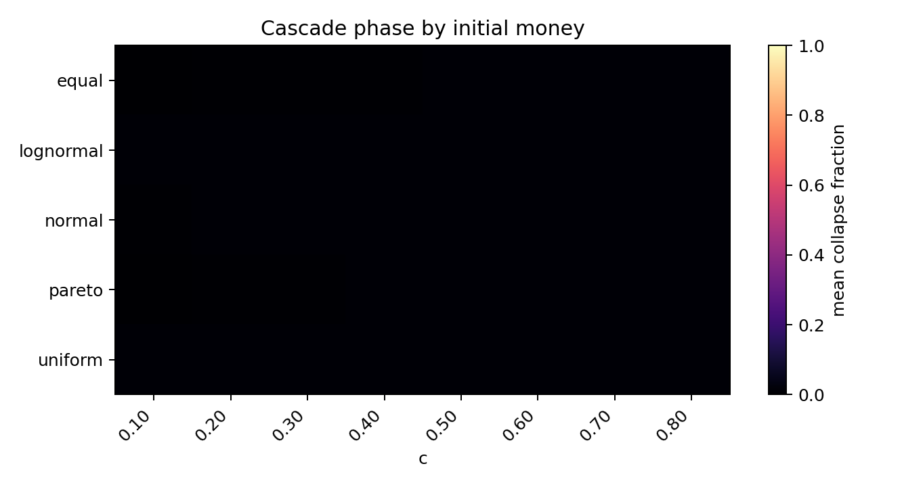

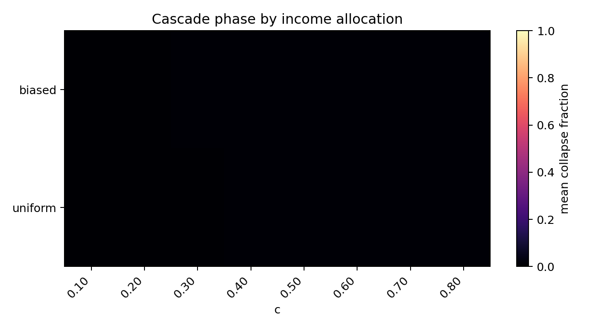

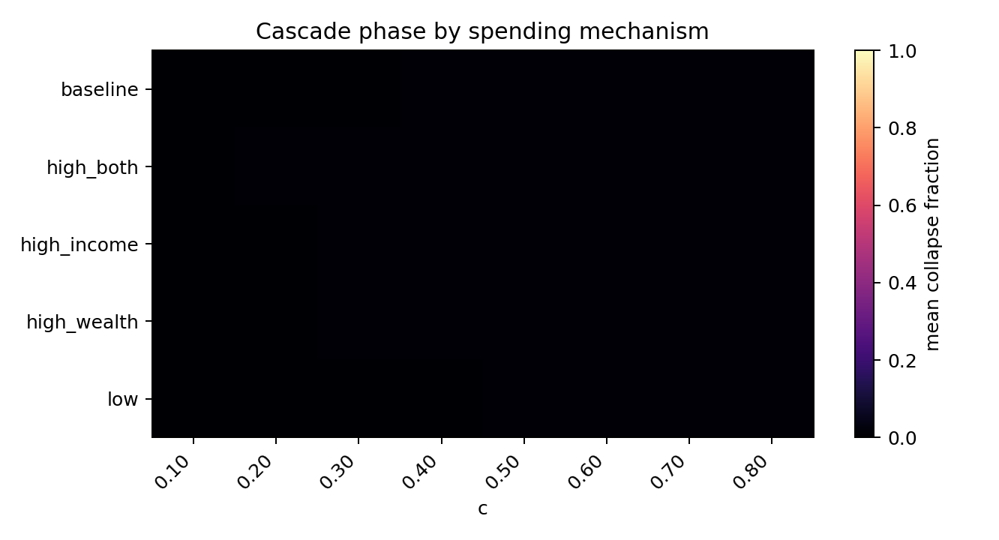

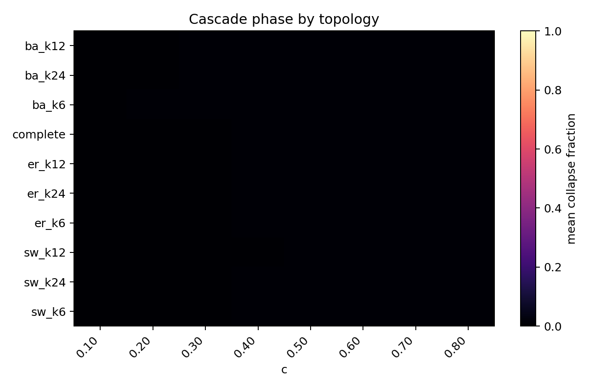

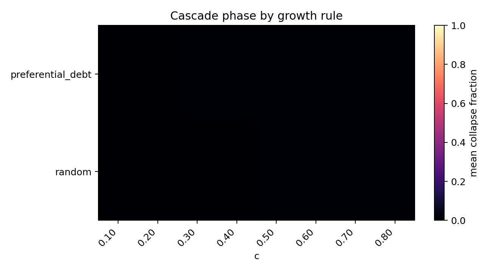

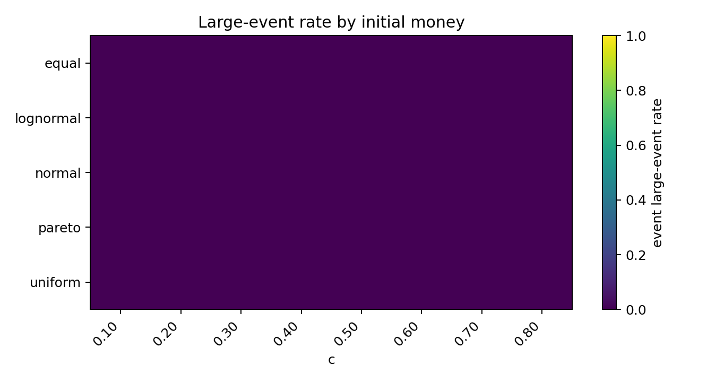

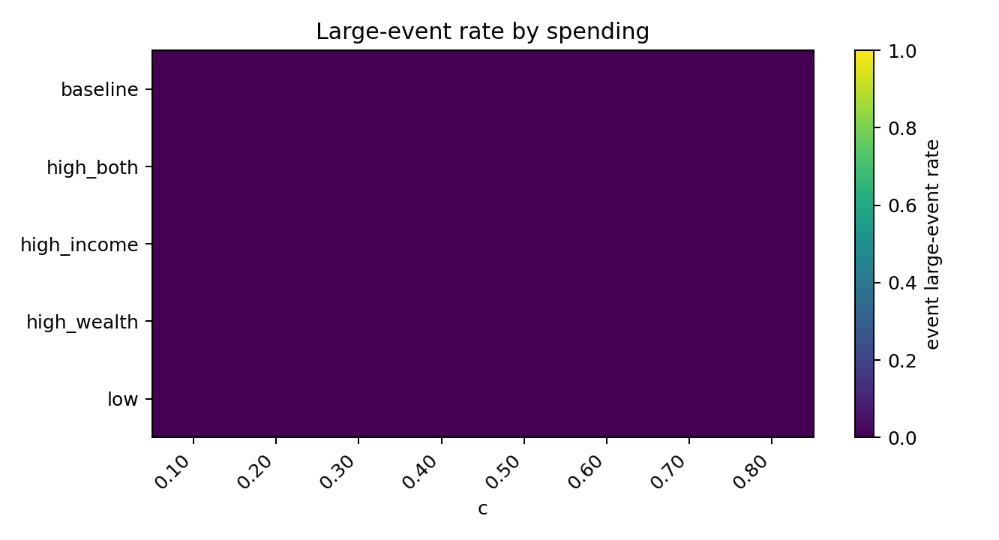

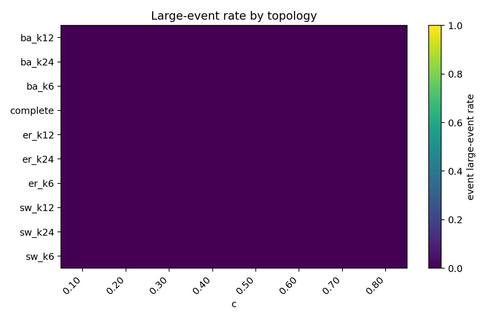

级联规模最高的场景：

| c | money_distribution | income_distribution_rule | growth_rule | spending_label | topology_label | event_large_event_rate | mean_event_fraction | event_timestep_rate | propagated_share_total | mean_repeat_default_share |
| --- | --- | --- | --- | --- | --- | --- | --- | --- | --- | --- |
| 0.1 | lognormal | biased | random | low | er_k12 | 0 | 0.01667 | 0.007634 | 0.5 | 0 |
| 0.1 | pareto | biased | preferential_debt | baseline | ba_k6 | 0 | 0.01667 | 0.004484 | 0.5 | 0 |
| 0.2 | pareto | uniform | preferential_debt | low | sw_k24 | 0 | 0.01667 | 0.003367 | 0.5 | 0 |
| 0.2 | pareto | biased | random | high_income | complete | 0 | 0.01667 | 0.00142 | 0.5 | 0 |
| 0.4 | equal | biased | random | baseline | sw_k6 | 0 | 0.01667 | 0.0006859 | 0.5 | 0 |
| 0.3 | pareto | biased | preferential_debt | low | complete | 0 | 0.01389 | 0.00565 | 0.4 | 0 |
| 0.6 | equal | biased | random | low | ba_k24 | 0 | 0.01364 | 0.005714 | 0.3889 | 0.05556 |
| 0.1 | equal | biased | preferential_debt | high_income | ba_k24 | 0 | 0.0125 | 0.006689 | 0.3333 | 0 |
| 0.1 | pareto | biased | preferential_debt | high_wealth | complete | 0 | 0.0125 | 0.006061 | 0.3333 | 0 |
| 0.2 | normal | uniform | random | high_wealth | ba_k6 | 0 | 0.0125 | 0.004994 | 0.3333 | 0.5 |
| 0.2 | lognormal | uniform | random | baseline | er_k12 | 0 | 0.0125 | 0.003945 | 0.3333 | 0 |
| 0.3 | equal | biased | random | high_wealth | er_k12 | 0 | 0.0125 | 0.001413 | 0.3333 | 0 |
| 0.1 | lognormal | uniform | random | high_income | sw_k6 | 0 | 0.0125 | 0.006826 | 0 | 0 |
| 0.1 | pareto | biased | random | high_both | sw_k24 | 0 | 0.0125 | 0.004283 | 0 | 0 |
| 0.8 | equal | uniform | random | high_wealth | complete | 0 | 0.01167 | 0.000501 | 0.2857 | 0 |
| 0.1 | uniform | uniform | random | high_income | ba_k24 | 0 | 0.01111 | 0.01056 | 0.25 | 0.25 |
| 0.3 | equal | biased | random | high_wealth | ba_k24 | 0 | 0.01111 | 0.006281 | 0.25 | 0 |
| 0.3 | pareto | biased | random | baseline | er_k12 | 0 | 0.01111 | 0.003344 | 0.25 | 0 |
| 0.3 | pareto | biased | preferential_debt | low | er_k24 | 0 | 0.01111 | 0.01198 | 0.25 | 0 |
| 0.4 | equal | uniform | preferential_debt | low | er_k24 | 0 | 0.01111 | 0.00361 | 0.25 | 0 |

## 4. SOC 快筛相图

- 快速候选数：0
- 小尺度尾部候选数（未达到 10%N 尺度门槛）：28
- timestep 近饱和场景数（event_timestep_rate >= 0.80）：42

| gate | passed | total | pass_rate |
| --- | --- | --- | --- |
| gate_event_count | 4758 | 8000 | 0.5948 |
| gate_not_saturated | 7958 | 8000 | 0.9948 |
| gate_has_transition | 0 | 8000 | 0 |
| gate_propagation | 150 | 8000 | 0.01875 |
| gate_tail_plausible | 146 | 8000 | 0.01825 |
| gate_alternative_not_better | 131 | 8000 | 0.01638 |
| gate_scale_range | 0 | 8000 | 0 |
| quick_soc_candidate | 0 | 8000 | 0 |

SOC 快筛分数最高的场景：

| soc_screen_score | quick_soc_candidate | small_tail_candidate | c | money_distribution | income_distribution_rule | growth_rule | spending_label | topology_label | event_large_event_rate | event_timestep_rate | propagated_share_total | bootstrap_p | bounded_bootstrap_p | pl_vs_lognormal_R |
| --- | --- | --- | --- | --- | --- | --- | --- | --- | --- | --- | --- | --- | --- | --- |
| 5 | False | True | 0.4 | equal | biased | preferential_debt | high_wealth | complete | 0 | 0.0184 | 0.25 | 0.6667 | 1 | -0.06076 |
| 5 | False | True | 0.5 | equal | uniform | preferential_debt | high_wealth | complete | 0 | 0.01347 | 0.2308 | 0.5 | 0.3636 | -0.1403 |
| 5 | False | True | 0.8 | equal | uniform | random | baseline | er_k24 | 0 | 0.004108 | 0.2264 | 0.7 | 0.6667 | -0.08617 |
| 5 | False | True | 0.6 | equal | biased | preferential_debt | low | ba_k24 | 0 | 0.0218 | 0.2105 | 0.6 | 0.6 | -0.3248 |
| 5 | False | True | 0.5 | pareto | biased | random | low | complete | 0 | 0.0253 | 0.2093 | 0.2727 | 0.2222 | -0.1862 |
| 5 | False | True | 0.5 | lognormal | uniform | preferential_debt | high_wealth | complete | 0 | 0.02312 | 0.2062 | 0.7 | 0.5455 | -0.335 |
| 5 | False | True | 0.4 | equal | biased | preferential_debt | high_both | complete | 0 | 0.02251 | 0.2051 | 0.09091 | 0.2727 | -0.1561 |
| 5 | False | True | 0.6 | equal | uniform | preferential_debt | high_wealth | complete | 0 | 0.01701 | 0.1984 | 0.7 | 0.6364 | -0.1232 |
| 5 | False | True | 0.4 | pareto | biased | preferential_debt | high_both | complete | 0 | 0.0271 | 0.1898 | 0.9091 | 0.9091 | -0.3434 |
| 5 | False | True | 0.6 | normal | uniform | preferential_debt | baseline | complete | 0 | 0.01714 | 0.1829 | 0.3636 | 0.3636 | -0.6478 |
| 5 | False | True | 0.6 | lognormal | uniform | preferential_debt | high_wealth | complete | 0 | 0.02217 | 0.1753 | 0.8182 | 0.7273 | -0.4704 |
| 5 | False | True | 0.5 | equal | biased | preferential_debt | baseline | complete | 0 | 0.01988 | 0.1724 | 0.7778 | 0.9 | -0.2656 |
| 5 | False | True | 0.8 | normal | uniform | preferential_debt | high_wealth | complete | 0 | 0.02044 | 0.17 | 0.5455 | 0.4545 | -0.9476 |
| 5 | False | True | 0.7 | lognormal | biased | preferential_debt | low | complete | 0 | 0.03699 | 0.1678 | 0.7273 | 0.7273 | -0.1948 |
| 5 | False | True | 0.3 | pareto | biased | random | high_wealth | er_k24 | 0 | 0.02117 | 0.1667 | 0.8 | 0.6667 | -0.1007 |
| 5 | False | True | 0.5 | equal | uniform | preferential_debt | high_income | complete | 0 | 0.01831 | 0.1653 | 0.4545 | 0.3636 | -0.2807 |
| 5 | False | True | 0.6 | equal | uniform | random | high_wealth | ba_k24 | 0 | 0.006833 | 0.1633 | 0.1 | 0.2857 | -0.1717 |
| 5 | False | True | 0.2 | lognormal | biased | random | baseline | ba_k24 | 0 | 0.0692 | 0.1622 | 1 | 1 | -0.05675 |
| 5 | False | True | 0.8 | normal | uniform | preferential_debt | baseline | complete | 0 | 0.01784 | 0.1604 | 0.5455 | 0.4545 | -0.7897 |
| 5 | False | True | 0.8 | lognormal | uniform | preferential_debt | high_wealth | complete | 0 | 0.01964 | 0.1588 | 0.2727 | 0.1818 | -0.9604 |
| 5 | False | True | 0.8 | equal | biased | preferential_debt | high_income | complete | 0 | 0.03016 | 0.1588 | 0.2727 | 0.1818 | -1.932 |
| 5 | False | True | 0.8 | lognormal | biased | preferential_debt | low | complete | 0 | 0.03406 | 0.1561 | 0.9091 | 1 | -0.2302 |
| 5 | False | True | 0.6 | pareto | biased | preferential_debt | baseline | ba_k24 | 0 | 0.03019 | 0.1533 | 0.6364 | 0.5455 | -0.5335 |
| 5 | False | True | 0.7 | normal | biased | preferential_debt | baseline | complete | 0 | 0.02987 | 0.153 | 0.2727 | 0.5455 | -0.6092 |
| 5 | False | True | 0.7 | normal | uniform | preferential_debt | high_both | complete | 0 | 0.02056 | 0.1523 | 0.4545 | 0.1818 | -1.008 |

## 5. 级联规模-频率关系

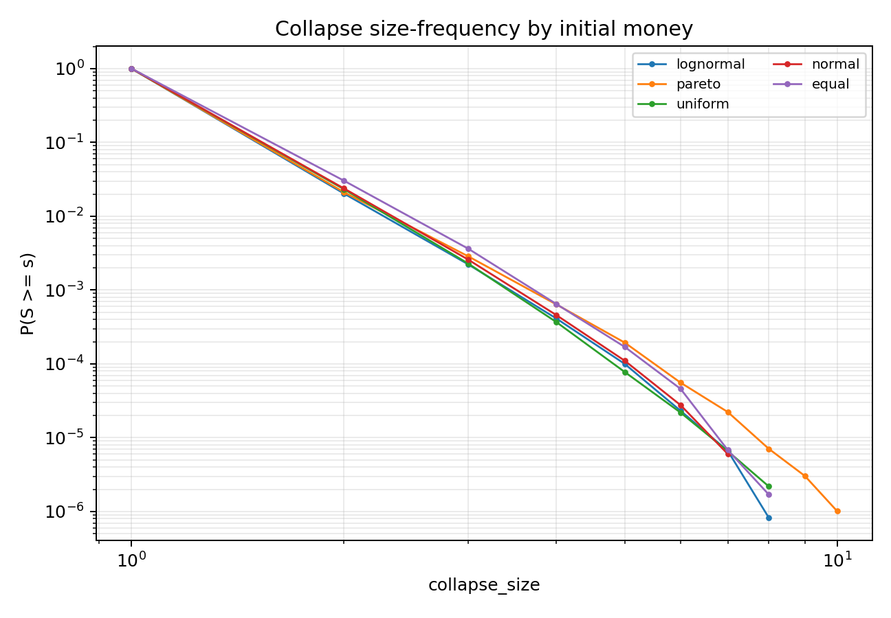

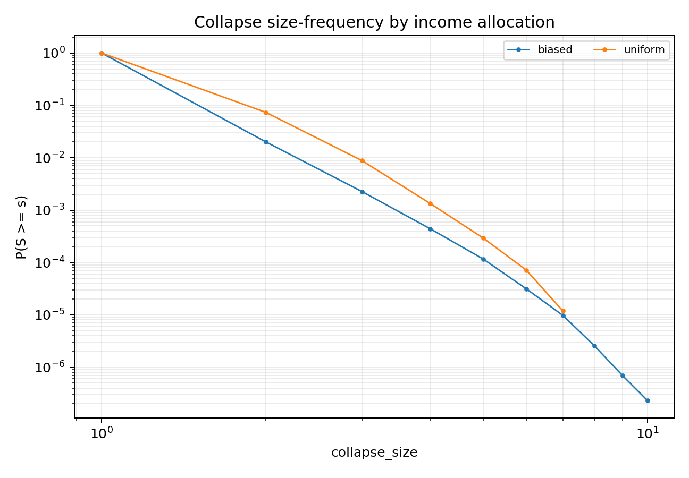

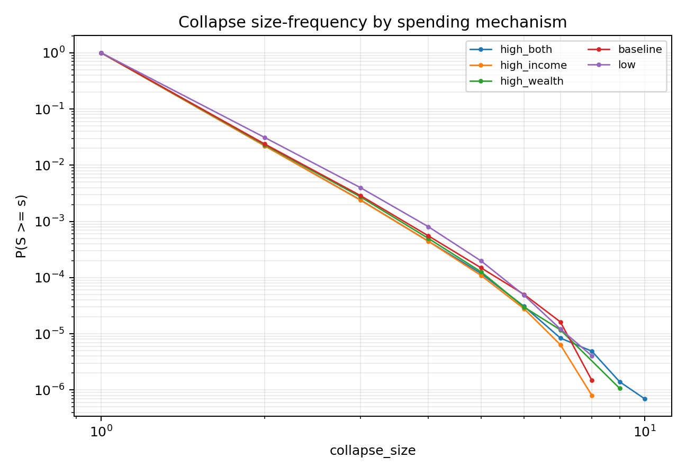

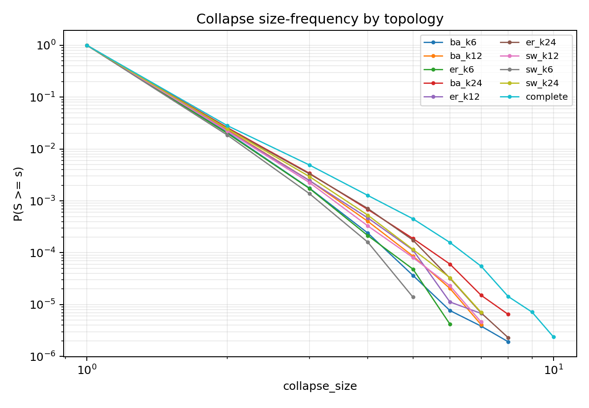

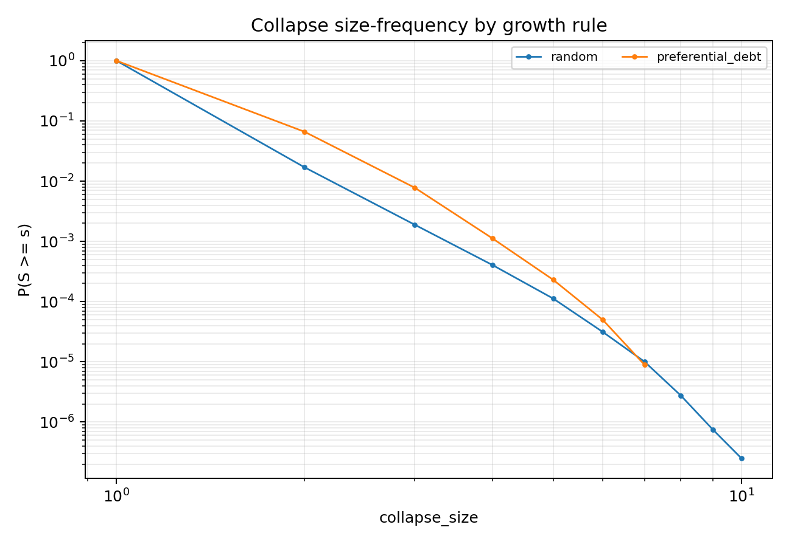

## 6. 尾部拟合摘要

| c | money_distribution | income_distribution_rule | growth_rule | spending_label | topology_label | events | fit_status | xmin | alpha | bootstrap_p | bounded_alpha | bounded_bootstrap_p | pl_vs_exponential_R | pl_vs_lognormal_R |
| --- | --- | --- | --- | --- | --- | --- | --- | --- | --- | --- | --- | --- | --- | --- |
| 0.7 | equal | uniform | random | baseline | er_k12 | 34 | insufficient_tail |  |  |  |  |  |  |  |
| 0.5 | equal | biased | random | high_wealth | complete | 63 | ok | 1 | 3.653 | 1 | 3.653 | 1 | 2.524 | -0.05214 |
| 0.2 | lognormal | biased | random | baseline | ba_k24 | 31 | ok | 1 | 3.387 | 1 | 3.387 | 1 | 0.591 | -0.05675 |
| 0.3 | pareto | biased | random | high_wealth | ba_k24 | 56 | ok | 1 | 3.961 | 1 | 3.961 | 0.8571 | 2.793 | -0.128 |
| 0.4 | normal | biased | preferential_debt | baseline | sw_k24 | 36 | ok | 1 | 3.787 | 1 | 3.787 | 1 | 1.317 | -0.05387 |
| 0.5 | pareto | biased | random | baseline | complete | 275 | ok | 1 | 3.65 | 1 | 3.649 | 0.5455 | 9.402 | -0.1008 |
| 0.7 | equal | biased | random | low | er_k24 | 44 | ok | 1 | 4.012 | 1 | 4.012 | 1 | 1.577 | -0.0932 |
| 0.8 | equal | uniform | random | high_wealth | er_k24 | 44 | ok | 1 | 4.012 | 1 | 4.012 | 1 | 1.577 | -0.0932 |
| 0.6 | uniform | uniform | random | high_both | ba_k12 | 187 | ok | 1 | 3.936 | 1 | 3.936 | 0.9091 | 5.178 | 0.01801 |
| 0.8 | lognormal | uniform | random | low | sw_k24 | 48 | ok | 1 | 3.858 | 1 | 3.858 | 1 | 1.206 | -0.01855 |
| 0.7 | uniform | biased | preferential_debt | high_both | complete | 376 | ok | 1 | 3.98 | 1 | 3.98 | 1 | 9.134 | -0.01188 |
| 0.8 | normal | biased | preferential_debt | low | sw_k12 | 210 | ok | 1 | 3.726 | 1 | 3.726 | 1 | 3.875 | -0.1422 |
| 0.6 | equal | uniform | preferential_debt | high_both | er_k12 | 194 | ok | 1 | 3.958 | 1 | 3.958 | 1 | 2.18 | -0.1608 |
| 0.3 | lognormal | biased | random | high_wealth | complete | 263 | ok | 1 | 4.082 | 1 | 4.082 | 1 | 4.29 | -0.03706 |
| 0.3 | lognormal | biased | random | high_income | ba_k24 | 365 | ok | 1 | 4.197 | 1 | 4.197 | 1 | 4.414 | -0.1048 |
| 0.6 | lognormal | biased | preferential_debt | high_income | complete | 568 | ok | 1 | 4.149 | 1 | 4.148 | 0.6364 | 4.461 | -0.4316 |
| 0.5 | pareto | biased | random | high_wealth | ba_k24 | 1068 | ok | 1 | 4.333 | 1 | 4.333 | 0.9091 | 9.71 | -0.3189 |
| 0.8 | equal | uniform | preferential_debt | high_wealth | complete | 198 | ok | 2 | 5.686 | 1 | 5.686 | 1 | -0.02325 | -0.06604 |
| 0.8 | lognormal | biased | preferential_debt | low | complete | 227 | ok | 1 | 3.449 | 0.9091 | 3.449 | 1 | 5.753 | -0.2302 |
| 0.6 | equal | uniform | preferential_debt | high_both | sw_k24 | 204 | ok | 1 | 4.181 | 0.9091 | 4.181 | 0.9091 | 4.626 | -0.1035 |
| 0.7 | uniform | uniform | preferential_debt | high_income | complete | 209 | ok | 1 | 3.492 | 0.9091 | 3.492 | 0.8182 | 5.205 | -0.1893 |
| 0.4 | pareto | biased | preferential_debt | high_both | complete | 110 | ok | 1 | 3.172 | 0.9091 | 3.172 | 0.9091 | 2.405 | -0.3434 |
| 0.8 | uniform | uniform | preferential_debt | high_income | complete | 222 | ok | 1 | 3.633 | 0.9091 | 3.633 | 0.9091 | 5.058 | -0.1221 |
| 0.5 | pareto | biased | preferential_debt | high_income | ba_k24 | 182 | ok | 1 | 3.949 | 0.9091 | 3.949 | 0.9091 | 4.635 | -0.07564 |
| 0.7 | pareto | biased | preferential_debt | low | complete | 93 | ok | 1 | 3.662 | 0.9091 | 3.661 | 0.6364 | 0.3486 | -0.3304 |

## 7. 当前判定

timestep 协议可以回答一个明确问题：上一轮 period_end 大崩塌是否主要来自较粗的批量结算尺度。如果 timestep 结算后大级联率、平均规模和同步 initial defaults 明显下降，就说明原大事件有相当部分由 period_end 批量聚合放大；如果仍在多个相邻 `c` 和多类场景中存在稳定跨尺度事件，并通过尾部、平稳性和有限尺寸门槛，才可升级为 timestep-SOC 候选。

本报告的 SOC 结论仍遵循项目层级：大级联出现 < 稳健级联转变 < 重尾 < 可信幂律 < 严格 SOC。timestep 下即使每个微步都可能触发 avalanche，也不能把高频事件本身直接等同于 SOC；必须结合规模分布、传播分量、重复违约、长期平稳和有限尺寸标度。

## 8. 轴效应摘要

| axis | level | scenarios | mean_large_event_rate | mean_event_fraction | mean_event_timestep_rate | mean_propagated_share | mean_repeat_default_share |
| --- | --- | --- | --- | --- | --- | --- | --- |
| growth_rule | preferential_debt | 4000 | 0 | 0.00842 | 0.02831 | 0.05032 | 0.3331 |
| growth_rule | random | 4000 | 0 | 0.007498 | 0.1408 | 0.02822 | 0.5384 |
| income_distribution_rule | biased | 4000 | 0 | 0.008205 | 0.1568 | 0.03947 | 0.5689 |
| income_distribution_rule | uniform | 4000 | 0 | 0.007713 | 0.01231 | 0.03906 | 0.3026 |
| money_distribution | lognormal | 1600 | 0 | 0.008627 | 0.126 | 0.04009 | 0.5175 |
| money_distribution | uniform | 1600 | 0 | 0.008591 | 0.09244 | 0.03494 | 0.5179 |
| money_distribution | normal | 1600 | 0 | 0.008455 | 0.07719 | 0.03554 | 0.4899 |
| money_distribution | pareto | 1600 | 0 | 0.007519 | 0.08281 | 0.04295 | 0.3665 |
| money_distribution | equal | 1600 | 0 | 0.006604 | 0.04444 | 0.04282 | 0.2871 |
| spending_label | high_both | 1600 | 0 | 0.008398 | 0.115 | 0.04333 | 0.5286 |
| spending_label | high_income | 1600 | 0 | 0.00821 | 0.1044 | 0.04089 | 0.4992 |
| spending_label | high_wealth | 1600 | 0 | 0.008079 | 0.08551 | 0.04321 | 0.4401 |
| spending_label | baseline | 1600 | 0 | 0.007822 | 0.07192 | 0.0376 | 0.4023 |
| spending_label | low | 1600 | 0 | 0.007287 | 0.04599 | 0.03129 | 0.3087 |
| topology_label | ba_k12 | 800 | 0 | 0.008368 | 0.09257 | 0.03937 | 0.5229 |
| topology_label | ba_k6 | 800 | 0 | 0.008362 | 0.1002 | 0.03584 | 0.5928 |
| topology_label | ba_k24 | 800 | 0 | 0.008233 | 0.08737 | 0.04669 | 0.4594 |
| topology_label | complete | 800 | 0 | 0.007923 | 0.07754 | 0.05611 | 0.3717 |
| topology_label | er_k6 | 800 | 0 | 0.007918 | 0.08837 | 0.03118 | 0.4584 |
| topology_label | er_k12 | 800 | 0 | 0.007891 | 0.08231 | 0.03869 | 0.4094 |
| topology_label | er_k24 | 800 | 0 | 0.007847 | 0.08007 | 0.04449 | 0.386 |
| topology_label | sw_k24 | 800 | 0 | 0.007721 | 0.07783 | 0.03975 | 0.3767 |
| topology_label | sw_k12 | 800 | 0 | 0.007687 | 0.07987 | 0.03302 | 0.3853 |
| topology_label | sw_k6 | 800 | 0 | 0.007643 | 0.07957 | 0.02752 | 0.3951 |
