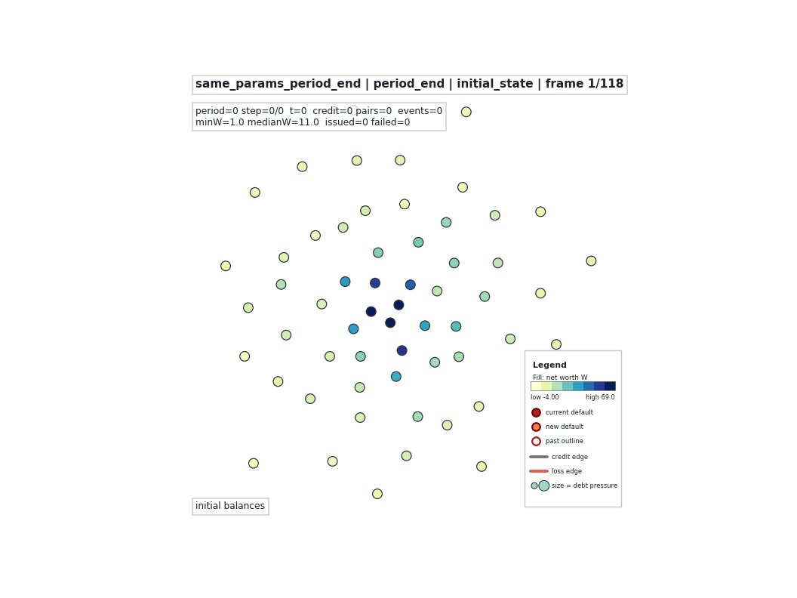
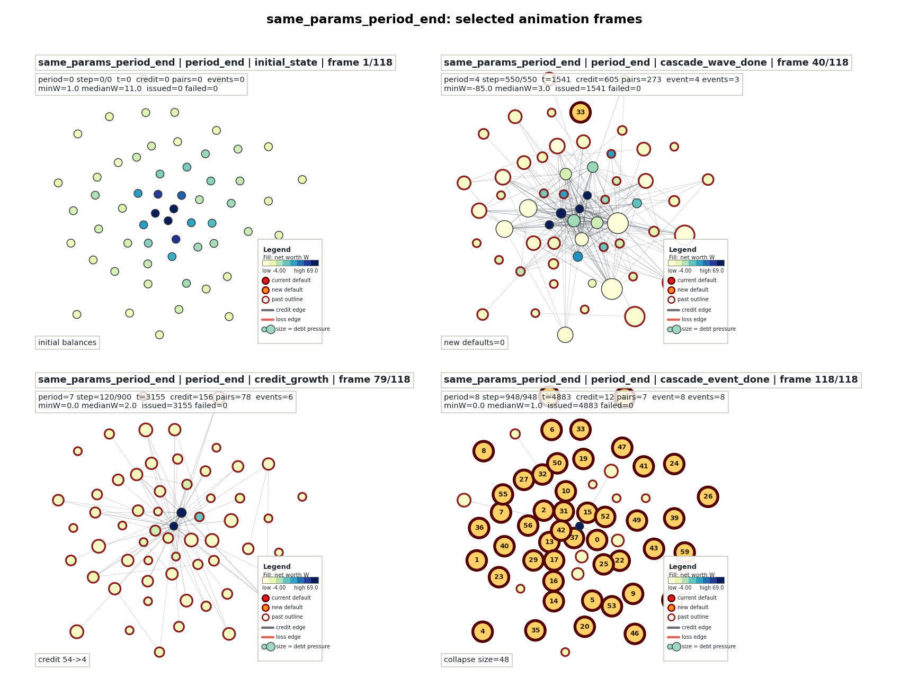
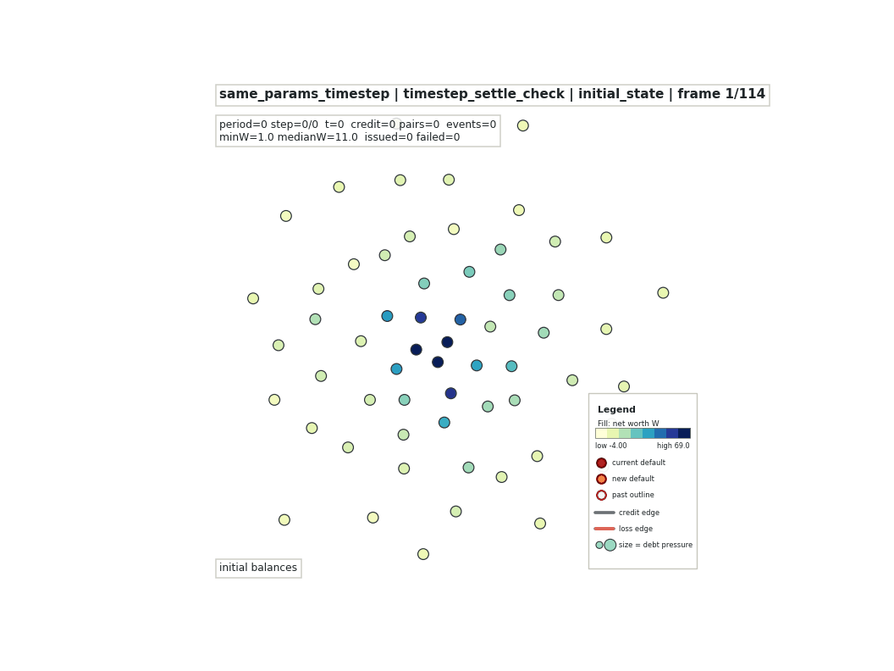
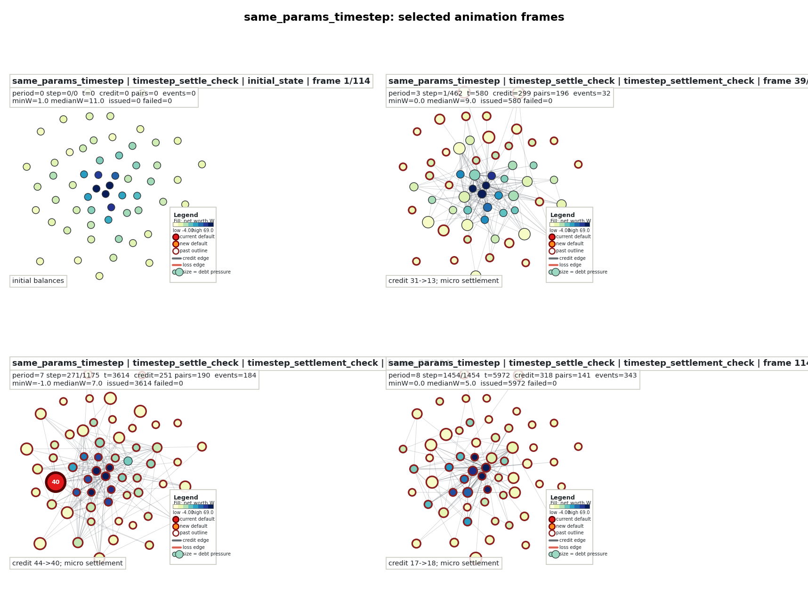

# 信贷网络同参数双粒度动画 v3

生成时间：2026-06-09 17:26 CST

本版按用户要求回到 v1 的表现形式：同一参数场景下，`period_end` 和 `timestep_settle_check` 分别画成两条独立 GIF，均保留信贷网络从稀疏到增密的增长过程；同时补充一条并排对照 GIF 和关键帧对照图。

输出目录：`results/credit_soc_visual_evolution_same_params_20260609_v3/`

## 场景参数

两条轨迹完全共用：

- `n_nodes=60`
- `seed=2009`
- `layout_seed=2026`
- `mean_initial_money=20.0`
- `money_distribution="lognormal"`
- `income_distribution_rule="biased"`
- `growth_rule="preferential_debt"`
- `spending_label="high_both"`，即 `a=0.04,b=0.40`
- `investment_income_propensity c=0.80`
- `initial_income_per_capita=5.0`
- `collapse_threshold_fraction=0.10`
- `wipe_defaulted_assets=True`
- `avalanche_protocol="continue_after_avalanche"`

两条轨迹唯一核心差异：

- `period_end`：整期累计信贷后，期末统一结算、违约检查和清算。
- `timestep_settle_check`：每个单位 credit time_step 后立即微结算、违约检查和清算。

metadata 校验 `initial_cash_vectors_identical=true`。

## 独立 GIF

### period_end

关键帧：

该 GIF 包含 42 帧 `credit_growth`，能看到信贷边逐步增加并加粗，然后进入期末结算和级联清算。该 seed 下 `period_end` 最大级联为 `49/60`。

### timestep_settle_check

关键帧：

该 GIF 包含 63 帧 `timestep_settlement_check`，展示每个微步后边增长、微结算、检查和小 avalanche 释放。该 seed 下最大事件为 `3/60`。

## 对照 GIF

对照关键帧：

并排 GIF 左侧为 `period_end`，右侧为 `timestep_settle_check`。二者共用同一初始现金向量和布局，因此更适合直观看“只改变结算/检查粒度”造成的事件聚合差异。

## 摘要指标

| 指标 | period_end | timestep_settle_check |
| --- | ---: | ---: |
| frames | 118 | 114 |
| growth/check frames | 42 `credit_growth` | 63 `timestep_settlement_check` |
| events | 8 | 343 |
| max collapse size | 49 | 3 |
| reached 10%N | True | False |
| initial cash identical | True | True |

完整汇总 JSON：`results/credit_soc_visual_evolution_same_params_20260609_v3/same_params_comparison_summary.json`

## 说明

本版动画是机制解释，不是新的 SOC 统计证明。它展示的是：在同一高风险参数和同一初始现金下，`period_end` 会把压力聚合到期末批量释放，容易形成大级联；`timestep_settle_check` 则把风险拆到微步上高频释放，形成许多小事件。
