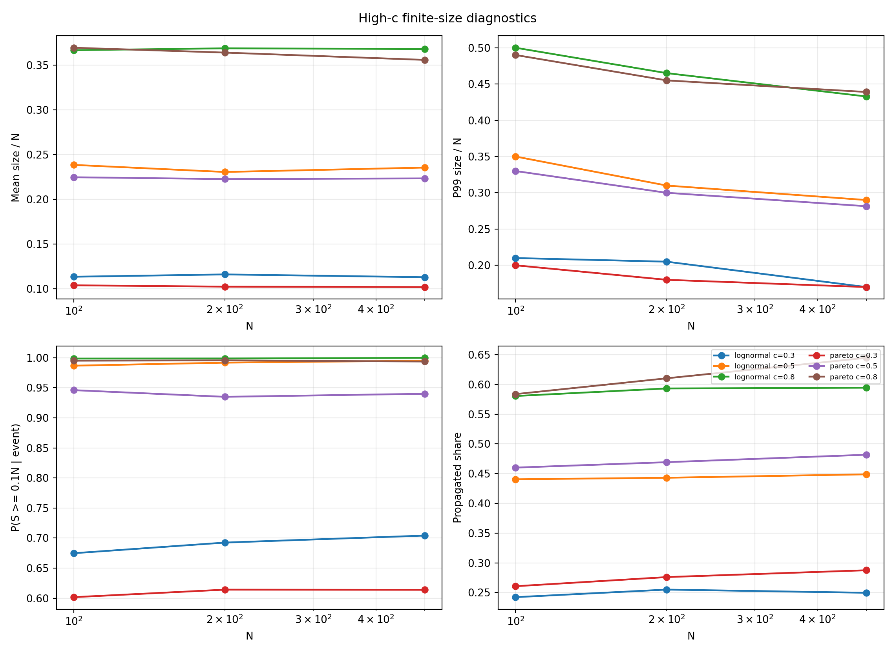
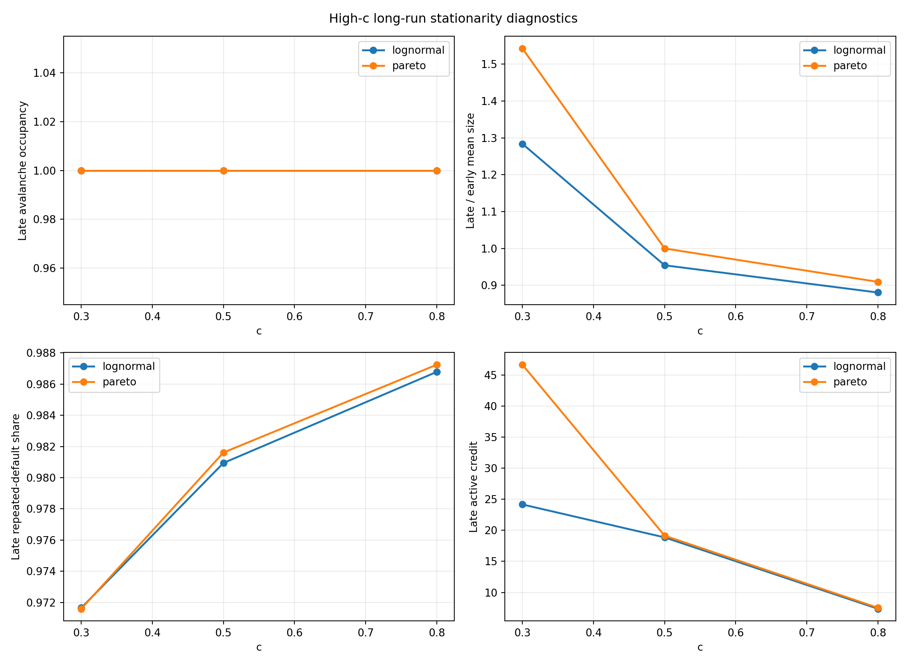
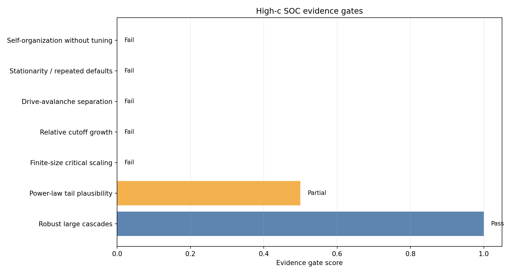

# 高 c 收入内生信贷网络 SOC 验证补充报告

生成时间：2026-06-05 23:02:03 CST

## 目标

上一轮 `c=0.10-0.80` 重扫显示，高 `c` 会产生稳定的大级联。这里继续补齐 SOC 验证所需的关键证据门槛：有限尺寸缩放、长时平稳性、尾部拟合和触发机制解释。

## 新增实验

- 有限尺寸：`N=100/200/500`，`c=0.30/0.50/0.80`，lognormal/pareto，两种分布各 24 次重复、240 period，共 432 runs、102094 events。
- 长时平稳性：`N=200`，`c=0.30/0.50/0.80`，lognormal/pareto，各 8 次重复、1200 period，共 48 runs、57418 events。
- 尾部拟合沿用高 c 重扫分析中的自动 `xmin` 离散幂律、有限支持幂律、exponential/lognormal 对照。

## 结论

当前高 c 扩展仍**不支持严格 SOC**。结论不是因为没有大级联；相反，大级联非常稳健。失败点在于：

1. 高 c 区域是外生驱动造成的持续过载：`c>=0.50` 的平均事件级大级联率为 0.990。
2. 有限尺寸中 `mean_size` 近似按 `N` 线性放大，而 `mean_size/N` 基本不随 `N` 变化，说明是广延同步失败，不是稀疏 avalanche cutoff 的临界扩展。
3. 长时 late window 的 avalanche occupancy 为 1.000-1.000，几乎每期都发生事件，破坏慢驱快崩分离。
4. late repeated-default share 为 0.972-0.987，尾部和大事件强烈依赖重复违约状态。
5. 尾部拟合即使在部分场景不拒绝幂律，也不具备跨 c、跨分布、跨 N 的普适性；`alpha` 范围为 6.08-40.22。

## 证据门槛

| gate | status | evidence |
| --- | --- | --- |
| 稳健大级联 | 通过 | c>=0.50 的平均事件级大级联率为 0.990，平均事件规模为 59.60 |
| 幂律尾部可接受性 | 部分通过 | 自动 xmin 下无界 bootstrap p>=0.10 的场景占 0.44，有限支持 p>=0.10 占 0.50；alpha 范围 6.08-40.22，不具普适性 |
| 有限尺寸临界缩放 | 不通过 | mean_size 对 N 的斜率约为 1，但 mean_size/N 的斜率接近 0；|slope(mean_size/N)| 中位数 0.005。这表示广延过载，而不是稀疏 avalanche cutoff 的临界扩展 |
| cutoff 相对规模 | 不通过 | p99/N 的斜率多为负或近 0，中位数 -0.098；相对 cutoff 没有 SOC 所需的清晰增长 |
| 慢驱快崩/时间分离 | 不通过 | 长时 late avalanche occupancy 范围 1.000-1.000，几乎每期发生事件 |
| 平稳性与重复违约 | 不通过 | late repeated-default share 范围 0.972-0.987，事件主要来自重复违约状态 |
| 非调参 SOC | 不通过 | 高 c 网格表现为从低/中驱动到过载区的外生参数扫描；系统没有在无需调参的稀疏临界态附近自组织 |

## 有限尺寸结果

| money_distribution | c | n_nodes | event_large_event_rate | mean_size_fraction | p99_fraction | propagated_share_of_total_size |
| --- | --- | --- | --- | --- | --- | --- |
| lognormal | 0.300 | 100.0 | 0.675 | 0.114 | 0.210 | 0.242 |
| lognormal | 0.300 | 200.0 | 0.693 | 0.116 | 0.205 | 0.255 |
| lognormal | 0.300 | 500.0 | 0.704 | 0.113 | 0.170 | 0.250 |
| lognormal | 0.500 | 100.0 | 0.987 | 0.238 | 0.350 | 0.440 |
| lognormal | 0.500 | 200.0 | 0.992 | 0.231 | 0.310 | 0.443 |
| lognormal | 0.500 | 500.0 | 0.995 | 0.235 | 0.290 | 0.449 |
| lognormal | 0.800 | 100.0 | 0.999 | 0.367 | 0.500 | 0.581 |
| lognormal | 0.800 | 200.0 | 0.999 | 0.369 | 0.465 | 0.593 |
| lognormal | 0.800 | 500.0 | 1.000 | 0.368 | 0.433 | 0.594 |
| pareto | 0.300 | 100.0 | 0.602 | 0.104 | 0.200 | 0.261 |
| pareto | 0.300 | 200.0 | 0.614 | 0.102 | 0.180 | 0.276 |
| pareto | 0.300 | 500.0 | 0.614 | 0.102 | 0.170 | 0.288 |
| pareto | 0.500 | 100.0 | 0.946 | 0.225 | 0.330 | 0.460 |
| pareto | 0.500 | 200.0 | 0.935 | 0.223 | 0.300 | 0.469 |
| pareto | 0.500 | 500.0 | 0.940 | 0.223 | 0.281 | 0.482 |
| pareto | 0.800 | 100.0 | 0.995 | 0.369 | 0.490 | 0.584 |
| pareto | 0.800 | 200.0 | 0.996 | 0.364 | 0.455 | 0.610 |
| pareto | 0.800 | 500.0 | 0.994 | 0.356 | 0.439 | 0.645 |

## 有限尺寸斜率

| money_distribution | c | metric | log_log_slope | r_squared |
| --- | --- | --- | --- | --- |
| lognormal | 0.300 | mean_size | 0.996 | 1.000 |
| lognormal | 0.300 | mean_size_fraction | -0.004 | 0.055 |
| lognormal | 0.300 | p99_fraction | -0.135 | 0.889 |
| lognormal | 0.500 | mean_size | 0.994 | 1.000 |
| lognormal | 0.500 | mean_size_fraction | -0.006 | 0.087 |
| lognormal | 0.500 | p99_fraction | -0.115 | 0.941 |
| lognormal | 0.800 | mean_size | 1.002 | 1.000 |
| lognormal | 0.800 | mean_size_fraction | 0.002 | 0.296 |
| lognormal | 0.800 | p99_fraction | -0.089 | 0.993 |
| pareto | 0.300 | mean_size | 0.989 | 1.000 |
| pareto | 0.300 | mean_size_fraction | -0.011 | 0.861 |
| pareto | 0.300 | p99_fraction | -0.099 | 0.939 |
| pareto | 0.500 | mean_size | 0.997 | 1.000 |
| pareto | 0.500 | mean_size_fraction | -0.003 | 0.311 |
| pareto | 0.500 | p99_fraction | -0.097 | 0.963 |
| pareto | 0.800 | mean_size | 0.977 | 1.000 |
| pareto | 0.800 | mean_size_fraction | -0.023 | 0.998 |
| pareto | 0.800 | p99_fraction | -0.067 | 0.924 |

## 长时平稳性

| money_distribution | c | early_occupancy | late_occupancy | late_over_early_mean_size | late_repeated_default_share | late_active_credit | late_gini |
| --- | --- | --- | --- | --- | --- | --- | --- |
| lognormal | 0.300 | 1.000 | 1.000 | 1.284 | 0.972 | 24.164 | 0.993 |
| lognormal | 0.500 | 1.000 | 1.000 | 0.954 | 0.981 | 18.860 | 0.994 |
| lognormal | 0.800 | 1.000 | 1.000 | 0.881 | 0.987 | 7.372 | 0.995 |
| pareto | 0.300 | 0.918 | 1.000 | 1.542 | 0.972 | 46.664 | 0.993 |
| pareto | 0.500 | 0.991 | 1.000 | 1.000 | 0.982 | 19.135 | 0.994 |
| pareto | 0.800 | 0.997 | 1.000 | 0.909 | 0.987 | 7.531 | 0.995 |

## 尾部拟合摘要

| money_distribution | c | alpha | bootstrap_p | bounded_alpha | bounded_bootstrap_p | pl_vs_exponential_R | pl_vs_lognormal_R |
| --- | --- | --- | --- | --- | --- | --- | --- |
| lognormal | 0.100 | 8.405 | 0.195 | 8.405 | 0.171 | -2.500 | -2.610 |
| lognormal | 0.200 | 13.155 | 0.024 | 13.155 | 0.024 | -4.515 | -7.199 |
| lognormal | 0.300 | 20.340 | 0.073 | 20.340 | 0.220 | -1.181 | -1.927 |
| lognormal | 0.400 | 21.300 | 0.024 | 21.300 | 0.024 | -3.390 | -6.025 |
| lognormal | 0.500 | 22.820 | 0.024 | 22.820 | 0.024 | -3.808 | -8.965 |
| lognormal | 0.600 | 24.464 | 0.024 | 24.464 | 0.024 | -5.221 | -16.022 |
| lognormal | 0.700 | 28.020 | 0.098 | 28.020 | 0.146 | -2.010 | -3.618 |
| lognormal | 0.800 | 29.757 | 0.146 | 29.757 | 0.098 | -0.327 | -0.314 |
| pareto | 0.100 | 6.079 | 0.122 | 6.079 | 0.146 | -2.877 | -2.641 |
| pareto | 0.200 | 15.901 | 0.683 | 15.901 | 0.732 | -0.001 | -0.089 |
| pareto | 0.300 | 25.351 | 0.098 | 25.351 | 0.073 | -1.225 | -2.191 |
| pareto | 0.400 | 23.705 | 0.049 | 23.705 | 0.024 | -3.295 | -4.951 |
| pareto | 0.500 | 29.360 | 0.049 | 29.360 | 0.098 | -2.020 | -4.635 |
| pareto | 0.600 | 40.224 | 0.732 | 40.224 | 0.683 | 0.048 | 0.001 |
| pareto | 0.700 | 31.447 | 0.244 | 31.447 | 0.195 | -1.086 | -1.678 |
| pareto | 0.800 | 23.375 | 0.512 | 23.375 | 0.317 | 0.071 | -0.032 |

## 图表

## 判定

高 c 扫描验证了“稳健大级联”和“过载转变”，但没有验证严格 SOC。更准确的表述是：

> 在当前 `period_end` 收入内生信贷网络机制下，扩大 `c` 会把系统推入高占用、重复违约、广延规模同步失败的过载吸引子；这不是无需精细调参的自组织临界态。

## 局限

- 本轮有限尺寸使用 `N=100/200/500` 三个规模，足以识别广延过载；若要估计更细的指数，可追加 `N=1000`。
- 本轮没有重新做高 c 下的 settlement/check-frequency 解耦机制实验；但高 c 已经在有限尺寸和平稳性门槛上失败，因此不会改变严格 SOC 的当前判定。
